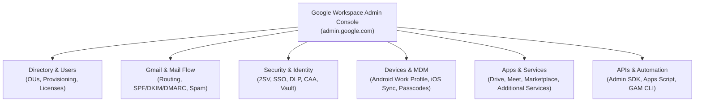
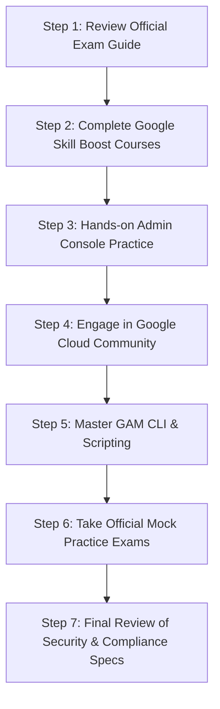

# Module 11: Professional Google Workspace Administrator Certification & Top 55 Q&A Handbook

> **Target Audience**: Candidates preparing for the **Professional Google Workspace Administrator** certification exam, Systems Engineers, and IT Administrators preparing for technical interviews.  
> **Overview**: Comprehensive guide covering the admin role definition, Kryterion exam specifications, Admin Console control tower, 55 categorized practice questions (Basic, Intermediate, Advanced Scenario, Behavioral), indispensable admin tools matrix, and the official 7-step exam preparation strategy.

---

## 1. Who is a Google Workspace Administrator?

A **Google Workspace Administrator** is the central architect and operational guardian of an organization’s digital collaboration ecosystem. They ensure that email flows uninterruptedly, calendars synchronize across time zones, shared drives remain organized and secure, and data policies prevent accidental or malicious data exposure.

Beyond routine tasks like user provisioning or password resets, a senior Workspace Admin designs automated lifecycle workflows, implements zero-trust security postures, enforces compliance retention, and manages federated single sign-on (SSO) and mobile endpoints. They balance security, compliance, automation, and end-user productivity.

---

## 2. Professional Google Workspace Administrator Certification Exam Overview

The **Google Cloud Professional Google Workspace Administrator** certification validates an administrator's ability to transform business requirements into practical enterprise configurations, manage operational security, and ensure seamless user collaboration.

### Exam Specifications & Format

| Exam Feature | Official Specification Details |
| :--- | :--- |
| **Exam Name** | Professional Google Workspace Administrator |
| **Exam Duration** | 2 Hours (120 Minutes) |
| **Question Format** | Multiple choice and multiple-select |
| **Total Questions** | Approximately 50–60 Questions |
| **Passing Score** | Approximately 70% |
| **Delivery Method** | Online proctored (via Kryterion Webassessor) or in-person at an authorized testing center |
| **Exam Language** | English |
| **Registration Cost** | $125 USD (plus applicable regional taxes) |
| **Recommended Experience** | Minimum 6+ months of hands-on Google Workspace administration experience |
| **Certification Validity** | 2 Years (Requires re-certification to maintain status) |

---

## 3. The Google Workspace Admin Console Architecture

The **Google Workspace Admin Console** (`admin.google.com`) is the centralized control tower for organization-wide administration. It provides granular administrative controls across core workloads:

* **User & Group Management**: Add/suspend users, manage group memberships, assign licenses, and place users in target Organizational Units (OUs).
* **Email Routing & Gmail Settings**: Configure inbound/outbound compliance rules, hosts, split/dual delivery, SPF/DKIM/DMARC, and disclaimers.
* **Security & Compliance**: Enforce 2-Step Verification (2SV), Context-Aware Access (CAA), Data Loss Prevention (DLP) rules, and Google Vault retention.
* **Mobile Device Management (MDM)**: Secure mobile endpoints via Basic or Advanced MDM, enforce encryption, and issue remote wipes.
* **API Access & Automation**: Delegate access via GCP Service Accounts and Domain-Wide Delegation to tools like GAM and Google Apps Script.

---

## 4. Comprehensive Top 55 Interview & Certification Practice Q&A

### Part A: Basic Level Questions (Q1 – Q15)

#### Q1: What is Google Workspace?
**Answer**: Google Workspace (formerly G Suite) is Google's cloud-native suite of productivity and collaboration apps (Gmail, Drive, Docs, Sheets, Slides, Meet, Calendar, Chat, Keep). For enterprise administration, it offers centralized management via the Admin Console (`admin.google.com`), enabling admins to enforce security baselines, provision users, manage devices, and configure data governance policies.

#### Q2: What is the role of a Google Workspace Administrator?
**Answer**: A Google Workspace Administrator manages user accounts, licensing, Organizational Units (OUs), email security, device access, compliance archiving, and SaaS integrations. They act as both the gatekeeper of security protocols and the technical troubleshooter ensuring system availability and productivity.

#### Q3: How do you add a new user in Google Workspace?
**Answer**: Navigate to **Admin Console > Directory > Users > Add new user**. Input the first name, last name, primary email address (username), and assign the target Organizational Unit (OU). Optionally assign a license SKU and set a temporary password. Alternatively, user creation can be executed in bulk via CSV upload, SCIM provisioning, GCDS, or GAM CLI (`gam create user`).

#### Q4: What is an Organizational Unit (OU) in Google Workspace?
**Answer**: An Organizational Unit (OU) is a hierarchical container used to group users or devices to apply specific security policies, service enablement, and configuration settings. Settings applied at a parent OU inherit down to child OUs unless explicitly overridden at the lower node.

#### Q5: What is the difference between a Group and an Organizational Unit (OU)?
**Answer**: 
* **Organizational Units (OUs)** are strictly administrative containers used to apply policy settings (e.g., password strength, Drive sharing restrictions, app access). Users can belong to only **one** OU at a time.
* **Groups** are used for communication and access controls (e.g., email distribution lists, collaborative inboxes, Drive ACL permissions). Users can belong to **multiple** groups simultaneously.

#### Q6: How do you reset a user’s password in Google Workspace?
**Answer**: Go to **Admin Console > Directory > Users**, search for the user, and click **Reset password**. Input a new password or let the system generate one. Check **Ask for a password change at the next sign-in** to enforce immediate user rotation.

#### Q7: What is the Admin Console in Google Workspace?
**Answer**: The Admin Console (`admin.google.com`) is the primary web portal where administrators configure services, manage identities, monitor domain security alerts, manage mobile endpoints, and audit user activity across the Workspace tenant.

#### Q8: What is 2-Step Verification (2SV) and how can it be enforced?
**Answer**: 2-Step Verification (2SV / MFA) requires users to verify their identity via a secondary factor (security key, Google Prompt, authenticator app, or SMS) after entering their password. Admins enforce it under **Security > Authentication > 2-Step Verification**, setting enforcement start dates, grace periods, and allowed verification methods by OU.

#### Q9: What are Admin Roles and how do they work?
**Answer**: Admin roles delegate specific administrative privileges without granting full access. Google provides predefined roles (**Super Admin**, **Groups Admin**, **User Management Admin**, **Help Desk Admin**, **Services Admin**) and allows creating **Custom Roles** with micro-permissions to adhere to the principle of least privilege.

#### Q10: How do you manage user licenses in Google Workspace?
**Answer**: Licenses are managed under **Billing > Subscriptions**. Admins can enable auto-licensing for specific OUs, manually assign/reclaim licenses per user, or perform bulk license assignments using CSV uploads, Admin SDK APIs, or GAM (`gam user <email> add license <SKUID>`).

#### Q11: What is Google Vault and what is its purpose?
**Answer**: Google Vault is an information governance and eDiscovery tool for Google Workspace. It allows organizations to retain, hold, search, and export data (Gmail, Drive, Chat, Groups) for legal and compliance requirements, even if end-users permanently delete items from their active mailboxes or trash.

#### Q12: What is the difference between Gmail settings at the user level vs. domain/OU level?
**Answer**: 
* **User-level settings** are managed by individual users in webmail (e.g., personal inbox filters, signature, vacation responder).
* **Domain/OU-level settings** are enforced globally by admins in the Admin Console (e.g., SPF/DKIM/DMARC, compliance footers, attachment blocks, spam thresholds, inbound/outbound mail routing rules).

#### Q13: How can you monitor user usage or login activity?
**Answer**: Admins use **Reporting > Audit logs** (Login, Admin, Drive, Token, SAML) in the Admin Console. Advanced monitoring is conducted using the **Security Investigation Tool**, **Alert Center**, or by exporting log streams to **Google Cloud BigQuery**.

#### Q14: What happens when a user is suspended in Google Workspace?
**Answer**: Suspending a user blocks active sign-in access, invalidates OAuth tokens, and halts mail delivery to active sessions. However, **no data is deleted**—their Gmail messages, Drive files, calendars, and contacts remain completely intact. Licenses continue to be consumed until explicitly reclaimed.

#### Q15: What is Mobile Device Management (MDM) in Google Workspace?
**Answer**: MDM allows administrators to secure and monitor mobile devices (Android and iOS) accessing corporate data. Features include enforcing screen passcodes, encrypting device storage, establishing Android Enterprise Work Profiles, and executing remote account or device wipes.

---

### Part B: Intermediate Level Questions (Q16 – Q35)

#### Q16: How do you enforce password policies in Google Workspace?
**Answer**: Navigate to **Admin Console > Security > Authentication > Password management**. Set minimum character length (8–100 characters), enforce password strength metrics, require password expiration policies, and disallow password reuse across specific OUs.

#### Q17: How do you set up email routing in Google Workspace?
**Answer**: Navigate to **Apps > Google Workspace > Gmail > Routing**. Admins create rules to modify routes (Split/Dual delivery), add compliance disclaimers, route copies to archive mailboxes, quarantine messages matching specific regex patterns, or redirect delivery based on envelope senders/recipients.

#### Q18: What are the steps to configure SPF, DKIM, and DMARC for your domain?
**Answer**:
1. **SPF**: Publish TXT record on domain apex: `v=spf1 include:_spf.google.com ~all`.
2. **DKIM**: Generate 2048-bit key in Admin Console (**Gmail > Authenticate email**), publish TXT record at `google._domainkey.yourdomain.com`, then click **Start Authentication**.
3. **DMARC**: Publish TXT record at `_dmarc.yourdomain.com`: `v=DMARC1; p=none; rua=mailto:dmarc@yourdomain.com`, gradually stepping up to `p=quarantine` and `p=reject`.

#### Q19: What is Google Groups for Business and how is it different from regular Groups?
**Answer**: Google Groups for Business adds enterprise administrative controls, granular access permissions, moderation workflows, collaborative inbox capabilities, and integration with Workspace sharing policies, converting basic distribution lists into managed communication hubs.

#### Q20: How do you migrate users from one domain to another within Google Workspace?
**Answer**: You cannot directly rename a tenant's primary domain instantly for all users. Process:
1. Add and verify the new domain in Admin Console (**Account > Domains**).
2. Provision user email aliases or update UPNs to the new domain.
3. If migrating across separate Workspace tenants, use **Google Workspace Migrate**, **Data Import Tool**, or third-party tools (BitTitan/CloudM) to migrate mailbox, calendar, and Drive data.

#### Q21: How do you delegate mailbox access in Gmail?
**Answer**:
* **User Method**: End-user navigates to **Gmail Settings > Accounts > Grant access to your account** and enters the delegate's email.
* **Admin Method**: Use GAM CLI: `gam user executive@domain.com add delegate assistant@domain.com`.

#### Q22: What is Context-Aware Access (CAA) and how do you configure it?
**Answer**: Context-Aware Access enforces zero-trust access policies based on user identity, geographic location, IP CIDR, device security posture (encryption state, OS version), and browser state. Configure it via **Security > Access and data control > Context-Aware Access**, define Access Levels using visual conditions or Common Expression Language (CEL), and assign them to Workspace apps.

#### Q23: How do you handle technical onboarding and offboarding of users?
**Answer**:
* **Onboarding**: Provision account (SCIM/GCDS/GAM), assign SKU license, place in correct OU, add to role-based Google Groups, enforce 2SV.
* **Offboarding**: Suspend user, revoke sign-in cookies (`gam user signout`), wipe OAuth tokens, transfer Drive files & Calendar to manager, move to `_Leavers` OU, reclaim high-cost licenses, and archive data in Vault.

#### Q24: What are Marketplace Apps, and how do you control access to them?
**Answer**: Google Workspace Marketplace apps are third-party OAuth integrations. Admins control app installations under **Apps > Google Workspace Marketplace apps > Access settings**, choosing to allow all apps, allow only whitelisted apps, or block all third-party installations per OU.

#### Q25: What is the difference between Core and Additional Google Services?
**Answer**:
* **Core Services** (Gmail, Drive, Meet, Calendar, Chat) are governed by the primary Google Workspace Enterprise Agreement, HIPAA/GDPR compliance terms, and guaranteed 99.9% SLAs.
* **Additional Services** (YouTube, Blogger, Google Maps) are consumer-grade services enabled/disabled by admins per OU without Workspace SLA guarantees.

#### Q26: How can you bulk upload or modify users?
**Answer**:
1. **CSV Upload**: Admin Console > Directory > Users > Bulk update users.
2. **Directory Sync**: Google Cloud Directory Sync (GCDS) or Entra ID / Okta SCIM provisioning.
3. **Command Line**: GAM CLI (`gam csv users.csv gam create user ...`).
4. **REST APIs**: Admin SDK Directory API.

#### Q27: What tools can you use for auditing user activities?
**Answer**:
* **Admin Console Audit Logs**: Login, Drive, Admin, SAML logs.
* **Security Investigation Tool (SIT)**: Advanced query builder for enterprise security events.
* **Google Vault**: Compliance audit trails and search.
* **BigQuery Export**: Streaming audit logs for long-term analytical queries.

#### Q28: How do you manage external sharing of files in Drive?
**Answer**: Go to **Apps > Google Workspace > Drive and Docs > Sharing settings**. Configure settings per OU:
* Block all external sharing.
* Allow sharing only to whitelisted target domains.
* Warn users before sharing externally.
* Disable public link sharing (`anyoneWithLink`).

#### Q29: What is Google Workspace Migrate?
**Answer**: Google Workspace Migrate is an enterprise multi-node migration platform deployed on GCP or on-premises VMs. It performs high-volume migrations of mail, calendars, personal files, and team sites from Exchange, SharePoint, OneDrive, Box, and local File Shares into Google Workspace.

#### Q30: How can you enforce policies on mobile devices?
**Answer**: Navigate to **Devices > Mobile & endpoints > Settings**. Enable **Basic Management** (agentless passcode policies) or **Advanced Management** (requires Apple Push Cert for iOS, creates Android Enterprise Work Profiles on BYOD, enables full remote wipe).

#### Q31: What are service status dashboards and how do they help?
**Answer**: The **Google Workspace Status Dashboard** (`google.com/appsstatus`) provides public real-time operational health reports for Workspace services. Admins use it during disruptions to determine if an issue is globally widespread or isolated to their local network environment.

#### Q32: What is the difference between Super Admin and other admin roles?
**Answer**:
* **Super Admin**: Has unrestricted, full administrative control across all settings, user accounts, security policies, and domain configurations.
* **Delegated Admin Roles**: Restricted roles (Groups Admin, Help Desk Admin, Services Admin) scoped to specific tasks and OUs to enforce least-privilege administrative access.

#### Q33: How do you handle suspicious login attempts?
**Answer**: Monitor real-time alerts in **Security > Alert Center**. If a login anomaly (impossible travel, suspicious IP) occurs:
1. Force immediate password reset.
2. Terminate active sessions: `gam user <email> signout`.
3. Revoke active OAuth tokens.
4. Enforce hardware security key 2SV.

#### Q34: How do you enable email compliance features like footers or disclaimers?
**Answer**: Navigate to **Apps > Google Workspace > Gmail > Compliance**. Select **Append footer**, define the HTML/text disclaimer string, and configure execution conditions (applied to outbound external mail across selected OUs).

#### Q35: What are key service limits in Google Workspace?
**Answer**:
* **Gmail Sending Limit**: 2,000 messages/day per user via webmail (500/day via SMTP client).
* **Group Membership**: 2,000 direct members per group (expandable via nested groups).
* **Shared Drive Item Limit**: Max 400,000 items (files, folders, shortcuts) per Shared Drive.
* **Shared Drive Depth**: Max 20 folder levels.

---

### Part C: Advanced & Scenario-Based Questions (Q36 – Q50)

#### Q36: A user accidentally deleted a critical shared file. What steps do you take to recover it?
**Answer**:
1. Check the user's active **Google Drive Trash** (items stay for 30 days).
2. If deleted from a Shared Drive, check the **Shared Drive Trash** (Manager role required).
3. If purged from Trash, use Admin Console **Directory > Users > Restore Data** (within 25 days of deletion).
4. If beyond 25 days, execute a search in **Google Vault** across the matter case and export the original file.

#### Q37: An employee left the company. How do you secure and transfer their data?
**Answer**:
1. Immediately suspend account & terminate active sign-in sessions (`gam user signout`).
2. Transfer Google Drive ownership to manager via **Admin Console > Apps > Drive > Transfer ownership** or GAM (`gam user leaver transfer drive manager`).
3. Transfer primary Google Calendar events to manager.
4. Move account to `_Leavers` OU and strip high-cost SKU licenses (assigning Cloud Identity Free or Vault Archived User SKU).
5. Maintain Vault retention for compliance before eventual account deletion.

#### Q38: How would you automate user provisioning and deprovisioning?
**Answer**:
* **On-Premises AD**: Deploy **Google Cloud Directory Sync (GCDS)** to mirror LDAP changes to Google Workspace SDK API.
* **Cloud Identity (Okta / Entra ID)**: Configure **SCIM 2.0 provisioning** to auto-create, update, and suspend accounts based on HR lifecycle triggers.
* **Scripted Pipeline**: Execute GAM scripts linked to webhook events (`gam create user` / `gam update user suspended true`).

#### Q39: Your company plans to merge with another that uses Google Workspace. How do you approach the migration?
**Answer**:
1. **Audit Phase**: Review both domain configurations, OU structures, licensed SKUs, third-party apps, and DNS records.
2. **Tooling**: Utilize **Google Workspace Migrate** or third-party tools (BitTitan / CloudM) for tenant-to-tenant data migration.
3. **Execution**: Pre-provision target user accounts, configure dual delivery email routing during coexistence, execute primary mailbox/Drive migration pass, cut over primary domain DNS records, and run a final Delta pass.

#### Q40: How do you investigate and respond to a phishing email reported by multiple users?
**Answer**:
1. Open **Security Investigation Tool (SIT)**, set data source to **Gmail messages**, query by `Subject` or `Message ID`.
2. Review sender IP, SPF/DKIM validation status, and recipient counts.
3. Execute domain-wide hard purge directly in SIT (**Actions > Delete Messages**) or via GAM (`gam all users delete messages query ...`).
4. Block sender domain/IP in Gmail Inbound Gateway / Spam rules.
5. Revoke sessions for users who clicked phishing links.

#### Q41: How do you set up a company-wide custom email signature?
**Answer**:
* **Native**: Use **Apps > Gmail > Compliance > Append footer** to add standard legal disclaimers.
* **Dynamic Per-User Signatures**: Deploy third-party signature management tools (e.g., Exclaimer, WiseStamp) or execute a GAM script reading user attributes from CSV to set custom HTML signatures via Gmail API.

#### Q42: Describe how you monitor security events like data loss or suspicious downloads.
**Answer**:
1. Configure **Alert Center** notifications for anomalous login attempts and DLP rule triggers.
2. Define **Data Loss Prevention (DLP)** rules with OCR to scan Drive files for credit cards, SSNs, or custom confidential regex.
3. Audit Drive log events in SIT filtering by `Event = Download` or `Visibility = Shared Externally`.
4. Stream audit logs to **BigQuery** for automated SIEM dashboarding.

#### Q43: Your team uses unmanaged personal devices to access Workspace. How do you reduce data exposure risk?
**Answer**:
1. Deploy **Context-Aware Access (CAA)**: Block access to Drive and Gmail unless device is company-owned or compliant.
2. Configure **Drive Sharing Settings**: Disable file downloading, printing, and copying for external viewers.
3. Deploy **Google Endpoint Verification** extension to evaluate device security posture before granting session tokens.

#### Q44: How would you handle a scenario where Gmail messages are not being delivered externally?
**Answer**:
1. Check **Admin Console > Reports > Email log search** using sender/recipient addresses.
2. Verify DNS email authentication records: **SPF** (`include:_spf.google.com`), **DKIM** (selector check), and **DMARC**.
3. Inspect NDR error codes (e.g., `550 5.7.1` authentication failure or `554 5.4.14` routing loop).
4. Verify destination server IP is not listed on global RBL blocklists.

#### Q45: A Google Group stopped receiving external emails. What could be the cause?
**Answer**:
1. Navigate to **Groups > Group Settings**.
2. Verify **Access settings > Who can post**: Ensure **Public / External** is selected (if set to "Group Members", external emails bounce).
3. Check **Spam moderation settings**: Messages might be held in moderation queue.
4. Verify sender domain SPF/DKIM is valid and not rejected by Group spam filters.

#### Q46: How do you create an alert for abnormal login attempts?
**Answer**:
1. Navigate to **Security > Alert Center**.
2. Configure **Rule > Suspicious login activity** and **Impossible travel**.
3. Set alert threshold and assign notification email recipients (IT Security distribution list).
4. Link alert to SIT for automated investigation workflows.

#### Q47: What steps would you take to enable Single Sign-On (SSO) for Google Workspace?
**Answer**:
1. In Admin Console, navigate to **Security > Authentication > SSO with third-party IdP**.
2. Input IdP Sign-in URL, Sign-out URL, and upload IdP X.509 verification certificate.
3. Test SSO profile on a pilot test OU.
4. Ensure Super Admin break-glass accounts are excluded from SSO profile to prevent lockout during IdP outages.

#### Q48: How do you audit file sharing outside the organization?
**Answer**:
1. Run query in **Security Investigation Tool**: Data source = `Drive log events`, Event = `Visibility change`, Filter = `Target domain != corporate domain`.
2. Run GAM audit: `gam all users print filelist query "visibility='anyoneWithLink' or visibility='anyoneCanFind'" fields id,name,owners todrive`.

#### Q49: Users report slow performance and lag during Google Meet calls. How do you troubleshoot?
**Answer**:
1. Open **Google Meet Quality Tool** (`Admin Console > Reporting > Meet quality tool`).
2. Search for the Meeting Code; review packet loss, jitter, network latency, and CPU utilization charts per participant.
3. Verify local network firewall rules allow outbound UDP ports `19302–19309`.
4. Lower default video send/receive resolution in Admin Console Meet settings if bandwidth is constrained.

#### Q50: How do you enforce compliance for Drive files containing confidential information?
**Answer**:
1. Configure **DLP Rules** under **Security > Data protection**.
2. Add detectors for credit card numbers, SSNs, or custom regex patterns.
3. Define automated rule response: Block external sharing, warn user, and dispatch security alert.
4. Apply **Vault Retention Rules** to retain compliance documents for mandatory retention periods.

---

### Part D: Behavioral & Experience-Based Questions (Q51 – Q55)

#### Q51: Describe a time when you handled a high-priority Google Workspace issue. What was your approach?
**Model Answer**: *“In a previous role, outbound emails began bouncing globally due to an accidental DNS SPF record deletion by an external web team. I immediately identified the root cause using Google Email Log Search and DNS diagnostic utilities, restored the published `v=spf1 include:_spf.google.com ~all` record, communicated status transparently to leadership every 15 minutes, and subsequently locked down DNS registrar permissions to prevent unauthorized zone modifications.”*

#### Q52: Have you led a Google Workspace migration or deployment project? How did you manage it?
**Model Answer**: *“Yes, I led a 300-user migration from Microsoft Exchange Online to Google Workspace. I structured it into 5 distinct phases: Pre-provisioning accounts via GCDS, pilot testing with 10 users, bulk data import using Advanced Data Import, single MX cutover to `1 SMTP.google.com`, and a 48-hour post-cutover Delta import. The project completed on schedule with zero data loss.”*

#### Q53: How do you keep yourself updated with changes in Google Workspace?
**Model Answer**: *“I subscribe directly to the official Google Workspace Updates Blog (`workspaceupdates.googleblog.com`), review quarterly Google Cloud Release Notes, participate in the Google Admin Help Community, and test upcoming feature flags in a dedicated developer sandbox environment.”*

#### Q54: Can you give an example of how you improved security or efficiency in your organization?
**Model Answer**: *“I implemented automated license reclamation and user offboarding using GAM CLI scripts linked to our IdP directory events. By moving inactive accounts (>90 days no login) to a restricted `_Leavers` OU and stripping Enterprise Plus licenses, we saved the organization ~$35,000 annually in licensing spend while simultaneously tightening zero-trust security.”*

#### Q55: Describe how you work with non-technical teams or executives to support Workspace tools.
**Model Answer**: *“I translate technical configurations into business outcomes. When explaining Context-Aware Access to executives, I focus on risk mitigation—explaining how it protects corporate IP on unmanaged devices without friction for approved laptops. For non-technical teams, I provide visual quick-start guides and host interactive Q&A sessions.”*

---

## 5. Indispensable Tools Every Workspace Admin Should Master

| Tool / Platform | Primary Functional Purpose | Key Use Cases |
| :--- | :--- | :--- |
| **Google Admin Console** | Primary Web Management Portal | Managing users, OUs, app policies, Gmail routing, and security settings. |
| **Google Vault** | Archiving & Legal eDiscovery | Retaining, searching, holding, and exporting Workspace data for legal compliance. |
| **Security Center & SIT** | Threat Monitoring & Incident Response | Investigating security incidents, purging phishing, and auditing domain security. |
| **GAM (GAM-ADV-XTD3)** | Command-Line Automation CLI | Executing bulk provisioning, ACL audits, token wipes, and delegated mailbox access. |
| **Data Import Tool (New DMS)** | Cloud-Native Migration Engine | Migrating Exchange, OneDrive, SharePoint, and Teams data into Google Workspace. |
| **Meet Quality Tool** | Telemetry & VoIP Troubleshooting | Diagnosing audio/video lag, jitter, packet loss, and CPU throttling in Meet calls. |
| **Email Log Search** | Message Delivery Diagnostics | Tracing mail flow, verifying inbound/outbound delivery, and identifying NDR bounces. |
| **BigQuery Log Export** | Security Analytics & SIEM Integration | Streaming real-time Admin Console audit logs for custom SQL dashboards and audits. |
| **Context-Aware Access** | Zero-Trust Access Control Engine | Defining granular app access rules based on IP, geofence, and device posture. |
| **Google Endpoint Management** | Mobile & Desktop MDM | Managing Android Work Profiles, iOS sync profiles, passcodes, and remote wipes. |

---

## 6. Official 7-Step Certification Preparation Strategy

1. **Step 1: Review Official Exam Guide**: Analyze all exam domains on Google Cloud's official certification portal.
2. **Step 2: Complete Google Skill Boost Training**: Enroll in structured Google Workspace Admin learning paths (*Managing Workspace, Security, Mail Management*).
3. **Step 3: Hands-on Practice in Admin Console**: Set up a test Workspace domain to configure OUs, 2SV, routing rules, DLP, and Shared Drives.
4. **Step 4: Engage in Google Cloud Community**: Participate in admin forums and webinars to discuss real-world scenarios.
5. **Step 5: Master GAM CLI & Scripting**: Practice writing syntax for bulk user provisioning, license management, and audit log extractions.
6. **Step 6: Take Official Mock Exams**: Simulate testing conditions with official Google practice questions to evaluate readiness.
7. **Step 7: Review Security & Compliance Specs**: Perform a final review of SPF/DKIM/DMARC, Vault precedence rules, and Context-Aware Access CEL syntax.

---
*Reference: Official Google Workspace Senior Systems Engineer & Certification Mastery Handbook.*
