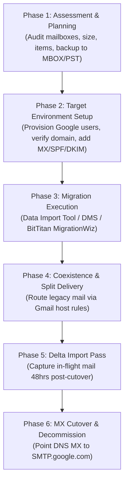
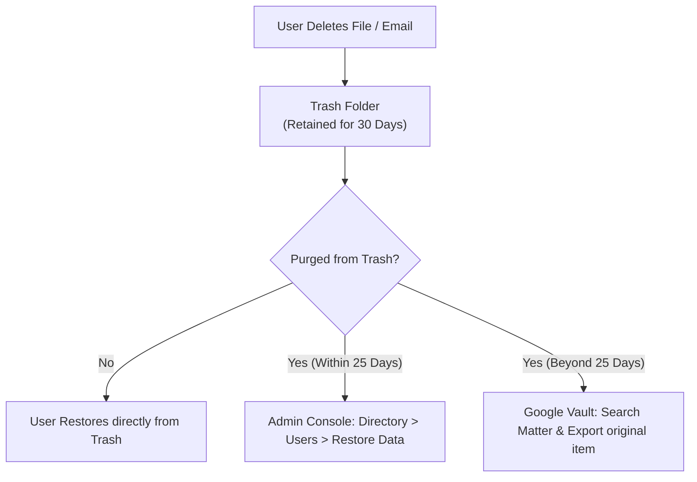
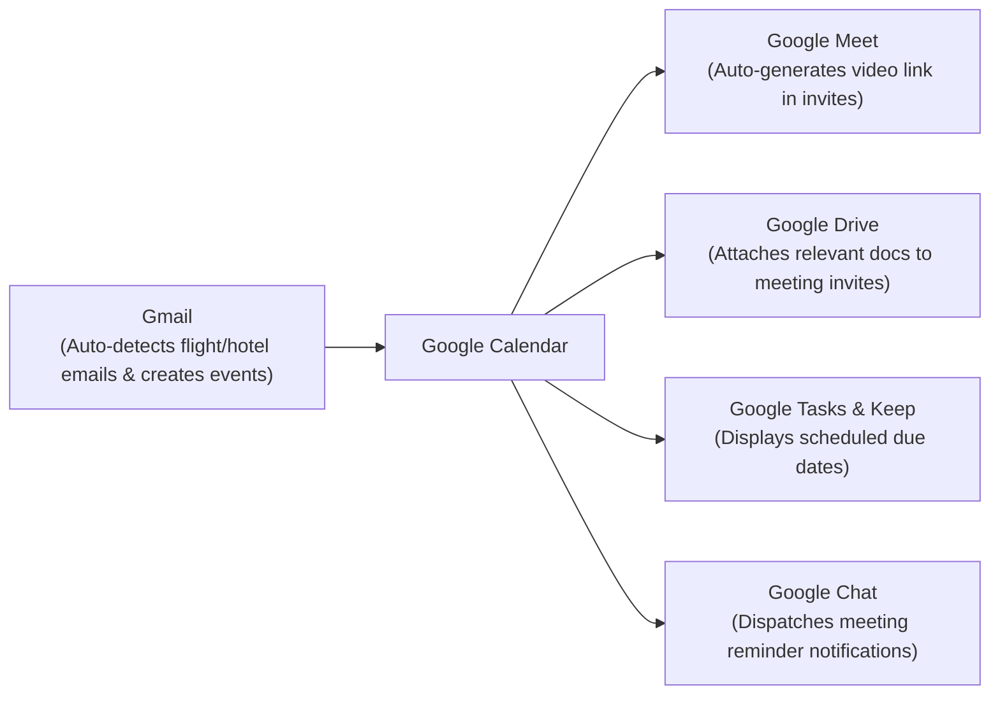

# Module 12: G Suite & Google Workspace Core Operational Interview Handbook

> **Target Audience**: Systems Engineers, Google Workspace Administrators, and IT Support Engineers preparing for technical interviews and operational evaluations.  
> **Overview**: Comprehensive reference covering core G Suite/Workspace architecture, Google Workspace vs. Microsoft 365 comparison, data migration workflows, user provisioning, Apps Script automation, Google Sheets advantages & conditional formatting, email aliases, Google Groups collaborative inboxes, third-party app governance, and service troubleshooting.

---

## 1. Core Architecture & Primary Components

### What is Google Workspace (formerly G Suite)?
Google Workspace is Google's cloud-native productivity, communication, and collaboration suite. It integrates enterprise-grade web applications accessible from any web browser or mobile endpoint, managed centrally via the Google Admin Console (`admin.google.com`).

### Core Applications Breakdown

| Application | Primary Business Function | Key Enterprise Features |
| :--- | :--- | :--- |
| **Gmail** | Professional Email | Custom domain (`@yourcompany.com`), 25 MB attachment limit, spam filters, Gmail API. |
| **Google Drive** | Cloud Storage & Content Management | Personal Drive (My Drive), Shared Drives (team ownership), Drive for Desktop sync. |
| **Google Docs** | Word Processing | Real-time multi-user co-authoring, version history, suggestions, inline comments. |
| **Google Sheets** | Cloud Spreadsheets | Data modeling, formulas, pivot tables, Google Apps Script automation, conditional formatting. |
| **Google Slides** | Presentation Software | Collaborative slide deck creation, presenter view, embedded video/graphics. |
| **Google Meet** | Video Conferencing | Up to 500 participants (higher plans), screen sharing, live captions, noise cancellation, recording. |
| **Google Calendar** | Scheduling & Resource Booking | Shared team calendars, conference room resource booking, Meet auto-link generation. |
| **Google Chat / Spaces** | Team Messaging & Rooms | 1:1 DMs, group conversations, threaded Spaces, Drive file integration. |
| **Google Forms** | Data Collection & Surveys | Custom survey creation, quiz grading, direct response logging to Google Sheets. |
| **Google Sites** | Intranet & Portal Builder | Drag-and-drop internal team sites, embedding Google Drive/Docs/Calendars. |
| **Google Keep** | Note-Taking & Checklists | Quick text/voice notes, shared checklists, integration with Gmail/Calendar sidebar. |
| **AppSheet** | No-Code App Builder | Building custom mobile/web workflow apps directly from Google Sheets or databases. |

---

## 2. Google Workspace vs. Microsoft 365 Comparison Matrix

| Aspect / Feature | Google Workspace | Microsoft 365 |
| :--- | :--- | :--- |
| **Core Applications** | Gmail, Drive, Docs, Sheets, Slides, Meet, Calendar, Chat, Forms, Sites, Keep, AppSheet, Vids | Outlook, OneDrive, Word, Excel, PowerPoint, Teams, OneNote, SharePoint, Exchange, Loop |
| **Deployment Model** | 100% Cloud-Native (Browser & Mobile Apps) | Hybrid (Desktop Native Applications + Web/Mobile Apps) |
| **Pricing (Annual/User/Mo)** | **Starter**: $7 (30 GB)<br>**Standard**: $14 (2 TB)<br>**Business Plus**: $22 (5 TB)<br>**Enterprise**: Custom | **Business Basic**: $6 (Web/Mobile)<br>**Standard**: $12.50 (Desktop Apps)<br>**Premium**: $22 (Advanced Security)<br>**Enterprise**: $35–$57 |
| **Storage Architecture** | Pooled storage across Gmail & Drive (30 GB to 5 TB / Unlimited) | 1 TB OneDrive per user + Separate 50–100 GB Exchange Mailbox |
| **Collaboration Engine** | Superior real-time simultaneous co-authoring; seamless external sharing | Real-time co-authoring via OneDrive/SharePoint/Teams; native desktop lock model |
| **Email Platform** | **Gmail**: Search-centric, intuitive labeling system, 25 MB attachment cap | **Outlook**: Folder-centric, robust desktop client rules, 50–100 GB mailbox capacity |
| **Video Conferencing** | **Google Meet**: Lightweight browser-native, up to 500 participants | **Microsoft Teams**: Robust desktop app, up to 250–1,000 participants, deep SharePoint ties |

---

## 3. End-to-End Email & Workspace Migration Workflow



1. **Planning**: Audit source mailboxes, storage size, contacts, calendars, and mail rules. Select native **Data Import Tool (New DMS)** or third-party tools (BitTitan MigrationWiz).
2. **Target Setup**: Provision target user accounts in Google Workspace via SCIM, GCDS, GAM, or CSV. Configure domain DNS records.
3. **Primary Migration**: Connect Google Workspace to source IMAP/Exchange server via OAuth delegation and run primary import pass.
4. **Cutover & Delta**: Switch DNS MX record to priority **1** `SMTP.google.com`. After 48 hours of DNS propagation, execute a **Delta Migration** pass to capture emails received during propagation.

---

## 4. User Account Provisioning & Deprovisioning (JML)

### A. Manual Provisioning via Admin Console
1. Navigate to **Admin Console > Directory > Users > Add new user**.
2. Input First Name, Last Name, Primary Email Address (`username@yourdomain.com`).
3. Set temporary password and assign to target **Organizational Unit (OU)**.
4. Assign corresponding license SKU (e.g., Business Standard).

### B. Automated Offboarding Sequence
1. **Block Sign-in**: Suspend user account in Admin Console.
2. **Terminate Sessions**: Execute session signout (`gam user leaver signout`) and delete active OAuth tokens.
3. **Data Transfer**:
   * Transfer Google Drive file ownership to designated manager (**Admin Console > Apps > Drive > Transfer ownership**).
   * Transfer primary Google Calendar events to manager.
4. **OU & License Re-assignment**: Move user to `_Leavers` OU and reclaim expensive enterprise SKU license (reassigning Cloud Identity Free or Vault Archived User SKU).

---

## 5. Comprehensive Security Suite in Google Workspace

* **Data Encryption**:
  * **In Transit**: TLS 1.3 encryption for all data moving across networks.
  * **At Rest**: AES-256 bit encryption across distributed storage.
  * **Client-Side Encryption (CSE)**: Encrypts Gmail messages, Drive files, Docs, Sheets, Slides, Meet calls, and Calendar events using customer-managed encryption keys (KMS partners: Thales, FlowCrypt).
* **Two-Step Verification (2SV) & Passkeys**:
  * Mandatory 2SV via security keys (FIDO2/WebAuthn), Google Prompts, or authenticator apps.
  * **Passkeys** support passwordless, phishing-resistant biometric sign-in.
* **Advanced Protection Program (APP)**: Enforces physical FIDO2 security keys, deep Gmail malware/phishing scans, and restricts third-party OAuth app permissions for high-risk accounts (executives, admins).

---

## 6. Data Recovery Workflows in Google Workspace



| Data Type | Retention in Trash | Admin Console Recovery Window | Long-Term Compliance Recovery |
| :--- | :--- | :--- | :--- |
| **Gmail Emails** | 30 Days | Up to 25 days post-trash purge | Google Vault (Indefinite if Litigation Hold active) |
| **Google Drive Files** | 30 Days | Up to 25 days post-trash purge | Google Vault / Shared Drive Trash |
| **Google Contacts** | 30 Days ("Undo changes") | N/A | Google Vault / Admin export |
| **Google Calendar** | 30 Days ("Trash") | N/A | Google Vault |

---

## 7. Google Apps Script & Automation Playbooks

**Google Apps Script** is a cloud-hosted JavaScript scripting platform running on Google servers. It interacts directly with Google Workspace APIs (Gmail, Drive, Sheets, Calendar, Admin SDK) without requiring external server infrastructure.

### Complete Production Script: Automated Email Broadcast from Google Sheets

```javascript
/**
 * Automates sending personalized email broadcasts reading data from a Google Sheet.
 */
function sendAutomatedEmails() {
  const sheet = SpreadsheetApp.getActiveSpreadsheet().getActiveSheet();
  const data = sheet.getDataRange().getValues();
  
  // Skip header row (row 0)
  for (let i = 1; i < data.length; i++) {
    const name = data[i][0];       // Column A: Name
    const email = data[i][1];      // Column B: Email
    const message = data[i][2];    // Column C: Message
    const status = data[i][3];     // Column D: Status Flag
    
    // Only send if email exists and hasn't been sent yet
    if (email && status !== "SENT") {
      const subject = "Official Update for " + name;
      const htmlBody = "<p>Dear " + name + ",</p><p>" + message + "</p><br><p>Best regards,<br>IT Operations</p>";
      
      try {
        GmailApp.sendEmail(email, subject, message, {
          htmlBody: htmlBody,
          name: "IT Operations Team"
        });
        
        // Update status in Column D to prevent duplicate sending
        sheet.getRange(i + 1, 4).setValue("SENT");
        Logger.log("Email sent successfully to: " + email);
      } catch (err) {
        sheet.getRange(i + 1, 4).setValue("ERROR: " + err.message);
        Logger.log("Failed to send email to " + email + ": " + err.message);
      }
    }
  }
}
```

---

## 8. Mobile Device Integration & MDM Controls

* **Native Mobile Apps**: Optimized iOS and Android apps for Gmail, Drive, Docs, Sheets, Slides, Meet, Calendar, Chat, and Keep.
* **Basic Endpoint Management**: Agentless MDM. Enforces device passcodes, account wipes (removes work profile), and audits active mobile endpoints.
* **Advanced Endpoint Management**:
  * **Android Enterprise**: Creates a cryptographically isolated **Work Profile** separating corporate data from personal applications. Prevents cross-profile copy/paste and screenshot capture of work apps.
  * **iOS Sync**: Uses Apple Push Notification service (APNs) and Google Device Policy app to enforce corporate encryption, password complexity, and full hardware wipe capability.

---

## 9. Google Calendar Integrations Across Workspace



---

## 10. Google Sheets: Advantages & Conditional Formatting

### Key Advantages Over Traditional Desktop Spreadsheets
1. **Cloud-Native Real-Time Collaboration**: Multiple users co-edit simultaneously without file locking conflicts (`.xlsx` lock errors).
2. **Built-in Apps Script Automation**: Extend functionality using JavaScript and REST APIs.
3. **Seamless Integration**: Connects natively to Google Forms, Google Finance (`=GOOGLEFINANCE()`), Google Translate (`=GOOGLETRANSLATE()`), and BigQuery datasets.
4. **Version History Audit**: Tracks every keystroke and edit with full point-in-time revision rollback capabilities.

### How to Apply Conditional Formatting
1. Select target range (e.g., `A1:D100`).
2. Navigate to **Format > Conditional formatting**.
3. Choose Rule Type:
   * Single Color (Greater than, Text contains, Date is before, Cell is empty).
   * Custom Formula (e.g., `= $D1 = "OVERDUE"` to highlight entire row).
   * Color Scale (Gradients for financial ranges).
4. Set formatting styles (Fill color, font color, bold) and click **Done**.

---

## 11. Configuring Email Aliases & Google Groups

### A. Configuring Email Aliases
* **Purpose**: Allows a single user to send and receive mail from alternate addresses (e.g., `sales@domain.com` routing to `jdoe@domain.com`).
* **Admin Setup**: Navigate to **Admin Console > Directory > Users > Select User > User Information > Email aliases > Add alias**.
* **Sending from Alias**: User opens **Gmail Settings > Accounts > Send mail as > Add another email address**.

### B. Google Groups Use Cases

| Group Purpose | Administrative Use Case | Key Configuration |
| :--- | :--- | :--- |
| **Email Distribution List** | Deliver email to multiple users via single address (`team@domain.com`) | Delivery enabled to all group members. |
| **Collaborative Inbox** | Shared queue where team members assign, resolve, and tag customer tickets (`support@domain.com`) | Web forum interface enabled at `groups.google.com`. |
| **Access Control Group** | Grant Drive file or Shared Drive permissions to a group rather than individuals | Group added to Shared Drive ACL as Content Manager. |
| **Policy Target Group** | Apply administrative policies (e.g., CAA or 2SV enforcement) across departments | Group selected under Admin Console security scoping. |

---

## 12. Multithreaded Execution Concept

A **multithreaded program** is a software application executing multiple concurrent threads within a single process. In Workspace administration, multithreading is used in CLI tools like **GAM** (`num_threads = 25` in `gam.cfg`) or **GWMME** (`-NumThreads 32`) to issue parallel API requests across thousands of user mailboxes simultaneously, dramatically reducing migration and audit execution times.

---

## 13. Third-Party App Governance & Marketplace Controls

1. **Marketplace Installation**: Navigate to **Admin Console > Apps > Google Workspace Marketplace apps > App list > Install app**.
2. **API Access Levels**: Navigate to **Security > Access and data control > API controls > Manage Third-Party App Access**:
   * **Trusted**: App granted unrestricted access to specified Google APIs.
   * **Limited**: App restricted to non-sensitive scopes.
   * **Blocked**: App execution blocked domain-wide.
3. **OU Scoping**: Apply app access settings to specific Organizational Units.

---

## 14. Workspace Access Methods & System Requirements

* **Access Web Portals**:
  * Gmail: `mail.google.com`
  * Drive: `drive.google.com`
  * Calendar: `calendar.google.com`
  * Admin Console: `admin.google.com`
* **System Requirements**:
  * Internet connectivity (plus Chrome offline extension for offline Gmail/Drive editing).
  * Modern web browser (Chrome, Firefox, Safari, Edge).
  * Mobile endpoints: iOS 13+ or Android 8.0+.
  * Custom domain ownership (for custom `@yourcompany.com` email branding).

---

## 15. Operational Troubleshooting & Diagnostics Guide

| Service Issue | Probable Root Cause | Diagnostic & Resolution Protocol |
| :--- | :--- | :--- |
| **User Sign-in Lockout / Error 400** | Expired SSO SAML cert, 2SV lockout, or suspended account | Check Admin Console audit logs; issue backup 2SV codes; verify IdP SAML cert validity. |
| **Outbound Email Bouncing (NDR)** | Invalid SPF, DKIM, or DMARC record | Run Google Admin Toolbox Messageheader; verify `v=spf1 include:_spf.google.com ~all` and DKIM TXT record. |
| **Inbound Email Bounce Loop (554 5.4.14)** | Routing rule pointing back to MX instead of legacy host IP | Inspect Gmail Routing host rules; ensure destination host points to explicit Exchange IP/FQDN. |
| **Google Group Rejecting External Mail** | "Who can post" set to Group Members only | Open **Groups > Group Settings > Access settings > Who can post** and change to **Public / Anyone**. |
| **Drive File Migration Error 429** | Microsoft Graph API rate-limiting throttling | Exponential backoff retries; reduce concurrent batch size in migration settings. |

---
*Reference: Official G Suite & Google Workspace Operational Interview Handbook.*
