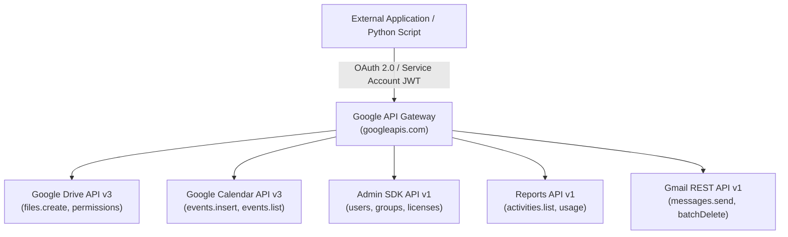
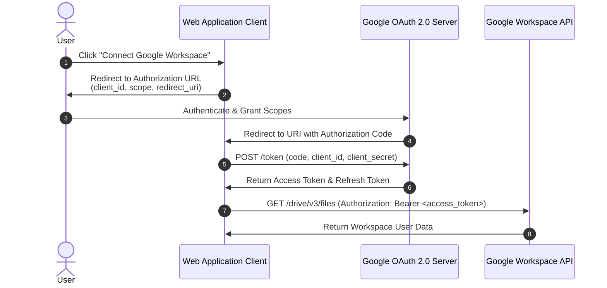
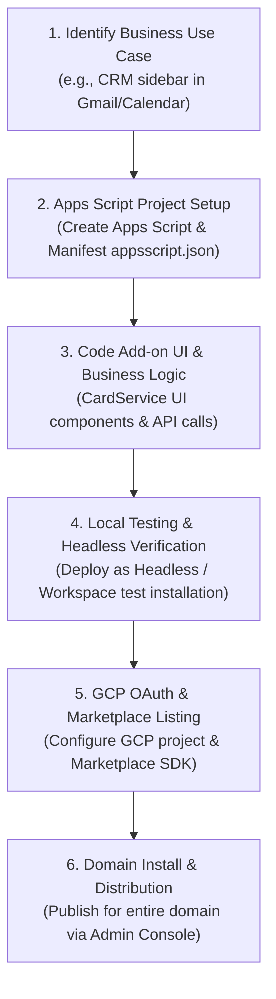
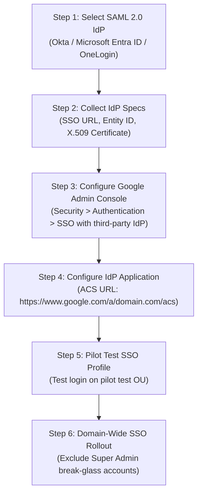

# Module 13: Google Workspace Developer APIs, Python SDKs & Custom Add-ons Handbook

> **Target Audience**: Systems Engineers, Google Workspace Developers, Automation Engineers, and Technical Architects.  
> **Overview**: Technical reference covering programmatic integration with Google Workspace using Python SDK (`google-api-python-client`), OAuth 2.0 web flow, Drive API file uploads, Calendar API event scheduling, custom Google Workspace Add-on development, Reports API auditing, and SAML 2.0 SSO integration.

---

## 1. Google Workspace Core Services & Developer Ecosystem

Google Workspace provides REST APIs exposing core services to external applications via Google Cloud Platform (GCP) Service Accounts or OAuth 2.0 User Delegation.



---

## 2. Python Scripting: Uploading Files to Google Drive (Drive API v3)

### Prerequisites
* Install official Google API Python client: `pip install google-api-python-client google-auth-httplib2 google-auth-oauthlib`
* GCP Service Account JSON key (`service_account.json`) with Drive scope `https://www.googleapis.com/auth/drive.file`.

### Complete Executable Python Script

```python
from googleapiclient.discovery import build
from googleapiclient.http import MediaFileUpload
from google.oauth2 import service_account

def upload_file_to_drive(file_path: str, mime_type: str, drive_file_name: str, service_account_path: str):
    """
    Uploads a local file to Google Drive using the Drive API v3.
    """
    SCOPES = ['https://www.googleapis.com/auth/drive.file']
    
    # 1. Authenticate using Service Account credentials
    credentials = service_account.Credentials.from_service_account_file(
        service_account_path, scopes=SCOPES
    )
    
    # 2. Build the Drive API client
    service = build('drive', 'v3', credentials=credentials)
    
    # 3. Define file metadata and media body
    file_metadata = {'name': drive_file_name}
    media = MediaFileUpload(file_path, mimetype=mime_type, resumable=True)
    
    # 4. Execute the create request
    try:
        file = service.files().create(
            body=file_metadata,
            media_body=media,
            fields='id, webViewLink'
        ).execute()
        
        print(f"Successfully uploaded file!")
        print(f"File ID: {file.get('id')}")
        print(f"View Link: {file.get('webViewLink')}")
        return file.get('id')
    except Exception as e:
        print(f"An error occurred during file upload: {str(e)}")
        return None

if __name__ == '__main__':
    upload_file_to_drive(
        file_path='report.pdf',
        mime_type='application/pdf',
        drive_file_name='Executive_Audit_Report_2026.pdf',
        service_account_path='credentials/service_account.json'
    )
```

---

## 3. Python Scripting: Programmatic Calendar Event Scheduling (Calendar API v3)

### Complete Executable Python Script

```python
from google.oauth2 import service_account
from googleapiclient.discovery import build
from datetime import datetime, timedelta

def schedule_calendar_event(service_account_path: str, user_email: str):
    """
    Programmatically creates a meeting event with Google Meet link in Google Calendar.
    """
    SCOPES = ['https://www.googleapis.com/auth/calendar']
    
    # Authenticate with Domain-Wide Delegation (delegating to user_email)
    credentials = service_account.Credentials.from_service_account_file(
        service_account_path, scopes=SCOPES
    ).with_subject(user_email)
    
    service = build('calendar', 'v3', credentials=credentials)
    
    # Define event timing (Tomorrow 10:00 AM - 11:00 AM PST)
    start_time = (datetime.now() + timedelta(days=1)).replace(hour=10, minute=0, second=0).isoformat() + '-08:00'
    end_time = (datetime.now() + timedelta(days=1)).replace(hour=11, minute=0, second=0).isoformat() + '-08:00'
    
    event_payload = {
        'summary': 'Enterprise Security Audit Review',
        'location': 'Virtual Meeting / Google Meet',
        'description': 'Quarterly Google Workspace security posture and DLP rule audit review.',
        'start': {
            'dateTime': start_time,
            'timeZone': 'America/Los_Angeles',
        },
        'end': {
            'dateTime': end_time,
            'timeZone': 'America/Los_Angeles',
        },
        'attendees': [
            {'email': 'sec-admin@company.com'},
            {'email': 'auditor@company.com'},
        ],
        'conferenceData': {
            'createRequest': {
                'requestId': f"meet-{int(datetime.now().timestamp())}",
                'conferenceSolutionKey': {'type': 'hangoutsMeet'}
            }
        },
        'reminders': {
            'useDefault': False,
            'overrides': [
                {'method': 'email', 'minutes': 24 * 60},
                {'method': 'popup', 'minutes': 15},
            ],
        },
    }
    
    # Insert event and create Google Meet conference
    event = service.events().insert(
        calendarId='primary',
        body=event_payload,
        conferenceDataVersion=1
    ).execute()
    
    print(f"Event created successfully!")
    print(f"HTML Link: {event.get('htmlLink')}")
    print(f"Meet Video Link: {event.get('hangoutLink')}")
    return event.get('id')

if __name__ == '__main__':
    schedule_calendar_event('credentials/service_account.json', 'admin@yourcompany.com')
```

---

## 4. OAuth 2.0 Web Application Authentication Architecture



### Steps to Implement OAuth 2.0 Web Authorization:
1. **Google Cloud Console Project Setup**: Enable Workspace APIs (Drive, Gmail, Calendar, Admin SDK).
2. **Configure OAuth Consent Screen**: Set application name, support email, authorized domains, and define API Scopes (`.../auth/drive.readonly`, etc.).
3. **Generate OAuth 2.0 Client ID**: Create Web Application credentials, configuring authorized JavaScript origins and redirect URIs (`https://your-app.com/oauth2/callback`).
4. **Exchange & Token Refresh**: Exchange short-lived `authorization_code` for `access_token` (valid 1 hour) and `refresh_token`. Store `refresh_token` securely to auto-renew access tokens offline.

---

## 5. Custom Google Workspace Add-on Development Lifecycle



### Add-on Manifest Configuration (`appsscript.json`)

```json
{
  "timeZone": "America/Los_Angeles",
  "dependencies": {},
  "exceptionLogging": "STACKDRIVER",
  "runtimeVersion": "V8",
  "addOns": {
    "common": {
      "name": "Enterprise Security Inspector",
      "logoUrl": "https://www.company.com/assets/logo.png",
      "layoutProperties": {
        "primaryColor": "#4285F4"
      }
    },
    "gmail": {
      "contextualTriggers": [{
        "unconditional": {},
        "onTriggerFunction": "buildGmailSidebarCard"
      }]
    }
  }
}
```

---

## 6. Audit Logging & Monitoring via Workspace Reports API (`reports_v1`)

### Fetching User Drive Activity Logs via Python

```python
from google.oauth2 import service_account
from googleapiclient.discovery import build

def audit_drive_activity(service_account_path: str, admin_email: str):
    """
    Fetches external file sharing audit events using Google Admin Reports API.
    """
    SCOPES = ['https://www.googleapis.com/auth/admin.reports.audit.readonly']
    
    credentials = service_account.Credentials.from_service_account_file(
        service_account_path, scopes=SCOPES
    ).with_subject(admin_email)
    
    service = build('admin', 'reports_v1', credentials=credentials)
    
    # Query Drive audit events for external visibility changes
    results = service.activities().list(
        userKey='all',
        applicationName='drive',
        eventName='change_user_access'
    ).execute()
    
    activities = results.get('items', [])
    print(f"Found {len(activities)} Drive audit events:")
    
    for activity in activities:
        user = activity.get('actor', {}).get('email')
        time = activity.get('id', {}).get('time')
        print(f"User: {user} | Timestamp: {time}")

if __name__ == '__main__':
    audit_drive_activity('credentials/service_account.json', 'admin@yourcompany.com')
```

---

## 7. SAML 2.0 Single Sign-On (SSO) Integration Step-by-Step



---
*Reference: Official Google Workspace Developer APIs, Python SDKs & Custom Add-ons Handbook.*
