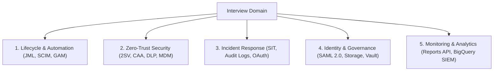
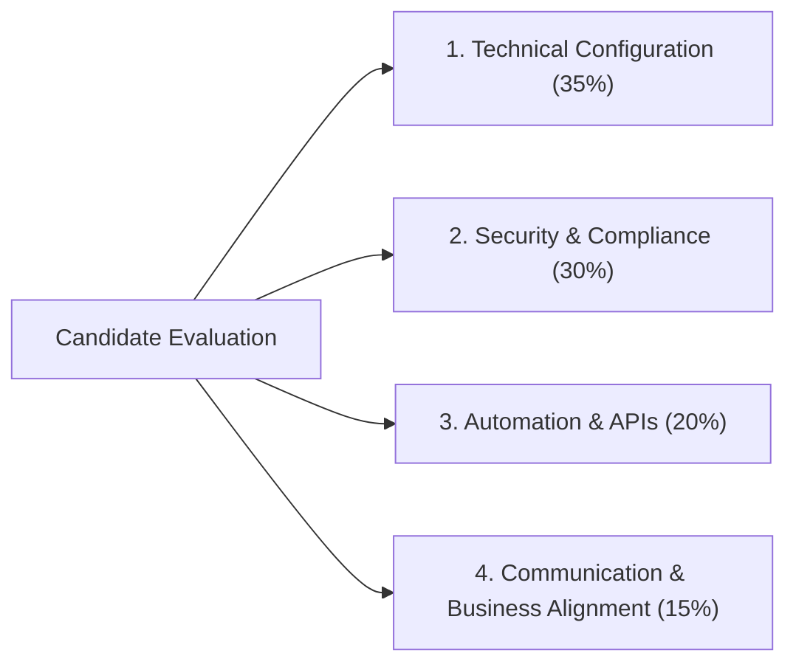

# Module 14: G Suite & Google Workspace Senior Analyst Hiring, Evaluation & Interview Rubric

> **Target Audience**: IT Directors, Hiring Managers, Lead Workspace Engineers, and Senior IT Recruitment Assessors.  
> **Overview**: Definitive framework for interviewing, evaluating, and scoring G Suite / Google Workspace Analyst candidates. Includes 10 scenario-based interview questions with "Strong Answer" criteria and "Red Flags", candidate evaluation methodologies, a 4-category weighted scoring rubric, core technology proficiency benchmarks, and enterprise hiring FAQs.

---

## 1. Top 10 Senior G Suite Analyst Interview Questions & Evaluator Rubrics

### Q1: User Lifecycle Management & Automated Provisioning
* **Question**: Describe how you manage user lifecycle processes in Google Workspace, including onboarding and offboarding.
* **Why It Matters**: Lifecycle management is the core operational baseline. Gaps create severe data leak security vulnerabilities and licensing cost inflation.
* **Strong Answer Must Include**:
  * Automated provisioning via **SCIM 2.0** (Okta / Entra ID) or **GCDS**.
  * Role-based group assignments and automated license allocation.
  * Hierarchical OU placement (`/Employees/Sales`, `/Leavers`).
  * Documented offboarding protocol: Instant session signout, OAuth token wipe, Drive/Calendar data ownership transfer to manager, account suspension, license reclamation, and Vault retention.
* **Red Flags**: Manual-only Admin Console GUI steps; no session revocation during offboarding; lack of license reclamation awareness.

---

### Q2: Security Policy Configuration & Staged Rollouts
* **Question**: How do you configure and enforce security policies in the Google Admin Console?
* **Why It Matters**: Misconfigured policies expose the enterprise to credential theft and unauthorized data egress.
* **Strong Answer Must Include**:
  * Mandatory 2SV enforcement with security key grace periods per OU.
  * Zero-trust **Context-Aware Access (CAA)** policies based on IP CIDR, device encryption state, and managed browser checks.
  * DLP rule configuration scanning Drive files and Gmail outbound traffic.
  * Staged rollout strategy: Pilot testing on a non-production OU before domain-wide enforcement, accompanied by Audit Log monitoring.
* **Red Flags**: Relying on vendor default settings; no staged testing protocol; ignoring compliance frameworks (HIPAA/GDPR).

---

### Q3: Incident Response & Suspicious Activity Investigation
* **Question**: Explain how you would investigate suspicious account activity in Google Workspace.
* **Why It Matters**: Evaluates incident response maturity and log analysis skills.
* **Strong Answer Must Include**:
  * Step-by-step query construction in the **Security Investigation Tool (SIT)** (filtering by login anomalies, suspicious IPs, or impossible travel).
  * Reviewing active OAuth token grants and revoking unapproved tokens (`gam user signout`).
  * Inspecting Gmail Message Headers and Email Log Search for unauthorized mail forwarding rules.
  * Executing containment (password reset, session wipe, device quarantine), followed by post-incident root-cause documentation.
* **Red Flags**: No structured IR plan; failure to inspect raw audit logs; inability to use SIT or GAM during an active breach.

---

### Q4: Federated Identity & Single Sign-On (SSO) Integration
* **Question**: How have you integrated Google Workspace with identity providers such as Okta or Azure AD (Entra ID)?
* **Why It Matters**: Validates hands-on experience with SAML 2.0 and directory synchronization.
* **Strong Answer Must Include**:
  * SAML 2.0 configuration details (ACS URL `https://www.google.com/a/domain.com/acs`, Entity ID, X.509 certificate upload).
  * SCIM 2.0 attribute mapping (UPN, givenName, familyName, department) and sync conflict resolution (e.g., handling duplicate email collisions).
  * Configuring **Super Admin break-glass accounts** to bypass SSO during IdP outages.
  * Group mapping for role-based Workspace policy enforcement.
* **Red Flags**: Purely conceptual understanding without hands-on SAML XML cert setup; failure to account for SSO outage break-glass contingencies.

---

### Q5: Storage Governance & Shared Drive Architecture
* **Question**: Describe your experience managing Google Workspace storage and Shared Drive governance.
* **Why It Matters**: Prevents unbudgeted storage overages and unauthorized external file exposure.
* **Strong Answer Must Include**:
  * Implementing per-user and per-OU Drive storage quotas.
  * Establishing Shared Drive lifecycle governance: Enforcing organizational ownership, restricting external sharing, and applying the **400,000 item limit** best practices.
  * Google Vault retention rules vs. Litigation Holds.
  * Auditing public file exposures using GAM or SIT.
* **Red Flags**: Treating Shared Drives like unmonitored local file shares; lack of storage quota strategy.

---

### Q6: API Scripting & Administrative Automation
* **Question**: How do you approach API automation within Google Workspace?
* **Why It Matters**: Evaluates efficiency and scalability beyond manual GUI clicking.
* **Strong Answer Must Include**:
  * Writing custom Python or PowerShell scripts consuming the **Google Workspace Admin SDK**.
  * Advanced CLI administration using **GAM / GAMADV-XTD3** for bulk user provisioning, license management, and ACL audits.
  * Deploying Google Apps Script for automated workflow triggers.
* **Red Flags**: Zero scripting exposure; 100% reliance on Admin Console GUI.

---

### Q7: Data Loss Prevention (DLP) Rule Engineering
* **Question**: Explain how you configure and monitor Data Loss Prevention (DLP) policies.
* **Why It Matters**: Critical for protecting PII, PCI-DSS, and corporate IP.
* **Strong Answer Must Include**:
  * Defining custom detectors (regex patterns, predefined SSN/Credit Card detectors, Optical Character Recognition for images).
  * Establishing rule actions: Block external sharing, display user warnings, and send real-time alerts to SecOps.
  * Tuning procedures: Running rules in **Audit/Monitor Mode** to analyze false positives before hard enforcement.
* **Red Flags**: Unaware of DLP features; deploying blocking rules without a dry-run testing phase.

---

### Q8: Third-Party OAuth App Governance
* **Question**: How do you manage third-party app access and OAuth permissions?
* **Why It Matters**: Unchecked OAuth app access creates malicious shadow IT backdoors.
* **Strong Answer Must Include**:
  * Managing API Controls in Admin Console (**Security > API Controls > Manage Third-Party App Access**).
  * Categorizing apps into **Trusted**, **Limited**, or **Blocked** states per OU.
  * Risk assessment methodology: Evaluating requested OAuth scopes (e.g., `gmail.readonly` vs. `drive.file`).
  * Automated token revocation via GAM or SIT.
* **Red Flags**: Allowing users to grant unrestricted OAuth scopes to unvetted Marketplace applications.

---

### Q9: Complex Tenant Migration Execution
* **Question**: Describe a complex migration or consolidation project you supported within Google Workspace.
* **Why It Matters**: Demonstrates end-to-end technical execution and change management capability.
* **Strong Answer Must Include**:
  * Detailed migration phases: Pre-migration audit, user account pre-provisioning, pilot pass, bulk migration pass, single MX cutover, and post-cutover delta sync.
  * Tool selection justification (Google Data Import Tool, Google Workspace Migrate, BitTitan MigrationWiz).
  * Coexistence email routing strategies (Dual/Split Delivery).
  * User communication and post-migration support planning.
* **Red Flags**: Lack of a structured project methodology; assuming migration tools automatically create target user accounts.

---

### Q10: Proactive Health Monitoring & SIEM Integration
* **Question**: How do you monitor overall Google Workspace performance and health?
* **Why It Matters**: Moves administration from reactive firefighting to proactive reliability engineering.
* **Strong Answer Must Include**:
  * Monitoring Google Workspace Status Dashboard (`appsstatus`) and Alert Center notifications.
  * Programmatic audit log extraction using the **Reports API (`reports_v1`)**.
  * Exporting Admin Console audit log streams to **Google Cloud BigQuery** or enterprise SIEM platforms (Splunk, Datadog).
* **Red Flags**: Purely reactive approach (waiting for users to log help desk tickets).

---

## 2. Hiring Manager Evaluation Framework & Scoring Rubric

### Technical & Behavioral Assessment Matrix

### Weighted Scoring Rubric (1–5 Scale)

| Evaluation Category | Weight | Description & Scoring Criteria | Target Senior Benchmark |
| :--- | :--- | :--- | :--- |
| **Technical Configuration Depth** | **35%** | Deep understanding of Admin Console settings, OU design, mail routing rules (SPF/DKIM/DMARC), Shared Drive governance, and DNS topologies. | **4.5+**: Explains exact UI navigation, CLI commands, and DNS record formats flawlessly. |
| **Security & Compliance Knowledge** | **30%** | Mastery of 2SV enforcement, Context-Aware Access, DLP rule tuning, Google Vault eDiscovery, and incident response via SIT. | **4.0+**: Prioritizes zero-trust principles, staged testing, and audit log analysis. |
| **Automation & Integration Skills** | **20%** | Proficiency with GAM / GAMADV-XTD3, Python/PowerShell SDKs, Google Apps Script, SAML 2.0 SSO, and SCIM provisioning. | **4.0+**: Demonstrates practical GAM syntax and custom API automation experience. |
| **Communication & Collaboration** | **15%** | Ability to translate complex technical controls into clear business outcomes for non-technical stakeholders (Legal, HR, Executives). | **4.0+**: Articulates business risk clearly and documents technical SOPs effectively. |

---

## 3. Senior vs. Mid-Level Analyst Differentiation

| Competency Domain | Mid-Level Workspace Administrator | Senior G Suite Systems Analyst / Architect |
| :--- | :--- | :--- |
| **Execution Scope** | Manages daily user provisioning, password resets, basic group memberships, and ticket queues. | Designs OU policy architecture, SAML/SCIM SSO federation, and automated JML lifecycles. |
| **Security Posture** | Maintains existing default security settings and basic 2SV enforcement. | Engineers zero-trust Context-Aware Access (CAA), DLP rules, CSE key management, and SIT containment. |
| **Automation Capabilities** | Relies primarily on Admin Console GUI; runs basic pre-written GAM commands. | Writes custom Python/PowerShell scripts using Admin SDK, GAM, and Google Apps Script pipelines. |
| **Migration & Projects** | Executes basic data migration batches following documented checklists. | Architects multi-tenant migration strategies, coexistence mail routing, and change management. |
| **Incident Response** | Responds to user tickets; escalates security anomalies to SecOps. | Leads security investigations in SIT, performs raw audit log extraction, and authors post-mortem SOPs. |

---

## 4. Core Enterprise Technology Benchmark Table

| Technology / Tool | Required Functional Competency | Enterprise Validation Method |
| :--- | :--- | :--- |
| **Google Admin Console** | Primary configuration portal across users, OUs, apps, and security. | Ask candidate to walk through configuring a Split Delivery routing rule step-by-step. |
| **Google Workspace Admin SDK** | Programmatic REST API management of directory resources. | Ask candidate to describe an API script they authored using `googleapiclient`. |
| **GAM / GAMADV-XTD3** | Command-line tool for high-volume enterprise administration. | Request exact GAM command syntax for executing a mass phishing email purge domain-wide. |
| **Google Vault** | Archiving, legal holds, eDiscovery searches, and exports. | Ask candidate to explain the operational difference between a Retention Rule and a Litigation Hold. |
| **Context-Aware Access (CAA)** | Zero-trust access control based on IP, device posture, and OS. | Ask candidate to write a CEL expression restricting access to managed, encrypted laptops. |
| **IdPs (Okta / Entra ID)** | Single Sign-On (SAML 2.0) and directory sync (SCIM 2.0). | Validate hands-on setup of SAML ACS URLs and handling SCIM attribute sync drops. |
| **SIEM Integration (BigQuery)** | Streaming audit log events for long-term security analytics. | Ask how log streams were forwarded to BigQuery or Splunk for automated SOC dashboards. |
| **Chrome Enterprise** | Managing Chrome browser profiles, extensions, and OS endpoints. | Ask candidate to explain how to enforce extension whitelisting across target OUs. |

---

## 5. Enterprise Hiring Manager FAQ

### Q1: What core skills should a G Suite Analyst possess for enterprise environments?
**Answer**: An enterprise G Suite Analyst must possess strong technical configuration depth in Google Admin Console, SAML 2.0/SCIM identity federation (Okta/Entra ID), GAM command-line automation, Context-Aware Access security enforcement, Google Vault eDiscovery governance, and DNS mail flow architecture (SPF/DKIM/DMARC).

### Q2: How do I evaluate a candidate's scripting & automation proficiency during an interview?
**Answer**: Avoid asking theoretical questions. Ask the candidate to write out or walk through a specific automation script—for example, a GAM command to audit all externally shared files (`gam all users print filelist query "visibility='anyoneWithLink'"`) or a Python script using `google-api-python-client` to provision users reading from a CSV file.

### Q3: What is the single biggest hiring mistake when interviewing G Suite Analysts?
**Answer**: The most common mistake is overvaluing paper certifications without validating hands-on operational experience. Candidates may pass multiple-choice exams but struggle when tasked with CLI automation, complex SAML SSO debugging, or handling a live mass-phishing outbreak in the Security Investigation Tool.

---
*Reference: Official G Suite & Google Workspace Senior Analyst Hiring, Evaluation & Interview Rubric.*
