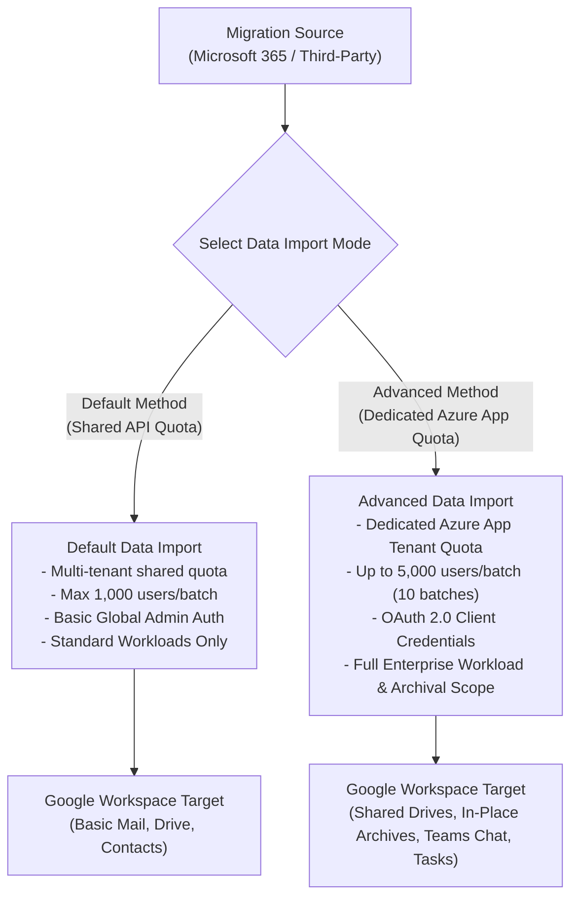
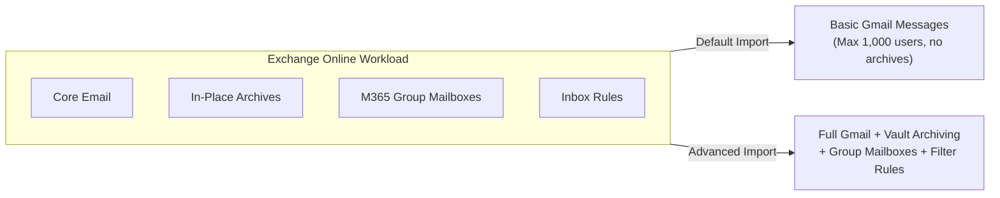
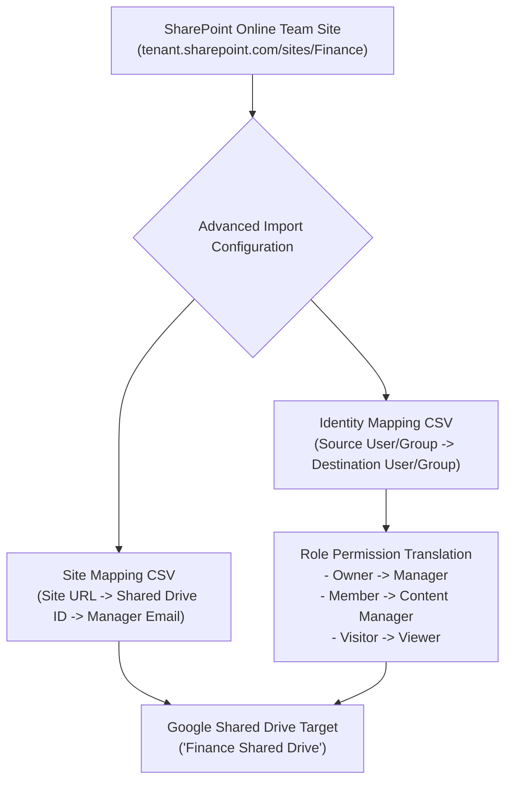
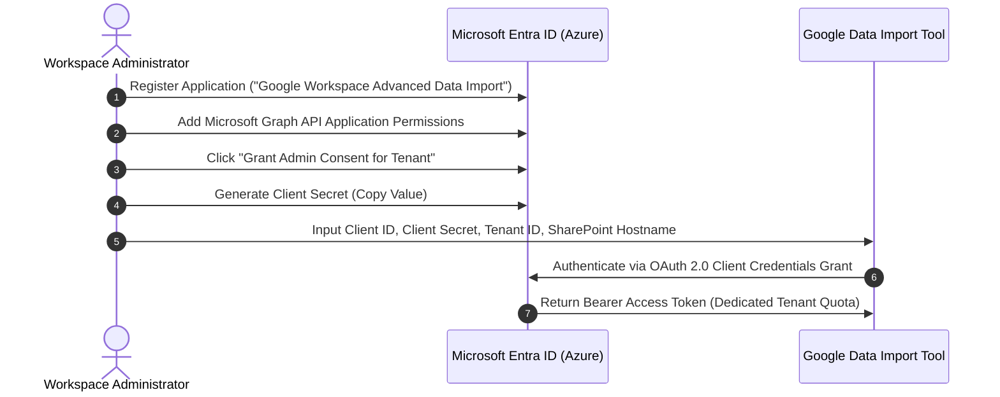
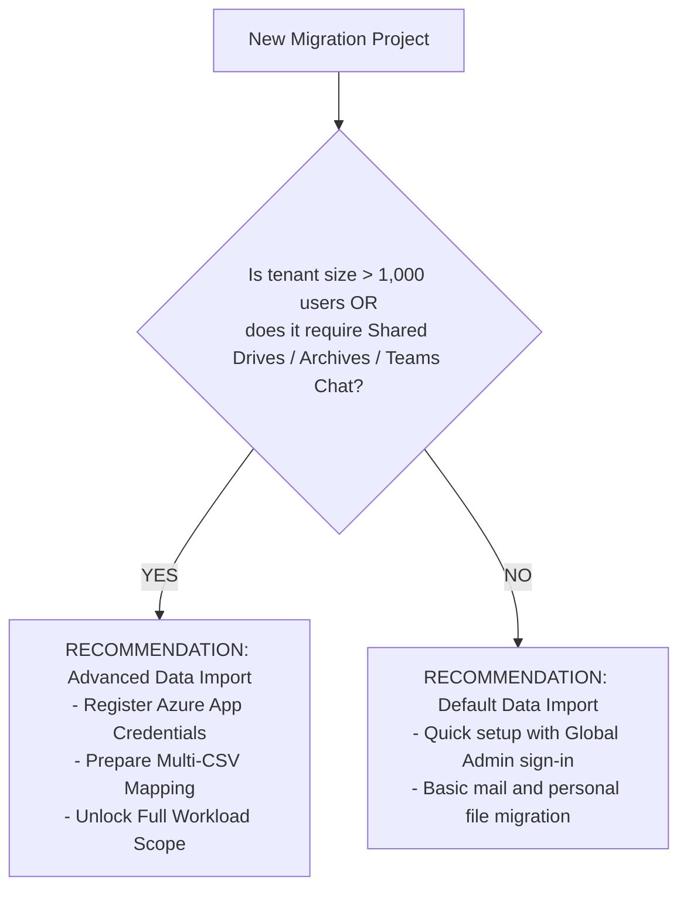

# Module 16: Google Workspace Data Import Tool — Default vs. Advanced Data Migration Definitive Guide

> **Target Audience**: Cloud Migration Architects, Google Workspace Engineers, Microsoft 365 Administrators, and Technical Project Managers.  
> **Overview**: Definitive technical guide comparing **Default Data Import** (Shared API Quota) vs. **Advanced Data Import** (Dedicated Azure App Quota) in the Google Workspace Admin Console (`Data > Data import & export > Data import` or `knowledge.workspace.google.com/admin/migrate/`). Covers all supported workloads: Exchange Online Mail, In-Place Archives, M365 Group Mailboxes, Contacts, Calendars, Tasks, OneDrive for Business, SharePoint Online, Teams Chat, and Third-Party Cloud Storage (Dropbox/Box).

---

## 1. Executive Summary & Architectural Overview

Google Workspace provides a cloud-native **Data Import Tool** integrated directly into the Admin Console. When setting up data migrations from Microsoft 365 or third-party sources, administrators must choose between two distinct operational modes: **Default Data Import** and **Advanced Data Import**.



---

## 2. High-Level Comparison Matrix: Default vs. Advanced Data Import

| Architecture / Feature Dimension | Default Data Import Method | Advanced Data Import Method |
| :--- | :--- | :--- |
| **Primary API Quota** | Multi-tenant shared Google API quota | Dedicated Microsoft Azure App Registration quota |
| **User Batch Limit** | Maximum **1,000 users** per batch | Up to **5,000 users** per batch (Supports 10 concurrent batches = 50,000 users) |
| **Authentication Architecture** | Interactive Global Admin Sign-in / Basic Credentials | OAuth 2.0 Client Credentials (`Client ID`, `Client Secret`, `Tenant ID`) |
| **Azure Entra ID App Required?** | ❌ No (Uses Google's pre-registered app consent) | ✅ **Yes** (Requires custom Azure App Registration with Graph API permissions) |
| **CSV Mapping Required?** | Simple Single CSV (Source Email $\rightarrow$ Target Email) | Multi-CSV Workflow (Identity Mapping CSV + Site Mapping CSV + User List CSV) |
| **Exchange Online Archives** | ❌ Excluded / Not Supported | ✅ **Supported** (Routes to Google Vault or custom `In-Place Archive` labels) |
| **M365 Group Mailboxes** | ❌ Excluded | ✅ **Supported** (Migrates group emails to Google Groups or Shared Mailboxes) |
| **Calendar Event Attachments** | Limited to 35 MB | ✅ **Up to 150 MB** (Uploads directly to user's Drive folder `Imported Calendar Attachments`) |
| **Outlook Rules & Calendar ACLs** | ❌ Basic or Excluded | ✅ **Supported** (Translates Outlook rules to Gmail filters & maps calendar ACLs) |
| **SharePoint Team Sites** | ❌ Basic File Copy Only | ✅ **Full Shared Drive Mapping** (Site URL $\rightarrow$ Shared Drive ID $\rightarrow$ Manager Email) |
| **Microsoft Teams Chat** | ❌ Excluded / Basic 1:1 Only | ✅ **Full Workload Support** (1:1 chats, group chats, channel messages, inline media) |
| **Microsoft To Do / Tasks** | ❌ Excluded | ✅ **Supported** (Migrates to Google Tasks, creating up to 100 task lists) |
| **Unmapped Identity Fallback** | Auto-maps unmapped emails automatically | Admin Control: Can disable auto-mapping to prevent permission leaks |
| **Throttling Mitigation** | Standard backoff (vulnerable to shared tenant limits) | Enterprise exponential backoff with dedicated Azure tenant throughput |

---

## 3. Workload-by-Workload Detailed Comparison

### A. Exchange Online (Email, In-Place Archives & Group Mailboxes)



| Exchange Data Sub-Type | Default Data Import Behavior | Advanced Data Import Behavior |
| :--- | :--- | :--- |
| **Primary Inbox & Folders** | Migrates core emails; converts folder slashes `A/B` to `A_B`. | Migrates core emails; preserves nested label hierarchies with system protection (`All Mail_`, `Bin_`). |
| **In-Place Archives** | ❌ **Not Migrated**. User must manually export archive PSTs. | ✅ **Migrated**. Automatically routes archive mail to Google Vault or custom Gmail labels (`In-Place Archive`). |
| **M365 Group Mailboxes** | ❌ **Not Migrated**. Shared group mailboxes are skipped. | ✅ **Migrated**. Transfers group conversations into Google Groups or dedicated target Shared Mailboxes. |
| **Outlook Inbox Rules** | ❌ **Not Migrated**. | ✅ **Migrated**. Translates Outlook server-side rules into native Gmail XML Search Filters. |
| **Attachment Size Limit** | 35 MB max attachment cap. | ✅ **150 MB max attachment cap** (large files stored in Drive). |
| **Read/Unread & Flags** | Preserves Read/Unread status and High Importance flags. | Preserves Read/Unread, High Importance (`Important` label), Snoozed, and Starred flags. |

---

### B. Microsoft Calendar & Resource Scheduling

| Calendar Feature | Default Data Import Behavior | Advanced Data Import Behavior |
| :--- | :--- | :--- |
| **Primary & Secondary Calendars** | Migrates primary personal calendar events. | Migrates primary, secondary, shared, and team calendars. |
| **Resource Calendars (Rooms/Equipment)**| ❌ Manual setup required post-migration. | ✅ **Automated Mapping**. Maps Exchange Resource Mailboxes directly to Google Workspace Building/Room resources. |
| **Event Attachments** | Attachments $>35$ MB drop or fail. | ✅ Attachments up to 150 MB uploaded to Drive folder `Imported Calendar Attachments` and linked to event. |
| **Calendar ACL Permissions** | ❌ Default permissions only (Free/Busy). | ✅ **Full ACL Translation**. Maps *Owner*, *Editor*, *Reviewer*, *Free/Busy* permissions to Google Calendar ACLs. |
| **Recurring Events without End Date** | Truncates to 2 years from migration date. | ✅ Automatically sets recurring end date to **December 31, 2099**. |

---

### C. Contacts & Microsoft To Do Tasks

| Workload Feature | Default Data Import Behavior | Advanced Data Import Behavior |
| :--- | :--- | :--- |
| **Personal Contacts Capacity** | Supports up to 5,000 personal contacts per user. | ✅ Supports up to **27,000 personal contacts** per user. |
| **Contact Sub-Folders** | Flattens contact sub-folders into a single main contact list. | ✅ Preserves sub-folders as single-level Google Contact labels (`Folder1 - Folder2`). |
| **Global Address List (GAL)** | ❌ Excluded from import. | ✅ Syncs domain directory attributes to Google Directory via Admin SDK. |
| **Microsoft To Do / Tasks** | ❌ **Not Migrated**. | ✅ **Migrated**. Converts Microsoft To Do task lists directly into **Google Tasks** (up to 100 task lists). |

---

### D. OneDrive for Business $\rightarrow$ Google Drive (My Drive)

| OneDrive Feature | Default Data Import Behavior | Advanced Data Import Behavior |
| :--- | :--- | :--- |
| **User File Hierarchy** | Copies personal files to target user's My Drive. | Copies files & folder trees to My Drive with full identity mapping. |
| **Unmapped Identity Handling** | Auto-maps unmapped user shares automatically (risk of sharing with wrong external accounts). | ✅ **Admin Policy Scoping**. Allows admins to disable `Copy unmapped accounts` to prevent accidental data leaks. |
| **File Exclusions by Format** | Basic file size limit filters. | ✅ Advanced regex exclusions (`.tmp`, `~$*.docx`, `.lock`, file sizes $>5$ TB). |
| **Illegal Filename Sanitization** | Replaces illegal characters (`\`, `/`, `:`, `*`, `?`, `"`, `<`, `>`, `\|`) with underscores. | Replaces illegal characters with underscores and truncates paths $>1,024$ characters cleanly. |

---

### E. SharePoint Online $\rightarrow$ Google Shared Drives



| SharePoint Feature | Default Data Import Behavior | Advanced Data Import Behavior |
| :--- | :--- | :--- |
| **Migration Target** | Copies site document libraries into user personal My Drives. | ✅ **Direct Shared Drive Target**. Maps SharePoint Team Sites directly to **Google Shared Drives**. |
| **Site Mapping Control** | Manual site selection per run. | ✅ **Site Mapping CSV**. Bulk maps hundreds of site URLs (`Site URL -> Shared Drive ID -> Manager Email`). |
| **Permission Translation** | Simplified view/edit permissions. | ✅ **Granular Role Matrix**: <br>• *Owner* $\rightarrow$ **Manager**<br>• *Member* $\rightarrow$ **Content Manager**<br>• *Visitor* $\rightarrow$ **Viewer** |
| **Item Limit Governance** | No enforcement of Shared Drive item caps. | ✅ Pre-checks and enforces Google Shared Drive limits (**400,000 items**, max 20 folder levels deep). |

---

### F. Microsoft Teams Chat $\rightarrow$ Google Chat & Spaces

| Teams Chat Component | Default Data Import Behavior | Advanced Data Import Behavior |
| :--- | :--- | :--- |
| **1:1 Direct Messages** | ❌ Basic text or excluded. | ✅ Migrates 1:1 chat history into Google Chat direct message threads. |
| **Group Chats** | ❌ **Not Migrated**. | ✅ Migrates multi-user group chats into Google Chat group conversations. |
| **Channel Messages (Public/Private)**| ❌ **Not Migrated**. | ✅ Migrates channel messages into **Google Chat Spaces** (preserving threaded replies). |
| **Inline Images & Attachments** | ❌ Attachments dropped. | ✅ Inline images and file attachments uploaded to Drive and linked in Chat threads. |

---

### G. Third-Party Cloud Storage (Dropbox & Box $\rightarrow$ Google Drive)

| Third-Party Storage Feature | Default Data Import Behavior | Advanced Data Import Behavior |
| :--- | :--- | :--- |
| **Dropbox Team Folders** | Migrates to personal My Drive accounts. | ✅ Maps Team Folders directly to **Google Shared Drives** via OAuth API consent. |
| **Box Enterprise Accounts** | Basic file copy without permission preservation. | ✅ Preserves Box collaborators, shared links, and folder structure. |

---

## 4. Azure App Registration Walkthrough for Advanced Data Import

To enable **Advanced Data Import**, administrators must register a dedicated OAuth 2.0 application in the source Microsoft 365 tenant via Entra ID (`entra.microsoft.com`).



### Required Microsoft Graph API Application Permissions Table

| API Permission | Permission Type | Required Functional Purpose |
| :--- | :--- | :--- |
| `Sites.FullControl.All` | Application | Read/Write access to all SharePoint Online sites and document libraries. |
| `Files.ReadWrite.All` | Application | Full access to OneDrive for Business user file trees and permissions. |
| `User.Read.All` | Application | Read all user directory profiles for identity mapping validation. |
| `Group.Read.All` | Application | Read M365 Groups, team memberships, and group mailboxes. |
| `Mail.Read` | Application | Read Exchange Online primary mailboxes and In-Place Archives. |
| `Calendars.Read` | Application | Read Exchange primary/secondary calendars, events, and ACLs. |
| `Contacts.Read` | Application | Read personal contacts and contact folders. |
| `Chat.Read.All` | Application | Read 1:1 and group chat threads in Microsoft Teams. |
| `ChannelMessage.Read.All` | Application | Read public and private channel messages in Microsoft Teams. |

---

## 5. Step-by-Step Configuration Guide in Google Admin Console

### Step 1: Access Data Import Tool
Navigate to **Google Admin Console > Data > Data import & export > Data import**.

### Step 2: Select Data Source & Migration Method
1. Select source: **Microsoft Exchange**, **Microsoft OneDrive**, **Microsoft SharePoint**, **Microsoft Teams**, or **Third-Party Cloud**.
2. Select Migration Method: Choose **Advanced** (Dedicated Azure App Quota).

```
┌────────────────────────────────────────────────────────────────────────┐
│ Data Import Setup - Microsoft 365                                      │
├────────────────────────────────────────────────────────────────────────┤
│ Select Import Method:                                                  │
│  ( ) Default Data Import (Shared API Quota - max 1,000 users)          │
│  (*) Advanced Data Import (Dedicated Azure Quota - max 50,000 users)   │
│                                                                        │
│ Credentials:                                                           │
│  Tenant ID:            [ 3fa85f64-5717-4562-b3fc-2c963f66afa6         ] │
│  Client ID:            [ 9b1deb4d-3b7d-4bad-9bdd-2b0d7b3dcb6d         ] │
│  Client Secret:        [ wK8~7Q...******************                 ] │
│  SharePoint Host Name: [ contoso.sharepoint.com                      ] │
└────────────────────────────────────────────────────────────────────────┘
```

### Step 3: Upload Mapping CSV Files
1. **User List CSV**: `SourceEmail,TargetEmail`
2. **Site Mapping CSV** (SharePoint): `SiteUrl,SharedDriveId,ManagerEmail`
3. **Identity Mapping CSV**: `SourceUserOrGroup,TargetUserOrGroup`

### Step 4: Configure Data Scoping & Exclusions
* Set date range filters (e.g., migrate mail from past 3 years).
* Set file size caps (e.g., exclude files $>5$ GB).
* Configure unmapped identity fallback rules (set `Copy unmapped accounts` to **Disabled**).

### Step 5: Start Migration & Execute Delta Passes
1. Click **Start Import**.
2. Monitor real-time progress dashboard.
3. Upon primary completion and MX cutover, click **Run Delta Import** (captures residual mail received during 48-hour DNS propagation window).

---

## 6. Diagnostic & Error Code Matrix

| Error Code / Status | Diagnostic Root Cause | Resolution Protocol |
| :--- | :--- | :--- |
| `HTTP 429 Too Many Requests` | Microsoft Graph API rate-limiting throttling. | Tool automatically executes exponential backoff. For custom runs, reduce batch size. |
| `401 Unauthorized / Invalid Client` | Expired Client Secret or incorrect Client ID / Tenant ID. | Generate a new Client Secret in Azure Entra ID and update credentials in Admin Console. |
| `403 Forbidden / Access Denied` | Missing admin consent for Graph API permissions. | Open Azure Entra ID > App Registrations > Select App > API Permissions > Click **Grant admin consent**. |
| `Item Limit Exceeded (400,000)` | Shared Drive target exceeds Google item cap limit. | Split SharePoint Document Library across multiple target Shared Drives in Site Mapping CSV. |
| `Unmapped Identity Error` | Source user email in ACL does not exist in target tenant. | Update Identity Mapping CSV to explicitly map unmapped source email to a designated fallback email. |

---

## 7. Operational Recommendation Decision Matrix



* **Use Default Data Import when**: Small tenant migration ($<1,000$ users), basic email and personal file copy only, no requirement for SharePoint-to-Shared-Drive mapping, Teams Chat, In-Place Archives, or custom Azure App Registration.
* **Use Advanced Data Import when**: Enterprise migration ($>1,000$ to 50,000 users), migrating SharePoint Team Sites to Shared Drives, migrating In-Place Archives to Google Vault, migrating Teams Chat to Google Chat Spaces, or requiring strict unmapped identity security controls.

---
*Reference: Official Google Workspace Data Import Tool Technical Documentation (`knowledge.workspace.google.com/admin/migrate/`).*
