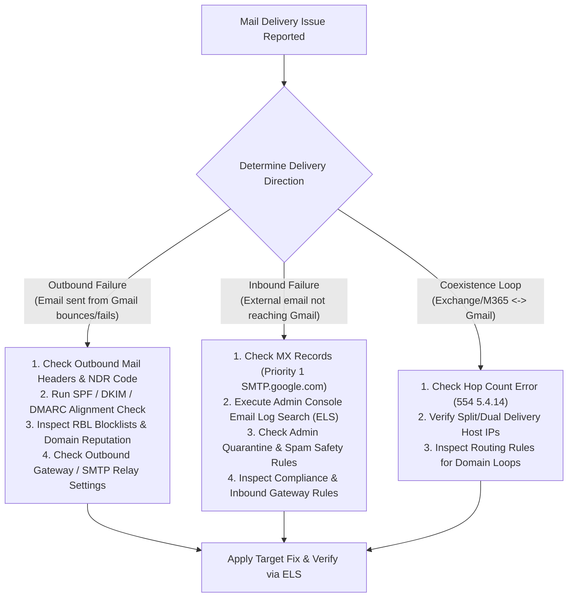
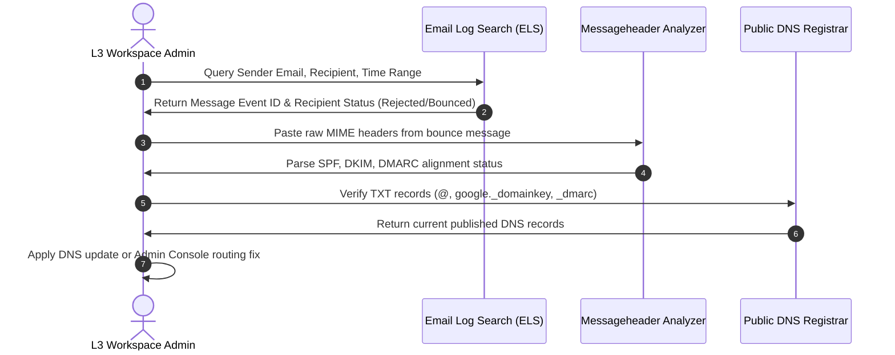
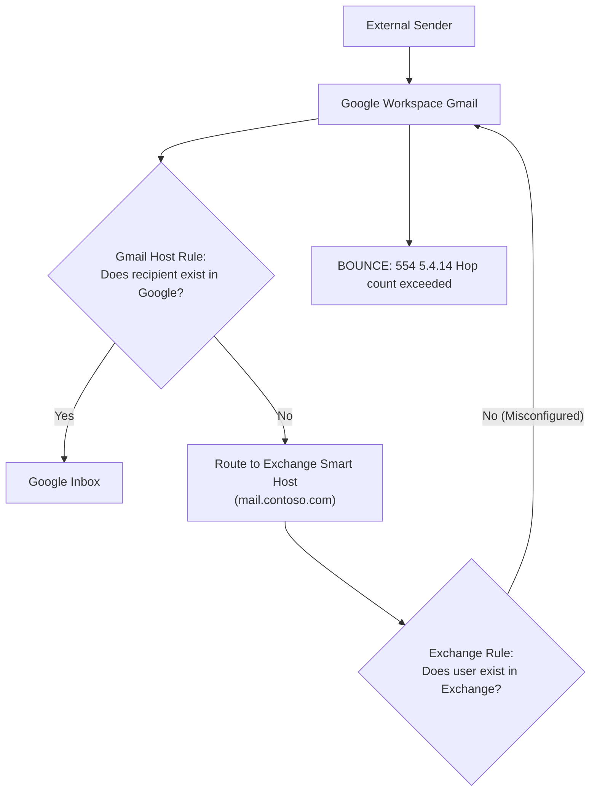

# Module 17: Google Workspace Mail Delivery Troubleshooting — Master Engineering Playbook

> **Target Audience**: Senior Systems Engineers, Email Infrastructure Architects, and L3 Support Engineers.  
> **Overview**: Comprehensive diagnostic and remediation playbook for resolving inbound, outbound, internal, and coexistence mail delivery failures in Google Workspace. Features exact SMTP error code breakdowns, DNS authentication troubleshooting (SPF/DKIM/DMARC/MTA-STS), Email Log Search (ELS) analysis, Gmail routing loop fixes, Admin Quarantine management, and GAM CLI diagnostic commands.

---

## 1. Master Diagnostic Flowchart: Inbound & Outbound Mail Issues



---

## 2. SMTP Bounce & Error Code Diagnostic Matrix

| Error Code | Error Status String | Root Cause | Actionable Resolution Protocol |
| :--- | :--- | :--- | :--- |
| **`550 5.7.1`** | `Unauthenticated email from [Domain] is not accepted due to domain's DMARC policy` | Sender domain failed DMARC alignment (`p=reject` or `p=quarantine`) and SPF/DKIM checks failed. | Publish valid SPF (`v=spf1 include:_spf.google.com ~all`), generate 2048-bit DKIM key in Admin Console, ensure `From:` domain aligns with `Return-Path` and `d=` tag. |
| **`550 5.7.26`** | `This message does not have authentication information or fails to pass authentication checks` | Missing SPF or DKIM record entirely (enforced strictly by Google/Yahoo 2024 bulk sender requirements). | Configure both SPF and DKIM records in domain DNS; ensure sender complies with bulk sender guidelines (>5,000 emails/day requires DMARC). |
| **`554 5.4.14`** | `Hop count exceeded - possible mail loop` | Routing rule configured to forward email to a smart host that routes it back to Google Workspace. | Inspect **Apps > Gmail > Routing**. Ensure destination host points to legacy server IP/FQDN directly and does not evaluate domain MX records. |
| **`421 4.7.0`** | `Try again later, closing connection / Rate limit exceeded` | Sending IP address or domain is sending excessive volume in a short window or IP reputation is poor. | Reduce sending rate; implement exponential backoff; ensure dedicated sending IPs are warmed up; verify IP is not listed on Spamhaus/Barracuda. |
| **`550 5.2.1`** | `The email account that you tried to reach is disabled` | Target recipient account is suspended or disabled in Google Workspace Admin Console. | Navigate to **Admin Console > Directory > Users**, search for user, and click **Restore / Unsuspend User**. |
| **`552 5.2.2`** | `The email account that you tried to reach has exceeded its quota` | Recipient mailbox storage capacity exceeded (rare in Workspace, occurs if storage limit hard capped). | Reassign user to higher storage tier SKU or increase user Drive/Gmail storage allocation in Admin Console. |
| **`550 5.1.1`** | `The email account that you tried to reach does not exist` | Invalid recipient email address or typo in username. | Verify target username in Admin Console Directory; check if recipient alias or secondary domain is active. |

---

## 3. Step-by-Step Diagnostic Workflows

### Diagnostic Workflow A: Investigating Outbound Email Bounces



1. **Step 1: Execute Email Log Search (ELS)**:
   * Navigate to **Admin Console > Reporting > Audit and Investigation > Email Log Search**.
   * Enter Sender Email, Recipient Email, and Date Range (past 30 days).
   * Click **Search**. Locate the target message and click the Subject line to view message history details.
   * Review **Recipient status**: *Delivered*, *Quarantined*, *Rejected*, or *Bounced*.

2. **Step 2: Parse Message Headers**:
   * Obtain the full header of the rejected email (or bounce NDR).
   * Paste into **Google Admin Toolbox Messageheader** (`toolbox.googleapps.com/apps/messageheader/`).
   * Verify header delivery hop times, `Authentication-Results`, `Received-SPF`, and `DKIM-Signature`.

3. **Step 3: Verify DNS Authentication Alignment**:
   * **SPF Check**: Verify TXT record on apex: `v=spf1 include:_spf.google.com ~all`.
     * *Check for 10-lookup limit*: Use `dig TXT yourdomain.com` or Google Admin Toolbox Dig. Ensure total lookups do not exceed 10.
   * **DKIM Check**: Verify TXT record on `google._domainkey.yourdomain.com`.
     * In Admin Console (**Apps > Gmail > Authenticate email**), verify status is **Authenticating email**.
   * **DMARC Check**: Verify TXT record on `_dmarc.yourdomain.com`.
     * Ensure `From:` domain strictly aligns with `Return-Path` (SPF) and `d=` tag (DKIM).

---

### Diagnostic Workflow B: Investigating Inbound Email Delivery Failures

1. **Step 1: Check MX Records**:
   * Verify domain MX records using `dig MX yourdomain.com`.
   * **Correct Google Workspace MX Configuration**:
     * Priority **1**: `SMTP.google.com` (Modern unified record)  
       *OR Legacy Setup*:
       * Priority **1**: `ASPMX.L.GOOGLE.COM`
       * Priority **5**: `ALT1.ASPMX.L.GOOGLE.COM`
       * Priority **5**: `ALT2.ASPMX.L.GOOGLE.COM`
       * Priority **10**: `ALT3.ASPMX.L.GOOGLE.COM`
       * Priority **10**: `ALT4.ASPMX.L.GOOGLE.COM`
   * *Common Failure*: Lingering legacy MX records (e.g., `mail.contoso.com`) causing round-robin delivery failures. Remove all non-Google MX records.

2. **Step 2: Audit Gmail Admin Quarantine**:
   * Navigate to **Admin Console > Apps > Google Workspace > Gmail > Manage Quarantines**.
   * Check default and custom quarantine queues for messages held by Spam, Compliance, or Attachment Safety rules.
   * Review held items and click **Release** or **Reject**.

3. **Step 3: Review Inbound Compliance & Safety Settings**:
   * Navigate to **Apps > Google Workspace > Gmail > Safety** and **Compliance**.
   * Inspect **Spoofing and phishing** protection controls (e.g., protect against domain spoofing, unauthenticated senders).
   * Check **Inbound gateway** settings: If receiving mail via an external spam filter (e.g., Proofpoint, Mimecast), ensure inbound gateway IPs are explicitly whitelisted with **Require TLS** enabled.

---

### Diagnostic Workflow C: Resolving Coexistence Routing Loops (`554 5.4.14`)

During Microsoft 365 / Exchange to Google Workspace migrations, email is routed between tenants using **Split Delivery** or **Dual Delivery**. Routing loops occur when System A routes mail to System B, which routes it back to System A.



#### Step-by-Step Hop Count Loop Remediation:
1. Navigate to **Admin Console > Apps > Google Workspace > Gmail > Hosts**.
2. Verify host definition: Ensure destination host specifies the explicit FQDN or IP of the Exchange server (e.g., `mail.contoso.com` on port 25/587) with **Perform MX lookup** UNCHECKED.
3. Navigate to **Apps > Gmail > Routing**.
4. Edit Split Delivery rule:
   * **Affecty envelope recipients**: *Single recipient* or *Pattern match*.
   * **Route action**: *Change route* $\rightarrow$ Select designated Exchange Host.
   * **Execution condition**: Select **Perform this action only for unrecognised recipients**.
5. On the Exchange / M365 side, ensure accepted domain is set to **Internal Relay** (not Authoritative) so unmatched mail does not loop back to Google.

---

## 4. Diagnostic Shell & GAM CLI Commands

Administrators can diagnose user-level mail rules, forwarding addresses, delegates, and DNS records using CLI tools:

```powershell
# 1. Audit User Inbound Forwarding Addresses
gam user user@yourdomain.com print forwardingaddresses

# 2. Audit Domain-Wide Mail Forwarding Rules (Detecting Data Exfiltration)
gam all users print forwardingaddresses todrive

# 3. Audit User Filters (Detecting Malicious Auto-Delete or Auto-Forward Filters)
gam user user@yourdomain.com print filters

# 4. Audit Mailbox Delegates
gam user user@yourdomain.com print delegates

# 5. Execute DNS SPF, MX, and DKIM Diagnostics via PowerShell
Resolve-DnsName -Name yourdomain.com -Type MX
Resolve-DnsName -Name yourdomain.com -Type TXT
Resolve-DnsName -Name google._domainkey.yourdomain.com -Type TXT
Resolve-DnsName -Name _dmarc.yourdomain.com -Type TXT

# 6. Delete Malicious Forwarding Rule via GAM
gam user user@yourdomain.com delete forwardingaddress attacker@external.com
```

---

## 5. Preventative Maintenance & Best Practices Baseline

1. **Maintain Strict DMARC Policy**: Transition domain from `p=none` to `p=quarantine` and ultimately `p=reject` to protect brand domain reputation.
2. **Automate DKIM Key Rotation**: Rotate 2048-bit DKIM keys annually using new selectors (`google2026`).
3. **Monitor SPF Lookup Budget**: Keep published SPF DNS lookups $\le 8$ to prevent `PermError` authentication drops.
4. **Implement Quarantine Review SLAs**: Establish daily IT Help Desk operational procedures for reviewing Admin Quarantine queues to prevent accidental data loss.
5. **Continuous Log Streaming**: Forward Email Log Search streams to **Google Cloud BigQuery** for long-term audit retention and automated SIEM anomaly detection.

---
*Reference: Official Google Workspace Mail Delivery & Gmail Troubleshooting Guide.*
