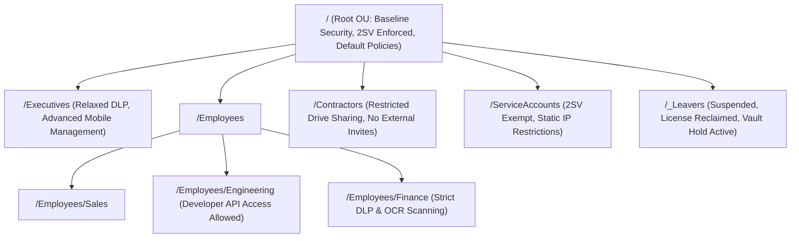
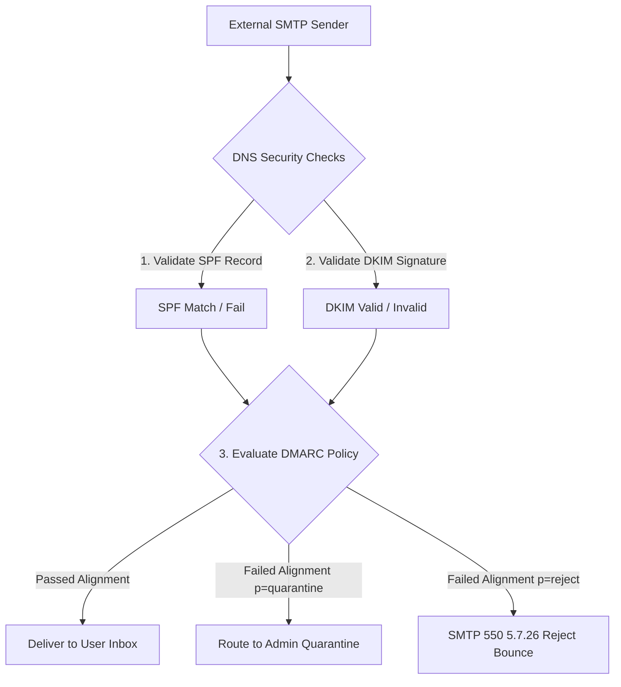
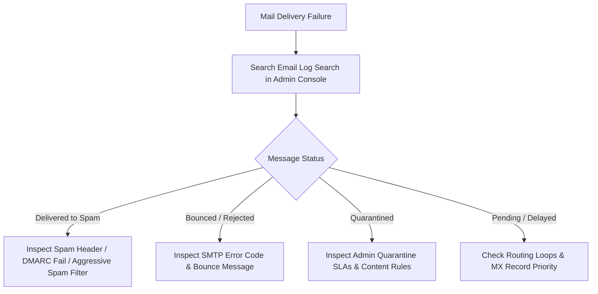
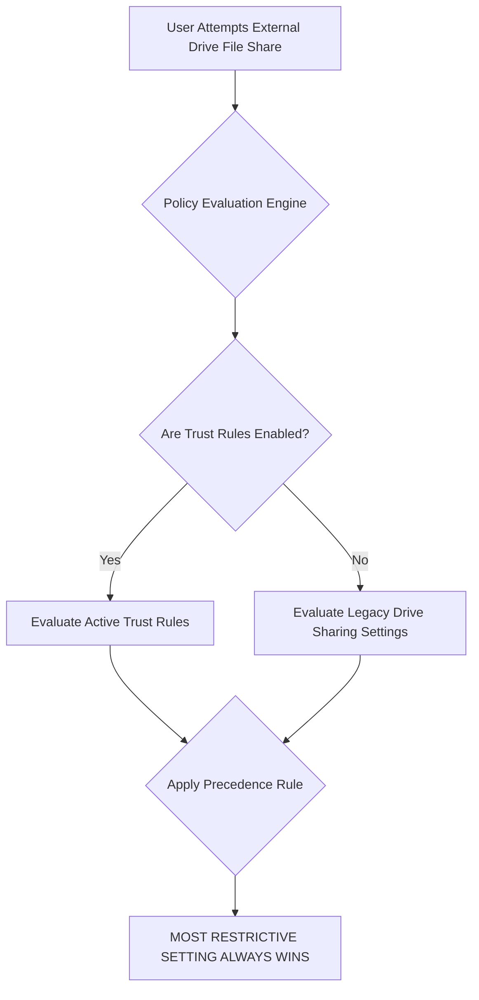

# 1. Google Workspace Architecture, Mail Flow & Security Master Engineering Guide

This master guide covers Google Workspace core tenant architecture, email authentication infrastructure, mail delivery troubleshooting, Data Loss Prevention (DLP), Google Vault eDiscovery, and Enterprise Trust Rules security architecture.

---

## 🏢 1. Tenant Architecture & OU Hierarchy Design

An enterprise Google Workspace deployment relies on a clean, scalable **Organizational Unit (OU)** hierarchy. Settings and policies inherit from top-level root (`/`) down to child OUs, unless explicitly overridden.



### Policy Inheritance Rules
1.  **Top-Down Inheritance**: Any setting configured at Root applies universally across all sub-OUs unless an explicit override exists.
2.  **Explicit Overrides**: Child OUs can override parent policies (e.g., enabling YouTube access for `/Marketing` while keeping it blocked at Root).
3.  **Group-Based Policy Overrides**: Access settings (e.g., Context-Aware Access, YouTube, App access) can be applied via Google Groups across OUs, overriding OU structure.
4.  **Service Accounts & Leavers**: Technical accounts and offboarded users MUST reside in dedicated sub-OUs to prevent accidental license consumption or security exposure.

---

## ✉️ 2. Mail Flow Infrastructure & Email Authentication

Secure enterprise mail delivery requires full implementation of SPF, DKIM, DMARC, MTA-STS, and BIMI.



### A. Sender Policy Framework (SPF)
*   **Purpose**: Authorizes specific IP addresses and servers to send mail on behalf of your domain.
*   **Standard Google SPF Record**:
    ```text
    v=spf1 include:_spf.google.com ~all
    ```
*   **Hard-Fail (`-all`) vs. Soft-Fail (`~all`)**: `~all` is recommended during DMARC rollout to prevent legitimate third-party mail drops; transition to `-all` once all senders are identified.
*   **The 10 DNS Lookup Limit**: RFC 7208 limits SPF processing to a maximum of 10 mechanism lookups (`include`, `a`, `mx`, `ptr`, `exists`). Exceeding 10 results in a permanent SPF `PermError`, causing DMARC failures.

### B. DomainKeys Identified Mail (DKIM)
*   **Purpose**: Adds a cryptographically signed header (`DKIM-Signature`) to outbound emails using a public/private key pair.
*   **Key Length**: Always deploy **2048-bit RSA keys** generated in Google Admin Console (`Apps > Google Workspace > Gmail > Authenticate email`).
*   **Selector Rotation**: Rotate DKIM selector keys annually to prevent cryptographic compromise.

### C. Domain-based Message Authentication, Reporting, and Conformance (DMARC)
*   **Purpose**: Enforces domain alignment and defines how receiving mail servers handle unauthenticated mail.
*   **DMARC Alignment**: Requires that the domain in the `From:` header matches the domain validated by SPF (`Return-Path`) AND/OR DKIM (`d=` claim).
*   **Progressive Policy Deployment**:
    ```text
    Phase 1 (Monitoring): v=DMARC1; p=none; rua=mailto:dmarc-reports@company.com; pct=100
    Phase 2 (Quarantine): v=DMARC1; p=quarantine; rua=mailto:dmarc-reports@company.com; pct=100
    Phase 3 (Enforcement):  v=DMARC1; p=reject; rua=mailto:dmarc-reports@company.com; pct=100
    ```

### D. MTA-STS & BIMI
*   **MTA-STS (RFC 8461)**: Forces inbound TLS encryption for SMTP connections, preventing Man-in-the-Middle (MITM) downgrade attacks (`v=STSv1; mode=enforce`).
*   **BIMI (Brand Indicators for Message Identification)**: Displays verified corporate logos in Gmail inboxes. Requires a valid VMC (Verified Mark Certificate) and DMARC set to `p=quarantine` or `p=reject`.

---

## 📬 3. Mail Delivery Troubleshooting Playbook

### Diagnostic Flowchart for Inbound/Outbound Failures



### Common SMTP Diagnostic Error Matrix

| SMTP Error Code | Error Description | Root Cause | Engineering Remediation |
| :--- | :--- | :--- | :--- |
| `550 5.7.1` | Access Denied / Relay Disallowed | Inbound mail relay unauthenticated or IP not whitelisted. | Add egress IP to Authorized Inbound Gateway settings. |
| `550 5.7.26` | Unauthenticated email is not accepted | Message failed SPF/DKIM authentication and violated DMARC `p=reject`. | Align sender SPF/DKIM records; ensure 2048-bit DKIM key active. |
| `554 5.4.14` | Hop count exceeded - possible mail loop | Dual delivery / Split delivery misconfiguration routing mail infinitely between Google and M365/On-Prem. | Check MX records and host routes; disable smart-host echo loops. |
| `421 4.7.0` | IP rate limit exceeded / Temporary deferral | Sending domain exceeded Google receiving rate limits or IP warmed improperly. | Reduce outbound burst rate; implement exponential backoff retry. |

---

## 🛡️ 4. Data Loss Prevention (DLP) & Optical Character Recognition (OCR)

Google Workspace DLP inspects sensitive data in Drive files, Gmail messages, and Chat.

### Key Configuration Capabilities:
1.  **Pre-defined Detectors**: Social Security Numbers (SSN), Credit Card Numbers (PCI-DSS), ABA Routing numbers, Passports.
2.  **Custom Regex Detectors**: Project codenames, internal employee IDs, custom tokens (`^EMP-[0-9]{5}$`).
3.  **OCR Integration**: Extracts and scans text inside image files (`.png`, `.jpg`) and scanned PDF documents attached to emails or saved in Drive.
4.  **Remediation Actions**:
    *   **Block**: Prevents external sharing or email transmission instantly.
    *   **Warn**: Prompts user with a warning modal before allowing external share.
    *   **Audit**: Logs violation quietly to Admin Audit logs for SOC review.

---

## 🔐 5. Google Vault & eDiscovery Architecture

Google Vault provides retention, litigation holds, search, and export capabilities for regulatory compliance.

```mermaid
graph LR
    subgraph Data Sources
        Gmail[Gmail]
        Drive[Drive & Shared Drives]
        Chat[Google Chat]
        Meet[Meet Recordings]
    end
    
    subgraph Vault Engine
        RetRules[Default / Custom Retention Rules]
        Holds[Litigation Holds - INDEFINITE OVERRIDE]
        Search[Audit & Search Engine]
    end
    
    Data Sources --> Vault Engine
    Vault Engine --> Export[Export MBOX / PST / EML / Zip]
```

*   **Retention Rules vs. Litigation Holds**: Retention rules automatically purge data older than a set timeframe (e.g., retain email for 7 years, then delete). **Litigation Holds override retention rules entirely**, preserving data indefinitely regardless of user deletion.
*   **Audit & Export**: Allows legal teams to search across historical user data using Boolean queries, export evidence to standard formats (`PST`, `MBOX`, `EML`), and maintain chain-of-custody log records.

---

## 🔒 6. Enterprise Security Scenarios & Trust Rules Architecture

Trust Rules provide granular access controls for Google Drive file sharing, superseding legacy Drive sharing settings.

### Trust Rules vs. Legacy Drive Sharing Settings



### Precedence Matrix

| Legacy Sharing Setting | Trust Rule Setting | Effective Access Outcome | Underlying Precedence Rationale |
| :--- | :--- | :--- | :--- |
| **Allowed** | **Allowed** | ✅ **ALLOWED** | Both policies permit external sharing. |
| **Allowed** | **Blocked** | ❌ **BLOCKED** | **Trust Rule Precedes** (Most Restrictive Wins). |
| **Blocked** | **Allowed** | ❌ **BLOCKED** | **Legacy Setting Precedes** (Most Restrictive Wins)*. |
| **Blocked** | **Blocked** | ❌ **BLOCKED** | Both policies deny access. |

*\*Note*: When transitioning tenant to **Enforce Trust Rules Exclusively**, Trust Rules completely replace legacy Drive sharing settings, becoming the single authoritative policy engine.
