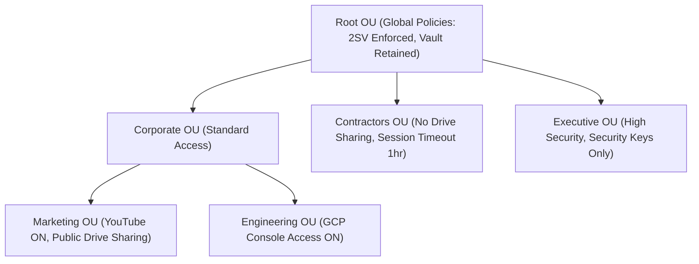
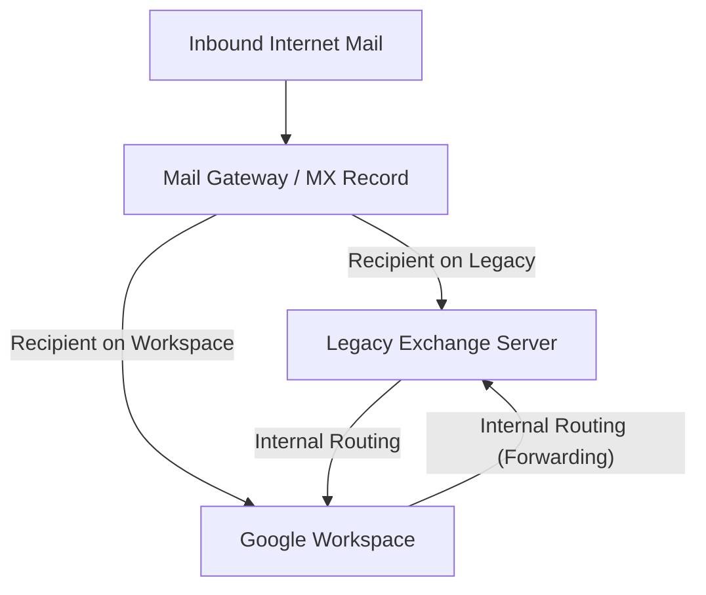

# Module 1: Google Workspace Engineering Deep Dive

This module covers core administrative architecture, email security standards, compliance, and enterprise data migration frameworks. As an L3 Administrator or Subject Matter Expert (SME), you must understand these systems at a protocol and architectural level, not just as buttons in the admin console.

---

## 1. Hierarchical OU Design and Policy Inheritance

Organizational Units (OUs) in Google Workspace control which settings, apps, and services are enabled for specific subsets of users.

### Architectural Best Practices
*   **Logical vs. Geographical Hierarchy**: Group users by functional policies (e.g., Security Level, Compliance Requirements) rather than geographic office location alone.
*   **Nest for Overrides**: Place settings at the Root OU that apply to 95% of the company, and create child OUs only for exceptions.
*   **Inheritance vs. Overrides**: By default, child OUs inherit settings from their parent. Overriding a setting breaks the link. If you change the parent setting, it will *not* propagate to overridden child OUs.
*   **Service States**: Services can be "ON for everyone", "OFF for everyone", or "ON/OFF for specific OUs".
*   **Security Groups as an Alternative**: For settings that don't support OU-level scoping (or when you need cross-functional policies), use Security Groups to target policies (e.g., enabling YouTube access for a specific cross-functional marketing team).



---

## 2. Advanced Mail Flow Infrastructure (DNS & Email Security)

Securing email flow is one of the most critical responsibilities of a Workspace Admin. You must be able to design and troubleshoot SPF, DKIM, DMARC, MTA-STS, and BIMI.

### A. Sender Policy Framework (SPF)
SPF is a TXT record in your DNS zone that lists the authorized IP addresses/hostnames allowed to send mail from your domain.

*   **Syntax Breakdown**:
    `v=spf1 include:_spf.google.com include:sendgrid.net ip4:192.0.2.0/24 ~all`
    *   `v=spf1`: Identifies the record as SPF version 1.
    *   `include:_spf.google.com`: Authorizes Google's outbound mail servers.
    *   `include:sendgrid.net`: Authorizes SendGrid outbound servers.
    *   `ip4:192.0.2.0/24`: Authorizes a specific IPv4 CIDR range.
    *   `~all` (Soft Fail): Mail is accepted but marked (often flagged as spam if other checks fail).
    *   `-all` (Hard Fail): Receiving servers are instructed to reject emails that do not match.
*   **The 10 DNS Lookup Limit**: The SPF specification (RFC 7208) limits the number of DNS-based lookup mechanisms (`include`, `a`, `mx`, `ptr`, `exists`, and `redirect`) to a maximum of **10** to prevent Denial of Service (DoS) attacks on DNS infrastructure.
    *   *Nested Lookups*: If you include a domain that includes another domain, all count toward the 10-lookup limit. Exceeding this triggers a `PermError` on the receiving mail server, failing authentication.
    *   *Google Workspace late-2025 Update*: In late 2025, Google updated the primary SPF record (`_spf.google.com`) to be fully flattened. Previously, including it consumed 4 DNS lookups (the parent record + 3 nested includes). It now resolves as **1 DNS lookup**, freeing up lookup budgets for other third-party sending platforms.
    *   *Mitigation Strategies for the Limit*:
        1.  **SPF Flattening (Manual)**: Replace domain `include` statements with their current static IP ranges (`ip4`/`ip6`). *Risk*: Vendors modify their IP ranges regularly; manual records will silently break mail authentication.
        2.  **SPF Flattening (Automated)**: Use dynamic SPF tools (e.g., Valimail, Red Sift, Sendmarc) that dynamically resolve includes into a single query chain at request time.
        3.  **Subdomain Delegation**: Delegate marketing or transactional email platforms to send from a sub-domain (e.g., `marketing.yourdomain.com`), giving that subdomain its own independent 10-lookup limit.
        4.  **Cleanup**: Periodically audit and remove stale `include` values. Never deploy multiple SPF records on a single domain.


### B. DomainKeys Identified Mail (DKIM)
DKIM adds a cryptographic signature to email headers, verified against a public key published in the domain's DNS.

*   **Under the Hood**:
    1.  The sending mail server hashes specific headers and the body of the message.
    2.  The server encrypts this hash using the domain's private key.
    3.  The signature is inserted into the email header as `DKIM-Signature`.
    4.  The receiving server queries DNS for the TXT record at `[selector]._domainkey.[domain]` to retrieve the public key.
    5.  The receiving server decrypts the signature and compares the hash. If they match, the email is verified authentic and unaltered in transit.
*   **Key Length**: Always use **2048-bit** keys unless your DNS provider does not support records longer than 255 characters (in which case you fall back to 1024-bit).
*   **DKIM Key Rotation SOP**:
    1.  Generate a new DKIM key in the Google Workspace Admin Console using a new selector (e.g., `google2026`).
    2.  Publish the new public key TXT record in your DNS zone.
    3.  Wait for DNS propagation (typically 24–48 hours depending on TTL).
    4.  In the Admin Console, click "Start Authentication" for the new selector.
    5.  Verify header analysis of outbound emails to ensure signatures are active.
    6.  Deprecate the old DNS TXT record (e.g., `google`) after 7 days.

### C. Domain-based Message Authentication, Reporting, and Conformance (DMARC)
DMARC ties SPF and DKIM together. It dictates what the receiver should do if an email fails authentication.

*   **DMARC Alignment**:
    *   *SPF Alignment*: The domain in the `Return-Path` header (used for bounces) must match the domain in the `From` header.
    *   *DKIM Alignment*: The domain in the `d=` tag of the `DKIM-Signature` header must match the domain in the `From` header.
    *   *Alignment Modes*: Can be `r` (relaxed - subdomains allowed) or `s` (strict - exact domain match required).
*   **Policy Types (`p=`)**:
    *   `none`: Monitor traffic and send reports, but take no action on failed emails.
    *   `quarantine`: Move failed emails to the spam/junk folder.
    *   `reject`: Block the email entirely at the gateway level.
*   **Syntax Breakdown**:
    `v=DMARC1; p=reject; pct=100; rua=mailto:dmarc-rua@example.com; ruf=mailto:dmarc-ruf@example.com; adkim=r; aspf=r`
    *   `pct=100`: Apply the policy to 100% of outbound messages.
    *   `rua`: Destination for aggregate XML reports (sent daily).
    *   `ruf`: Destination for forensic/failure reports (sent in real-time).
*   **DMARC Rollout Strategy**:
    ```mermaid
    graph LR
        None["p=none (Audit phase, analyze reports for 2-4 weeks)"] --> Quarantine["p=quarantine; pct=10 (Gradual ramp up to pct=100)"]
        Quarantine --> Reject["p=reject; pct=100 (Full enforcement)"]
    ```

### D. MTA-STS and BIMI
*   **MTA-STS (Strict Transport Security)**: Forces encrypted TLS connections for inbound emails. If a TLS connection cannot be established, the sending server drops the email rather than sending it in cleartext.
    *   Requires publishing a policy file at `https://mta-sts.example.com/.well-known/mta-sts.txt` and a DNS TXT record `_mta-sts.example.com`.
*   **BIMI (Brand Indicators for Message Identification)**: Displays the company logo in the user's inbox next to authenticated emails.
    *   Requires `p=reject` at 100%, a Verified Mark Certificate (VMC) from an authorized Certificate Authority, and an SVG logo formatted to BIMI specifications.

---

## 3. Data Protection, Compliance, and Google Vault

### A. Data Loss Prevention (DLP)
DLP rules prevent users from sharing sensitive data (credit cards, SSNs, source code, credentials) outside the organization.

*   **Detection Engines**:
    *   **Predefined Detectors**: Pre-built algorithms for global identifiers (e.g., credit card numbers, HIPAA indicators, passports).
    *   **Regular Expressions (Regex)**: Custom patterns for proprietary identifiers (e.g., employee IDs formatted as `EMP-\d{5}-[A-Z]{2}`).
    *   **Optical Character Recognition (OCR)**: Scans text inside images (PNG, JPEG, PDF) attached to emails or stored in Google Drive.
*   **Rule Actions**:
    *   *Block sharing*: Stop the user from sharing the document or sending the email.
    *   *Warn user*: Display a dialog warning the user before allowing them to share.
    *   *Audit*: Log the action silently for administrator review.

### B. Google Vault (eDiscovery & Archiving)
Google Vault is an information governance and eDiscovery tool for Google Workspace. It is **not** a traditional backup tool (it does not do point-in-time restorations to a user's mailbox), but rather a compliance and legal archiving tool.

| Feature | Retention Rules | Litigation Holds |
| :--- | :--- | :--- |
| **Purpose** | Automate data lifecycle (keep for X years, then delete). | Preserve data indefinitely for legal discovery. |
| **Scope** | Can target OUs, specific dates, or all accounts. | Can target specific accounts, OUs, or search queries. |
| **Priority** | Overridden by Litigation Holds. | Takes absolute precedence over retention rules. |
| **User Visibility**| Invisible to the user. | Invisible to the user. |

#### Vault Precedence Hierarchy
When determining whether data is kept or permanently purged, Vault resolves rules in a strict order of priority:

1.  **Priority 1: Litigation Holds (Highest)**
    *   Holds override all retention rules.
    *   If data is subject to a litigation hold, it cannot be purged. It remains available in Vault even if users delete it or if standard retention rules expire.
2.  **Priority 2: Custom Retention Rules (Medium)**
    *   Custom rules override default retention rules.
    *   If a user is subject to multiple conflicting custom retention rules, **the rule with the longest retention period always wins**. For example, if rule A keeps emails for 3 years and rule B keeps emails for 5 years, the data is kept for 5 years.
3.  **Priority 3: Default Retention Rules (Lowest)**
    *   Acts as a global fallback policy for the domain.
    *   Only applies to data that is not subject to any litigation hold or custom retention rules.

> [!WARNING]
> **Irreversible Purging**: When a retention rule is configured to "Purge" expired data, the system permanently deletes the data from all active and backup servers once the duration ends (provided no holds are active). Once purged, the data is unrecoverable. Always test rules on small test OUs first.

*   **Vault Export/eDiscovery Workflow**:
    1.  Create a **Matter** in Vault.
    2.  Define a **Search** query (e.g., emails between Alice and Bob containing "project X" between Jan 1 and Feb 15).
    3.  Apply a **Litigation Hold** to the relevant custodians' accounts.
    4.  Perform the search and review matching messages/files.
    5.  **Export** the results in PST, MBOX, or PDF formats for external legal counsel.


---

## 4. Email Migration Frameworks & Coexistence

Migrating users from an on-premises Exchange server or Microsoft 365 to Google Workspace requires meticulous planning to avoid downtime or lost mail.

### A. Mail Delivery & Routing Topologies
During a staged migration, you will have users on both the legacy system and Google Workspace simultaneously. This requires configuring mail coexistence.



*   **Dual Delivery**:
    *   Inbound mail hits a primary gateway.
    *   The gateway duplicates every message and delivers one copy to Google Workspace and one copy to the legacy Exchange server.
    *   *Pros*: Perfect synchronization of mailboxes during testing.
    *   *Cons*: High bandwidth usage; dual licensing cost.
*   **Split Delivery**:
    *   Inbound mail hits the primary gateway (e.g., Google Workspace MX).
    *   If the recipient mailbox exists on Workspace, Google delivers it.
    *   If the recipient does not exist on Workspace, Google forwards the mail to the legacy server using a routing rule and a secondary domain/alias (e.g., `legacy.example.com`).
    *   *Pros*: Highly efficient; ideal for staged rollouts.

#### Setup Guide: Dual/Split Delivery in Admin Console
To configure this coexistence pattern, you must define the legacy server as a Host, then establish the email routing rules:

1.  **Step 1: Configure the Legacy Mail Host**:
    *   Navigate to **Apps > Google Workspace > Gmail > Hosts**.
    *   Click **Add Route**.
    *   Set the Name (e.g., `Exchange Legacy Server`).
    *   Specify the destination IP address or fully qualified domain name (FQDN) of your Exchange inbound mail gateway, and set the destination port (usually `25`).
    *   Select security options (e.g., require CA-signed certificate for TLS transmission) and click **Save**.

2.  **Step 2: Create the Routing Rule**:
    *   Navigate to **Apps > Google Workspace > Gmail > Routing**.
    *   Scroll to **Routing** and click **Configure** (or **Add Another Rule**).
    *   Enter a descriptive name (e.g., `Split Delivery Routing Rule`).
    *   Under **Email messages to affect**, check **Inbound**.
    *   Under **For the above types of messages**, select **Change route** and select the Host created in Step 1.
    *   *For Dual Delivery*: Check the box for **Also deliver to** and select **Secondary destination / Gmail mailbox** to ensure duplicates are written to both destinations.
    *   *For Split Delivery*: Under the routing options, select **Unrecognized / Catch-all** or apply an envelope filter to direct mail only when the recipient does not have an active mailbox in Google Workspace.
    *   Click **Save**.


### B. Migration Tools Comparison

*   **Data Migration Service (DMS)**: Built-in cloud-to-cloud tool in the Workspace Admin Console. Best for simple IMAP migrations or direct M365/Exchange migrations for small-to-medium organizations.
*   **Google Workspace Migration for Exchange (GWME)**: An on-premises utility run on a Windows Server. Connects via MAPI or IMAP to legacy Exchange servers. Excellent for large-scale enterprise Exchange migrations where local bandwidth can be optimized.
*   **Google Workspace Migration for Microsoft Outlook (GWMMO)**: A client-side desktop application. Allows individual users to migrate their own PST files, local calendars, and contacts into Workspace.
*   **BitTitan MigrationWiz**: A premium, third-party cloud migration tool. Essential for complex tenant-to-tenant migrations, mergers, acquisitions, and cross-platform shifts (including Teams-to-Chat or OneDrive-to-Drive mappings).
