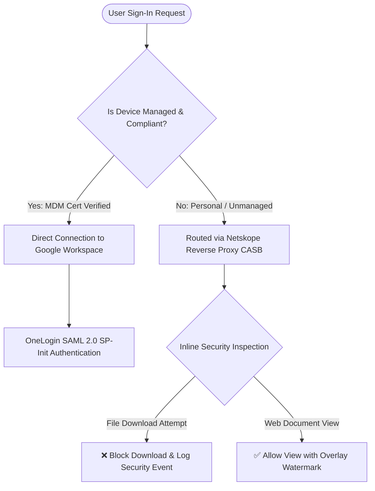
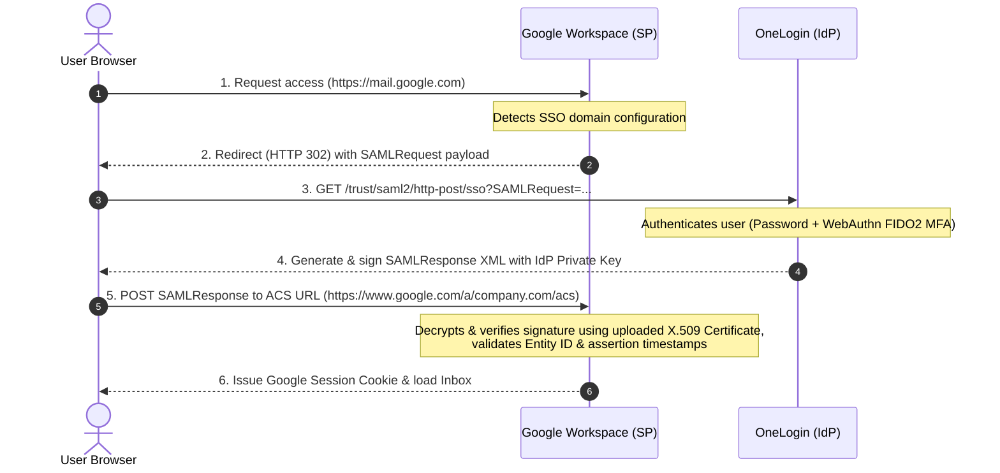
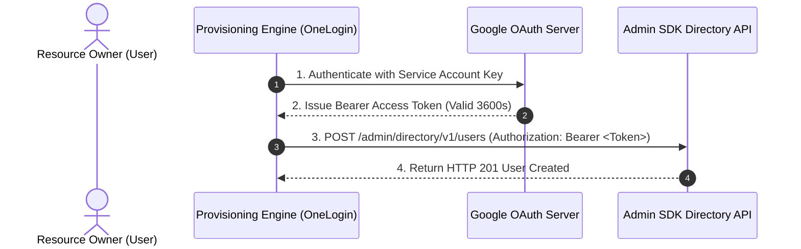
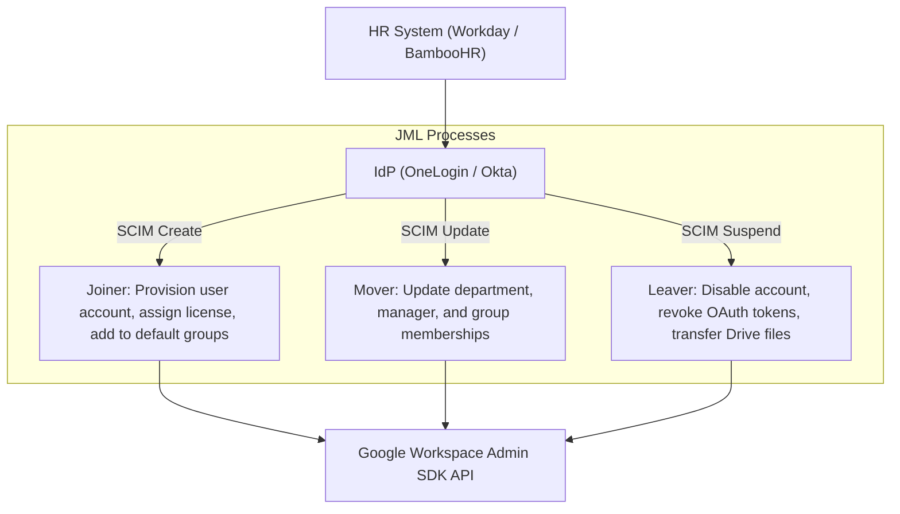

# 2. Identity, Access, and Device Management Master Engineering Guide

This master guide covers Enterprise IAM, Single Sign-On (SSO), SAML 2.0, OAuth 2.0, OpenID Connect (OIDC), SCIM automated user provisioning (JML), Endpoint Device Management (MDM), Netskope CASB steering, and Context-Aware Access (CAA).

---

## 🏛️ 1. Enterprise IAM Topology (OneLogin + Google Workspace + Netskope)

In a modern zero-trust enterprise deployment:
*   **Identity Provider (IdP)**: OneLogin (Central source of truth for authentication and identity lifecycle).
*   **Service Provider (SP)**: Google Workspace (Resource domain for Gmail, Drive, Docs, Calendar, Meet).
*   **User Lifecycle Provisioning**: OAuth 2.0 REST automation connecting OneLogin to Google Admin SDK Directory API.
*   **Device Security Steering**:
    *   *Managed Devices*: Direct access to Google Workspace.
    *   *Unmanaged / BYOD Devices*: Steered through **Netskope Reverse Proxy (CASB)** for real-time DLP, download prevention, and document watermarking.



---

## 🔐 2. SAML 2.0 Authentication Engineering

Security Assertion Markup Language (SAML 2.0) handles federated enterprise authentication.

### SP-Initiated SAML 2.0 Authentication Flow



### Core SAML Configuration Parameters:
*   **ACS URL (Assertion Consumer Service)**: `https://www.google.com/a/yourdomain.com/acs`
*   **Entity ID (Audience URI)**: `google.com/a/yourdomain.com`
*   **NameID Format**: `urn:oasis:names:tc:SAML:1.1:nameid-format:emailAddress`
*   **X.509 Certificate Rotation**: Google supports **Dual Certificate Window** uploading up to 2 public X.509 certificates. Upload the new certificate to Google prior to rotating private keys in OneLogin to prevent user lockout.

---

## 🔑 3. OAuth 2.0 Authorization Framework

OAuth 2.0 (RFC 6749) grants third-party applications scoped API permissions without exposing user passwords.



*   **Access Token vs. Refresh Token**: Access tokens grant short-lived API permissions (typically 1 hour). Refresh tokens are long-lived credentials used to request new Access Tokens.
*   **Admin SDK Scopes**:
    *   `https://www.googleapis.com/auth/admin.directory.user` (Full user management).
    *   `https://www.googleapis.com/auth/admin.directory.group` (Group lifecycle).

---

## 🪪 4. OpenID Connect (OIDC) & Modern Authentication

OIDC extends OAuth 2.0 to add a standardized identity authentication layer.

$$\text{OIDC} = \text{OAuth 2.0 (Authorization)} + \text{ID Token JWT (Authentication)}$$

### JWT ID Token Structure (`Header.Payload.Signature`):

```json
// Header
{ "alg": "RS256", "typ": "JWT" }

// Payload (Decoded Claims)
{
  "iss": "https://accounts.google.com",
  "aud": "1092837465012-client_id.apps.googleusercontent.com",
  "sub": "108237491827364510293",
  "hd": "company.com",
  "email": "alex.smith@company.com",
  "email_verified": true,
  "iat": 1787696100,
  "exp": 1787699700
}
```

---

## 📊 5. Protocol Comparison Matrix

| Technical Vector | SAML 2.0 | OAuth 2.0 | OpenID Connect (OIDC) |
| :--- | :--- | :--- | :--- |
| **Primary Purpose** | Enterprise Authentication / SSO | Delegated Authorization | Authentication + Authorization |
| **Data Format** | XML (`<saml2:Assertion>`) | JSON / Opaque Bearer Token | JSON Web Token (JWT) |
| **API Access** | ❌ No native API token model | ✅ Native API bearer token | ✅ Native API bearer token |
| **Mobile & SPA** | Poor (Requires Browser Redirects) | Excellent | Excellent (supports PKCE RFC 7636) |
| **Target Use Case** | Legacy & SaaS Enterprise SSO | Third-party API Access | Modern SaaS, Mobile & Single Page Apps |

---

## 🔄 6. SCIM & Joiner-Mover-Leaver (JML) Lifecycle Automation

SCIM (System for Cross-domain Identity Management) automates provisioning between HR systems, IdPs, and Google Workspace.



---

## 📱 7. Endpoint Device Management (MDM) & Context-Aware Access (CAA)

### Endpoint Management Strategy
*   **macOS Onboarding**: Automated Device Enrollment (ADE) via Apple Business Manager (ABM) pushing Jamf Pro MDM profiles.
*   **Windows Onboarding**: Windows Autopilot enrolling devices into Microsoft Intune.
*   **Google Endpoint Management**: Enforces device encryption, screen lock, remote wipe, and enterprise app management across BYOD and Company-Owned devices.

### Context-Aware Access (CAA) CEL Policy Engine
Context-Aware Access evaluates access requests dynamically using Common Expression Language (CEL).

```cel
// CEL Access Level Example: Require Corporate Managed Chrome + Egress IP Range
device.chrome.management_state == ChromeManagementState.CHROME_MANAGEMENT_STATE_BROWSER_MANAGED &&
inIpRange(origin.ip, ["203.0.113.0/24", "198.51.100.12/32"])
```

---

## 🔗 Official Google Support References
- [Set up SSO via SAML for Google Workspace](https://support.google.com/a/answer/60224)
- [Manage SAML Certificates](https://support.google.com/a/answer/6245100)
- [Set up Context-Aware Access](https://support.google.com/a/answer/9368756)
- [Google Identity Platform OAuth 2.0](https://developers.google.com/identity/protocols/oauth2)
- [Google OpenID Connect Documentation](https://developers.google.com/identity/openid-connect/openid-connect)
