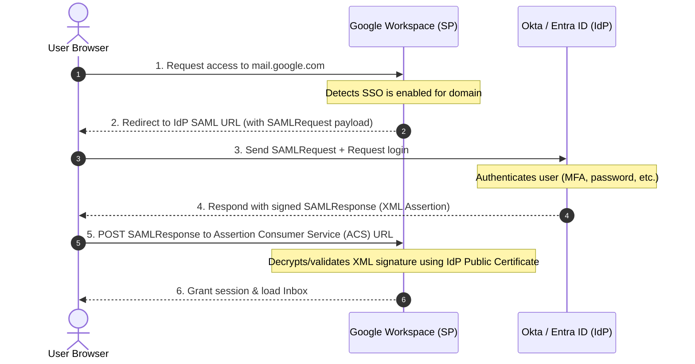
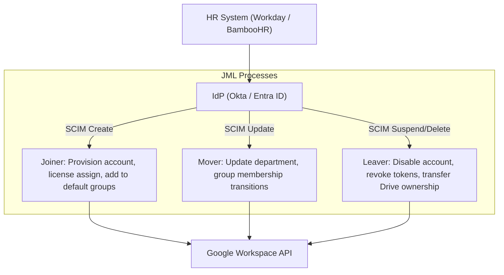

# Module 2: Identity & Access Management (IAM)

This module details federated identity, single sign-on (SSO) protocols, automated lifecycle provisioning (SCIM), and security policies like Context-Aware Access (CAA). Modern Workspace engineering relies heavily on third-party Identity Providers (IdPs) like Okta and Entra ID (formerly Azure AD).

---

## 1. SAML 2.0 & OIDC Authentication Workflows

To troubleshoot sign-in errors, an L3 administrator must understand the step-by-step cryptographic token exchange under the hood.

### A. SAML 2.0 (Security Assertion Markup Language)
SAML is an XML-based framework for exchanging authentication and authorization data between an **Identity Provider (IdP)** (e.g., Okta) and a **Service Provider (SP)** (e.g., Google Workspace).

#### The Service-Provider-Initiated (SP-Init) Flow


#### Key SAML Parameters & Troubleshooting:
*   **Assertion Consumer Service (ACS) URL**: The endpoint on the SP where the IdP sends the SAML response. For Google Workspace, this is always:
    `https://www.google.com/a/yourdomain.com/acs`
*   **Entity ID (Audience URI)**: A unique identifier for the SP. For Google, this is:
    `google.com/a/yourdomain.com`
*   **NameID Format**: Defines how the username is passed. For Workspace, this must map to the user's primary email address:
    `urn:oasis:names:tc:SAML:1.1:nameid-format:emailAddress`
*   **SAML Certificate Rotation**: SAML assertions are signed cryptographically. The public certificate is uploaded to Google Workspace, while the private key is held by the IdP.
    *   *Warning*: If this certificate expires, **all users lose access immediately**.
    *   *Best Practice*: Set up a dual-verification certificate window. Keep the old certificate active in Google Workspace while uploading the new one. Switch the active certificate in your IdP first, then delete the old certificate in Google Workspace after confirming successful logins.

---

## 2. IdP Architectures: Okta, OneLogin, and Entra ID

Corporate environments use identity providers as their single source of truth for identities and automated provisioning.

### OneLogin Integration Patterns
*   **OneLogin to Google Workspace Provisioning**: OneLogin connects to Google Workspace via the Admin SDK API to automate user creation, suspension, and attribute synchronization.
*   **SAML SSO Federation**: OneLogin acts as the SAML Identity Provider; Google Workspace acts as the Service Provider (SP).
*   **Multi-Directory Reconciliation**: In enterprise environments, OneLogin user status and Google Workspace user status are reconciled periodically against Google Cloud Storage (GCS) buckets or reporting datasets to detect orphaned/inactive accounts.

### Okta Integration Patterns
*   **Okta AD Agent**: Polls Active Directory (AD) on-premises using outbound HTTPS (no inbound firewall ports needed) and syncs users/groups to the Okta Cloud.
*   **Okta-to-Google Workspace App**: Okta-provisioned users are pushed into Google Workspace via the Directory API.
*   **SSO Enforcement**: Users attempting to log into Google Workspace are redirected to Okta. To prevent admin lockout during an Okta outage, configure **SSO bypass for super admins**.

### Microsoft Entra ID Integration Patterns
*   **Federation**: Google Workspace is configured to trust Entra ID as a third-party IdP.
*   **Provisioning**: Uses Entra ID's Enterprise Application provisioning engine to automatically sync users, contacts, and groups.

---

## 3. SCIM and Lifecycle Provisioning (JML)

SCIM (System for Cross-domain Identity Management) is an open standard HTTP service protocol that automates user provisioning and deprovisioning between identity providers and cloud applications.

### Joiner-Mover-Leaver (JML) Automation Lifecycle



### Common Attribute Mappings
During provisioning, you map attributes from your IdP schema to the Google Workspace directory schema:

| Target Google Field | Source IdP Attribute | Troubleshooting Note |
| :--- | :--- | :--- |
| `primaryEmail` | `user.mail` (or `user.userPrincipalName`) | Must be lowercase; check for domain suffix mismatch. |
| `name.givenName` | `user.firstName` | Null value errors will cause sync failure. |
| `name.familyName` | `user.lastName` | Null value errors will cause sync failure. |
| `organizations.department`| `user.department` | Used for dynamic group assignments. |
| `customSchemas` | `user.customAttribute` | Requires defining the schema custom metadata in Google first. |

### Debugging SCIM Failures
1.  **Status Code 409 (Conflict)**: The user account already exists in Google Workspace with that primary email or alias. You must manually merge, delete, or rename the conflicting Google account.
2.  **Status Code 400 (Bad Request)**: Invalid schema configuration (e.g., trying to write to a field that doesn't exist, or sending a null value to a required field like `name.familyName`).
3.  **OutOfScope Events**: A user was moved out of the sync OU in AD/Okta. The IdP will send a deprovisioning command (suspend or delete depending on IdP policy settings).

---

## 4. Context-Aware Access (CAA) and Conditional Access

Context-Aware Access (CAA) allows you to define granular access control policies based on the context of the request (device security posture, IP address, geographic location) rather than just user credentials.

### Google Context-Aware Access (CAA) Engine
Context-Aware Access rules can be defined using either the basic visual interface in the Admin Console or the **Common Expression Language (CEL)** in Advanced Mode.

#### Key CEL Objects in CAA:
*   `origin`: Network/geographical source properties (e.g., `origin.ip`, `origin.region_code`).
*   `device`: Hardware/OS metadata (e.g., `device.os_type`, `device.encryption_status`, `device.chrome.versionAtLeast`).
*   `request.auth`: Identity authentication state details.

#### Custom CEL Access Level Examples:

1.  **Enforce Corporate Managed Chrome Browser & Minimum Version**:
    ```cel
    device.chrome.management_state == ChromeManagementState.CHROME_MANAGEMENT_STATE_BROWSER_MANAGED &&
    device.chrome.versionAtLeast("120.0.0.0")
    ```

2.  **IP Geofencing (Allowed corporate egress IP ranges)**:
    *Note: Always use `inIpRange` rather than string matching for IP addresses.*
    ```cel
    inIpRange(origin.ip, ["203.0.113.0/24", "198.51.100.12/32"])
    ```

3.  **Authentication Strength (Password + FIDO2 Hardware Security Key)**:
    ```cel
    request.auth.claims.crd_str.pwd == true &&
    request.auth.claims.crd_str.hwk == true
    ```

4.  **Device-Bound Session Enforcement (DBSC)**:
    ```cel
    request.auth.sessionBoundToDevice(origin) == true
    ```

*   **Binding Access Levels to Applications**:
    *   You assign specific Access Levels to core Google Workspace apps (e.g., Google Drive requires a company-owned device; Google Chat is accessible from anywhere).
*   **Critical Block Scenario**: If a user's device state changes (e.g., they disable disk encryption), they are blocked immediately from accessing Workspace data.

> [!TIP]
> **Implementation Best Practice - Monitor Mode**: When creating or deploying a new Context-Aware Access level, always configure the level in **Monitor Mode** first. This logs policy matches in the Access Transparency and Audit logs without actively blocking users, allowing you to debug rules and verify device status before enforcement.


### Entra ID Conditional Access integration
If Entra ID is your IdP, you can enforce security postures at the identity level *before* federating to Google Workspace:
1.  User goes to log in.
2.  Entra ID evaluates Conditional Access (CA) policies (e.g., Require MFA, Require Compliant Device, Block High Sign-in Risk).
3.  If conditions are met, Entra ID signs the assertion.
4.  User is signed into Google Workspace.
