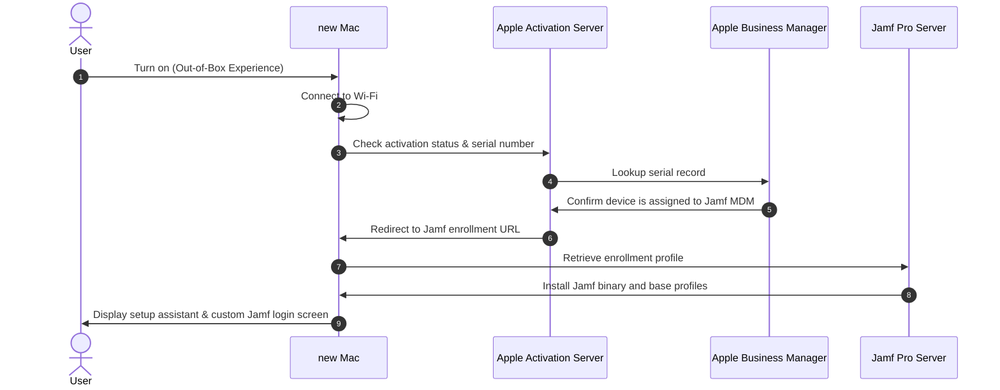

# Module 3: Endpoint Device Management (MDM)

As a senior Systems Engineer or L3 Administrator, you will manage company-wide device enrollment, push security baselines, deploy corporate software, and ensure data quarantine on lost or stolen endpoints. This module details Apple (Jamf Pro), Microsoft (Intune), and Google Workspace MDM environments.

---

## 1. Jamf Pro & Apple Business Manager (macOS Management)

Jamf Pro is the enterprise standard for macOS MDM. It integrates tightly with Apple Business Manager (ABM) to facilitate zero-touch deployments.

### A. Automated Device Enrollment (ADE) & DEP Flow
Automated Device Enrollment (formerly Device Enrollment Program / DEP) connects purchased Apple hardware directly to Jamf Pro configuration profiles before the user first turns on the device.



### B. Apple Business Manager (ABM) Configurations
*   **VPP (Volume Purchase Program) / Apps and Books**: Used to purchase app licenses in bulk (even free apps). The VPP Token (`.vpptoken` file) must be uploaded to Jamf Pro and renewed annually. If expired, app deployments and updates fail immediately.
*   **Push Certificates (APNs)**: Apple Push Notification service certificate allows Jamf to send commands to Macs (wipe, lock, install profile). APNs must be renewed yearly using the same Apple ID used to create it, or all communication between Jamf and the fleet breaks, requiring manual re-enrollment of every device.

### C. Configuration Profiles vs. Policies
*   **Configuration Profiles (`.mobileconfig`)**: Standard XML files based on Apple's MDM protocol. Pushed over-the-air via APNs. Used for enforcing configurations (passcode rules, Wi-Fi payloads, FileVault encryption, System Extensions, Privacy Preferences Policy Control (PPPC/TCC)).
*   **Policies (Jamf Binary)**: Executes shell scripts, installs software packages (`.pkg`, `.dmg`), manages local user accounts, and triggers inventory collections. Driven by the local `jamf` agent daemon, checking in periodically (default: every 15 minutes).

### D. Custom Extension Attributes
Extension Attributes (EAs) collect custom data points from client machines using Bash/Zsh scripts.
*   *Example Zsh Script to detect if FileVault Encryption is active*:
```bash
#!/bin/zsh
fv_status=$(fdesetup status)
if [[ "$fv_status" == *"FileVault is On."* ]]; then
    echo "<result>Enabled</result>"
else
    echo "<result>Disabled</result>"
fi
```

---

## 2. Microsoft Intune & Windows Autopilot (Windows Management)

Microsoft Intune is the cloud-based endpoint management system used to govern Windows devices and security baselines.

### A. Windows Autopilot Deployment
Autopilot simplifies the deployment of Windows machines, removing the need for custom image creation.
1.  **Hardware Hash Capture**: The hardware vendor uploads the device's hardware hash (a unique hardware fingerprint) directly to the organization's tenant. Alternatively, administrators run a PowerShell script on a device to extract the hash CSV manually:
    `Get-WindowsAutopilotInfo.ps1 -OutputFile autopilot.csv`
2.  **Autopilot Profile**: Defines the Out-Of-Box Experience (OOBE). Confirms the user's login, disables the local admin account creation (forces standard user), and configures the Enrollment Status Page (ESP).
3.  **ESP (Enrollment Status Page)**: Blocks the user from accessing the desktop until required security apps (e.g., Endpoint Detection & Response agent, VPN client) are fully installed.

### B. Compliance Policies & Conditional Access
*   **Compliance Policies**: Define requirements that a device must meet to be marked "compliant" (e.g., BitLocker encrypted, Secure Boot enabled, Windows Defender running, firewall turned ON, minimum OS version).
*   **Conditional Access Integration**: Entra ID evaluates compliance status. If a device fails compliance, it is blocked from accessing corporate resources (such as Google Workspace via SSO).

### C. Win32 Application Packaging
Intune cannot deploy raw `.exe` or complex software installations directly without wrapping them.
1.  **Content Prep Tool**: Run `IntuneWinAppUtil.exe` on a folder containing the installation files to create an `.intunewin` file.
2.  **Upload & Configure**:
    *   *Install Command*: `msiexec /i "setup.msi" /q` (or custom silent installer script).
    *   *Uninstall Command*: `msiexec /x {App-GUID} /q`
    *   *Detection Rules*: How Intune verifies the app is installed. Can be based on Registry keys (e.g., HKLM\SOFTWARE\AppName\Version), File existence (e.g., `%ProgramFiles%\AppName\app.exe`), or a custom PowerShell detection script.

---

## 3. Google Endpoint Management

Google provides MDM controls directly within the Workspace Admin Console, useful for mobile devices and basic computer management.

### A. Basic vs. Advanced Management
*   **Basic Management**: No agent or profile installation required. Enforces passcode locks, basic account wipes, and security policies on standard web browsers.
*   **Advanced Management**:
    *   *iOS Sync*: Requires installing the Google Device Policy app and an Apple Push Certificate. Allows complete device wipe, inventory tracking, and application push.
    *   *Android Enterprise*: Creates a cryptographically separated **Work Profile** on BYOD devices, separating corporate data (Drive, Gmail) from personal apps. Personal apps cannot access work data, and taking screenshots of work apps can be blocked.
    *   *Company-Owned Device Enrollment*: Devices are set up from a factory reset state using QR code or zero-touch enrollment. The organization has full administrative control over the entire device, including blocking personal apps.
