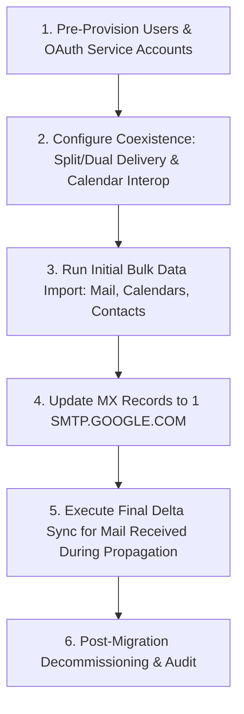
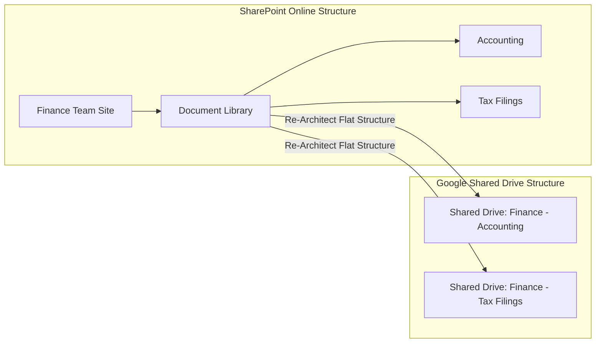

# 3. Microsoft 365 to Google Workspace Migration Master Engineering Guide

This master guide details the enterprise migration architecture from Microsoft 365 (Exchange Online, OneDrive, SharePoint, Teams Chat) to Google Workspace (Gmail, Drive, Shared Drives, Chat).

---

## 🏗️ 1. Enterprise Migration Tooling Comparison

| Migration Tool | Primary Target Workloads | Scalability / Capacity | Best Use Case |
| :--- | :--- | :--- | :--- |
| **Data Import Tool (Default)** | Exchange Mail, Calendars, Contacts | Shared API Quota (max 1,000 users) | Small to mid-market migrations (<1,000 seats). |
| **Data Import Tool (Advanced)**| Exchange Mail, Archives, OneDrive, SharePoint | Dedicated Azure App Quota (up to 50,000 users) | Large enterprise M365 migrations (1,000 to 50,000 seats). |
| **Google Workspace Migrate** | Exchange, OneDrive, SharePoint, File Shares | Distributed node architecture | Massive multi-phase enterprise migrations (>10,000 seats). |
| **GWMME (Desktop CLI)** | PST files, IMAP mailboxes, Exchange | Single-server / desktop process | Specialized PST or legacy on-prem IMAP migrations. |

---

## 🔑 2. Azure App Registration & Permissions Setup

To enable automated data extraction via Microsoft Graph API and Exchange Web Services (EWS), an Azure Enterprise Application must be registered in the source M365 tenant.

### Required Azure API Permissions Matrix:

```text
Application Permissions (Microsoft Graph API):
- User.Read.All
- Contacts.Read
- Calendars.Read
- Files.Read.All
- Sites.Read.All
- Directory.Read.All
- Group.Read.All
- Chat.Read.All

EWS Access:
- full_access_as_app (Office 365 Exchange Online)
```

#### Required Credentials Generated:
1.  **Application (Client) ID**
2.  **Directory (Tenant) ID**
3.  **Client Secret / Certificate Key**
4.  **SharePoint Hostname** (`company.sharepoint.com`)

---

## ✉️ 3. Exchange Online to Gmail Migration Playbook



### Coexistence Mail Flow Architecture

*   **Dual Delivery**: Primary MX record points to an Inbound Email Gateway (e.g., Proofpoint) which duplicates incoming mail and sends copies simultaneously to Exchange Online and Gmail.
*   **Split Delivery**: Primary MX record points directly to Google. If a user address exists in Gmail, it delivers locally; if not, Google routes the message via SMTP route to Exchange Online.
*   **Calendar Interop**: Enables free/busy calendar lookup between Exchange and Google Calendar users during migration waves.

---

## 📁 4. OneDrive for Business to Google Drive Migration

OneDrive user migration utilizes a **Two-CSV Workflow**:
1.  **Source User CSV**: Defines source OneDrive account URLs and target user primary email addresses.
2.  **Identity Mapping CSV**: Maps M365 user principals (`user@domain.onmicrosoft.com`) to target Google Workspace email addresses (`user@company.com`) to preserve file ACL permissions.

### Unmapped Identity Configurations:
*   **Enabled**: External shares with unmapped identities convert to standard email invitation shares.
*   **Disabled**: File shares associated with unmapped identities are dropped to prevent external security leaks.

---

## 🏢 5. SharePoint Online to Google Shared Drives Migration

Enterprise SharePoint migrations require migrating site document libraries into **Google Shared Drives**.



### Critical Shared Drive Limits & Architectural Constraints:
*   **400,000 Item Cap**: A single Shared Drive cannot contain more than 400,000 total items (files, folders, and trash).
*   **Nesting Depth Limit**: Google Drive supports a maximum subfolder nesting depth of 20 levels.
*   **Member Limits**: Shared Drives support a maximum of 600 direct members (users or groups).
*   **Best Practice**: Flatten multi-nested SharePoint document libraries into distinct, task-focused Shared Drives during migration planning.

---

## ⚡ 6. API Throttling Mitigation & Error Handling

During enterprise migration syncs, API rate limits (`HTTP 429 Too Many Requests`, `HTTP 503 Service Unavailable`, `HTTP 403 Rate Limit Exceeded`) may occur.

### Engineering Remediation Pipeline:
1.  **Exponential Backoff with Jitter**: Configure migration engines to retry failed requests using randomized exponential delay ($\text{Delay} = 2^n + \text{jitter}$).
2.  **Phased User Batching**: Divide users into migration waves based on total mailbox size (e.g., Wave 1: <10GB, Wave 2: 10GB-50GB, Wave 3: Archives).
3.  **Dedicated Azure App Registrations**: Distribute migration workloads across multiple Azure App registrations to bypass single-client Graph API quotas.
