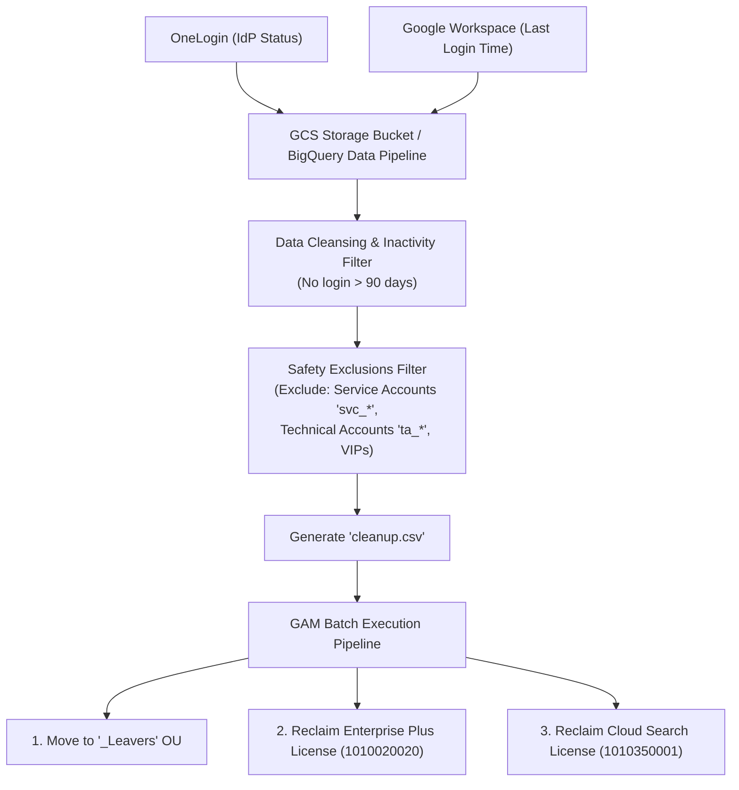

# Module 4: Scripting and Automation

This module focuses on command-line automation, scripting, and API management. A senior administrator leverages Google Apps Manager (GAM), Google Apps Script, and OS shell scripts (Bash/PowerShell) to automate administrative toil, manage bulk actions, and enforce lifecycle tasks.

---

## 1. Google Apps Manager (GAM & GAM-ADV-XTD3)

GAM is a command-line tool for Google Workspace administrators. It uses Google's Admin SDK, Drive, Gmail, and Directory APIs to manage users, groups, domains, policies, and files at enterprise scale.

### A. Initial Setup and Authentication Architecture
GAM requires a dedicated Google Cloud Platform (GCP) project to interact with Google Workspace APIs.
1.  **Service Account Creation**: GAM creates a GCP service account and generates a private key (`oauth2service.json`).
2.  **Domain-Wide Delegation (DWD)**: In the Workspace Admin Console, the administrator must authorize the client ID of the service account with specific OAuth Scopes (e.g., Gmail read/write, Drive access, Directory management). This allows the service account to impersonate *any* user in the domain without knowing their password.
3.  **Local Auth Files**:
    *   `oauth2.txt`: Stores your administrator OAuth credentials (for actions run as your admin user).
    *   `oauth2service.json`: Stores the service account credentials (for actions run on behalf of other users).

### B. BNF-Compliant Entity Selectors
GAM supports precise entity targeting using formal Backus-Naur Form (BNF) selectors:

```bash
# Target all active users vs. suspended vs. archived
gam all users <Command>
gam all users_susp <Command>
gam all users_arch <Command>

# Target specific Organizational Unit subtrees (recursive)
gam ou_and_children "/Marketing/EMEA" <Command>

# Target Google Group members and managers
gam group_users marketing-team@company.com members managers end <Command>

# Target users matching directory attribute queries
gam query "orgUnitPath='/Engineering' isSuspended=false" <Command>
```

### C. Production-Grade GAM Commands

#### 1. Enterprise Bulk Provisioning & Licensing via CSV Loop
Given a file named `onboarding.csv` containing columns `Email`, `FirstName`, `LastName`, `OU`, `Password`, and `SKU`:
```bash
# Provision accounts in target OUs with forced password change
gam csv onboarding.csv gam create user ~Email firstname ~FirstName lastname ~LastName password ~Password org ~OU changepassword on

# Assign licenses (e.g., wsentplus, wsbizstan, cloudidentityfree)
gam csv onboarding.csv gam user ~Email add license ~SKU
```
*Note*: `~` indicates a variable mapped from the CSV header name.

#### 2. Auditing and Wiping OAuth Tokens (Security Incident Response)
To list all third-party apps authorized by a specific user:
```bash
gam user user@example.com show tokens
```
To revoke a compromised third-party token (e.g., token ID `123456789`) or revoke a malicious OAuth Client ID domain-wide:
```bash
# Single user token deletion
gam user user@example.com delete token clientid 123456789

# Domain-wide malicious OAuth app revocation
gam all users delete token clientid 9876543210-abcdef.apps.googleusercontent.com
```

#### 3. Delegated Mailbox Access
To give an executive assistant access to an executive's mailbox (without sharing passwords):
```bash
gam user executive@example.com add delegate assistant@example.com
```
To audit all mailbox delegates domain-wide and stream results directly to a Google Sheet:
```bash
gam all users print delegates todrive
```

#### 4. Bulk Mail Deletion (Incident Response)
To search and permanently delete a specific phishing email (by RFC822 Message-ID or Subject) from all user inboxes:
```bash
gam all users delete messages query "rfc822msgid:CA+123456789@mail.attacker.com" doit
```
*Caution*: Running `gam all users` makes API calls for every user. For large domains (10,000+ users), configure multithreading (`num_threads = 25` in `gam.cfg`) or target specific OUs using `ou_and_children`.

#### 5. Drive File Sharing & Public Exposure Audit
To generate a real-time audit of all files shared publicly or with 'anyoneWithLink':
```bash
gam all users print filelist query "visibility='anyoneWithLink' or visibility='anyoneCanFind'" fields id,name,owners,permissions todrive
```

#### 6. Production Case Study: Inactive User Audit, Leaver OU Transition & License Reclamation

In enterprise environments, managing SaaS spend and maintaining security hygiene requires continuous harvesting of inactive licenses.



##### Step 1: Inactivity & Reconciliation Pipeline
1. **Multi-Source Telemetry**: User account status is extracted from **OneLogin** (Identity Provider) and correlated with **Google Workspace** directory attributes (specifically `lastLoginTime`).
2. **Data Aggregation**: Ingested into a central Google Cloud Storage (GCS) bucket or reporting pipeline.
3. **Safety Exclusion Filters**: Automated queries explicitly filter out non-human and mission-critical accounts:
   - Service Accounts (`svc_*`, `service_*`)
   - Technical / Automation Accounts (`ta_*`, `admin_*`)
   - Legal Hold custodians and executive exemption lists
4. **Target Dataset**: Produces a clean `cleanup.csv` containing users inactive for **> 3 months (90+ days)**.

##### Step 2: GAM Batch Execution Pipeline
```bash
# Phase 1: Move inactive/departed accounts to the '_Leavers' Organizational Unit
# (Enforces strict leaver policies: disables external Drive sharing, restricts app access)
gam csv cleanup.csv gam update user ~email org "_Leavers" >> cleanupresults.csv

# Phase 2: Reclaim expensive Google Workspace Enterprise Plus licenses (SKUID: 1010020020)
# (Saves ~$30/user/month in enterprise licensing spend)
gam csv cleanup.csv gam user ~email delete license "1010020020" >> cleanupresults.csv

# Phase 3: Reclaim standalone Cloud Search add-on licenses (SKUID: 1010350001)
gam csv cleanup.csv gam user ~email delete license "1010350001" >> cleanupresults.csv
```

> [!TIP]
> **Senior Engineer Interview Insight — Append Operator (`>>`)**:
> In multi-phase batch operations, always use the append redirection operator (`>>`) rather than single overwrite (`>`). Using `>` in sequential lines will overwrite the previous command's output log, destroying the audit trail for earlier phases. Using `>>` preserves the end-to-end execution history across all 3 phases in `cleanupresults.csv`.

#### 7. Cross-Tenant Migration GAM Automation Pipeline
```bash
# 1. Verify source user existence in target Google Workspace tenant
gam all users print users fields primaryEmail,isSuspended > target_users_audit.csv

# 2. Bulk audit Shared Drive access post-SharePoint migration
gam all users print teamdrives fields id,name,restrictions > shared_drives_audit.csv

# 3. Bulk create Resource Calendars for conference room migrations
gam csv conference_rooms.csv gam create resource ~Email name ~Name type ~Type capacity ~Capacity
```

---

## 2. Google Apps Script

Google Apps Script is a JavaScript-based cloud platform. It executes code on Google's infrastructure, making it ideal for automation within the Workspace ecosystem.

### Complete Production Script: Employee Offboarding Automation
This script automates the standard technical deprovisioning sequence: suspends the user, randomizes their password, revokes active OAuth sessions, adds an auto-responder, and logs the execution to a spreadsheet.

```javascript
/**
 * Automates the technical offboarding process for a departed employee.
 */
function offboardEmployee(userEmail) {
  const targetEmail = userEmail || "departed.user@example.com";
  const managerEmail = "hr.records@example.com";
  
  try {
    Logger.log("Starting offboarding process for: " + targetEmail);
    
    // 1. Generate a random secure password to block access
    const newPassword = Math.random().toString(36).substring(2, 15) + Math.random().toString(36).substring(2, 15).toUpperCase() + "!";
    
    // 2. Update user properties in Admin Directory: Suspend, reset password, move to Offboarded OU
    const resource = {
      suspended: true,
      password: newPassword,
      changePasswordAtNextLogin: false,
      orgUnitPath: "/Offboarded_Users"
    };
    
    AdminDirectory.Users.update(resource, targetEmail);
    Logger.log("User suspended, password changed, and moved to /Offboarded_Users OU.");
    
    // 3. Reset/Revoke all active sign-in cookies (Wipe active sessions)
    AdminDirectory.Users.signOut(targetEmail);
    Logger.log("Revoked all active sign-in sessions.");
    
    // 4. Set Gmail auto-responder (Out of Office) using Gmail API
    const vacationSettings = {
      enableAutoReply: true,
      responseBodyHtml: "<p>This employee is no longer with the organization. For urgent queries, please contact info@example.com.</p>",
      responseSubject: "Auto-Response: Department Notice",
      restrictToDomain: false
    };
    
    // Gmail API requires impersonation or delegate service settings to access another user's inbox
    // Note: To execute Gmail API calls on behalf of the user, the script must run with Domain-Wide delegation.
    
    // 5. Log execution to our Admin Spreadsheet
    const sheetId = "YOUR_SPREADSHEET_ID_HERE";
    const sheet = SpreadsheetApp.openById(sheetId).getActiveSheet();
    sheet.appendRow([new Date(), targetEmail, "Suspended", "Password Reset", "Sessions Revoked", "Moved OU"]);
    
    Logger.log("Offboarding script completed successfully.");
    
  } catch (error) {
    Logger.log("Failed to offboard user: " + error.toString());
    MailApp.sendEmail(managerEmail, "ALERT: Offboarding Automation Failed", "Failed to offboard " + targetEmail + ". Error: " + error.message);
  }
}
```

### Complete Production Script: Workspace Security & Service Outage Health Check
This script runs as a daily cron job (time-driven trigger) in Apps Script. It checks:
1.  **Service Outages**: Pulls the Google Workspace Status RSS feed to detect active service disruptions.
2.  **Super Admin 2SV Enforcement Check**: Queries the Admin SDK to ensure all Super Admins have 2-Step Verification (MFA) enabled.
3.  **Gmail Forwarding Audit**: Audits user settings for unauthorized external email forwarding.

```javascript
/**
 * Daily Google Workspace Health & Security Audit Check
 */
function runWorkspaceHealthCheck() {
  const adminAlertEmail = "security-alerts@example.com";
  let healthSummary = "Google Workspace Health & Security Check Summary\n";
  healthSummary += "Timestamp: " + new Date().toISOString() + "\n";
  healthSummary += "==================================================\n\n";
  
  let issuesFound = false;
  
  // --- PART 1: SERVICE OUTAGE CHECK ---
  try {
    healthSummary += "--- Google Workspace Service Status Audit ---\n";
    const feedUrl = "https://www.google.com/appsstatus/dashboard/history.v1.xml";
    const response = UrlFetchApp.fetch(feedUrl);
    const xml = XmlService.parse(response.getContentText());
    const root = xml.getRootElement();
    const namespace = root.getNamespace();
    
    // Parse entries for active outages
    const entries = root.getChildren('entry', namespace);
    let activeOutages = [];
    
    // Look at recent entries (last 24 hours)
    for (let i = 0; i < Math.min(entries.length, 5); i++) {
      const title = entries[i].getChildText('title', namespace);
      const summary = entries[i].getChildText('summary', namespace);
      if (title.toLowerCase().includes("disruption") || title.toLowerCase().includes("outage")) {
        activeOutages.push("- " + title + ": " + summary);
      }
    }
    
    if (activeOutages.length > 0) {
      issuesFound = true;
      healthSummary += "[WARNING] Active Google Service Outages detected:\n" + activeOutages.join("\n") + "\n\n";
    } else {
      healthSummary += "[OK] All core Google services reporting normal operation.\n\n";
    }
  } catch (err) {
    healthSummary += "[ERROR] Failed to fetch Google Apps Status feed: " + err.message + "\n\n";
  }

  // --- PART 2: SUPER ADMIN 2SV ENFORCEMENT CHECK ---
  try {
    healthSummary += "--- Super Admin MFA Enrollment Audit ---\n";
    let pageToken;
    let nonCompliantAdmins = [];
    
    do {
      const response = AdminDirectory.Users.list({
        customer: 'my_customer',
        query: 'isAdmin=true',
        maxResults: 100,
        pageToken: pageToken
      });
      
      const users = response.users;
      if (users) {
        users.forEach(user => {
          // Check if the user is a true Super Admin and is not enrolled in 2SV
          if (user.isDelegatedAdmin === false && user.isEnrolledIn2Sv === false) {
            nonCompliantAdmins.push("- " + user.primaryEmail + " (2SV Disabled!)");
          }
        });
      }
      pageToken = response.nextPageToken;
    } while (pageToken);
    
    if (nonCompliantAdmins.length > 0) {
      issuesFound = true;
      healthSummary += "[CRITICAL] Super Admins found without 2-Step Verification:\n" + nonCompliantAdmins.join("\n") + "\n\n";
    } else {
      healthSummary += "[OK] All Super Admins have 2SV (MFA) enrolled.\n\n";
    }
  } catch (err) {
    healthSummary += "[ERROR] Failed to audit Super Admins: " + err.message + "\n\n";
  }

  // --- PART 3: GMAIL AUTO-FORWARDING AUDIT ---
  try {
    healthSummary += "--- Unauthorized Auto-Forwarding Audit ---\n";
    const corporateDomain = "example.com";
    let nonCompliantForwarders = [];
    
    // In production, loop through user lists. For demo size, query critical users/OUs
    const response = AdminDirectory.Users.list({
      customer: 'my_customer',
      maxResults: 50
    });
    
    const users = response.users;
    if (users) {
      users.forEach(user => {
        try {
          // Gmail API call to inspect forwarding addresses
          // Note: Requires Service Account impersonation or delegation setup
          const forwarding = Gmail.Users.Settings.ForwardingAddresses.list(user.primaryEmail);
          const addresses = forwarding.forwardingAddresses;
          
          if (addresses) {
            addresses.forEach(addr => {
              // Alert if mail is actively forwarded to a non-corporate domain
              if (addr.verificationStatus === 'accepted' && !addr.forwardingAddress.endsWith("@" + corporateDomain)) {
                nonCompliantForwarders.push("- User " + user.primaryEmail + " is auto-forwarding to external: " + addr.forwardingAddress);
              }
            });
          }
        } catch (e) {
          // Users who haven't initialized Gmail or have API access disabled will be caught here
        }
      });
    }
    
    if (nonCompliantForwarders.length > 0) {
      issuesFound = true;
      healthSummary += "[WARNING] External Gmail Auto-forwarding rules detected:\n" + nonCompliantForwarders.join("\n") + "\n\n";
    } else {
      healthSummary += "[OK] No unauthorized external forwarding rules found.\n\n";
    }
  } catch (err) {
    healthSummary += "[ERROR] Failed to audit Gmail Forwarding: " + err.message + "\n\n";
  }
  
  // --- PART 4: SUMMARY ROUTING / ALERTS ---
  Logger.log(healthSummary);
  
  if (issuesFound) {
    MailApp.sendEmail({
      to: adminAlertEmail,
      subject: "Workspace Health Alert: Security Checks or Outages Detected",
      body: healthSummary
    });
    Logger.log("Alert email dispatched to: " + adminAlertEmail);
  } else {
    Logger.log("Health check completed successfully with zero alerts.");
  }
}
```

---


## 3. Operating System Scripting (Bash & PowerShell)

Systems administrators deploy scripts to local endpoints to audit configurations, verify MDM check-ins, or automate agent settings.

### A. PowerShell (Windows Administration)
PowerShell interacts directly with local APIs, registry profiles, and Windows settings.

#### Script to Verify BitLocker Encryption Status & Send to Log
```powershell
# Check if BitLocker is active on the primary drive (C:)
$drive = Get-BitLockerVolume -MountPoint "C:"
$encryptionStatus = $drive.VolumeStatus
$protectionStatus = $drive.ProtectionStatus

$logPath = "C:\Windows\Temp\bitlocker_status.log"

if ($encryptionStatus -eq "FullyEncrypted" -and $protectionStatus -eq "On") {
    "BitLocker Verified: Active on C: drive at $(Get-Date)" | Out-File $logPath
    exit 0 # Success
} else {
    "WARNING: BitLocker is NOT active on C: drive (Status: $encryptionStatus, Protection: $protectionStatus) at $(Get-Date)" | Out-File $logPath
    # Trigger a telemetry alarm or notify MDM
    exit 1 # Failure / Warning
}
```

### B. Bash/Zsh (macOS Administration)
Bash and Zsh execute command-line diagnostics on Apple hardware.

#### Script to Verify Jamf Agent Check-In & Force Policy Execution
```bash
#!/bin/zsh

# Check if the Jamf binary is present on the machine
if [ ! -f /usr/local/bin/jamf ]; then
    echo "ERROR: Jamf binary not installed."
    exit 1
fi

# Verify communication with Jamf Pro Server
check_in=$(/usr/local/bin/jamf checkJSSConnection)

if [[ "$check_in" == *"The JSS is available"* ]]; then
    echo "JSS Connection Verified. Triggering inventory check..."
    # Force Jamf binary to send current hardware/software inventory update
    /usr/local/bin/jamf recon
    # Run any outstanding policy triggers
    /usr/local/bin/jamf policy
    exit 0
else
    echo "ERROR: Jamf Pro Server is unreachable."
    exit 2
fi
```
