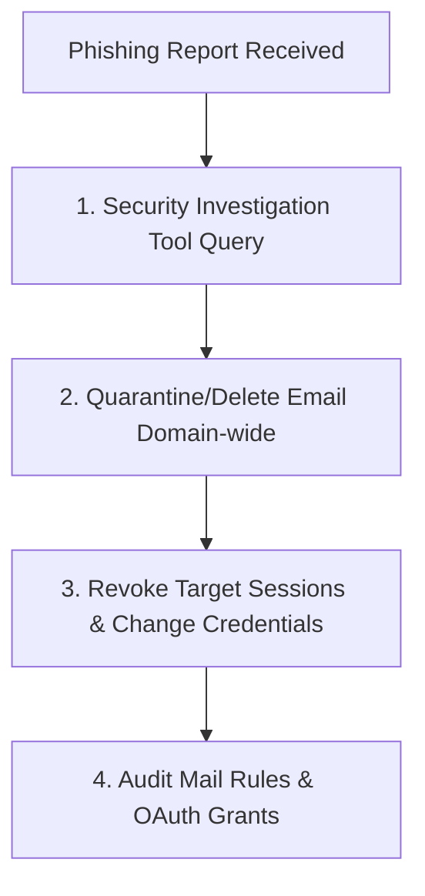
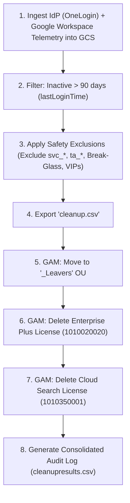

# Module 5: L3 Scenarios & Integrated SaaS Administration

This module provides Level 3 (L3) operational scenarios. It is structured as Incident Response Runbooks / Standard Operating Procedures (SOPs) to prepare you for senior-level interview questions and architectural escalations. It also covers the management of integrated corporate tools like WordPress, DocuSign, ClickUp, QuickBase, and Jira.

---

## 1. Incident SOP 1: Mitigating a Massive Phishing Outbreak

### Scenario
An attacker has successfully bypassed spam filters and delivered a high-urgency credential harvesting email ("Updated HR Benefits Form") to 2,000 employees. Five users have already reported entering their credentials.



### Resolution Playbook
1.  **Isolate & Query (Security Investigation Tool)**:
    *   Navigate to *Security > Security Center > Investigation Tool*.
    *   Set the data source to **Gmail messages**.
    *   Query by `Sender` OR `Subject: "Updated HR Benefits Form"` OR `Message ID`.
    *   Verify the sender's IP address.
2.  **Bulk Purge**:
    *   In the Investigation Tool, select all matching messages.
    *   Click **Actions > Delete Messages** (or *Quarantine Messages* if legal review is pending).
    *   Alternatively, execute a fast multithreaded purge via GAM:
        `gam all users delete messages query "subject:'Updated HR Benefits Form'"`
3.  **Remediation (Compromised Users)**:
    *   For users who clicked/submitted credentials:
        1.  Force password reset: `gam user user@example.com update password [new_secure_pwd] changepassword on`
        2.  Terminate active sessions: `gam user user@example.com signout`
        3.  Wipe OAuth tokens: `gam user user@example.com delete tokens`
        4.  Temporarily disable account or enforce security keys if they haven't set up 2-Step Verification.
4.  **Post-Incident Audit**:
    *   Search the Directory API for any auto-forwarding rules created during the attack:
        `gam all users print forwardingaddresses`
    *   Block the sender domain/IP at the Gmail gateway rules level (*Apps > Google Workspace > Gmail > Routing*).

---

## 2. Incident SOP 2: Recovering from an Identity Provider (IdP) SSO Outage

### Scenario
Your primary Identity Provider (Okta or Microsoft Entra ID) is suffering a major global outage. Users cannot sign into Google Workspace. All business communications are halting.

### Resolution Playbook
1.  **Activate Break-Glass Accounts**:
    *   *SME Architecture Rule*: Always maintain at least two Super Admin accounts that are explicitly excluded from the SSO policy profile. These accounts must use strong Google-native passwords, enforce 2-Step Verification via hardware security keys, and reside outside standard synchronization OUs.
    *   Log in to `admin.google.com` using a break-glass account.
2.  **Disable SSO Profile Enforcement**:
    *   Navigate to *Security > Set up single sign-on (SSO) with a third-party IdP*.
    *   In the **SSO profiles** section, locate the active profile assigned to your organizational units.
    *   Update the profile assignment to **Disable** or switch the default policy back to Google authentication.
    *   *Warning*: This forces users to authenticate using their local Google Workspace passwords. If users have never set local Google Workspace passwords (because they have always logged in via SSO), you must:
        *   Distribute temp passwords to emergency channels, or
        *   Create temporary password self-service paths, or
        *   Keep SSO enabled for standard OUs but create an emergency "Bypass OU" that logs in via Google credentials, moving critical personnel (finance, executives, IT) to it.

---

## 3. Incident SOP 3: Resolving Email Migration & Delivery Failure Loops

### Scenario
During a staged migration from Exchange to Google Workspace, you notice emails sent to some users are bouncing with the error: `554 5.4.14 Hop count exceeded - possible mail loop`.

### Resolution Playbook
A mail loop occurs when Server A thinks Server B hosts the mailbox, and Server B thinks Server A hosts it. The email bounces between the two servers until the "Hop limit" (usually 25–30) is reached.

```mermaid
graph LR
    Google["Google Workspace MX"] -->|Routing Rule: Recipient not found| Exchange["Exchange Server (Internal Forward)"]
    Exchange -->|Inbound Connector mismatch| Google
    Exchange -- loop -- Exchange
```

### Diagnostic Steps
1.  **Analyze the Message Headers**:
    *   Paste the header from the Non-Delivery Report (NDR) into the **Google Admin Toolbox Messageheader tool** (`toolbox.googleapps.com/apps/messageheader`).
    *   Trace each hop IP to identify exactly where the message redirects back to the previous server.
2.  **Verify Routing and Forwarding Rules**:
    *   **In Google Workspace**: Check *Gmail > Routing*. Ensure that the forwarding route uses a target host configured as an **explicit target host (Exchange IP/hostname)** rather than resolving MX records, which points back to Google.
    *   **In Exchange**: Check the SMTP Receive Connector and Inbound Routing. Verify that the migrated user’s target address in AD is mapped to the Google routing alias domain (e.g., `user@yourdomain.com.test-google.a.com` or `user@gtemp.yourdomain.com`) instead of the primary routing address, preventing Exchange from routing it back internally.

---

## 4. Incident SOP 4: Compromised / Lost Device Response

### Scenario
An employee leaves their corporate-issued device (macOS or Windows) in a public taxi. The device contains sensitive data.

### Resolution Playbook
1.  **Command MDM Remote Wipe**:
    *   **macOS (Jamf Pro)**:
        1.  Search for the device by Serial Number in Jamf Pro.
        2.  Click **Management > Lock Device** (to protect the screen immediately) OR **Erase Device** (Remote Wipe).
        3.  Specify a 6-digit PIN code (required for Intel-based Macs to wipe the EFI lock; Apple Silicon Macs wipe instantly).
        4.  The erase command is sent via APNs. The moment the Mac connects to any network, it will initiate factory reset.
    *   **Windows (Intune)**:
        1.  Locate the device in the Intune Portal.
        2.  Select **Wipe** (Erase all user data and settings, leaving the OS intact) or **Retire** (Remove corporate data and profiles only, leaving personal data).
        3.  If the device is stolen, check "Wipe device, and continue to wipe even if device loses power."
2.  **Secure the Account (Workspace & Identity)**:
    *   Suspend the user account or force a password reset.
    *   Revoke all active OAuth sessions: `gam user user@example.com signout`
    *   Delete all registered device policy profiles: `gam user user@example.com delete mobile`
3.  **Audit Logs**: Check the *Admin Console Directory audit logs* to confirm the status of the remote wipe command.

---

## 5. Incident SOP 5: Repairing Broken SCIM / Provisioning Sync Errors

### Scenario
Okta reports sync errors for new hires: `Automatic provisioning of user Jane Doe to Google Workspace failed: License limit exceeded.`

### Resolution Playbook
1.  **Examine target error code in IdP**:
    *   In the Okta Dashboard, navigate to *Applications > Google Workspace > Provisioning > API Integration*.
    *   Review the task details. Identify the explicit API error response from Google.
2.  **Verify Google Workspace Licensing**:
    *   Go to *Billing > Subscriptions* in the Workspace Admin Console.
    *   Verify if your active user count matches your purchased seat limit.
    *   *Remediation*: Purchase more seats, or suspend/delete inactive accounts to free up licenses.
3.  **Resolve Mappings & Conflicts**:
    *   If the error is `User Already Exists`: The user was created manually in Google before Okta provisioning ran.
    *   *Remediation*: Run a manual "Import" in Okta to link the existing Google account with the Okta profile, or rename the local Google user's email address to allow the new account to provision cleanly.

---

## 6. Incident / Operational SOP 6: Inactive User Audit, Leaver OU Transition & License Reclamation

### Scenario
An organization with 10,000+ users notices license costs inflating due to departed employees or inactive contractors retaining active Enterprise Plus and Cloud Search licenses. You need to establish an automated, recurring pipeline to move inactive accounts to a `_Leavers` OU and reclaim their licenses without affecting service accounts or active users.



### Resolution Playbook

1.  **Telemetry Reconciliation (IdP + Google)**:
    *   Extract user account status from **OneLogin** (Identity Provider) and reconcile against Google Workspace directory metadata (specifically `lastLoginTime` and `creationTime`).
    *   Store correlated reports in a centralized Google Cloud Storage (GCS) bucket or reporting sheet.

2.  **Safety Filtering & Exclusion Rules**:
    *   Identify human accounts with **zero login activity for > 3 months (90 days)**.
    *   **CRITICAL SAFETY STEP**: Exclude non-human and mission-critical accounts:
        - Service Accounts (e.g., `svc_*`, `service_*`)
        - Technical / Automation Accounts (e.g., `ta_*`, `admin_*`)
        - Break-Glass Super Admin accounts
        - Legal Hold / Compliance Hold custodians
    *   Export the scrubbed target list to `cleanup.csv`.

3.  **GAM Execution Pipeline**:
    *   Execute the batch commands sequentially using the append operator (`>>`) to ensure an unbroken audit log:
    ```bash
    # Step 1: Move target accounts to '_Leavers' OU (applies restricted policies, blocks sharing)
    gam csv cleanup.csv gam update user ~email org "_Leavers" >> cleanupresults.csv

    # Step 2: Delete Workspace Enterprise Plus license (SKUID: 1010020020) - saves ~$30/user/mo
    gam csv cleanup.csv gam user ~email delete license "1010020020" >> cleanupresults.csv

    # Step 3: Delete standalone Cloud Search license (SKUID: 1010350001)
    gam csv cleanup.csv gam user ~email delete license "1010350001" >> cleanupresults.csv
    ```

4.  **Verification & Audit Sign-Off**:
    *   Inspect `cleanupresults.csv` for any failed API calls or permission errors.
    *   Verify reclaimed licenses in the Admin Console under *Billing > Subscriptions*.
    *   Verify user OU placement in `Directory > Users`.

---

## 7. SaaS Ecosystem Integration & Administration

You will collaborate with cross-functional teams to administer, configure, and troubleshoot access for common enterprise SaaS platforms.

### A. WordPress
*   **SSO Integration**: Configured via SAML plugins (e.g., MiniOrange) linked to your Okta or Entra ID. Always configure a backend bypass URL (e.g., `/wp-login.php?normal=1`) to allow local admin logins if SSO is broken.
*   **SMTP Relay**: WordPress transactional emails (password resets, system notices) should be routed through the Google Workspace SMTP Relay service (`smtp-relay.gmail.com` on port 587 with TLS) rather than local server mail agents to prevent spam classification. Add the server IP to your SPF record.

### B. DocuSign
*   **SSO SAML Configuration**: In DocuSign Admin, configure Identity Providers. Upload the IdP metadata XML from Okta/Entra. Map the SAML assertion `NameID` to the DocuSign email address.
*   **Access Control**: Ensure that user provisioning is driven by security groups. If a user is removed from the corporate Directory, SCIM should automatically revoke their DocuSign license.

### C. ClickUp, QuickBase, and Jira (Atlassian)
*   **Atlassian Access (Jira)**: Centrally manages identity across Atlassian products. Requires verifying your domain in Atlassian Admin by publishing a DNS TXT record. Once verified, you can enforce SAML SSO and automate user provisioning via SCIM.
*   **ClickUp SSO**: ClickUp supports SAML SSO. If a user is deprovisioned in Okta, their active session in ClickUp is immediately terminated.
*   **QuickBase Administration**: Ensure that application-level permissions are mapped to Directory Groups. User access must be audited quarterly to ensure compliance with external audit standards (SOC2 / ISO 27001).
