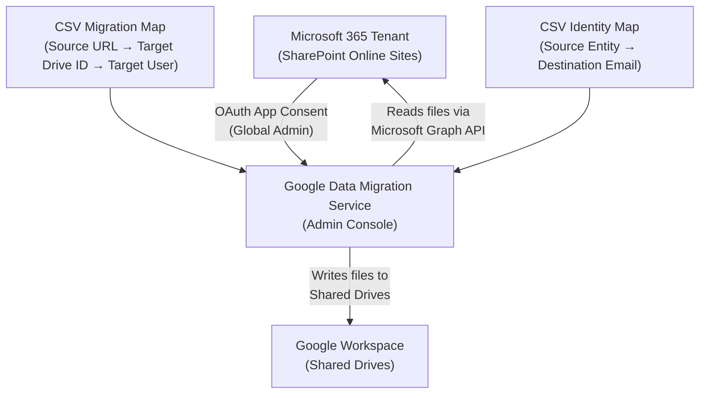
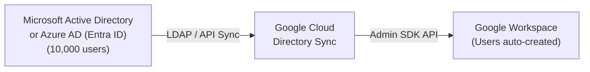
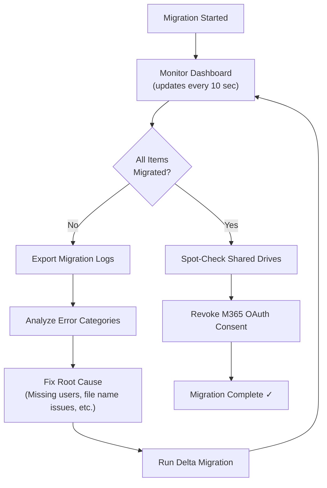

# Module 6: SharePoint Online to Google Drive Migration — Interview Deep Dive

This module covers the complete architectural workflow, tooling, best practices, and troubleshooting for migrating data from Microsoft 365 SharePoint Online into Google Workspace Shared Drives. Special emphasis is placed on **enterprise-scale migrations (10,000+ items)** and the best practices required to execute them reliably.

---

## 1. Migration Architecture Overview

### What Is Being Migrated?

SharePoint Online **sites** contain documents, folders, lists, and metadata. The Google Data Migration Service (DMS) migrates **files and folder structures** from SharePoint document libraries into Google Workspace **Shared Drives**.

> [!IMPORTANT]
> SharePoint Lists, custom workflows (Power Automate), InfoPath forms, and SharePoint-specific metadata columns are **NOT** migrated by DMS. Only files and folder structures from SharePoint document libraries are transferred.

### End-to-End Architecture



### Migration Flow Summary

| Phase | Action | Where |
| :--- | :--- | :--- |
| **1. Pre-Migration** | Audit SharePoint sites, create Shared Drives, provision users/groups in Google | M365 Admin + Google Admin Console |
| **2. Connection** | Connect Google to M365 tenant via OAuth (Global Admin required) | Google Admin Console → Data Migration |
| **3. Mapping** | Upload CSV files mapping SharePoint URLs to Shared Drive IDs and identity mappings | Google Admin Console |
| **4. Execution** | Start migration; DMS reads from SharePoint via Microsoft Graph API | Google Admin Console |
| **5. Validation** | Review migration reports, run Delta migration if needed, verify data | Google Admin Console + Google Drive |

---

## 2. Prerequisites & Pre-Migration Checklist

Before touching the migration tool, an L3 admin must complete the following preparation. In an interview, demonstrating awareness of this prep work signals senior-level thinking.

### A. Microsoft 365 Side

- [ ] **Global Administrator Role**: The account used to authorize the connection **must** have the Global Administrator role in Microsoft 365. A SharePoint Admin role alone is **insufficient** because DMS requires tenant-wide OAuth consent.
- [ ] **Audit SharePoint Sites**: Navigate to `SharePoint Admin Center → Active Sites` and inventory all sites targeted for migration. Document:
  - Site name
  - Site URL (e.g., `https://contoso.sharepoint.com/sites/Marketing`)
  - Approximate storage consumed (visible in SharePoint Admin Center)
  - Number of document libraries and items
- [ ] **Check for Unsupported Content**: Identify SharePoint Lists, OneNote notebooks embedded in SharePoint, and custom web parts — these will NOT migrate.
- [ ] **Verify Sharing Permissions**: Document which M365 groups and individual users have access to each SharePoint site.

### B. Google Workspace Side

- [ ] **Provision Users**: All target users must exist in Google Workspace **before** migration begins. For large-scale provisioning (1,000+ users), use one of the following methods:

#### Enterprise User Provisioning Methods (10,000+ Users)

| Method | Best For | Scale | Effort |
| :--- | :--- | :--- | :--- |
| **Admin Console Bulk CSV Upload** | One-time migration provisioning | Up to ~10,000 users | Low |
| **GAM Bulk Scripting** | Scripted control with error logging | Unlimited | Medium |
| **Google Cloud Directory Sync (GCDS)** | Syncing from Active Directory / Azure AD | Unlimited | Medium-High (initial setup) |
| **SCIM Auto-Provisioning (Okta / Entra ID)** | Organizations already using an IdP | Unlimited | Low (if IdP exists) |

**Method 1 — Admin Console Bulk CSV Upload:**
Navigate to `Admin Console → Directory → Users → Bulk upload users`. Download the CSV template, fill in all user details, and upload:
```csv
First Name,Last Name,Email Address,Password,Org Unit Path
Adele,Vance,adele@magicmails.org,TempP@ss123,/
Alex,Wilber,alex@magicmails.org,TempP@ss456,/Marketing
```

**Method 2 — GAM Bulk Scripting:**
```bash
# Bulk create users from a CSV file
gam csv users.csv gam create user ~email firstname ~firstname lastname ~lastname password ~password changepassword on org ~orgunit
```

**Method 3 — Google Cloud Directory Sync (GCDS):**
GCDS is an on-premises tool that reads users from **Microsoft Active Directory** or **Azure AD (Entra ID)** via LDAP/API and automatically creates matching Google Workspace accounts, groups, and OUs. Ideal for enterprises migrating an entire directory structure.



**Method 4 — SCIM Auto-Provisioning via IdP:**
If the organization uses **Okta** or **Microsoft Entra ID** as an Identity Provider, configure SCIM provisioning to automatically create Google Workspace accounts when users are assigned the Google Workspace app in the IdP. This also handles ongoing Joiner-Mover-Leaver (JML) lifecycle management.

- [ ] **Create Groups (If Applicable)**: If SharePoint sites use M365 Groups for permissions, replicate matching Google Groups in `Directory → Groups`. Group email addresses do **not** need to match the M365 domain, but the group **must** exist.
- [ ] **Create Shared Drives**: For each SharePoint site being migrated, create a corresponding Shared Drive in Google Drive (`drive.google.com → Shared Drives → New`).
- [ ] **Assign Manager Permissions**: Ensure at least one Google Workspace user has the **Manager** role on each target Shared Drive. This user's email goes into the CSV migration map.
- [ ] **Obtain Shared Drive IDs**: Navigate to `Admin Console → Apps → Google Workspace → Drive and Docs → Manage Shared Drives`. Click the **⋮** (more options) on each drive and select **Copy Shared Drive ID**.

> [!TIP]
> **For 10,000+ Item Migrations**: Complete user and group provisioning at least **48 hours before** starting the migration. This ensures directory propagation across all Google services and avoids "user not found" mapping errors during migration.

---

## 3. Step-by-Step Migration Procedure

### Step 1: Connect Google Workspace to Microsoft 365

1. In Google Admin Console, navigate to **Data → Data Import and Export**.
2. Under **Migrate data from Microsoft**, find **SharePoint Online** and click **Migrate**.
3. Click **Connect to Microsoft SharePoint Online**.
4. Sign in with the **Microsoft 365 Global Administrator** account.
5. Review the permission request (read access to SharePoint sites, files, and user profiles).
6. Click **Accept** to grant OAuth consent.
7. Verify the connection status shows **Connected** with your tenant name.

> [!WARNING]
> **Security Consideration**: The OAuth consent grants Google read access to all SharePoint sites in the tenant. After migration is complete, revoke this consent in the **Microsoft Entra ID (Azure AD) → Enterprise Applications** section to follow the principle of least privilege.

### Step 2: Create and Upload the Migration Map CSV

The migration map CSV tells DMS which SharePoint site maps to which Google Shared Drive.

**CSV Structure:**

| Column | Description | Example |
| :--- | :--- | :--- |
| `Source SharePoint URL` | Full URL of the SharePoint site | `https://contoso.sharepoint.com/sites/Marketing` |
| `Target Drive Folder ID` | The Shared Drive ID from Google Admin Console | `0APsR7gKl5mXkUk9PVA` |
| `Target Google User` | Email of a user with **Manager** permission on the Shared Drive | `admin@company.com` |

**Example CSV Content:**
```csv
Source SharePoint URL,Target Drive Folder ID,Target Google User
https://contoso.sharepoint.com/sites/Marketing,0APsR7gKl5mXkUk9PVA,admin@magicmails.org
https://contoso.sharepoint.com/sites/eBike,0BQtS8hLm6nYlVl0QXB,admin@magicmails.org
```

**Upload Process:**
1. Download the sample CSV from the Google migration wizard.
2. Fill in the values for each SharePoint site.
3. Save as CSV (not `.xlsx`).
4. Click **Upload CSV** in the migration wizard.
5. Verify the status shows **✓ All rows uploaded for migration map**.

### Step 3: Create and Upload the Identity Map CSV

The identity map tells DMS how to translate Microsoft 365 user/group identities to Google Workspace identities when mapping file permissions.

**CSV Structure:**

| Column | Description | Example |
| :--- | :--- | :--- |
| `Source Entity` | M365 user email OR M365 group email OR SharePoint site group name | `marketing@contoso.onmicrosoft.com` |
| `Destination Email` | Corresponding Google Workspace user or group email | `marketing@magicmails.org` |

**Example CSV Content:**
```csv
Source Entity,Destination Email
marketing@contoso.onmicrosoft.com,marketing@magicmails.org
ebike@contoso.onmicrosoft.com,ebike@magicmails.org
john.doe@contoso.com,john.doe@magicmails.org
```

> [!NOTE]
> **Three types of source entities are supported:**
> 1. **Individual user email** (e.g., `user@contoso.com`)
> 2. **M365 Group email** (e.g., `marketing@contoso.onmicrosoft.com`)
> 3. **SharePoint site group name** (e.g., `Marketing Members`)

### Step 4: Configure Auto-Mapping (Optional)

- **Map All Accounts ON**: DMS automatically maps unmapped M365 users/groups to detected Google Workspace users/groups with matching email prefixes.
- **Map All Accounts OFF**: Only explicitly mapped identities in the CSV are processed; unmapped users are logged as warnings.

**Best Practice for 10,000+ Item Migrations**: Turn this **OFF**. Rely on explicit identity maps to maintain full control and auditability. Auto-mapping can create unintended permission grants in large environments.

### Step 5: Start Migration

1. Click **Save Settings**.
2. Review the configuration summary.
3. Click **Start Migration**.
4. Monitor the **Migration Status Report** (updates every ~10 seconds).

### Step 6: Post-Migration Validation

1. **Review Migration Reports**: Check for errors/warnings in the migration status dashboard.
2. **Export Reports**: Click **Export Site Report** and **Export Migration Logs** for detailed error analysis (exported to the admin's Google Drive as Google Sheets).
3. **Spot-Check Data**: Open several Shared Drives and verify folder structures and file contents.
4. **Run Delta Migration** (if needed): If files were added/modified in SharePoint after the initial migration, run a Delta migration to catch changes.

---

## 4. Best Practices for Large-Scale Migrations (10,000+ Items)

This section covers enterprise-grade best practices — exactly what an interviewer will probe for when they hear "10,000 items."

### A. Planning & Capacity

| Aspect | Best Practice | Rationale |
| :--- | :--- | :--- |
| **Phased Migration** | Migrate in batches of 2,000–3,000 items per wave | Reduces risk; allows validation between waves; easier rollback |
| **Pilot Wave** | Start with 1–2 small, non-critical SharePoint sites (< 500 items) | Validates CSV mappings, permissions, and file type compatibility before enterprise rollout |
| **Migration Window** | Schedule migrations during off-peak hours (nights/weekends) | Reduces impact on M365 API throttling limits and end-user productivity |
| **Bandwidth Planning** | Estimate 1–2 GB/hour throughput for DMS | Google's cloud-to-cloud service has throughput caps; plan timelines accordingly |
| **Parallel Migrations** | Run multiple SharePoint site migrations concurrently (separate CSV rows) | DMS processes rows independently; leverage parallelism for faster completion |

### B. Data Integrity & File Handling

| Aspect | Best Practice | Rationale |
| :--- | :--- | :--- |
| **File Size Limits** | Google Drive max upload is **5 TB per file**; however, DMS may have lower practical limits (~100 GB per file) | Very large files may timeout; split archives if needed |
| **File Name Compatibility** | Audit for illegal characters in Google Drive: `\ / : * ? " < > \|` | Files with incompatible names will fail migration; rename beforehand |
| **Path Length** | Google Drive supports max **255 characters** per file name and a **total path length** limit | Deeply nested SharePoint folders may exceed limits; flatten if needed |
| **File Type Conversion** | By default, DMS does **NOT** auto-convert `.docx → Google Docs` | Files remain in original format; conversion can be done post-migration via Drive settings |
| **Version History** | DMS migrates the **latest version only** by default | If version history is critical, document this limitation and archive versions separately |
| **Empty Folders** | Empty SharePoint folders may not migrate | Create them manually in Google Drive if needed |

### C. Permission & Security Best Practices

| Aspect | Best Practice | Rationale |
| :--- | :--- | :--- |
| **Complete Identity Map** | Map ALL users and groups explicitly in the identity CSV before starting | Unmapped users result in orphaned permissions and warning logs |
| **Group Replication** | Create Google Groups with identical membership to M365 Groups | Ensures migrated files retain equivalent access controls |
| **Manager Role Verification** | Verify the target Google user has **Manager** role on EVERY target Shared Drive | Migration fails if the target user lacks Manager permission |
| **Post-Migration Permission Audit** | After migration, run `gam print drivefileacl <drive_id>` to verify ACLs | Catch any permissions that didn't map correctly |
| **Revoke OAuth Post-Migration** | Remove the Google Enterprise App from Microsoft Entra ID after migration completes | Principle of least privilege; removes standing read access |

### D. Monitoring & Error Handling



**Common Error Categories for 10,000+ Migrations:**

| Error | Cause | Resolution |
| :--- | :--- | :--- |
| `User not found` | Target Google user doesn't exist | Create user in Google Admin Console, then run Delta migration |
| `Permission denied` | Target user is not a Manager on the Shared Drive | Grant Manager role to the target user |
| `File name not supported` | SharePoint file contains characters invalid in Google Drive | Rename file in SharePoint, then run Delta migration |
| `Rate limit exceeded` | Too many concurrent API calls to M365 | Wait and retry; consider reducing batch size |
| `Storage quota exceeded` | Target Shared Drive or user has hit storage limits | Increase storage quota or archive old data |

### E. Communication & Change Management

For 10,000+ item migrations, technical execution is only half the battle. Senior admins are expected to manage the human side:

1. **Stakeholder Communication Plan**:
   - Notify department heads 2 weeks before migration.
   - Send end-user communication 1 week before with expected timeline.
   - Provide a "Day 1" guide showing users how to find their files in Google Drive.

2. **Rollback Plan**:
   - Keep SharePoint sites **read-only** (not deleted) for 30 days post-migration.
   - Document a rollback procedure in case critical data is missing.

3. **Training**:
   - Schedule Google Drive orientation sessions for power users.
   - Document differences between SharePoint and Google Drive (e.g., no "Check Out" feature, different sharing model).

---

## 5. DMS vs. Third-Party Tools Comparison

| Feature | Google Data Migration Service (DMS) | BitTitan MigrationWiz | ShareGate |
| :--- | :--- | :--- | :--- |
| **Cost** | Free (included with Workspace) | Per-user/per-mailbox licensing | Per-seat licensing |
| **Setup Complexity** | Low (built into Admin Console) | Medium (separate portal) | Medium (desktop app) |
| **SharePoint Support** | Sites → Shared Drives | Full SharePoint migration including metadata | Full SharePoint + lists |
| **Identity Mapping** | CSV-based manual mapping | Auto-discovery + manual mapping | Auto-discovery |
| **Delta/Incremental** | Yes (Delta migration) | Yes (Differential sync) | Yes |
| **File Conversion** | No auto-conversion | Optional conversion | Optional conversion |
| **Best For** | Small to mid-size (< 50,000 items) | Large enterprise, complex tenants | On-premises + cloud hybrid |
| **Version History** | Latest version only | Configurable version depth | Configurable |
| **SharePoint Lists** | ❌ Not supported | ❌ Not supported | ✅ Supported |

> [!TIP]
> **Interview Insight**: For a migration involving 10,000 items, Google DMS is typically sufficient and cost-effective. For migrations exceeding 100,000+ items, or those requiring metadata and list preservation, recommend BitTitan MigrationWiz or ShareGate as enterprise-grade alternatives.

---

## 6. Google Shared Drive Limits & Constraints

Understanding Shared Drive limits is critical for capacity planning during large migrations.

| Limit | Value | Impact |
| :--- | :--- | :--- |
| Max items per Shared Drive | **400,000** items (files, folders, shortcuts) | Plan folder distribution if a single SharePoint site exceeds this |
| Max folder nesting depth | **20 levels** | Deeply nested SharePoint structures may need flattening |
| Max file upload size | **5 TB** | Rarely an issue for document migrations |
| Max members per Shared Drive | **600** (direct) | Use Google Groups for large membership sets |
| Shared Drive storage | Pooled across the organization (Enterprise editions) | Monitor org-level storage during migration |
| Max Shared Drives per org | No hard limit, but performance degrades at scale | Group related sites logically; don't create 1:1 mapping for every sub-site |

---

## 7. Interview Questions & Answers

### Q1: "Walk me through how you would migrate 10,000 files from SharePoint Online to Google Workspace."

**Model Answer:**
> I would approach this in five phases. First, **pre-migration planning**: audit the SharePoint sites in the SharePoint Admin Center to understand volume, identify unsupported content like SharePoint Lists or OneNote files, and document the permission structure. Second, **Google environment preparation**: provision all users and groups in Google Workspace, create matching Shared Drives, and assign Manager roles. Third, **pilot migration**: run a small test batch (one non-critical SharePoint site) to validate the CSV mapping format and catch file-naming issues early. Fourth, **phased production migration**: split the 10,000 items across waves of 2,000–3,000, scheduled during off-peak hours to minimize M365 API throttling. I'd monitor each wave via the DMS dashboard and export migration logs for error analysis before proceeding to the next wave. Fifth, **post-migration validation**: spot-check Shared Drive contents, run a Delta migration to catch any files modified during the migration window, audit permissions using GAM, and finally revoke the OAuth consent from Microsoft Entra ID.

### Q2: "What are the most common failure scenarios when migrating from SharePoint to Google Drive?"

**Model Answer:**
> The most common failures I've encountered are: **unmapped users** — if a user exists in SharePoint permissions but isn't in the identity map CSV, their permissions won't transfer and the items show warnings. **File name incompatibility** — SharePoint allows characters like `#`, `%`, and trailing spaces that Google Drive doesn't support; these files fail to migrate. **Target user lacks Manager role** — if the Google user specified in the migration CSV doesn't have Manager permission on the Shared Drive, the entire site migration fails. **API throttling** — for large migrations, Microsoft's Graph API may throttle requests, slowing migration; this is mitigated by scheduling off-peak and batching. And finally, **Shared Drive item limits** — if a single SharePoint site has more than 400,000 items, it exceeds Google's Shared Drive limit and must be split.

### Q3: "The migration completed but 500 items show as 'failed.' How do you troubleshoot?"

**Model Answer:**
> First, I'd export the migration logs from the DMS dashboard — these get saved as Google Sheets in the admin's Drive. I'd sort errors by category to identify patterns. Common patterns include file name issues (batch rename in SharePoint and re-run Delta), missing users (provision in Google and re-run Delta), or storage quota issues (check org pooled storage). For permission errors, I'd verify the target user's role on the Shared Drive. After fixing the root causes, I'd run a **Delta migration** — DMS will only attempt to migrate items that previously failed or were modified since the last run. I'd then spot-check the previously failed items and export a final report for documentation.

### Q4: "Should you use Google DMS or a third-party tool like BitTitan for 10,000 items?"

**Model Answer:**
> For 10,000 items, Google DMS is the right choice in most scenarios. It's free, built into the Admin Console, supports Delta migrations, and handles the SharePoint-to-Shared-Drive mapping natively. The main limitations — no SharePoint List migration, no version history beyond the latest version, and no file conversion — are acceptable trade-offs for most organizations. I'd recommend BitTitan or ShareGate only if the 10,000 items are part of a larger, more complex migration that involves preserving SharePoint Lists, custom metadata, or version histories, or if the total migration scope is 100,000+ items requiring advanced scheduling and reporting.

### Q5: "How do you handle permissions and access control during the migration?"

**Model Answer:**
> Permissions are handled through two mechanisms. First, the **identity map CSV** maps M365 users and groups to their Google Workspace equivalents. I ensure every user and group in the SharePoint permission structure has a corresponding entry — whether that's individual user-to-user mapping or group-to-group mapping. Second, I replicate the M365 Group structure by creating matching **Google Groups** with identical membership. The DMS then applies the mapped permissions to the migrated files. Post-migration, I run a permission audit using `gam print drivefileacl` to verify the ACLs are correct and catch any orphaned permissions. I also disable the auto-mapping feature for large migrations to maintain full control and prevent unintended permission grants.

### Q6: "What's the difference between a full migration and a Delta migration?"

**Model Answer:**
> A **full migration** is the initial run that processes all files and folders from the source SharePoint site to the target Shared Drive. A **Delta migration** is a follow-up run that only processes files that were **added, modified, or previously failed** since the last migration run. Delta is essential for large migrations because users continue working in SharePoint during the migration window. I always plan for at least one Delta migration pass after the initial run, and schedule a final Delta migration immediately before the cutover date to capture last-minute changes.

### Q7: "After migration, the original SharePoint data still exists. What's your decommissioning plan?"

**Model Answer:**
> I follow a 30-60-90 day decommissioning plan. **Day 0–30**: Set SharePoint sites to **read-only** mode (remove edit permissions for all users). Users can still reference old content but all new work happens in Google Drive. **Day 30–60**: Run a final Delta migration and perform a comprehensive data reconciliation — compare file counts, folder structures, and spot-check key documents. **Day 60–90**: After stakeholder sign-off, archive the SharePoint site content to long-term storage (e.g., Azure Blob or export to local backup) and then delete the SharePoint sites. I'd also revoke the Google OAuth app from Microsoft Entra ID and document the entire migration in a post-mortem report.

---

## 8. Quick Reference: GAM Commands for SharePoint Migration

```bash
# 1. Bulk create Shared Drives from a CSV mapping file
gam csv sharepoint_sites.csv gam create teamdrive ~SharedDriveName

# 2. Add Managers to target Shared Drives in bulk
gam csv sharepoint_sites.csv gam add drivefileacl ~TargetDriveFolderID user ~TargetGoogleUser role manager

# 3. Apply security restrictions (disable external sharing and non-member access)
gam update teamdrive <SharedDriveID> restrictions:domainUsersOnly true restrictions:driveMembersOnly true

# 4. Audit all files inside a migrated Shared Drive
gam user admin@company.com print filelist selectteamdriveid <SharedDriveID> fields id,name,size,mimeType todrive

# 5. Audit permissions/ACLs across all Shared Drives domain-wide
gam print teamdriveacls todrive

# 6. Bulk replicate M365 Security Groups to Google Groups
gam csv groups.csv gam create group ~GroupEmail name ~GroupName

# 7. Bulk populate Google Group memberships post-migration
gam csv group_members.csv gam update group ~GroupEmail add member user ~UserEmail

# 8. Check storage consumption for a specific Shared Drive
gam user admin@company.com show driveinfo <SharedDriveID>
```

---

## 9. Key Terminology Glossary

| Term | Definition |
| :--- | :--- |
| **DMS** | Data Migration Service — Google's built-in cloud-to-cloud migration tool in the Admin Console |
| **Shared Drive** | Google Drive storage shared by a team (formerly "Team Drive"); owned by the organization, not individual users |
| **Delta Migration** | An incremental migration that only processes new, modified, or previously failed items |
| **Identity Map** | A CSV file mapping M365 users/groups to Google Workspace users/groups for permission translation |
| **Migration Map** | A CSV file mapping SharePoint site URLs to target Shared Drive IDs and manager accounts |
| **OAuth Consent** | The authorization grant that allows Google DMS to read from the M365 tenant via Microsoft Graph API |
| **Global Administrator** | The M365 role required to grant tenant-wide OAuth consent for the migration |
| **Microsoft Graph API** | Microsoft's unified REST API that DMS uses to read SharePoint content |
| **Shared Drive ID** | A unique identifier for a Google Shared Drive, obtainable from the Admin Console |
| **Auto-Mapping** | A DMS feature that automatically maps unmapped M365 identities to matching Google Workspace identities |
