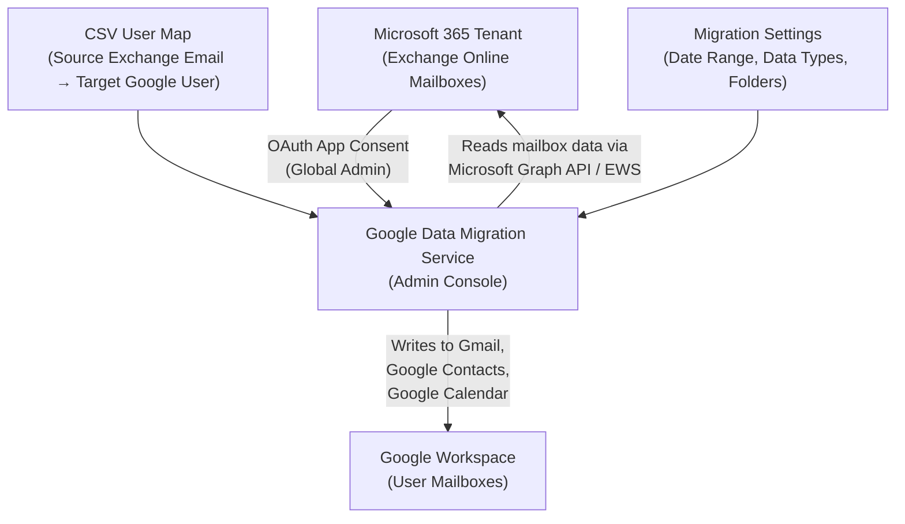
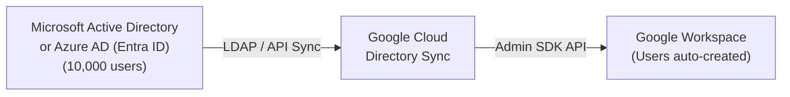
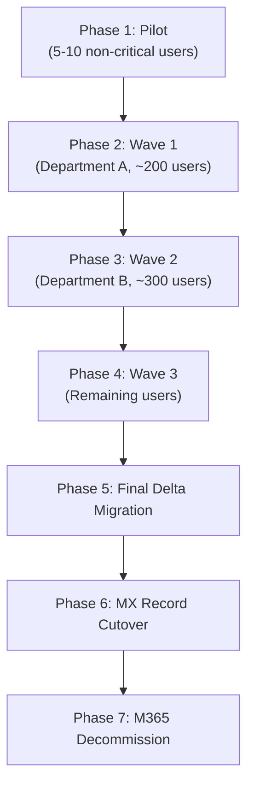
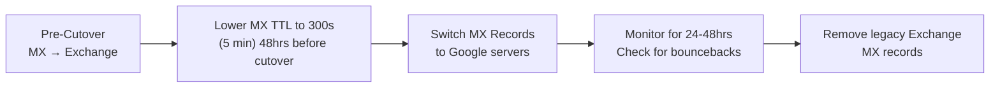
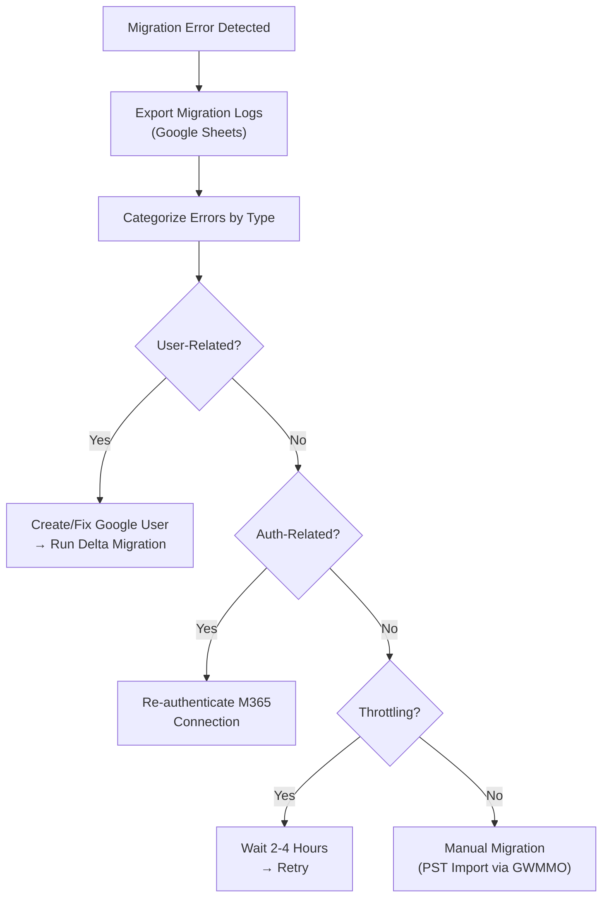

# Module 7: Exchange Online Email, Contacts & Calendars Migration to Google Workspace — Interview Deep Dive

This module covers the complete workflow, tooling, configuration options, and troubleshooting for migrating **email, contacts, and calendar data** from Microsoft 365 Exchange Online into Google Workspace using Google's built-in Data Migration Service (DMS). Special emphasis is placed on enterprise-scale migrations, throttling considerations, and interview-ready explanations.

---

## 1. Migration Architecture Overview

### What Is Being Migrated?

| Data Type | Source (M365) | Destination (Google Workspace) | Notes |
| :--- | :--- | :--- | :--- |
| **Email** | Exchange Online mailbox | Gmail | Includes folder structure, labels, read/unread state |
| **Contacts** | Exchange Contacts | Google Contacts | Personal contacts stored in the mailbox |
| **Calendars** | Exchange Calendar | Google Calendar | Events, attendees, recurrence patterns |
| **Deleted Emails** | Recoverable Items folder | Gmail Trash | Optional — configurable in settings |
| **Junk/Spam** | Junk Email folder | Gmail Spam | Optional — configurable in settings |

> [!IMPORTANT]
> **What Does NOT Migrate:**
> - Microsoft Teams chat history
> - OneDrive files (separate migration path — see Module 6 for SharePoint)
> - Shared/resource mailbox calendars (unless explicitly mapped as users)
> - Mail rules and auto-replies (Outlook rules are Exchange-specific)
> - Email signatures (these are client-side in Outlook, not stored in Exchange)
> - Distribution list memberships
> - Encrypted (S/MIME) emails

### End-to-End Architecture



### Migration Flow Summary

| Phase | Action | Where |
| :--- | :--- | :--- |
| **1. Pre-Migration** | Provision users in Google Workspace, verify Global Admin role in M365 | Both Admin Consoles |
| **2. Connection** | Connect Google Workspace to M365 Exchange Online via OAuth | Google Admin Console → Data Migration |
| **3. User Mapping** | Upload CSV mapping source Exchange emails to target Google users | Google Admin Console |
| **4. Configuration** | Set data types (email/contacts/calendar), date range, folder exclusions | Google Admin Console |
| **5. Execution** | Start migration; DMS reads from Exchange and writes to Gmail/Calendar/Contacts | Google Admin Console |
| **6. Validation** | Review migration reports, verify data in user mailboxes, run Delta if needed | Google Admin Console + Gmail |

---

## 2. Prerequisites & Pre-Migration Checklist


### A. Microsoft 365 Side

- [ ] **Global Administrator Role**: The M365 account used for OAuth consent **must** hold the Global Administrator role. To verify: `M365 Admin Center → Users → Active Users → Click your account → Roles`.
- [ ] **Audit Mailbox Sizes**: Check each user's mailbox storage to estimate migration duration. Navigate to: `M365 Admin Center → Users → Active Users → Click user → Mail tab`. Record the storage used (e.g., 3 MB, 2 GB, 50 GB).
- [ ] **Inventory Users**: List all users to be migrated. For each user, document:
  - Exchange email address (e.g., `adele@contoso.onmicrosoft.com`)
  - Mailbox size
  - Whether they have shared mailbox access
  - Any custom mail rules or auto-forwards
- [ ] **Check Licensing**: Ensure all source users have active Exchange Online licenses (Plan 1 or Plan 2). Unlicensed mailboxes cannot be read by DMS.
- [ ] **Disable Litigation Hold (if applicable)**: Litigation holds may cause timeouts on very large mailboxes. Document any holds and plan accordingly.

### B. Google Workspace Side

- [ ] **Provision Users**: All target users **must** exist in Google Workspace before migration. For large-scale provisioning (1,000+ users), use one of the following methods:

#### Enterprise User Provisioning Methods (10,000+ Users)

| Method | Best For | Scale | Effort |
| :--- | :--- | :--- | :--- |
| **Admin Console Bulk CSV Upload** | One-time migration provisioning | Up to ~10,000 users | Low |
| **GAM Bulk Scripting** | Scripted control with error logging | Unlimited | Medium |
| **Google Cloud Directory Sync (GCDS)** | Syncing from Active Directory / Azure AD | Unlimited | Medium-High (initial setup) |
| **SCIM Auto-Provisioning (Okta / Entra ID)** | Organizations already using an IdP | Unlimited | Low (if IdP exists) |

**Method 1 — Admin Console Bulk CSV Upload:**
Navigate to `Admin Console → Directory → Users → Bulk upload users`. Download the CSV template, fill in all user details, and upload:
```csv
First Name,Last Name,Email Address,Password,Org Unit Path
Adele,Vance,adele@magicmails.org,TempP@ss123,/
Alex,Wilber,alex@magicmails.org,TempP@ss456,/Marketing
```

**Method 2 — GAM Bulk Scripting:**
```bash
# Bulk create users from a CSV file
gam csv users.csv gam create user ~email firstname ~firstname lastname ~lastname password ~password changepassword on org ~orgunit
```

**Method 3 — Google Cloud Directory Sync (GCDS):**
GCDS is an on-premises tool that reads users from **Microsoft Active Directory** or **Azure AD (Entra ID)** via LDAP/API and automatically creates matching Google Workspace accounts, groups, and OUs. Ideal for enterprises migrating an entire directory structure.



**Method 4 — SCIM Auto-Provisioning via IdP:**
If the organization uses **Okta** or **Microsoft Entra ID** as an Identity Provider, configure SCIM provisioning to automatically create Google Workspace accounts when users are assigned the Google Workspace app in the IdP. This also handles ongoing Joiner-Mover-Leaver (JML) lifecycle management.

- [ ] **Assign Licenses**: Ensure each target user has a Google Workspace license that includes Gmail (Business Starter, Standard, Plus, or Enterprise).
- [ ] **Domain Verification**: The target domain must be verified and active in Google Workspace. If migrating from `contoso.com` to `magicmails.org`, both domains must be properly configured.
- [ ] **Note Credentials**: Record the temporary passwords set during user creation — these will be distributed to end users post-migration.

> [!TIP]
> **Batch Size Limit**: Google DMS supports migrating up to **1,000 users per batch**. For organizations with more than 1,000 users, split the migration into multiple CSV uploads and run them sequentially.

---

## 3. Step-by-Step Migration Procedure

### Step 1: Connect Google Workspace to Exchange Online

1. Sign into the **Google Admin Console** (`admin.google.com`).
2. Navigate to **Data → Data Import and Export → Data Migration (New)**.
3. Scroll to the **Migrate data from Microsoft** section.
4. Under **Exchange Online**, click **Migrate**.
5. Click **Connect to Exchange Online**.
6. Sign in with the **M365 Global Administrator** account.
7. Review the permissions Google is requesting:
   - Read user mailbox data
   - Read calendar data
   - Read contacts
   - Read user profiles
8. Click **Accept** to grant OAuth consent.
9. Verify the status shows **Connected** with your tenant name (e.g., "Ktoso — Connected").

> [!WARNING]
> **Security Best Practice**: After the migration is complete, revoke this OAuth consent by navigating to **Microsoft Entra ID → Enterprise Applications → Google Data Migration → Properties → Delete**. This removes Google's standing read access to all Exchange mailboxes.

### Step 2: Create and Upload the User Mapping CSV

The CSV maps each Exchange Online mailbox to its corresponding Google Workspace user.

**CSV Structure:**

| Column | Description | Example |
| :--- | :--- | :--- |
| `Source Exchange Email` | The user's email in Microsoft 365 | `adele@contoso.onmicrosoft.com` |
| `Target G User` | The corresponding Google Workspace email | `adele@magicmails.org` |

**Example CSV Content:**
```csv
Source Exchange Email,Target G User
adele@contoso.onmicrosoft.com,adele@magicmails.org
alex@contoso.onmicrosoft.com,alex@magicmails.org
alan@contoso.onmicrosoft.com,alan@magicmails.org
```

**Upload Process:**
1. Download the sample CSV from the migration wizard.
2. Fill in the source (M365) and target (Google) email addresses for every user.
3. Save as CSV format (not `.xlsx`).
4. Click **Upload CSV** in the migration wizard.
5. Wait for Google to process and validate. Confirm: **✓ All rows uploaded for migration map**.

> [!NOTE]
> **Cross-Domain Migration**: If your M365 domain (e.g., `contoso.com`) differs from your Google domain (e.g., `magicmails.org`), that is perfectly fine. The CSV explicitly maps each source to each target regardless of domain. The key requirement is that the target user **must already exist** in Google Workspace.

### Step 3: Configure Migration Settings

Click **Edit Settings** in Step 3 of the wizard. Configure the following:

#### A. Data Types to Migrate

| Setting | Default | Recommendation |
| :--- | :--- | :--- |
| **Email** | ✅ ON | Leave ON — this is the primary data being migrated |
| **Calendar** | ✅ ON | Leave ON — ensures meetings and events transfer |
| **Contacts** | ✅ ON | Leave ON — personal contacts are migrated to Google Contacts |

#### B. Date Range

| Setting | Description | Best Practice |
| :--- | :--- | :--- |
| **Start Date** | The earliest date from which to migrate emails | Set to the earliest date you need (e.g., `January 1, 2015` for 10 years of history). Default is `January 1, 2000`. |
| **End Date** | Usually "now" (current date) | Leave as default |

> [!TIP]
> **For Large Mailboxes (10+ GB)**: Consider setting a more recent start date for the initial migration (e.g., last 2 years) and running a second pass for historical data. This gets users productive faster with recent emails while older data catches up.

#### C. Email Options

| Option | Description | Recommendation |
| :--- | :--- | :--- |
| **Include Deleted Emails** | Migrates items from the Recoverable Items (Deleted Items) folder | ✅ Include — users often need recently deleted items |
| **Include Junk Emails** | Migrates items from the Junk Email folder | ❌ Exclude — junk/spam data is unnecessary clutter |
| **Exclude Specific Folders** | Comma-separated list of folder names to skip | Use for large archive folders that are no longer needed |

#### D. Domain Handling

| Option | Description | When to Use |
| :--- | :--- | :--- |
| **Keep the same domain name** | The target Google user uses the domain specified in the CSV | Use when your CSV already has the correct target domains |
| **Assign a different domain name** | Override the target domain for all users | Use when you have multiple verified domains in Google and want to redirect all users to a specific one |

#### E. Additional Calendars

- Optionally migrate **additional calendars** (shared or delegated) if configured in Exchange.
- For most migrations, the default personal calendar migration is sufficient.

Click **Save** after configuration.

### Step 4: Start the Migration

1. Review the configuration summary on the migration page.
2. Confirm that it shows: *"All email, calendar data will be copied from [start date] for your organization, and all contacts will also be copied."*
3. Click **Start Migration** in the bottom right corner.
4. Monitor the live dashboard — it updates every **10 seconds**.

### Step 5: Monitor Progress

The migration dashboard shows real-time statistics:

| Metric | Description |
| :--- | :--- |
| **Emails Discovered** | Total emails found in source mailboxes |
| **Emails Migrated** | Successfully transferred emails |
| **Successful** | Items completed without errors |
| **Failed** | Items that could not be migrated |
| **Warning** | Items migrated with potential issues |
| **Skipped** | Items intentionally excluded by settings |

> [!NOTE]
> **You can safely navigate away from the page** — the migration continues running in the background. Return to `Data → Data Import and Export → Data Migration` at any time to check status.

### Step 6: Post-Migration Validation

1. **Check Migration Status**: When complete, the dashboard shows **"Complete"** at the top.
2. **Export User Report**: Click **Export User Report** — generates a Google Sheet showing per-user statistics (emails migrated, calendars, contacts, errors).
3. **Export Migration Logs**: Click **Export Migration Logs** — detailed file-level logs useful for troubleshooting failures.
4. **Spot-Check User Mailboxes**: Sign into Gmail as a migrated user and verify:
   - Email folder structure is intact
   - Recent and historical emails are present
   - Calendar events appear in Google Calendar
   - Contacts appear in Google Contacts
5. **Run Delta Migration** (if needed): If users continued sending/receiving email in Exchange during the migration window, run a Delta migration to capture new items.

---

## 4. Best Practices for Large-Scale Migrations (1,000+ Users / 10,000+ Items)

### A. Planning & Phasing Strategy



| Practice | Detail | Rationale |
| :--- | :--- | :--- |
| **Pilot First** | Migrate 5–10 non-critical users and validate thoroughly | Catches CSV formatting issues, permission problems, and data type gaps before enterprise rollout |
| **Wave-Based Migration** | Group users by department (200–500 per wave) | Reduces risk; enables department-specific validation; easier user communication |
| **Off-Peak Scheduling** | Start migrations Friday evening or overnight | Minimizes impact on M365 API throttling and end-user productivity |
| **Mailbox Size Triage** | Migrate small mailboxes (< 5 GB) first, large mailboxes (> 20 GB) last | Small mailboxes complete fast, giving quick wins; large mailboxes need longer windows |

### B. Microsoft 365 API Throttling

> [!IMPORTANT]
> **This is the #1 bottleneck for large migrations.** Microsoft 365 enforces API throttling limits on mailbox access. Understanding and planning for this is what separates a junior admin from a senior engineer.

| Throttling Factor | Impact | Mitigation |
| :--- | :--- | :--- |
| **Per-Mailbox Rate Limit** | Microsoft limits concurrent connections and operations per mailbox | DMS handles this automatically, but very large mailboxes (50+ GB) may take 24–48 hours |
| **Per-Tenant Rate Limit** | Total API calls across all mailboxes are throttled at the tenant level | Spread migration across multiple days; avoid running other API-heavy tools (e.g., compliance scans) during migration |
| **Connection Throttling** | Too many simultaneous mailbox reads trigger HTTP 429 (Too Many Requests) | DMS has built-in retry logic, but may slow down. Batch sizes of 200–500 users help |
| **Time-Based Throttling** | Microsoft may reduce API quotas during peak business hours (US Eastern timezone) | Schedule migrations during off-peak hours relative to the M365 datacenter region |

**Realistic Timeline Estimates:**

| Scenario | Estimated Duration |
| :--- | :--- |
| 10 users, < 1 GB each | 30 minutes – 1 hour |
| 100 users, average 5 GB each | 12–24 hours |
| 500 users, average 10 GB each | 2–4 days |
| 1,000 users, mixed sizes | 5–7 days (with throttling) |

### C. Data Integrity Best Practices

| Aspect | Best Practice | Rationale |
| :--- | :--- | :--- |
| **Date Range Planning** | Set the start date to capture ALL needed historical email | Missing the date range = missing emails; users will notice immediately |
| **Folder Exclusion** | Exclude large archive folders (e.g., "Old Projects 2010") if not needed | Reduces migration time and storage consumption |
| **Deleted Items** | Include deleted items for compliance-regulated industries (finance, healthcare) | Regulatory requirements may mandate preserving deleted email history |
| **Junk Email** | Exclude junk/spam for most migrations | Unnecessary data transfer; wastes time and storage |
| **Email Attachments** | All attachments migrate with their parent emails | No special configuration needed; be aware of Gmail's 25 MB attachment limit for new emails (migrated attachments can exceed this) |
| **Calendar Recurring Events** | Verify post-migration that recurring events display correctly in Google Calendar | Exchange and Google handle recurrence patterns slightly differently; edge cases may appear |

### D. Coexistence During Migration

During a staged migration, some users will be on M365 while others are already on Google Workspace. This creates a **coexistence period** that must be managed.

| Challenge | Solution |
| :--- | :--- |
| **Mail Flow** | Configure **Split Delivery** or **Dual Delivery** routing (see Module 1, Section 4) to ensure email reaches users on both platforms |
| **Calendar Free/Busy** | Use the **Google Calendar Interop** tool to allow Exchange and Google Calendar users to see each other's availability |
| **Global Address List (GAL)** | Maintain contact records on both platforms during coexistence; consider using GCDS (Google Cloud Directory Sync) for automatic sync |
| **User Confusion** | Provide clear communication about which platform each user should use and when their cutover date is |

> [!TIP]
> **Interview Gold**: If asked about coexistence, reference Split Delivery routing (Module 1) and explain how you'd configure a mail host route in Gmail to forward unrecognized recipients to the legacy Exchange server. This demonstrates architectural depth.

### E. MX Record Cutover Strategy

Once all users are migrated and validated, the final step is switching the MX records to point to Google Workspace.



**Google Workspace MX Records:**

| Priority | Server |
| :--- | :--- |
| 1 | `ASPMX.L.GOOGLE.COM` |
| 5 | `ALT1.ASPMX.L.GOOGLE.COM` |
| 5 | `ALT2.ASPMX.L.GOOGLE.COM` |
| 10 | `ALT3.ASPMX.L.GOOGLE.COM` |
| 10 | `ALT4.ASPMX.L.GOOGLE.COM` |

---

## 5. Common Error Scenarios & Troubleshooting

| Error | Cause | Resolution |
| :--- | :--- | :--- |
| `User not found` | Target Google user doesn't exist or has a typo in the CSV | Verify user exists in `Directory → Users`; correct the CSV and re-upload |
| `Authentication failed` | OAuth consent expired or Global Admin credentials changed | Re-authenticate the M365 connection in Step 1 |
| `Mailbox not accessible` | Source user's Exchange license was removed or mailbox is inactive | Re-activate the Exchange license on the source account |
| `Rate limit exceeded` / `HTTP 429` | Microsoft API throttling | Wait and retry; reduce concurrent user batch size |
| `Message too large` | Individual email exceeds Google's import size limit | Skip manually; typically extremely rare for standard email |
| `Calendar event format error` | Complex recurrence patterns or non-standard iCal properties | Events may appear slightly different in Google Calendar; manual correction needed |
| `Zero contacts migrated` | Source user has no contacts stored in Exchange (contacts may be in Outlook local storage, not Exchange) | Check if contacts are stored locally in Outlook PST rather than Exchange Online |
| Migration stuck at "In Progress" | Large mailbox or throttling delays | Allow 24–48 hours before investigating; check M365 service health dashboard |

### Troubleshooting Workflow



---

## 6. Migration Tools Comparison — Email/Calendar/Contacts

| Feature | Google DMS (Built-in) | Google Workspace Migration for Exchange (GWME) | Google Workspace Migration for Microsoft Outlook (GWMMO) | BitTitan MigrationWiz |
| :--- | :--- | :--- | :--- | :--- |
| **Type** | Cloud-to-cloud | On-premises utility | Desktop client | Cloud-based (third-party) |
| **Cost** | Free (included) | Free (Google tool) | Free (Google tool) | Per-user licensing |
| **Source** | Exchange Online (M365) | On-premises Exchange (2010/2013/2016/2019) | Local PST files, Outlook profiles | Any Exchange, IMAP, Gmail |
| **Max Users per Batch** | 1,000 | Unlimited (limited by server resources) | 1 user at a time | Unlimited |
| **Delta/Incremental** | ✅ Yes | ✅ Yes | ❌ No | ✅ Yes |
| **Admin Control** | Centralized (Admin Console) | Centralized (Windows Server) | Decentralized (end-user driven) | Centralized (BitTitan portal) |
| **Best For** | Cloud-to-cloud M365 migrations | Legacy on-premises Exchange servers | Individual PST imports, small-scale | Complex enterprise migrations |

> [!TIP]
> **Interview Insight**: For cloud-to-cloud Exchange Online to Google Workspace migrations, always recommend **Google DMS first**. It's free, centrally managed, and handles Delta migrations. Recommend GWME only for on-premises Exchange servers, GWMMO for individual PST imports, and BitTitan for complex multi-source or tenant-to-tenant scenarios.

---

## 7. Post-Migration Checklist

- [ ] **Verify Migration Status**: Dashboard shows **"Complete"** for all users.
- [ ] **Export & Archive Reports**: Download both the User Report and Migration Logs to Google Drive.
- [ ] **Spot-Check 10% of Users**: Randomly verify email, calendar, and contact data for a sample of migrated users.
- [ ] **Run Delta Migration**: Capture any emails sent/received during the migration window.
- [ ] **Distribute Credentials**: Send Google Workspace login credentials to all migrated users via a secure channel (not email — use SMS, Slack, or in-person).
- [ ] **Configure Mail Coexistence** (if staged): Set up Split Delivery routing in Gmail (see Module 1).
- [ ] **Update MX Records** (if full cutover): Point domain MX records to Google's mail servers.
- [ ] **Update SPF Record**: Add `include:_spf.google.com` to your domain's SPF TXT record.
- [ ] **Configure DKIM**: Generate and publish DKIM keys in `Apps → Gmail → Authenticate email`.
- [ ] **Set DMARC Policy**: Start with `p=none` for monitoring, then ramp to `p=reject` (see Module 1).
- [ ] **Revoke M365 OAuth**: Remove Google's Enterprise App from Microsoft Entra ID.
- [ ] **Archive or Decommission M365 Licenses**: After validation period (30–60 days), remove Exchange Online licenses to stop billing.

---

## 8. Interview Questions & Answers

### Q1: "Walk me through migrating email, contacts, and calendars from Microsoft 365 to Google Workspace for an organization of 500 users."

**Model Answer:**
> I'd break this into seven phases. **Phase 1 — Planning**: Audit all 500 Exchange mailboxes to document sizes and identify any shared or resource mailboxes that need special handling. **Phase 2 — Google Prep**: Provision all 500 users in Google Workspace, either via bulk CSV upload or GAM scripting, and assign licenses. **Phase 3 — Pilot**: Migrate 5–10 non-critical users first to validate the CSV mapping, OAuth connection, and data integrity. **Phase 4 — Phased Migration**: Divide the remaining users into 3–4 waves of 100–150 users each, scheduled during off-peak hours to minimize Microsoft API throttling. I'd set the date range to capture all historical email back to the organization's founding date, exclude junk folders, and include deleted items. **Phase 5 — Delta Migration**: After each wave, run a Delta migration to catch emails received during the migration window. **Phase 6 — Cutover**: Once all users are validated, lower the MX TTL to 300 seconds 48 hours before cutover, then switch MX records to Google's mail servers. Update SPF, DKIM, and DMARC records simultaneously. **Phase 7 — Decommission**: Keep M365 licenses active for 30 days as a safety net, then archive and cancel.

### Q2: "What happens to email received in Exchange during the migration?"

**Model Answer:**
> During the migration window, users continue receiving new email in their Exchange mailbox. The initial DMS migration captures everything up to the point it runs. Once the initial migration completes, I run a **Delta migration** — this is an incremental pass that only processes new emails received after the initial migration started, plus any previously failed items. For critical environments, I schedule the final Delta migration immediately before the MX record cutover to minimize the gap. During coexistence, I configure **Split Delivery** routing in Gmail so that mail to migrated users goes to Google while mail to not-yet-migrated users forwards to Exchange.

### Q3: "A user reports that their calendar events are missing after migration. How do you troubleshoot?"

**Model Answer:**
> First, I'd check the migration logs — export the Migration Logs from the DMS dashboard and filter for that user's email address. If calendar items show as "failed," I'd investigate the specific error message. Common causes include: the source calendar having complex recurring events with non-standard iCal properties that Google can't parse, or the calendar being a delegated/shared calendar that wasn't included in the migration scope. If the calendar was simply skipped, I'd verify that "Calendar" was checked in the migration settings and re-run the migration for that specific user. If the issue is a format incompatibility, I'd export the calendar from Outlook as an ICS file and import it directly into Google Calendar as a fallback.

### Q4: "Microsoft is throttling your migration and it's taking much longer than expected. What do you do?"

**Model Answer:**
> Microsoft 365 enforces API throttling at both the per-mailbox and per-tenant level, and this is the single biggest variable in migration timelines. My approach: First, I'd **reduce the batch size** — instead of migrating 500 users simultaneously, I'd split into smaller batches of 100–200. Second, I'd **schedule migrations during off-peak hours** — Microsoft's throttling is less aggressive during evenings and weekends relative to the tenant's datacenter region. Third, I'd **check Microsoft Service Health** — sometimes throttling is elevated during planned maintenance or outages. Fourth, I'd ensure no other API-heavy processes are running against the tenant simultaneously (e.g., compliance scans, eDiscovery exports, backup tool syncs). Finally, I'd **communicate updated timelines** to stakeholders — throttling is a Microsoft-imposed constraint, not something we can bypass, and setting realistic expectations is critical.

### Q5: "What's the difference between DMS, GWME, and GWMMO? When would you use each?"

**Model Answer:**
> **Google DMS** is the built-in cloud-to-cloud migration tool in the Admin Console. It connects directly to Exchange Online via OAuth and migrates email, contacts, and calendars. It's free, centrally managed, supports Delta migrations, and handles up to 1,000 users per batch. This is my default recommendation for M365-to-Google migrations. **GWME** (Google Workspace Migration for Exchange) is an on-premises Windows application that connects to Exchange servers via MAPI or EWS. I'd use this specifically for **on-premises Exchange** migrations (Exchange 2010, 2013, 2016, 2019) where the server isn't cloud-hosted. **GWMMO** (Google Workspace Migration for Microsoft Outlook) is a desktop client that individual users can run to import their local PST files into Gmail. I'd use this for ad-hoc migrations — for example, a single executive who has years of email stored in local PST files on their laptop that never synced to Exchange. For very complex migrations involving multiple source platforms, I'd consider **BitTitan MigrationWiz** as an enterprise-grade third-party tool.

### Q6: "After migration, what DNS changes are required for the domain?"

**Model Answer:**
> Four DNS record changes are required. First, **MX records** — update domain MX records to point to Google's mail servers (`ASPMX.L.GOOGLE.COM` at priority 1, plus the four ALT servers). I'd lower the TTL to 300 seconds 48 hours before making the change to ensure fast propagation. Second, **SPF** — add `include:_spf.google.com` to the domain's SPF TXT record, and remove the Exchange Online include (`include:spf.protection.outlook.com`) once Exchange is fully decommissioned. Third, **DKIM** — generate a new DKIM key pair in the Google Admin Console (`Apps → Gmail → Authenticate Email`), publish the public key as a DNS TXT record at `google._domainkey.yourdomain.com`, and activate signing. Fourth, **DMARC** — if not already configured, start with `p=none` to monitor authentication results for 2–4 weeks, then ramp to `p=quarantine` and eventually `p=reject`. I'd also configure **MTA-STS** to enforce TLS on inbound connections.

### Q7: "How do you handle a situation where the source and destination domains are different?"

**Model Answer:**
> This is a common scenario — for example, migrating from `contoso.onmicrosoft.com` to `magicmails.org`. The CSV user map explicitly handles this by mapping each source email to each target email regardless of domain. The key requirement is that all target users already exist in Google Workspace under the destination domain. During the migration, DMS reads from the source mailbox and writes to the target mailbox based purely on the CSV mapping. Post-migration, if users need to continue receiving email at their old domain, I'd add the old domain as a **domain alias** in Google Workspace and configure email routing so messages to either domain reach the user's Gmail inbox. This provides a seamless transition period where both old and new email addresses work.

---

## 9. Quick Reference: GAM Commands for Email Migration Support

```bash
# 1. Bulk create users from CSV with randomized passwords and force change at next login
gam csv users.csv gam create user ~email firstname ~firstname lastname ~lastname password ~temppassword org ~orgunit changepassword on

# 2. Bulk assign Google Workspace Enterprise Plus licenses
gam csv users.csv gam user ~email add license wsentplus

# 3. Audit all active mail forwarding rules across the tenant (detecting data leaks)
gam all users print forwardingaddresses todrive

# 4. Audit all user mailbox delegates domain-wide
gam all users print delegates todrive

# 5. Restore executive delegate access post-migration
gam user executive@company.com add delegate assistant@company.com

# 6. Bulk configure send-as email aliases with custom display names
gam csv sendas.csv gam user ~UserEmail add sendas ~AliasEmail ~DisplayName default true

# 7. Check DKIM DNS authentication status for primary domain
gam info domain company.com

# 8. Send API verification test email post-cutover
gam user admin@company.com sendemail recipient admin@company.com subject "Post-Migration Verification" message "Email delivery to Google Workspace successfully verified."
```

---

## 10. Key Terminology Glossary

| Term | Definition |
| :--- | :--- |
| **DMS** | Data Migration Service — Google's built-in cloud-to-cloud migration tool in the Admin Console |
| **Exchange Online** | Microsoft's cloud-hosted email platform, part of Microsoft 365 |
| **EWS** | Exchange Web Services — the API protocol used to access Exchange mailbox data |
| **Delta Migration** | An incremental migration pass that only processes new, modified, or previously failed items |
| **Split Delivery** | Mail routing configuration where a gateway delivers to Google or Exchange depending on where the recipient's mailbox exists |
| **Dual Delivery** | Mail routing configuration where every inbound message is duplicated to both Google and Exchange |
| **MX Record** | DNS Mail Exchanger record that specifies which servers handle incoming email for a domain |
| **OAuth Consent** | The authorization grant allowing Google DMS to read from Exchange Online via Microsoft Graph API |
| **PST** | Personal Storage Table — Outlook's local email archive file format |
| **GWME** | Google Workspace Migration for Exchange — on-premises migration tool for legacy Exchange servers |
| **GWMMO** | Google Workspace Migration for Microsoft Outlook — desktop client for PST file imports |
| **Global Administrator** | The M365 role with full tenant-wide permissions, required for granting OAuth consent |
| **Calendar Interop** | Google's tool for enabling free/busy lookup between Exchange and Google Calendar during coexistence |
