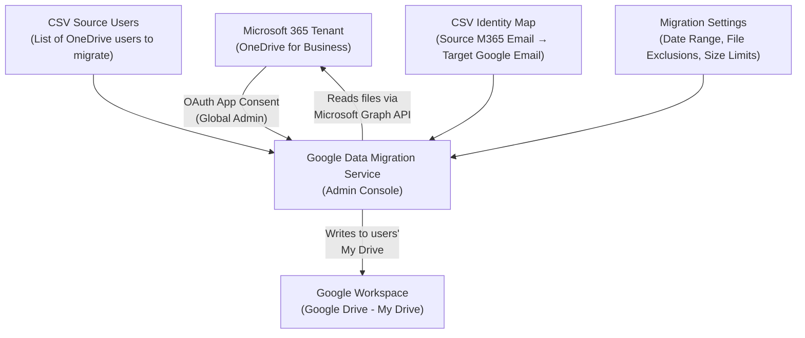
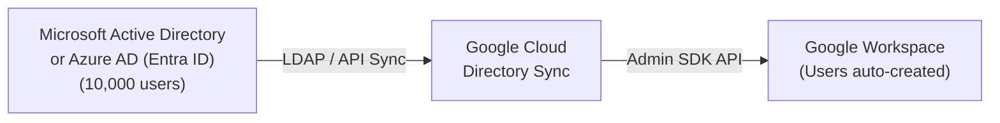
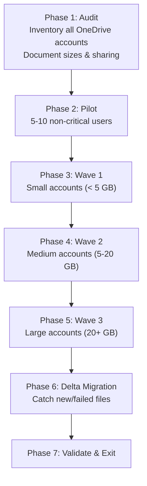
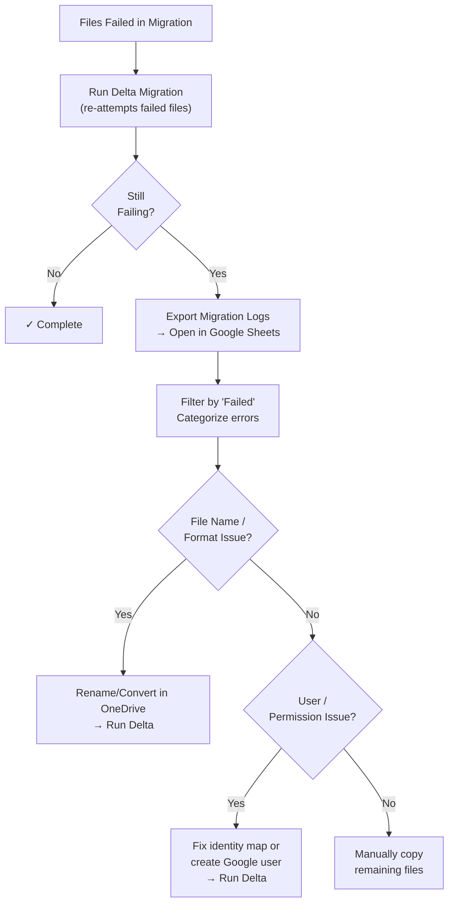

# Module 8: OneDrive to Google Drive Migration — Interview Deep Dive

This module covers the complete workflow, configuration options, best practices, and troubleshooting for migrating **user files and folders** from Microsoft 365 OneDrive into Google Drive using Google's built-in Data Migration Service (DMS). Special emphasis is placed on permission handling (unmapped identities), file format considerations, and enterprise-scale migration strategies.

---

## 1. Migration Architecture Overview

### What Is Being Migrated?

| Data Type | Source (M365) | Destination (Google Workspace) | Notes |
| :--- | :--- | :--- | :--- |
| **Files** | OneDrive for Business (user's personal cloud storage) | Google Drive (My Drive) | All file types preserved in original format |
| **Folders** | OneDrive folder structure | Google Drive folder structure | Hierarchy preserved |
| **Sharing Permissions** | OneDrive file/folder sharing (internal & external) | Google Drive sharing ACLs | Requires identity mapping; unmapped users lose access |
| **File Metadata** | Created/modified timestamps | Preserved where possible | Some metadata may not transfer (e.g., custom columns) |

> [!IMPORTANT]
> **What Does NOT Migrate:**
> - OneDrive **Recycle Bin** items (deleted files)
> - OneNote notebooks stored in OneDrive (proprietary format)
> - OneDrive **Vault** (Personal Vault files)
> - Files exceeding Google Drive's per-file size limit (5 TB)
> - Outlook `.pst` or `.ost` files stored in OneDrive (use GWMMO for these)
> - OneDrive **sync settings** and **shortcuts to shared folders**
> - Microsoft 365 app-specific data (e.g., Visio, Project files may transfer as files but won't open natively in Google)

### End-to-End Architecture



### Migration Flow Summary

| Phase | Action | Where |
| :--- | :--- | :--- |
| **1. Pre-Migration** | Provision users in Google Workspace, verify Global Admin role in M365 | Both Admin Consoles |
| **2. Connection** | Connect Google Workspace to M365 OneDrive via OAuth | Google Admin Console → Data Migration |
| **3. Source Users** | Upload CSV listing OneDrive users to migrate | Google Admin Console |
| **4. Identity Mapping** | Upload CSV mapping M365 users to Google Workspace users | Google Admin Console |
| **5. Configuration** | Set date range, file exclusions, size limits, unmapped identity handling | Google Admin Console |
| **6. Execution** | Start migration; DMS reads from OneDrive and writes to Google Drive | Google Admin Console |
| **7. Validation** | Review migration reports, run Delta migration if needed, verify data | Google Admin Console + Google Drive |

---

## 2. Prerequisites & Pre-Migration Checklist

### A. Microsoft 365 Side

- [ ] **Global Administrator Role**: The M365 account used for OAuth consent **must** hold the Global Administrator role. Without it, the migration will not connect. To verify: `M365 Admin Center → Users → Active Users → Click your account → Roles → Global Administrator`.
- [ ] **Audit OneDrive Storage**: Check each user's OneDrive usage to estimate migration duration and identify large accounts. Navigate to: `M365 Admin Center → Users → Active Users → Click user → OneDrive tab`.
- [ ] **Inventory Users**: List all users to be migrated with their:
  - M365 email address (e.g., `adele@contoso.onmicrosoft.com`)
  - OneDrive storage used
  - Number of files (approximate)
  - Sharing patterns (files shared with external users, other internal users)
- [ ] **Check Licensing**: Ensure all source users have active OneDrive for Business licenses. Unlicensed or deactivated accounts cannot be read by DMS.
- [ ] **Identify Shared Files**: Document files shared between users — these require proper identity mapping to preserve access controls post-migration.

### B. Google Workspace Side

- [ ] **Provision Users**: All target users **must** exist in Google Workspace before migration begins. For large-scale provisioning (1,000+ users), use one of the following methods:

#### Enterprise User Provisioning Methods (10,000+ Users)

| Method | Best For | Scale | Effort |
| :--- | :--- | :--- | :--- |
| **Admin Console Bulk CSV Upload** | One-time migration provisioning | Up to ~10,000 users | Low |
| **GAM Bulk Scripting** | Scripted control with error logging | Unlimited | Medium |
| **Google Cloud Directory Sync (GCDS)** | Syncing from Active Directory / Azure AD | Unlimited | Medium-High (initial setup) |
| **SCIM Auto-Provisioning (Okta / Entra ID)** | Organizations already using an IdP | Unlimited | Low (if IdP exists) |

**Method 1 — Admin Console Bulk CSV Upload:**
Navigate to `Admin Console → Directory → Users → Bulk upload users`. Download the CSV template, fill in all user details, and upload:
```csv
First Name,Last Name,Email Address,Password,Org Unit Path
Adele,Vance,adele@magicmails.org,TempP@ss123,/
Alex,Wilber,alex@magicmails.org,TempP@ss456,/Marketing
```

**Method 2 — GAM Bulk Scripting:**
```bash
# Bulk create users from a CSV file
gam csv users.csv gam create user ~email firstname ~firstname lastname ~lastname password ~password changepassword on org ~orgunit
```

**Method 3 — Google Cloud Directory Sync (GCDS):**
GCDS is an on-premises tool that reads users from **Microsoft Active Directory** or **Azure AD (Entra ID)** via LDAP/API and automatically creates matching Google Workspace accounts, groups, and OUs. Ideal for enterprises migrating an entire directory structure.



**Method 4 — SCIM Auto-Provisioning via IdP:**
If the organization uses **Okta** or **Microsoft Entra ID** as an Identity Provider, configure SCIM provisioning to automatically create Google Workspace accounts when users are assigned the Google Workspace app in the IdP. This also handles ongoing Joiner-Mover-Leaver (JML) lifecycle management.

- [ ] **Assign Licenses**: Each target user needs a Google Workspace license that includes Google Drive (Business Starter, Standard, Plus, or Enterprise).
- [ ] **Verify Storage Quotas**: Ensure sufficient pooled storage (Enterprise) or per-user storage for the incoming data. Check: `Admin Console → Storage`.
- [ ] **Domain Verification**: Target domain must be verified and active. Cross-domain migration (e.g., `contoso.com` → `magicmails.org`) is fully supported via the CSV identity map.

> [!TIP]
> **Batch Size Limit**: Google DMS supports up to **1,000 users per migration batch**. For larger organizations, split users into multiple CSV batches and run them sequentially.

---

## 3. Step-by-Step Migration Procedure

### Step 1: Connect Google Workspace to Microsoft OneDrive

1. Sign into the **Google Admin Console** (`admin.google.com`).
2. Navigate to **Data → Data Import and Export → Data Migration (New)**.
3. Scroll to the **Migrate data from Microsoft** section.
4. Click on **OneDrive**, then click **Migrate**.
5. Click **Connect to Microsoft OneDrive**.
6. Sign in with the **M365 Global Administrator** account.
7. Review the permissions Google is requesting:
   - Read user files and folders
   - Read user profiles
   - Read sharing permissions
8. Click **Accept** to grant OAuth consent.
9. Verify the status shows **Connected** with your tenant name.

> [!WARNING]
> **Retry Note**: Occasionally the connection may require 1–2 attempts. If the status doesn't change to "Connected," click the connect button again and re-authenticate. This is a known minor UI behavior.

### Step 2: Upload the Source Users CSV

This CSV tells DMS **which OneDrive users** to migrate.

**CSV Structure:**

| Column | Description | Example |
| :--- | :--- | :--- |
| `Source OneDrive User` | The M365 email address of the OneDrive user | `adele@contoso.onmicrosoft.com` |

**Example CSV Content:**
```csv
Source OneDrive User
adele@contoso.onmicrosoft.com
alex@contoso.onmicrosoft.com
alan@contoso.onmicrosoft.com
```

**Upload Process:**
1. Download the sample CSV from the migration wizard.
2. Add all M365 email addresses of users whose OneDrive data you want to migrate (one per row).
3. Save as CSV format.
4. Click **Upload CSV** in the migration wizard.
5. Verify: **✓ All rows uploaded for migration map** with the correct row count (e.g., "3 rows successfully uploaded").

> [!NOTE]
> **Key Difference from Email Migration (Module 7)**: The OneDrive source CSV only contains the **source user** column — it does NOT include the target Google user. The target mapping is handled separately in Step 3 via the Identity Map CSV.

### Step 3: Upload the Identity Map CSV

The identity map tells DMS how to translate M365 user identities to Google Workspace identities. This is critical for:
- Mapping each user's OneDrive to the correct Google Drive account
- Preserving file sharing permissions between users

**CSV Structure:**

| Column | Description | Example |
| :--- | :--- | :--- |
| `Source Email` | The user's email in Microsoft 365 | `adele@contoso.onmicrosoft.com` |
| `Destination Email` | The corresponding Google Workspace email | `adele@magicmails.org` |

**Example CSV Content:**
```csv
Source Email,Destination Email
adele@contoso.onmicrosoft.com,adele@magicmails.org
alex@contoso.onmicrosoft.com,alex@magicmails.org
alan@contoso.onmicrosoft.com,alan@magicmails.org
```

**Upload Process:**
1. Download the **identity map sample CSV** from Step 3 of the wizard.
2. Fill in source (M365) and destination (Google) email addresses for every user.
3. Save as CSV format.
4. Click **Upload CSV** in the migration wizard.
5. Verify: **✓ All rows uploaded for identity mappings**.

> [!IMPORTANT]
> **Map ALL users who share files**, not just the users being migrated. If User A shares a file with User B, but User B is not in the identity map, User B's access will be lost after migration. Include all collaborators in the identity map for complete permission preservation.

### Step 4: Configure Migration Settings

Click **Edit** on Step 4 to configure the following:

#### A. Unmapped Identities

This is one of the most important settings for OneDrive migrations and a frequent interview topic.

| Option | What It Does | When to Enable |
| :--- | :--- | :--- |
| **Copy unmapped accounts (enabled)** | DMS attempts to preserve permissions for users NOT in your identity map by matching them to Google accounts with the same email prefix | Enable if you want to preserve sharing for users you didn't explicitly map (e.g., old employees, external contacts) |
| **Copy unmapped accounts (disabled)** | Permissions for unmapped users are silently dropped | Enable if you only want to migrate files without any shared permissions |
| **Keep source domain** | Unmapped users retain their M365 domain in sharing records | Use when source and target domains are the same |
| **Select different domain** | Override the domain for unmapped users | Use when migrating to a different domain |

> [!TIP]
> **Best Practice for Enterprise Migrations**: Disable unmapped identities and rely on explicit identity maps. This gives you full control and auditability over who has access to migrated files. Enable it only if you have a very large number of external collaborators that would be impractical to map individually.

#### B. Date Range

| Setting | Description | Best Practice |
| :--- | :--- | :--- |
| **Enable date range filter** | Only migrate files created/modified within the specified date range | Use to limit migration scope for very large OneDrive accounts |
| **Disable date range filter** (default) | Migrate ALL files regardless of date | Recommended for most migrations — ensures nothing is missed |

#### C. Exclude Specific File Formats

| Setting | Description | Example |
| :--- | :--- | :--- |
| **File format exclusions** | Comma-separated list of file extensions to skip | `pst, ost, tmp, bak` |

**Common exclusions:**
- `.pst`, `.ost` — Outlook data files (migrate these via GWMMO or DMS email migration instead)
- `.tmp`, `.bak` — Temporary and backup files
- `.exe`, `.msi` — Executables (if security policy prohibits)

#### D. Exclude Files Larger Than

| Setting | Description | Best Practice |
| :--- | :--- | :--- |
| **Size limit** | Skip files exceeding the specified size (e.g., 1 GB, 10 GB) | Set to 10 GB unless users have legitimate large files (video production, CAD) |

**Rationale**: Very large files (> 10 GB) dramatically slow migration and are often outdated backups or media archives that could be moved separately.

Click **Save** after configuration.

### Step 5: Start Migration

1. Review the configuration summary on the migration page.
2. Verify the migration settings in Step 4 match your requirements.
3. Click **Start Migration**.
4. Monitor the live dashboard — it updates every **10 seconds**.

### Step 6: Monitor Progress

| Metric | Description |
| :--- | :--- |
| **Files Discovered** | Total files found in source OneDrive accounts |
| **Files Migrated** | Successfully transferred files |
| **Successful** | Files completed without errors |
| **Failed** | Files that could not be migrated |
| **Warning** | Files migrated with potential issues |
| **Skipped** | Files excluded by settings (format, size, date range) |

> [!NOTE]
> **You can safely navigate away** — the migration continues running in the background. Return to the migration page anytime to check progress.

### Step 7: Post-Migration Validation

1. **Check Migration Status**: Dashboard shows **"Complete"** at the top.
2. **Handle Failed Files**:
   - **First**: Run a **Delta Migration** — this re-attempts failed files and catches newly added files.
   - **If still failing**: Click **Export Migration Logs** → **Open in Google Sheets** → filter for failed items → review the error reason.
   - **Last resort**: Manually copy the handful of failed files directly into Google Drive.
3. **Spot-Check User Drives**: Sign into Google Drive as a migrated user and verify folder structures and file contents.
4. **Click Exit Migration** once satisfied.

---

## 4. Best Practices for Large-Scale Migrations (1,000+ Users / 10,000+ Files)

### A. Planning & Phasing Strategy



| Practice | Detail | Rationale |
| :--- | :--- | :--- |
| **Pilot First** | Migrate 5–10 non-critical users to validate CSV mappings, permissions, and file compatibility | Catches issues before full enterprise rollout |
| **Size-Based Waves** | Migrate small accounts first (< 5 GB), then medium (5–20 GB), then large (20+ GB) | Small accounts complete fast for quick wins; large accounts need extended windows |
| **Off-Peak Scheduling** | Start migrations during evenings or weekends | Reduces M365 API throttling and end-user disruption |
| **1,000 User Batches** | Split users into CSV batches of ≤ 1,000 | DMS hard limit per batch |
| **Parallel Waves** | Run separate migration batches concurrently for different user groups | Maximizes throughput within API limits |

### B. Microsoft 365 API Throttling

> [!IMPORTANT]
> **This is the primary bottleneck for large OneDrive migrations.** Microsoft enforces per-tenant and per-user API rate limits via the Microsoft Graph API. DMS has built-in retry logic, but large volumes will be throttled.

| Factor | Impact | Mitigation |
| :--- | :--- | :--- |
| **Per-User Rate Limit** | Microsoft limits API calls per OneDrive account | DMS handles retries automatically; large accounts (50+ GB) may take 24–48 hours |
| **Per-Tenant Rate Limit** | Total API calls across all users throttled at tenant level | Batch users in waves of 200–500; avoid concurrent API-heavy operations |
| **HTTP 429 Responses** | Too many simultaneous requests trigger throttling | DMS retries with backoff; reduce batch size if persistent |
| **Peak Hours** | Microsoft may reduce quotas during business hours | Schedule migrations off-peak (nights/weekends) |

**Realistic Timeline Estimates:**

| Scenario | Estimated Duration |
| :--- | :--- |
| 10 users, < 1 GB each | 30 minutes – 1 hour |
| 100 users, average 5 GB each | 12–24 hours |
| 500 users, average 10 GB each | 2–5 days |
| 1,000 users, mixed sizes (some 50+ GB) | 5–10 days (with throttling) |

### C. File Compatibility & Handling

| Aspect | Best Practice | Rationale |
| :--- | :--- | :--- |
| **File Name Characters** | Audit for illegal characters in Google Drive: `\ : * ? " < > \|` and trailing dots/spaces | Files with incompatible names fail migration; rename in OneDrive beforehand |
| **Path Length** | Google Drive supports max **255 characters** per file name and limited total path length | Deeply nested OneDrive folders may exceed limits; flatten if needed |
| **File Type Conversion** | DMS does **NOT** auto-convert Office files to Google Docs format | Files remain as `.docx`, `.xlsx`, `.pptx`; users can optionally convert post-migration via Drive settings |
| **OneNote Notebooks** | OneNote stored in OneDrive will NOT migrate (proprietary format) | Export OneNote to PDF or use Google Keep/Docs as alternatives |
| **Large Files (> 10 GB)** | Consider excluding via the size limit setting and transferring separately | Very large files slow the entire migration and often represent outdated archives |
| **Shortcut Links** | OneDrive shortcuts and linked files do NOT migrate as functional shortcuts | Files they point to will migrate if they exist in the user's OneDrive |

### D. Permission & Sharing Best Practices

| Aspect | Best Practice | Rationale |
| :--- | :--- | :--- |
| **Complete Identity Map** | Map ALL users who share files — not just the users being migrated | Preserves sharing ACLs; unmapped users lose access |
| **External Sharing** | Files shared with external users (outside the M365 tenant) lose their sharing during migration | Re-share externally post-migration or document external shares beforehand |
| **Unmapped Identities OFF** | Disable for enterprise migrations to maintain explicit control | Prevents unintended permission grants |
| **Post-Migration ACL Audit** | Verify file permissions using GAM after migration | Catch any sharing that didn't transfer correctly |
| **Shared Folders** | OneDrive "Shared with me" items are NOT migrated (they belong to other users' OneDrives) | Only files owned by the user in their own OneDrive are migrated |

### E. Communication & Change Management

| Step | Timing | Action |
| :--- | :--- | :--- |
| **Stakeholder Notification** | 2 weeks before | Notify department heads with migration timeline and impact |
| **User Communication** | 1 week before | Email users with instructions: "Stop saving new files to OneDrive after [cutover date]" |
| **Day-Of Communication** | Migration day | Notify users that migration is in progress; files will appear in Google Drive |
| **Post-Migration Guide** | Day after | Send users a "Welcome to Google Drive" guide with key differences from OneDrive |
| **OneDrive Read-Only** | After validation | Set OneDrive to read-only (revoke edit permissions) for 30 days |
| **OneDrive Decommission** | 60–90 days post | Archive and remove OneDrive licenses after validation period |

---

## 5. OneDrive vs. Google Drive: Key Differences for User Training

Understanding these differences is critical for post-migration user support and is a common interview topic.

| Feature | OneDrive | Google Drive | Migration Impact |
| :--- | :--- | :--- | :--- |
| **File Ownership** | Files owned by the user's M365 account | Files owned by the user's Google account | Ownership transfers via migration |
| **Sync Client** | OneDrive sync client | Google Drive for Desktop | Users must install new sync client |
| **Office Files** | Native editing in Office apps | Opens in Google Docs/Sheets/Slides (or Office Online) | Files stay as `.docx` etc. unless manually converted |
| **Version History** | Full version history in OneDrive | New version history starts in Google Drive | Historical versions do NOT migrate |
| **"Shared with Me"** | Central view of shared files | Similar "Shared with me" in Google Drive | Shared items are not migrated — they come from other users' drives |
| **Storage Quota** | Per-user (1 TB default) | Per-user or pooled (varies by license) | Verify sufficient quota before migration |
| **Recycle Bin** | 93-day retention | 30-day retention (Trash) | OneDrive recycle bin items do NOT migrate |
| **File Locking** | Check-out/check-in in SharePoint-linked libraries | No native check-out in Google Drive | Workflow change for users accustomed to check-out |

---

## 6. Common Error Scenarios & Troubleshooting

| Error | Cause | Resolution |
| :--- | :--- | :--- |
| `User not found` | Target Google user doesn't exist or has a typo in the identity map | Create/fix user in Google Admin Console; re-run Delta |
| `Authentication failed` | OAuth consent expired or M365 admin password changed | Re-authenticate the connection in Step 1 |
| `File not supported` | File type or format not supported by the migration service (e.g., OneNote, corrupted files) | Manually transfer the file; export OneNote to PDF |
| `File name not supported` | File name contains characters invalid in Google Drive | Rename file in OneDrive; re-run Delta |
| `Rate limit exceeded` / `HTTP 429` | Microsoft Graph API throttling | Wait 2–4 hours; reduce batch size |
| `Storage quota exceeded` | Target Google Drive user has hit their storage limit | Increase quota or archive old files |
| `Path too long` | File path exceeds Google Drive's path length limit | Shorten folder names or flatten the directory structure in OneDrive |
| `File too large` | File exceeds the migration size limit setting | Increase the size limit or transfer the file manually |
| `Permission denied` | Source user's OneDrive is deactivated or unlicensed | Re-activate the M365 user license |

### Troubleshooting Workflow



---

## 7. Migration Tools Comparison — OneDrive to Google Drive

| Feature | Google DMS (Built-in) | BitTitan MigrationWiz | Movebot | Mover (Microsoft) |
| :--- | :--- | :--- | :--- | :--- |
| **Type** | Cloud-to-cloud | Cloud-to-cloud (third-party) | Cloud-to-cloud (third-party) | Cloud-to-cloud (Microsoft) |
| **Cost** | Free (included) | Per-user licensing | Per-GB pricing | Free (for M365 tenants) |
| **Direction** | M365 OneDrive → Google Drive | Any → Any | Any → Any | Any → M365 OneDrive only |
| **Max Users per Batch** | 1,000 | Unlimited | Unlimited | N/A (not for Google migration) |
| **Delta/Incremental** | ✅ Yes | ✅ Yes | ✅ Yes | ✅ Yes |
| **Permission Mapping** | ✅ Via identity map CSV | ✅ Auto-discovery + manual | ✅ Yes | ❌ M365-centric only |
| **File Conversion** | ❌ No auto-conversion | ✅ Optional | ✅ Optional | ❌ No |
| **Version History** | ❌ Latest version only | ✅ Configurable depth | ✅ Yes | ✅ Yes |
| **Best For** | Standard M365-to-Google migrations | Complex, multi-source enterprise | Large-volume file migrations | Inbound to M365 only (not applicable) |

> [!TIP]
> **Interview Insight**: For a standard OneDrive-to-Google-Drive migration, Google DMS is the recommended first choice — it's free, centrally managed, and handles Delta migrations. Recommend BitTitan for complex multi-platform migrations or when version history preservation is critical. Note that Microsoft's Mover tool only migrates **into** OneDrive, not out of it.

---

## 8. Interview Questions & Answers

### Q1: "Walk me through migrating OneDrive data for 500 users from Microsoft 365 to Google Drive."

**Model Answer:**
> I'd follow a seven-phase approach. **Phase 1 — Audit**: Inventory all 500 OneDrive accounts, documenting storage sizes, file counts, and sharing patterns. Identify any OneNote notebooks or very large files that need special handling. **Phase 2 — Google Prep**: Provision all 500 users in Google Workspace with Drive-enabled licenses, verify storage quotas. **Phase 3 — Pilot**: Migrate 5–10 non-critical users to validate the CSV mappings, identity maps, and file compatibility. **Phase 4 — Phased Migration**: Split users by OneDrive size into waves — small accounts (< 5 GB) first, then medium (5–20 GB), then large (20+ GB). Each wave uses a CSV batch of up to 1,000 users, scheduled during off-peak hours to minimize Microsoft API throttling. **Phase 5 — Delta Migration**: After each wave, run a Delta migration to catch files added during the migration window and re-attempt any failures. **Phase 6 — Validation**: Export migration logs, spot-check 10% of user drives, verify file permissions. **Phase 7 — Decommission**: Set OneDrive to read-only for 30 days, then archive and remove M365 licenses after the validation period.

### Q2: "What are unmapped identities in a OneDrive migration, and how do you handle them?"

**Model Answer:**
> Unmapped identities are users who appear in file sharing permissions in OneDrive but are NOT included in the identity map CSV. This commonly happens with former employees, external collaborators, or accounts that no longer exist. DMS gives you two options: enable auto-mapping, which attempts to match unmapped users to Google accounts with the same email prefix and preserve their access — or disable it, which silently drops their permissions. For enterprise migrations, I recommend **disabling auto-mapping** and creating a comprehensive identity map that includes all collaborators, not just the users being migrated. This gives you explicit control over who retains file access post-migration and avoids unintended permission grants.

### Q3: "Some files failed during the OneDrive migration. How do you troubleshoot?"

**Model Answer:**
> My first step is to run a **Delta migration** — this automatically re-attempts all previously failed files and often resolves transient issues. If files still fail, I export the migration logs from the DMS dashboard, open them in Google Sheets, and filter by "Failed" status. I categorize the errors: file name issues (illegal characters like `* ? " < >` — I'd rename them in OneDrive and re-run Delta), file format issues (OneNote notebooks don't migrate — I'd export to PDF and upload manually), path length issues (I'd flatten deep folder structures), and size limit issues (I'd either increase the threshold or transfer large files manually). For a migration with 90 files where only 2 failed, I'd likely just copy those 2 files manually rather than spending time debugging — it's about pragmatic efficiency.

### Q4: "How do you handle file sharing permissions when migrating from OneDrive to Google Drive?"

**Model Answer:**
> Permissions are handled through the identity map CSV. For every user who has shared access to files — not just the file owners being migrated — I include an entry mapping their M365 email to their Google Workspace email. DMS then translates the OneDrive sharing ACLs to Google Drive sharing permissions. There are important caveats: files shared with **external users** (outside the M365 tenant) will lose their sharing because DMS can't map external identities. I document these shares beforehand and re-share them manually post-migration. Also, the "Shared with me" view in OneDrive doesn't migrate — those files belong to other users' OneDrives and will come across when those owners' accounts are migrated. Finally, I disable the auto-mapping feature for large migrations to prevent unintended permission grants and maintain a clean audit trail.

### Q5: "What's the difference between migrating OneDrive data and SharePoint data to Google Workspace?"

**Model Answer:**
> OneDrive and SharePoint are conceptually different in Microsoft 365, and they map to different Google Workspace destinations. **OneDrive** is personal cloud storage — each user has their own OneDrive, and it maps to that user's **My Drive** in Google. The migration CSV lists individual users, and files land in their personal Google Drive. **SharePoint** is team/organizational storage — SharePoint sites contain shared document libraries, and they map to **Shared Drives** in Google Workspace. The migration CSV maps SharePoint site URLs to specific Shared Drive IDs. The key operational differences: SharePoint migration requires creating Shared Drives beforehand and assigning Manager roles; OneDrive migration requires comprehensive identity mapping to preserve inter-user file sharing. SharePoint also involves group permission mapping, while OneDrive is user-centric. I typically run OneDrive and SharePoint migrations as parallel workstreams with separate CSV files and monitoring.

### Q6: "A user says 'my files are missing' after migration. What do you check?"

**Model Answer:**
> I'd systematically check five things. **First**, confirm the migration status for that specific user — export the user report from DMS and verify their row shows "Complete" with the expected file count. **Second**, check if the user is looking in the right place — OneDrive files land in Google Drive's "My Drive," not Shared Drives. **Third**, review the migration logs for that user's account, filtering for "Failed" or "Skipped" items — files may have been excluded by the date range filter, file format exclusion, or size limit. **Fourth**, check if the "missing" files were in "Shared with me" rather than the user's own OneDrive — shared items don't migrate with the recipient's account. **Fifth**, if files genuinely didn't transfer, run a Delta migration for that user to re-attempt. The Delta migration only processes new or failed items, so it's fast and non-disruptive.

### Q7: "Should you convert OneDrive Office files to Google Docs format after migration?"

**Model Answer:**
> This is a strategic decision, not a technical one, and depends on the organization's direction. If they're fully committing to Google Workspace, I recommend enabling the **"Convert uploads to Google Docs editor format"** setting in the Admin Console post-migration. This converts `.docx` to Google Docs, `.xlsx` to Sheets, and `.pptx` to Slides when users open and edit them. The advantages are native collaboration features (real-time co-editing, commenting, versioning) and no need for Microsoft Office licenses. However, I'd advise **against** bulk converting everything immediately. Some files have complex formatting (macros, pivot tables, VBA) that may not convert perfectly. Instead, I'd recommend a gradual approach: leave files in Office format and let them naturally convert as users open and edit them. Critical documents with complex formatting should be tested before conversion.

---

## 9. Quick Reference: GAM Commands for OneDrive Migration Audits

```bash
# 1. Audit all files in a migrated user's Google Drive (My Drive)
gam user adele@magicmails.org print filelist fields id,name,mimeType,size todrive

# 2. Audit public sharing permissions ('anyoneWithLink' or 'anyone') across all migrated drives
gam all users print filelist query "visibility='anyoneWithLink' or visibility='anyoneCanFind'" fields id,name,owners,permissions todrive

# 3. Audit files shared with external domains across the entire tenant
gam all users print filelist query "readableByMe and not (domain='company.com')" fields id,name,owners,permissions > external_sharing_audit.csv

# 4. Strip unauthorized public sharing links in bulk from a user's files
gam user adele@magicmails.org delete drivefileacl <DriveFileID> anyoneWithLink

# 5. Claim/transfer ownership of files from departing M365 users to a designated manager
gam user leaver@company.com transfer drive manager@company.com

# 6. Bulk verify storage usage across all migrated user accounts
gam all users print users fields primaryEmail,usedQuotaInBytes > storage_consumption.csv

# 7. Check Drive API activity and audit log for a specific user
gam user adele@magicmails.org show driveactivity
```

---

## 10. Post-Migration Checklist

- [ ] **Migration Dashboard**: Status shows **"Complete"** for all users.
- [ ] **Delta Migration**: Run at least once to capture late files and re-attempt failures.
- [ ] **Export Reports**: Download User Report and Migration Logs; archive in Google Drive.
- [ ] **Spot-Check 10% of Users**: Randomly verify file counts, folder structures, and key documents.
- [ ] **Permission Audit**: Use GAM to verify sharing ACLs on critical shared files/folders.
- [ ] **Failed File Handling**: Manually transfer any files that could not be migrated.
- [ ] **User Notification**: Distribute Google Drive credentials and "Getting Started" guide.
- [ ] **Install Google Drive for Desktop**: Push the sync client to user devices via MDM (Jamf, Intune, or Google Endpoint Management).
- [ ] **OneDrive Read-Only**: Revoke edit permissions on OneDrive for all migrated users (30-day safety net).
- [ ] **OneDrive Decommission**: Archive OneDrive data and remove licenses after 60–90 day validation period.
- [ ] **Revoke M365 OAuth**: Remove Google's Enterprise App from Microsoft Entra ID.
- [ ] **Exit Migration**: Click "Exit Migration" in the DMS wizard to finalize.

---

## 11. Key Terminology Glossary

| Term | Definition |
| :--- | :--- |
| **DMS** | Data Migration Service — Google's built-in cloud-to-cloud migration tool in the Admin Console |
| **OneDrive for Business** | Microsoft's per-user cloud file storage, part of Microsoft 365 |
| **My Drive** | Google Drive's personal storage space for each user (destination for OneDrive files) |
| **Identity Map** | A CSV file mapping M365 user emails to Google Workspace user emails for permission translation |
| **Unmapped Identities** | M365 users found in file sharing permissions but not included in the identity map CSV |
| **Delta Migration** | An incremental pass that re-attempts failed files and processes newly added files |
| **OAuth Consent** | Authorization grant allowing Google DMS to read from M365 OneDrive via Microsoft Graph API |
| **Global Administrator** | The M365 role required to grant tenant-wide OAuth consent for migration |
| **Microsoft Graph API** | Microsoft's unified REST API used by DMS to read OneDrive content |
| **Google Drive for Desktop** | Google's desktop sync client (replacement for OneDrive sync client) |
| **File Format Exclusion** | Migration setting that skips files with specified extensions (e.g., `.pst`, `.tmp`) |
| **Size Limit Exclusion** | Migration setting that skips files exceeding a specified size (e.g., 10 GB) |
