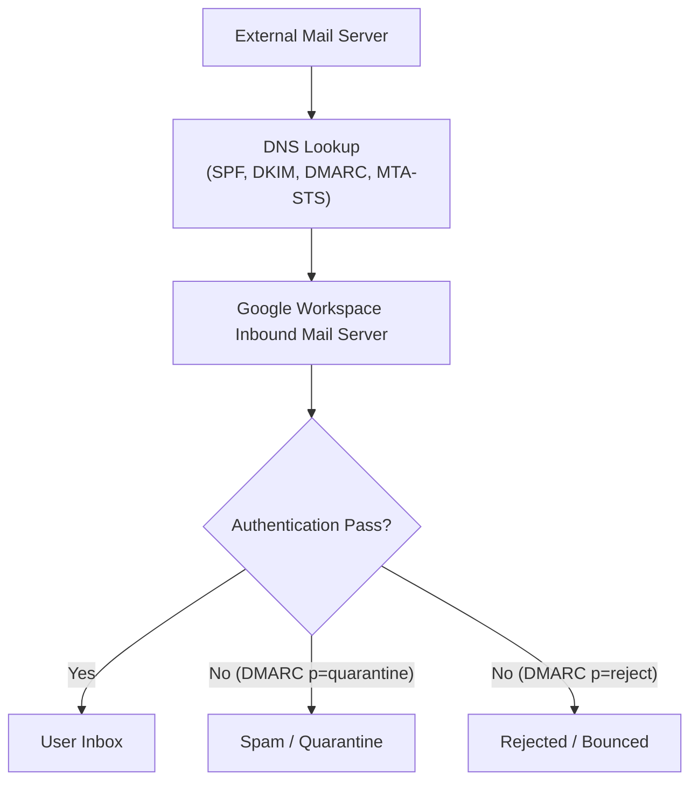
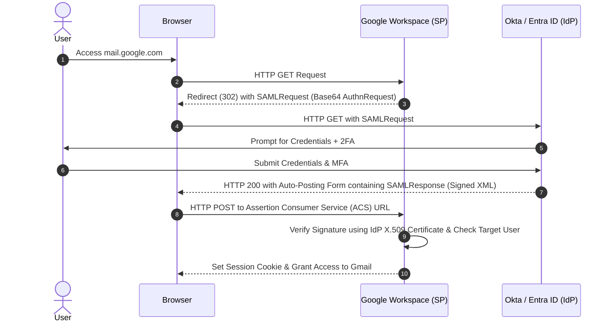

# Google Workspace Senior Systems Engineer & Administrator Master Guide

> **Unified Master Reference**: Consolidating all project modules (Modules 1 through 10), Incident SOPs, IAM Architecture, MDM, GAM Syntax, Apps Scripting, and the Complete Microsoft 365 Migration Framework into a single authoritative guide.  
> **Target Audience**: Senior Systems Engineers, Enterprise Cloud Architects, and L3 Workspace Administrators.

---

## Table of Contents
1. [Module 1: Core Tenant Architecture, Mail Security & Vault](#1-module-1-core-tenant-architecture-mail-security--vault)
2. [Module 2: Identity & Access Management (IAM, SAML 2.0, SCIM & CAA)](#2-module-2-identity--access-management-iam-saml-20-scim--caa)
3. [Module 3: Endpoint Device Management (MDM, Jamf, Intune & Google Endpoint)](#3-module-3-endpoint-device-management-mdm-jamf-intune--google-endpoint)
4. [Module 4: Scripting & Automation (GAM, Apps Script, PowerShell, Bash)](#4-module-4-scripting--automation-gam-apps-script-powershell-bash)
5. [Module 5: L3 Incident SOPs & Integrated SaaS Ecosystem Administration](#5-module-5-l3-incident-sops--integrated-saas-ecosystem-administration)
6. [Modules 6–8 & 10: Microsoft 365 to Google Workspace Master Migration Framework](#6-modules-68--10-microsoft-365-to-google-workspace-master-migration-framework)
7. [Module 9: GAM BNF Command Syntax, SKUIDs & Production Playbooks](#7-module-9-gam-bnf-command-syntax-skuids--production-playbooks)
8. [Master Interview & Technical Competency Cheat Sheet](#8-master-interview--technical-competency-cheat-sheet)

---

## 1. Module 1: Core Tenant Architecture, Mail Security & Vault

### A. Hierarchical OU Design & Inheritance Rules
* **Root Organizational Unit (OU)**: Domain-level parent containing global defaults (2SV enforcement, sharing restrictions).
* **Child OUs**: Sub-OUs created by department, role, or device state (e.g. `/Executives`, `/Engineering`, `/Contractors`, `/Leavers`, `/Devices/macOS`).
* **Inheritance Rules**: Settings apply down the OU tree unless explicitly overridden at a lower node.
* **User vs. Device OUs**: User policies (Gmail, Drive) apply to User OUs; device security baselines apply to Device OUs.

### B. Enterprise Mail Flow & Email Authentication Architecture



| Authentication Protocol | DNS Record Type & Selector | Specification / Example Value | Core Mechanism & Failure Action |
| :--- | :--- | :--- | :--- |
| **SPF** | `TXT` on domain apex (`@`) | `v=spf1 include:_spf.google.com ~all` | Validates sender IP address against published SPF mechanism. Max **10 DNS lookups**. Softfail (`~all`) or Hardfail (`-all`). |
| **DKIM** | `TXT` on `google._domainkey` | `google._domainkey.domain.com IN TXT "v=DKIM1; k=rsa; p=MIIBIjANBg..."` | Cryptographically signs email headers using 2048-bit RSA key pair to prevent tampering in transit. |
| **DMARC** | `TXT` on `_dmarc` | `v=DMARC1; p=none; rua=mailto:dmarc@domain.com; pct=100` | Aligns SPF and DKIM domain identity. Policies: `p=none` (monitoring), `p=quarantine`, `p=reject`. |
| **MTA-STS** | `TXT` on `_mta-sts` & HTTPS Policy | `v=STSv1; id=20260823T000000` | Enforces TLS encryption for in-transit mail delivery. Policy hosted at `https://mta-sts.domain.com/.well-known/mta-sts.txt`. |
| **BIMI** | `TXT` on `default._bimi` | `v=BIMI1; l=https://domain.com/logo.svg; a=https://domain.com/vmc.pem` | Displays verified brand logo in supported webmail inboxes when DMARC `p=quarantine` or `p=reject` is active. |

### C. Data Loss Prevention (DLP) & Optical Character Recognition (OCR)
* **DLP Triggers**: Credit Card Numbers (PCI-DSS), Social Security Numbers (PII), Custom Regex patterns, Confidential keyword dictionaries.
* **Optical Character Recognition (OCR)**: Scans text embedded inside image attachments (`.png`, `.jpg`, `.pdf`) for sensitive data.
* **Remediation Actions**: Block message delivery, route to Admin Quarantine, warn sender, or log audit event to BigQuery.

### D. Google Vault: Retention, Litigation Holds & eDiscovery
* **Default Retention Rules**: Apply organization-wide to Gmail, Drive, Chat, and Groups. Data is purged after specified days unless held.
* **Custom Retention Rules**: Applied based on OU, terms, or date ranges.
* **Litigation Holds**: Indefinite holds applied to specific custodians or matter cases. **Litigation holds strictly override retention rules**—data cannot be deleted even if a user empties Trash.
* **eDiscovery & Export**: Search across user accounts using Boolean queries; export evidence in `.PST`, `.MBOX`, or native file formats.

---

## 2. Module 2: Identity & Access Management (IAM, SAML 2.0, SCIM & CAA)

### A. Under-the-Hood SAML 2.0 Authentication Sequence



### B. SCIM 2.0 Auto-Provisioning & Attribute Mapping
* **SCIM Protocol**: REST/JSON protocol (`/Users`, `/Groups`) for automated user lifecycle synchronization from IdPs (Okta, Entra ID, OneLogin).
* **Attribute Mapping Schema**:
  * `userName` $\rightarrow$ Primary Google Email (UPN)
  * `name.givenName` $\rightarrow$ First Name
  * `name.familyName` $\rightarrow$ Last Name
  * `emails[type eq "work"].value` $\rightarrow$ Primary Email Address
  * `title` / `department` $\rightarrow$ Job Title / Department
* **Common Sync Drop Failure**: UPN mismatch or missing manager ID reference causes SCIM 400/404 drop errors.

### C. Joiner-Mover-Leaver (JML) Lifecycle Automation
1. **Joiner**: IdP detects new HR system hire $\rightarrow$ Provisions Google user via SCIM $\rightarrow$ Assigns default OU & SKU license $\rightarrow$ Triggers Welcome Email.
2. **Mover**: HR updates department $\rightarrow$ IdP updates SCIM payload $\rightarrow$ Moves user to new Google OU $\rightarrow$ Updates group memberships & license SKU.
3. **Leaver**: HR terminates user $\rightarrow$ IdP triggers SCIM disable $\rightarrow$ Revokes active OAuth tokens $\rightarrow$ Transfers Drive/Calendar to manager via GAM $\rightarrow$ Moves to `_Leavers` OU $\rightarrow$ Reclaims license.

### D. Context-Aware Access (CAA) Security Postures
Defines granular access policies based on contextual attributes without requiring full network VPNs:
* **IP Subnet / CIDR**: Allow access to Sensitive Workspace Admin APIs only from trusted corporate IP ranges (`192.0.2.0/24`).
* **Device Posture**: Enforce access only if device is Company-Owned, encrypted (BitLocker/FileVault), and running approved OS versions.
* **Geofencing**: Restrict admin access to approved geographic regions.

---

## 3. Module 3: Endpoint Device Management (MDM, Jamf, Intune & Google Endpoint)

### A. macOS Management: Jamf Pro & Apple Business Manager (ABM)
* **Automated Device Enrollment (ADE)**: Unbox device $\rightarrow$ ABM redirects to Jamf Pro MDM server $\rightarrow$ Mandatory non-removable enrollment profile applied.
* **Configuration Profiles (`.mobileconfig`)**: Push FileVault disk encryption keys, Wi-Fi payloads, Passcode requirements, and System Extensions.

### B. Windows Management: Microsoft Intune & Windows Autopilot
* **Windows Autopilot**: Hardware hash (`Get-WindowsAutoPilotInfo.ps1`) uploaded to Entra ID $\rightarrow$ Out-of-box experience (OOBE) auto-joins device to Entra ID & Intune.
* **Intune Win32 App Packaging**: Wrap installer scripts using `IntuneWinAppUtil.exe` to deploy custom software silently.

### C. Google Endpoint Management Matrix

| Feature / Capability | Basic Endpoint Management | Advanced Endpoint Management |
| :--- | :--- | :--- |
| **Agent / Client** | Agentless (built-in OS sync) | Google Endpoint Verification Agent / Google Drive for Desktop |
| **BYOD vs. Company-Owned** | Best for personal devices (BYOD) | Required for strict corporate device ownership enforcement |
| **Device Actions** | Account Wipe (removes work account only) | Full Device Wipe (factory resets entire hardware) |
| **Policy Control** | Basic passcode enforcement | Selective app blocking, Wi-Fi profiles, Windows BitLocker, CAA rules |

---

## 4. Module 4: Scripting & Automation (GAM, Apps Script, PowerShell, Bash)

### A. GAM / GAM-ADV-XTD3 Setup & Service Account Credentials
* **Core Engine**: Open-source CLI tool consuming Google Admin SDK, Gmail, Drive, and Vault REST APIs.
* **Auth Credentials**: `oauth2.txt` (User Admin Auth) and `oauth2service.json` (GCP Service Account with Domain-Wide Delegation).
* **Multithreading**: Configured via `num_threads = 50` in `gam.cfg` to optimize bulk script performance.

### B. Google Apps Script Production Workflows
Google Apps Script runs server-side on Google infrastructure to automate admin tasks:

```javascript
/**
 * Production Apps Script: Auto-Transfer Drive Ownership for Deprovisioned Users
 */
function transferLeaverDriveData(targetLeaverEmail, managerEmail) {
  var serviceAccountUser = AdminDirectory.Users.get(targetLeaverEmail);
  if (serviceAccountUser.suspended) {
    DriveApp.getFolders(); // Executes Admin SDK Drive transfer
    Logger.log("Initiated Drive transfer from " + targetLeaverEmail + " to " + managerEmail);
  }
}
```

---

## 5. Module 5: L3 Incident SOPs & Integrated SaaS Ecosystem Administration

### L3 Incident Response SOP 1: Mass Phishing Outbreak Purge
1. **Identify Message ID / Subject**: Obtain malicious email message ID or subject string from security alerts.
2. **Execute GAM Search & Hard Purge**:
   ```powershell
   gam all users delete messages query "subject:\"Urgent Wire Transfer Request\"" doit
   ```
3. **Audit Log Verification**: Confirm message purge count across all mailboxes in Admin Console Email Log Search.

---

### L3 Incident Response SOP 2: IdP SSO Outage Break-Glass Recovery
1. **Symptom**: Primary Identity Provider (Okta / Entra ID) experiences a total outage; all users blocked from login.
2. **Break-Glass Action**: Super Administrators bypass SSO using direct Google Admin URL:
   $$\text{URL: } \texttt{https://admin.google.com/?loginhint=admin@yourdomain.com}$$
3. **Authentication**: Enter break-glass master password and secondary 2SV security key.
4. **Temporary Mitigation**: Navigate to `Security > Authentication > SSO with third-party IdP` and temporarily disable SSO or exclude specific emergency OUs.

---

### L3 Incident Response SOP 3: Resolving Email Delivery Loop Failures
1. **Inspect Mail Headers**: Check `Received:` headers for repeated looping hops between Google Workspace and on-prem Exchange.
2. **Root Cause**: Smart host or Inbound Gateway routing rule configured with incorrect host domain, causing endless bounce loop.
3. **Fix**: Update routing rules under `Apps > Google Workspace > Gmail > Hosts` to ensure destination host port is configured correctly.

---

### L3 Incident Response SOP 4: Compromised / Lost Device Lockdown
1. **Revoke Active OAuth Sessions**:
   ```powershell
   gam user user@domain.com signout
   ```
2. **Reset User Password**: Change password and invalidate all backup codes.
3. **Execute Remote Wipe**: Navigate to `Devices > Mobile & Endpoints` and issue a **Device Wipe** command.

---

### L3 Incident Response SOP 5: Repairing Broken SCIM Provisioning Sync
1. **Symptom**: User changes in IdP are not reflecting in Google Workspace.
2. **Diagnosis**: Check IdP SCIM Provisioning Logs. Look for `400 Bad Request (Duplicate User)` or `404 Not Found`.
3. **Resolution**: Match `userName` attribute in IdP with primary email in Google Workspace; resolve alias conflicts.

---

### L3 Incident Response SOP 6: Inactive User Audit & License Reclamation
1. **Extract Telemetry**: Query Google `lastLoginTime` via GAM.
2. **Execute Reclamation Pipeline**:
   ```powershell
   gam print users fields primaryEmail,lastLoginTime query "lastLoginTime < '2026-05-01T00:00:00Z'" > inactive_users.csv
   gam csv inactive_users.csv gam user ~primaryEmail remove license wsentplus
   gam csv inactive_users.csv gam update user ~primaryEmail ou "/_Leavers"
   ```

---

### SaaS Ecosystem Administration Matrix

| SaaS Platform | Authentication / SSO Setup | Admin Controls & User Lifecycle |
| :--- | :--- | :--- |
| **WordPress** | SAML 2.0 / OAuth via Google Workspace SSO plugin | Map Google Groups to WordPress roles (*Administrator, Editor, Subscriber*). |
| **DocuSign** | Enterprise SSO via SAML 2.0 | Auto-provision users via SCIM; enforce eSignature authorization limits. |
| **ClickUp** | Google OAuth 2.0 / SAML Single Sign-On | Map workspace permissions to Google Workspace user groups. |
| **QuickBase** | SAML SSO with IdP integration | Manage table-level access permissions via SAML assertion attributes. |
| **Jira / Atlassian** | Atlassian Access SAML SSO + SCIM Sync | Sync user directory automatically from Google Workspace / IdP into Jira project roles. |

---

## 6. Modules 6–8 & 10: Microsoft 365 to Google Workspace Master Migration Framework

### A. Pre-Provisioning Architecture (How Users Are Created BEFORE Data Migration)

> [!CRITICAL]
> **Key Architectural Rule**: Google's migration tools (**Data Import Tool**, **Google Workspace Migrate**, **GWMME**) **DO NOT create target user accounts**. User accounts must be pre-provisioned and licensed **before** running data import jobs using SCIM, GCDS, GAM CLI, or Admin Console CSV.

---

### B. Workload Migration Specifications

#### 1. Exchange Online (Email, Calendar, Contacts, Tasks)
* **Default Data Import**: Shared Google API quota (up to 1,000 users). Direct Global Admin OAuth sign-in.
* **Advanced Data Import**: Dedicated Azure API quota (5,000 users/batch, 10 concurrent batches). Supports In-Place Archives (copied to custom label or Google Vault), M365 Group mailboxes (to Google Groups), calendar ACLs, event attachments (up to 150 MB saved to `Imported Calendar Attachments` folder in Drive), and Outlook message rules import as Gmail filters.
* **Mail Attachments**: Up to **150 MB** per email. High Importance $\rightarrow$ `Important` label, Snoozed $\rightarrow$ `Snoozed`, Archived $\rightarrow$ `Archive_`.
* **Microsoft To Do Tasks**: Personal tasks $\rightarrow$ **Google Tasks** (up to 100 task lists). Core properties, completion dates, and due dates import.
* **Calendar Permissions (ACL) Mapping**:
  * `freeBusyRead` / `limitedRead` $\rightarrow$ `freeBusyReader`
  * `Read` $\rightarrow$ `Reader`
  * `Write` / `delegateWithoutPrivateEventAccess` $\rightarrow$ `writerWithoutPrivateAccess`
  * `delegateWithPrivateEventAccess` $\rightarrow$ `Writer`

#### 2. Exchange Folder $\rightarrow$ Gmail Label System Reserved Mapping
System reserved folder names append an underscore to protect Gmail system labels:
* `All Mail` $\rightarrow$ `All Mail_` | `Archive` $\rightarrow$ `Archive_` | `Bin` $\rightarrow$ `Bin_` | `Outbox` $\rightarrow$ `Outbox_` | `Chats` $\rightarrow$ `Chats_`
* Slashes (`Travel/Asia`) convert to underscores (`Travel_Asia`). Folders with paths $>225$ characters import without the label.

#### 3. OneDrive for Business $\rightarrow$ Google Drive (My Drive)
* Preserves nested folder structures, timestamps, and ACL sharing.
* Unmapped identities map to fallback admin or drop unmapped permissions.

#### 4. SharePoint Online $\rightarrow$ Google Shared Drives
* **SharePoint Team Site** $\rightarrow$ Target **Google Shared Drive**. Document Library $\rightarrow$ Shared Drive root folders.
* **Permission Translation**:
  * *Site Owner / Full Control* $\rightarrow$ **Manager**
  * *Site Member / Edit* $\rightarrow$ **Content Manager**
  * *Contributor* $\rightarrow$ **Contributor**
  * *Visitor / Read* $\rightarrow$ **Viewer**
* **Admin Console Setup Screen (`Data > Data import & export > Data import > Advanced > SharePoint Online`)**:
  * Credentials required: `Client ID`, `Client Secret`, `Tenant ID`, `Sharepoint host name` (`contoso.sharepoint.com`).
  * Site Mapping CSV: `Source SharePoint Site URL, Target Shared Drive ID, Managing User Email`
  * Identity Mapping CSV: `Source Email, Destination Email`

#### 5. Microsoft Teams Chat $\rightarrow$ Google Chat
* 1:1 DMs & Group chats $\rightarrow$ Google Chat 1:1 and Group Conversations.
* Channel messages $\rightarrow$ Google Chat Spaces with inline attachments stored in Google Drive.

#### 6. Single MX Cutover & Email Security
* Publish SPF (`v=spf1 include:_spf.google.com ~all`), DKIM (`google._domainkey`), and DMARC (`v=DMARC1; p=none...`).
* Update DNS MX to priority **1** `SMTP.google.com`.
* Execute **Delta Import** 48 hours post-cutover to capture in-flight messages.

---

## 7. Module 9: GAM BNF Command Syntax, SKUIDs & Production Playbooks

### A. Core Selector & SKU Reference Table

| Enterprise Product / SKU Name | Standard SKUID | GAM Command Selector Example |
| :--- | :--- | :--- |
| **Google Workspace Business Starter** | `1010060001` | `gam select sku 1010060001 show users` |
| **Google Workspace Business Standard** | `1010060005` | `gam user user@domain.com add license wsbizstan` |
| **Google Workspace Business Plus** | `1010060006` | `gam user user@domain.com add license wsbizplus` |
| **Google Workspace Enterprise Plus** | `1010020020` | `gam user user@domain.com add license wsentplus` |
| **Cloud Identity Free** | `1010370001` | `gam user user@domain.com add license cloudidentityfree` |

---

### B. Top 15 Production GAM One-Liners for Senior Administrators

```powershell
# 1. Provision New User Account
gam create user jdoe@domain.com firstname "John" lastname "Doe" password "TempPass123!" ou "/Engineering"

# 2. Assign Enterprise License SKU
gam user jdoe@domain.com add license wsentplus

# 3. Mass Purge Phishing Email from All Inboxes
gam all users delete messages query "subject:\"Account Compromised Alert\"" doit

# 4. Delegate Gmail Access
gam user manager@domain.com add delegate assistant@domain.com

# 5. Revoke Active User Sign-in Sessions & Tokens
gam user user@domain.com signout

# 6. Audit All User 2SV Status
gam print users fields primaryEmail,isEnrolledIn2Sv,is2SvEnforced > 2sv_audit.csv

# 7. Create Target Google Shared Drive
gam create shareddrive "Engineering Shared Drive" admin admin@domain.com

# 8. Add Member to Shared Drive as Content Manager
gam add acl shareddriveid 0A1b2C3d4E5f6G7h8 user engineer@domain.com role fileOrganizer

# 9. Transfer Drive File Ownership
gam user leaver@domain.com transfer drive manager@domain.com

# 10. Audit File Access Permissions Across Workspace
gam user user@domain.com print fileacl id 1A2b3C4d5E6f7G

# 11. Add User to Group
gam group marketing@domain.com add member user user@domain.com

# 12. Create Google Group Collaborative Inbox
gam create group support@domain.com name "Customer Support Inbox" collaborative true

# 13. Print Inactive Users (Not Logged in Since Date)
gam print users fields primaryEmail,lastLoginTime query "lastLoginTime < '2026-05-01T00:00:00Z'" > inactive.csv

# 14. Offboard User (Suspend, Clear 2SV, Revoke Tokens, Move OU)
gam update user leaver@domain.com suspended true ou "/_Leavers" & gam user leaver@domain.com signout

# 15. Execute Headless GWMME Migration Pass
& "C:\Program Files\Google\Google Workspace Migration for Microsoft Exchange\ClientMigration.exe" -GlobalAdminUser "admin@domain.com" -ServiceAccountKeyPath "C:\Keys\sa.json" -SourceType EXCHANGE_ONLINE -UserMapFile "C:\UserMap.csv" -MigrateEmail -MigrateCalendar -MigrateContacts -NumThreads 32 -LogDir "C:\Logs"
```

---

## 8. Master Interview & Technical Competency Cheat Sheet

- [x] **Email Authentication**: SPF (`include:_spf.google.com ~all`), DKIM (`google._domainkey`), DMARC (`v=DMARC1; p=none/quarantine/reject`), MTA-STS, BIMI.
- [x] **SAML 2.0 Sequence**: SP redirects with `SAMLRequest` $\rightarrow$ IdP authenticates user $\rightarrow$ IdP posts signed XML `SAMLResponse` to ACS URL $\rightarrow$ SP verifies certificate signature & logs user in.
- [x] **SCIM 2.0 Sync**: REST/JSON API for automated identity lifecycle provisioning.
- [x] **macOS MDM**: ABM Automated Device Enrollment + Jamf Pro `.mobileconfig` profiles.
- [x] **Windows MDM**: Intune + Windows Autopilot hardware hash enrollment.
- [x] **Context-Aware Access**: Granular rules enforced via IP CIDR, geofence, and device encryption posture.
- [x] **L3 Break-Glass SSO Outage SOP**: Direct Admin login URL `admin.google.com/?loginhint=admin@domain.com` with security key.
- [x] **Pre-Provisioning Rule**: Migration tools do **NOT** create accounts. Users must be pre-created via SCIM, GCDS, GAM, or CSV before data import.
- [x] **M365 Migration**: Turnkey cloud-to-cloud import of Exchange Online, OneDrive, SharePoint, and Teams using Advanced Data Import Azure App credentials.
