# Google Workspace Complete Senior Systems Engineer & Administrator Master Handbook

> **Unified Unabridged Master Handbook**: Consolidating every single chapter, concept, architectural diagram, technical workflow, incident SOP, scripting playbook, GAM BNF command, and migration guide across all 10 project modules into a single, complete reference file.  
> **Target Audience**: Senior Systems Engineers, Enterprise Cloud Architects, and L3 Workspace Administrators.

---

## Table of Contents
1. [Chapter 1: Google Workspace Engineering Deep Dive (Module 1)](#1-chapter-1-google-workspace-engineering-deep-dive-module-1)
2. [Chapter 2: Identity & Access Management (IAM) (Module 2)](#2-chapter-2-identity--access-management-iam-module-2)
3. [Chapter 3: Endpoint Device Management (MDM) (Module 3)](#3-chapter-3-endpoint-device-management-mdm-module-3)
4. [Chapter 4: Scripting & Automation (Module 4)](#4-chapter-4-scripting--automation-module-4)
5. [Chapter 5: L3 Scenarios & Integrated SaaS Administration (Module 5)](#5-chapter-5-l3-scenarios--integrated-saas-administration-module-5)
6. [Chapter 6: SharePoint Online to Google Drive Migration (Module 6)](#6-chapter-6-sharepoint-online-to-google-drive-migration-module-6)
7. [Chapter 7: Exchange Online Email, Contacts & Calendars Migration (Module 7)](#7-chapter-7-exchange-online-email-contacts--calendars-migration-module-7)
8. [Chapter 8: OneDrive to Google Drive Migration (Module 8)](#8-chapter-8-onedrive-to-google-drive-migration-module-8)
9. [Chapter 9: GAM Advanced Command Reference & Interview Cheat Sheet (Module 9)](#9-chapter-9-gam-advanced-command-reference--interview-cheat-sheet-module-9)
10. [Chapter 10: Official Google Workspace Migration Knowledge Base (Module 10)](#10-chapter-10-official-google-workspace-migration-knowledge-base-module-10)
11. [Chapter 11: Master Migration Guide & Senior Systems Engineer Interview Mastery](#11-chapter-11-master-migration-guide--senior-systems-engineer-interview-mastery)
12. [Chapter 12: Professional Google Workspace Administrator Certification & Top 55 Q&A Handbook (Module 11)](#12-chapter-12-professional-google-workspace-administrator-certification--top-55-qa-handbook-module-11)
13. [Chapter 13: G Suite & Google Workspace Core Operational Interview Handbook (Module 12)](#13-chapter-13-g-suite--google-workspace-core-operational-interview-handbook-module-12)
14. [Chapter 14: Google Workspace Developer APIs, Python SDKs & Custom Add-ons Handbook (Module 13)](#14-chapter-14-google-workspace-developer-apis-python-sdks--custom-add-ons-handbook-module-13)
15. [Chapter 15: G Suite & Google Workspace Senior Analyst Hiring, Evaluation & Interview Rubric (Module 14)](#15-chapter-15-g-suite--google-workspace-senior-analyst-hiring-evaluation--interview-rubric-module-14)
16. [Chapter 16: Google Workspace Master 95 Platform Owner & Lead Administrator Interview Handbook (Module 15)](#16-chapter-16-google-workspace-master-95-platform-owner--lead-administrator-interview-handbook-module-15)
17. [Chapter 17: Google Workspace Data Import Tool — Default vs. Advanced Data Migration Definitive Guide (Module 16)](#17-chapter-17-google-workspace-data-import-tool--default-vs-advanced-data-migration-definitive-guide-module-16)

---

## 1. Chapter 1: Google Workspace Engineering Deep Dive (Module 1)

This module covers core administrative architecture, email security standards, compliance, and enterprise data migration frameworks at a protocol and architectural level.

### 1. Hierarchical OU Design and Policy Inheritance

Organizational Units (OUs) in Google Workspace control which settings, apps, and services are enabled for specific subsets of users.

#### Architectural Best Practices
* **Logical vs. Geographical Hierarchy**: Group users by functional policies (e.g., Security Level, Compliance Requirements) rather than geographic office location alone.
* **Nest for Overrides**: Place settings at the Root OU that apply to 95% of the company, and create child OUs only for exceptions.
* **Inheritance vs. Overrides**: By default, child OUs inherit settings from their parent. Overriding a setting breaks the link. If you change the parent setting, it will *not* propagate to overridden child OUs.
* **Service States**: Services can be "ON for everyone", "OFF for everyone", or "ON/OFF for specific OUs".
* **Security Groups as an Alternative**: For settings that don't support OU-level scoping (or when you need cross-functional policies), use Security Groups to target policies (e.g., enabling YouTube access for a specific cross-functional marketing team).

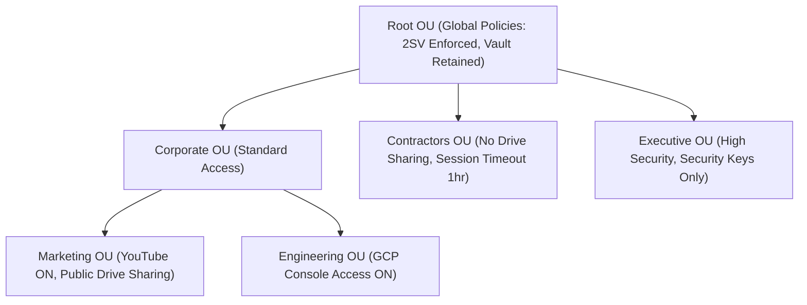

---

### 2. Advanced Mail Flow Infrastructure (DNS & Email Security)

Securing email flow requires configuring and troubleshooting SPF, DKIM, DMARC, MTA-STS, and BIMI.

#### A. Sender Policy Framework (SPF)
SPF is a TXT record in your DNS zone that lists the authorized IP addresses/hostnames allowed to send mail from your domain.

* **Syntax Breakdown**:
  `v=spf1 include:_spf.google.com include:sendgrid.net ip4:192.0.2.0/24 ~all`
  * `v=spf1`: Identifies the record as SPF version 1.
  * `include:_spf.google.com`: Authorizes Google's outbound mail servers.
  * `include:sendgrid.net`: Authorizes SendGrid outbound servers.
  * `ip4:192.0.2.0/24`: Authorizes a specific IPv4 CIDR range.
  * `~all` (Soft Fail): Mail is accepted but marked (often flagged as spam if other checks fail).
  * `-all` (Hard Fail): Receiving servers are instructed to reject emails that do not match.
* **The 10 DNS Lookup Limit**: The SPF specification (RFC 7208) limits the number of DNS-based lookup mechanisms (`include`, `a`, `mx`, `ptr`, `exists`, and `redirect`) to a maximum of **10** to prevent Denial of Service (DoS) attacks on DNS infrastructure.
  * *Nested Lookups*: If you include a domain that includes another domain, all count toward the 10-lookup limit. Exceeding this triggers a `PermError` on the receiving mail server, failing authentication.
  * *Google Workspace late-2025 Update*: In late 2025, Google updated the primary SPF record (`_spf.google.com`) to be fully flattened. Previously, including it consumed 4 DNS lookups (the parent record + 3 nested includes). It now resolves as **1 DNS lookup**, freeing up lookup budgets for other third-party sending platforms.
  * *Mitigation Strategies for the Limit*:
    1. **SPF Flattening (Manual)**: Replace domain `include` statements with their current static IP ranges (`ip4`/`ip6`). *Risk*: Vendors modify their IP ranges regularly; manual records will silently break mail authentication.
    2. **SPF Flattening (Automated)**: Use dynamic SPF tools (e.g., Valimail, Red Sift, Sendmarc) that dynamically resolve includes into a single query chain at request time.
    3. **Subdomain Delegation**: Delegate marketing or transactional email platforms to send from a sub-domain (e.g., `marketing.yourdomain.com`), giving that subdomain its own independent 10-lookup limit.
    4. **Cleanup**: Periodically audit and remove stale `include` values. Never deploy multiple SPF records on a single domain.

#### B. DomainKeys Identified Mail (DKIM)
DKIM adds a cryptographic signature to email headers, verified against a public key published in the domain's DNS.

* **Under the Hood**:
  1. The sending mail server hashes specific headers and the body of the message.
  2. The server encrypts this hash using the domain's private key.
  3. The signature is inserted into the email header as `DKIM-Signature`.
  4. The receiving server queries DNS for the TXT record at `[selector]._domainkey.[domain]` to retrieve the public key.
  5. The receiving server decrypts the signature and compares the hash. If they match, the email is verified authentic and unaltered in transit.
* **Key Length**: Always use **2048-bit** keys unless your DNS provider does not support records longer than 255 characters (in which case you fall back to 1024-bit).
* **DKIM Key Rotation SOP**:
  1. Generate a new DKIM key in the Google Workspace Admin Console using a new selector (e.g., `google2026`).
  2. Publish the new public key TXT record in your DNS zone.
  3. Wait for DNS propagation (typically 24–48 hours depending on TTL).
  4. In the Admin Console, click "Start Authentication" for the new selector.
  5. Verify header analysis of outbound emails to ensure signatures are active.
  6. Deprecate the old DNS TXT record (e.g., `google`) after 7 days.

#### C. Domain-based Message Authentication, Reporting, and Conformance (DMARC)
DMARC ties SPF and DKIM together. It dictates what the receiver should do if an email fails authentication.

* **DMARC Alignment**:
  * *SPF Alignment*: The domain in the `Return-Path` header (used for bounces) must match the domain in the `From` header.
  * *DKIM Alignment*: The domain in the `d=` tag of the `DKIM-Signature` header must match the domain in the `From` header.
  * *Alignment Modes*: Can be `r` (relaxed - subdomains allowed) or `s` (strict - exact domain match required).
* **Policy Types (`p=`)**:
  * `none`: Monitor traffic and send reports, but take no action on failed emails.
  * `quarantine`: Move failed emails to the spam/junk folder.
  * `reject`: Block the email entirely at the gateway level.
* **Syntax Breakdown**:
  `v=DMARC1; p=reject; pct=100; rua=mailto:dmarc-rua@example.com; ruf=mailto:dmarc-ruf@example.com; adkim=r; aspf=r`
  * `pct=100`: Apply the policy to 100% of outbound messages.
  * `rua`: Destination for aggregate XML reports (sent daily).
  * `ruf`: Destination for forensic/failure reports (sent in real-time).
* **DMARC Rollout Strategy**:
  ```mermaid
  graph LR
      None["p=none (Audit phase, analyze reports for 2-4 weeks)"] --> Quarantine["p=quarantine; pct=10 (Gradual ramp up to pct=100)"]
      Quarantine --> Reject["p=reject; pct=100 (Full enforcement)"]
  ```

#### D. MTA-STS and BIMI
* **MTA-STS (Strict Transport Security)**: Forces encrypted TLS connections for inbound emails. If a TLS connection cannot be established, the sending server drops the email rather than sending it in cleartext.
  * Requires publishing a policy file at `https://mta-sts.example.com/.well-known/mta-sts.txt` and a DNS TXT record `_mta-sts.example.com`.
* **BIMI (Brand Indicators for Message Identification)**: Displays the company logo in the user's inbox next to authenticated emails.
  * Requires `p=reject` at 100%, a Verified Mark Certificate (VMC) from an authorized Certificate Authority, and an SVG logo formatted to BIMI specifications.

---

### 3. Data Protection, Compliance, and Google Vault

#### A. Data Loss Prevention (DLP)
DLP rules prevent users from sharing sensitive data (credit cards, SSNs, source code, credentials) outside the organization.

* **Detection Engines**:
  * **Predefined Detectors**: Pre-built algorithms for global identifiers (e.g., credit card numbers, HIPAA indicators, passports).
  * **Regular Expressions (Regex)**: Custom patterns for proprietary identifiers (e.g., employee IDs formatted as `EMP-\d{5}-[A-Z]{2}`).
  * **Optical Character Recognition (OCR)**: Scans text inside images (PNG, JPEG, PDF) attached to emails or stored in Google Drive.
* **Rule Actions**:
  * *Block sharing*: Stop the user from sharing the document or sending the email.
  * *Warn user*: Display a dialog warning the user before allowing them to share.
  * *Audit*: Log the action silently for administrator review.

#### B. Google Vault (eDiscovery & Archiving)
Google Vault is an information governance and eDiscovery tool for Google Workspace. It is **not** a traditional backup tool, but rather a compliance and legal archiving tool.

| Feature | Retention Rules | Litigation Holds |
| :--- | :--- | :--- |
| **Purpose** | Automate data lifecycle (keep for X years, then delete). | Preserve data indefinitely for legal discovery. |
| **Scope** | Can target OUs, specific dates, or all accounts. | Can target specific accounts, OUs, or search queries. |
| **Priority** | Overridden by Litigation Holds. | Takes absolute precedence over retention rules. |
| **User Visibility**| Invisible to the user. | Invisible to the user. |

##### Vault Precedence Hierarchy
1. **Priority 1: Litigation Holds (Highest)**: Holds override all retention rules. If data is subject to a litigation hold, it cannot be purged.
2. **Priority 2: Custom Retention Rules (Medium)**: Custom rules override default retention rules. If a user is subject to multiple conflicting custom retention rules, **the rule with the longest retention period always wins**.
3. **Priority 3: Default Retention Rules (Lowest)**: Acts as a global fallback policy for the domain.

> [!WARNING]
> **Irreversible Purging**: When a retention rule is configured to "Purge" expired data, the system permanently deletes the data from all active and backup servers once the duration ends (provided no holds are active). Once purged, the data is unrecoverable.

* **Vault Export/eDiscovery Workflow**:
  1. Create a **Matter** in Vault.
  2. Define a **Search** query.
  3. Apply a **Litigation Hold** to relevant custodians.
  4. Review matching messages/files.
  5. **Export** results in PST, MBOX, or PDF formats.

---

### 4. Email Migration Frameworks & Coexistence

#### A. Mail Delivery & Routing Topologies

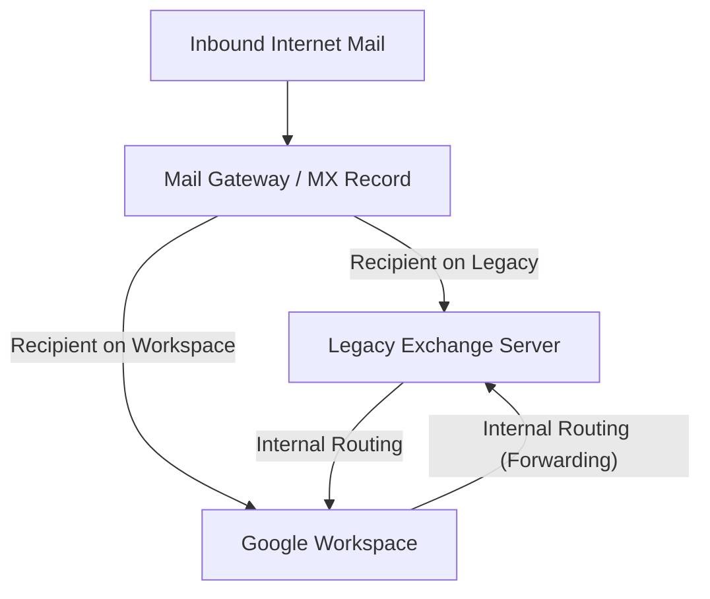

* **Dual Delivery**: Inbound mail hits primary gateway; gateway duplicates every message and delivers to both Google Workspace and Exchange.
* **Split Delivery**: Inbound mail hits primary gateway (e.g., Google Workspace MX). If recipient exists on Workspace, Google delivers it. If not, Google forwards to legacy server using secondary domain alias (`legacy.example.com`).

##### Setup Guide: Dual/Split Delivery in Admin Console
1. **Step 1: Configure Legacy Mail Host**: Navigate to **Apps > Google Workspace > Gmail > Hosts** $\rightarrow$ Add Route $\rightarrow$ Enter FQDN/IP of Exchange server, port `25`, TLS settings.
2. **Step 2: Create Routing Rule**: Navigate to **Apps > Google Workspace > Gmail > Routing** $\rightarrow$ Add Rule $\rightarrow$ Email messages to affect: Inbound $\rightarrow$ Change route to Host $\rightarrow$ Select Catch-all / Unrecognized recipients for Split Delivery.

#### B. Migration Tools Comparison
* **Data Migration Service (DMS)**: Built-in cloud-to-cloud tool in Admin Console. Best for M365/Exchange migrations for small-to-medium organizations.
* **Google Workspace Migration for Exchange (GWME)**: On-premises Windows Server utility. Connects via MAPI/IMAP for legacy Exchange servers.
* **Google Workspace Migration for Microsoft Outlook (GWMMO)**: Client-side app for individual PST file imports.
* **BitTitan MigrationWiz**: Premium third-party tool for complex tenant-to-tenant migrations.

---

## 2. Chapter 2: Identity & Access Management (IAM) (Module 2)

### 1. SAML 2.0 & OIDC Authentication Workflows

#### A. SAML 2.0 (Security Assertion Markup Language)
XML-based framework for exchanging authentication and authorization data between an **Identity Provider (IdP)** (e.g., Okta) and a **Service Provider (SP)** (e.g., Google Workspace).

##### Service-Provider-Initiated (SP-Init) Flow
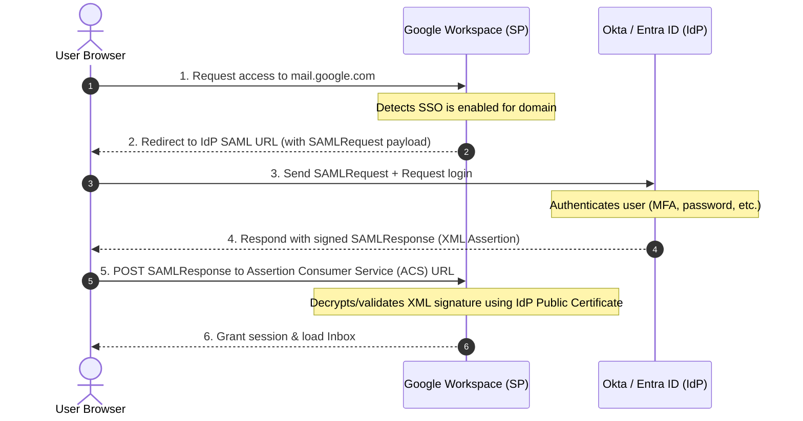

##### Key SAML Parameters:
* **Assertion Consumer Service (ACS) URL**: `https://www.google.com/a/yourdomain.com/acs`
* **Entity ID (Audience URI)**: `google.com/a/yourdomain.com`
* **NameID Format**: `urn:oasis:names:tc:SAML:1.1:nameid-format:emailAddress`
* **SAML Certificate Rotation**: SAML assertions are signed cryptographically. Always maintain a dual-certificate window during rotation to prevent lockout.

---

### 2. IdP Architectures: Okta, OneLogin, and Entra ID

* **OneLogin**: Connects via Admin SDK API for user creation, suspension, and SAML SSO federation.
* **Okta**: Uses AD Agent for on-prem AD sync; provisions users via Directory API; SSO enforcement requires **SSO bypass for super admins** to prevent lockout during Okta outages.
* **Microsoft Entra ID**: Enterprise App provisioning engine syncs users, contacts, and groups; Google Workspace trusts Entra ID as third-party IdP.

---

### 3. SCIM and Lifecycle Provisioning (JML)

SCIM (System for Cross-domain Identity Management) is a REST/JSON HTTP protocol (`/Users`, `/Groups`) for automated user provisioning.

#### Joiner-Mover-Leaver (JML) Automation Lifecycle
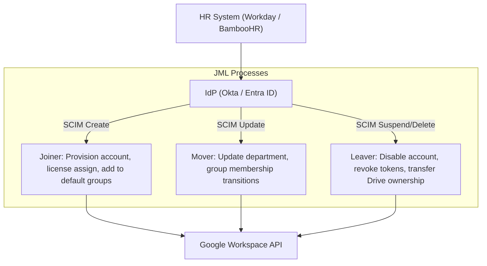

#### Common Attribute Mappings
| Target Google Field | Source IdP Attribute | Troubleshooting Note |
| :--- | :--- | :--- |
| `primaryEmail` | `user.mail` (or `user.userPrincipalName`) | Must be lowercase; check for domain suffix mismatch. |
| `name.givenName` | `user.firstName` | Null value errors cause sync failure. |
| `name.familyName` | `user.lastName` | Null value errors cause sync failure. |
| `organizations.department`| `user.department` | Used for dynamic group assignments. |

#### Debugging SCIM Failures
1. **Status Code 409 (Conflict)**: Account already exists in Google Workspace with that primary email or alias.
2. **Status Code 400 (Bad Request)**: Invalid schema configuration or null value in required field.
3. **OutOfScope Events**: User moved out of sync OU in AD/Okta; IdP triggers deprovisioning command.

---

### 4. Context-Aware Access (CAA) and Conditional Access

Context-Aware Access (CAA) defines granular access policies based on request context (device security posture, IP address, location).

#### Common Expression Language (CEL) Objects & Custom Examples:
* **Objects**: `origin` (`origin.ip`, `origin.region_code`), `device` (`device.os_type`, `device.encryption_status`, `device.chrome.versionAtLeast`), `request.auth`.
* **Managed Browser Requirement**:
  `device.chrome.management_state == ChromeManagementState.CHROME_MANAGEMENT_STATE_BROWSER_MANAGED && device.chrome.versionAtLeast("120.0.0.0")`
* **IP Geofencing**: `inIpRange(origin.ip, ["203.0.113.0/24", "198.51.100.12/32"])`
* **Auth Strength**: `request.auth.claims.crd_str.pwd == true && request.auth.claims.crd_str.hwk == true`

> [!TIP]
> **Monitor Mode**: Always deploy new Context-Aware Access policies in **Monitor Mode** first to audit log evaluation without blocking users.

---

## 3. Chapter 3: Endpoint Device Management (MDM) (Module 3)

### 1. Jamf Pro & Apple Business Manager (macOS Management)

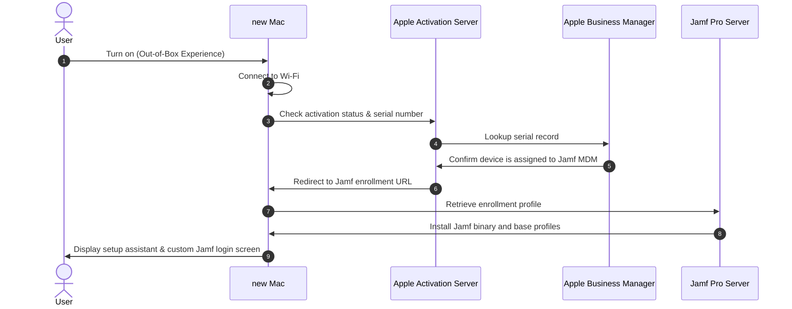

* **VPP Apps and Books**: Purchase app licenses in bulk; renew `.vpptoken` annually.
* **APNs Push Certificates**: Apple Push Notification service certificate allows Jamf to send remote commands (wipe, lock). Must be renewed yearly.
* **Configuration Profiles (`.mobileconfig`)**: XML files pushed via APNs for passcodes, Wi-Fi, FileVault, PPPC/TCC.
* **Policies (Jamf Binary)**: Shell scripts, package installation (`.pkg`, `.dmg`), running on `jamf` daemon check-in (15-min interval).
* **Extension Attribute Script (FileVault Check)**:
```bash
#!/bin/zsh
fv_status=$(fdesetup status)
if [[ "$fv_status" == *"FileVault is On."* ]]; then
    echo "<result>Enabled</result>"
else
    echo "<result>Disabled</result>"
fi
```

---

### 2. Microsoft Intune & Windows Autopilot (Windows Management)

* **Windows Autopilot**: Hardware hash (`Get-WindowsAutopilotInfo.ps1`) uploaded to tenant $\rightarrow$ OOBE auto-joins Entra ID & Intune $\rightarrow$ Enrollment Status Page (ESP) blocks desktop until security tools install.
* **Win32 Packaging**: Wrap installers using `IntuneWinAppUtil.exe` to deploy `.intunewin` packages with custom silent install/uninstall commands and registry/file detection rules.

---

### 3. Google Endpoint Management

* **Basic Management**: Agentless passcode enforcement and account wipes.
* **Advanced Management**:
  * **iOS Sync**: Apple Push Certificate + Google Device Policy app.
  * **Android Enterprise Work Profile**: Cryptographically separates work data (Drive, Gmail) from personal apps on BYOD devices.
  * **Company-Owned Zero-Touch**: Complete hardware control from factory reset state.

---

## 4. Chapter 4: Scripting & Automation (Module 4)

### 1. Google Apps Manager (GAM & GAM-ADV-XTD3)

* **Credentials**: `oauth2.txt` (Admin User OAuth) and `oauth2service.json` (GCP Service Account with Domain-Wide Delegation).
* **Entity Selectors**: `gam all users`, `gam ou_and_children "/Marketing"`, `gam group_users marketing@co.com`, `gam query "orgUnitPath='/Engineering' isSuspended=false"`.

#### Production GAM Command Suites

##### A. Provisioning & Licensing
```bash
gam csv onboarding.csv gam create user ~Email firstname ~FirstName lastname ~LastName password ~Password org ~OU changepassword on
gam csv onboarding.csv gam user ~Email add license ~SKU
```

##### B. Revoking OAuth Tokens & Session Revocation
```bash
gam user user@example.com delete token clientid 123456789
gam all users delete token clientid 9876543210-abcdef.apps.googleusercontent.com
```

##### C. Delegated Mailbox Access
```bash
gam user executive@example.com add delegate assistant@example.com
gam all users print delegates todrive
```

##### D. Bulk Phishing Email Purge
```bash
gam all users delete messages query "rfc822msgid:CA+123456789@mail.attacker.com" doit
```

##### E. Public Drive File Exposure Audit
```bash
gam all users print filelist query "visibility='anyoneWithLink' or visibility='anyoneCanFind'" fields id,name,owners,permissions todrive
```

##### F. Inactive User Audit, Leaver OU Transition & License Reclamation
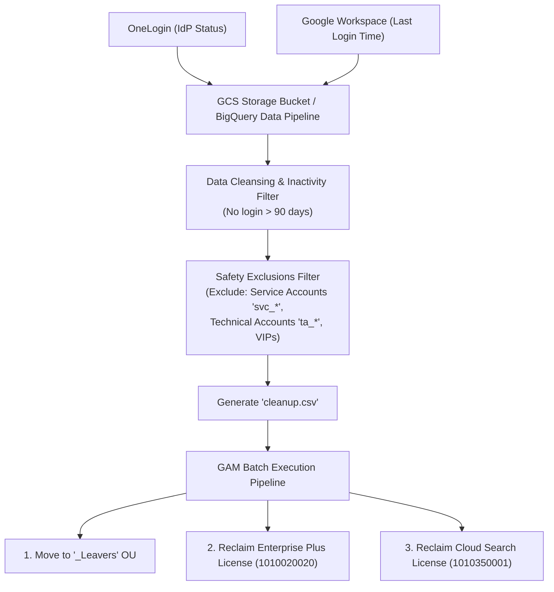
```bash
gam csv cleanup.csv gam update user ~email org "_Leavers" >> cleanupresults.csv
gam csv cleanup.csv gam user ~email delete license "1010020020" >> cleanupresults.csv
gam csv cleanup.csv gam user ~email delete license "1010350001" >> cleanupresults.csv
```

---

### 2. Google Apps Script Production Workflows

```javascript
/**
 * Production Apps Script: Offboard Employee
 */
function offboardEmployee(userEmail) {
  const targetEmail = userEmail || "departed.user@example.com";
  const managerEmail = "hr.records@example.com";
  try {
    const newPassword = Math.random().toString(36).substring(2, 15) + "!";
    const resource = { suspended: true, password: newPassword, changePasswordAtNextLogin: false, orgUnitPath: "/Offboarded_Users" };
    AdminDirectory.Users.update(resource, targetEmail);
    AdminDirectory.Users.signOut(targetEmail);
    const sheet = SpreadsheetApp.openById("SPREADSHEET_ID").getActiveSheet();
    sheet.appendRow([new Date(), targetEmail, "Suspended", "Password Reset", "Sessions Revoked"]);
  } catch (error) {
    MailApp.sendEmail(managerEmail, "ALERT: Offboarding Failed", error.message);
  }
}
```

---

### 3. Operating System Scripting

#### PowerShell BitLocker Verification Script
```powershell
$drive = Get-BitLockerVolume -MountPoint "C:"
if ($drive.VolumeStatus -eq "FullyEncrypted" -and $drive.ProtectionStatus -eq "On") {
    "BitLocker Verified: Active on C: drive at $(Get-Date)" | Out-File "C:\Windows\Temp\bitlocker_status.log"
    exit 0
} else {
    "WARNING: BitLocker is NOT active on C: drive" | Out-File "C:\Windows\Temp\bitlocker_status.log"
    exit 1
}
```

#### Bash Jamf Agent Recon Script
```bash
#!/bin/zsh
if [ ! -f /usr/local/bin/jamf ]; then exit 1; fi
check_in=$(/usr/local/bin/jamf checkJSSConnection)
if [[ "$check_in" == *"The JSS is available"* ]]; then
    /usr/local/bin/jamf recon
    /usr/local/bin/jamf policy
    exit 0
fi
```

---

## 5. Chapter 5: L3 Scenarios & Integrated SaaS Administration (Module 5)

### Incident Response Runbooks (SOPs 1–6)

#### SOP 1: Mass Phishing Outbreak Purge
```powershell
gam all users delete messages query "subject:\"Urgent HR Notice\"" doit
```
*Force password reset, signout sessions (`gam user ... signout`), revoke OAuth tokens, and block domain.*

#### SOP 2: IdP SSO Outage Break-Glass Recovery
*Access via direct URL: `https://admin.google.com/?loginhint=admin@yourdomain.com` using non-SSO Super Admin accounts with security keys. Temporarily disable SSO profile enforcement.*

#### SOP 3: Resolving Email Migration & Delivery Failure Loops
*Error `554 5.4.14 Hop count exceeded`. Paste headers into Google Admin Toolbox Messageheader. Ensure target host in Gmail Routing points directly to Exchange IP/FQDN, not MX.*

#### SOP 4: Compromised / Lost Device Response
*Issue Jamf Pro Erase Device (6-digit PIN) or Intune Remote Wipe. Execute GAM session signout (`gam user ... signout`) and delete mobile profile.*

#### SOP 5: Repairing Broken SCIM / Provisioning Sync Errors
*Inspect IdP provisioning logs for `400 Bad Request` or `409 Conflict`. Verify license seat limits in Admin Console. Re-link existing accounts.*

#### SOP 6: Inactive User Audit & License Reclamation
*Extract OneLogin + Google Workspace `lastLoginTime` telemetry. Filter out `svc_*`, `ta_*`, and VIPs. Execute 3-phase GAM script using `>>` append operator.*

---

### SaaS Ecosystem Integration Matrix

| SaaS Platform | Authentication / SSO Setup | User Lifecycle & Controls |
| :--- | :--- | :--- |
| **WordPress** | SAML 2.0 / Google OAuth plugin | Map Google Groups to WP roles (*Admin, Editor*); route transactional email via Gmail SMTP Relay (`smtp-relay.gmail.com:587`). |
| **DocuSign** | Enterprise SAML SSO | SCIM user provisioning; enforce eSignature authorization limits. |
| **ClickUp** | Google OAuth 2.0 / SAML SSO | Session revocation on IdP deprovisioning. |
| **QuickBase** | SAML SSO with IdP integration | Table-level permission group mapping. |
| **Jira / Atlassian** | Atlassian Access SAML SSO + SCIM | Domain verification via DNS TXT record; automated directory sync. |

---

## 6. Chapter 6: SharePoint Online to Google Drive Migration (Module 6)

### 1. Migration Architecture Overview
SharePoint Team Sites map to Google **Shared Drives**; Document Libraries map to Shared Drive root folders. (SharePoint Lists, Power Automate workflows, and InfoPath forms do NOT migrate).

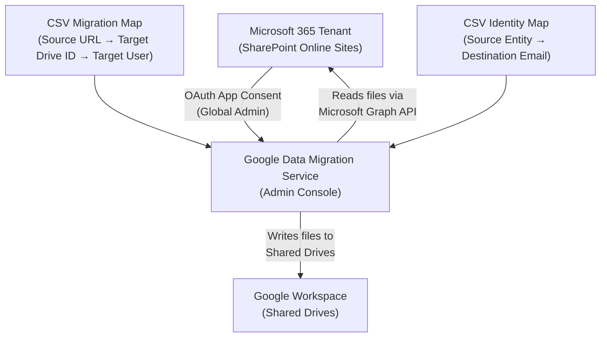

---

### 2. Step-by-Step Procedure & CSV Configurations

#### Migration Map CSV (`Site_Mapping.csv`):
```csv
Source SharePoint URL,Target Drive Folder ID,Target Google User
https://contoso.sharepoint.com/sites/Marketing,0APsR7gKl5mXkUk9PVA,admin@magicmails.org
https://contoso.sharepoint.com/sites/Engineering,0BQtS8hLm6nYlVl0QXB,admin@magicmails.org
```

#### Identity Map CSV (`Identity_Mapping.csv`):
```csv
Source Entity,Destination Email
marketing@contoso.onmicrosoft.com,marketing@magicmails.org
john.doe@contoso.com,john.doe@magicmails.org
```

---

### 3. Best Practices for 10,000+ Items

* **Shared Drive Constraints**: Max **400,000 items** per Shared Drive; max **20 folder levels** deep; max **600 direct members**.
* **Role Translation**:
  * *Site Owner / Full Control* $\rightarrow$ **Manager**
  * *Site Member / Edit* $\rightarrow$ **Content Manager**
  * *Contributor* $\rightarrow$ **Contributor**
  * *Visitor / Read* $\rightarrow$ **Viewer**

---

## 7. Chapter 7: Exchange Online Email, Contacts & Calendars Migration (Module 7)

### 1. Architecture & Workload Scope

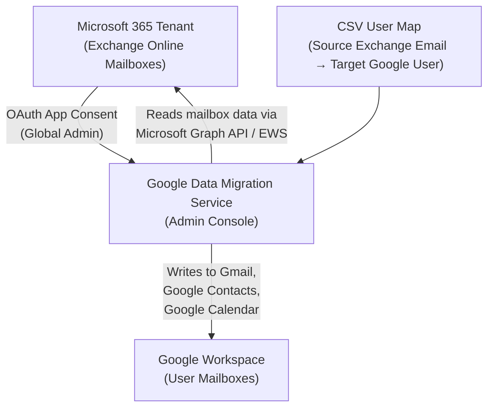

#### What Migrates:
* **Email**: Folder structure, read/unread, attachments up to 150 MB, High Importance ($\rightarrow$ `Important` label), Snoozed, Archived.
* **In-Place Archives**: Copies to custom label (`In-Place Archive`) or Google Vault.
* **Calendars**: Primary/secondary/resource calendars, event attachments (to `Imported Calendar Attachments` folder in Drive), recurring events without end date ($\rightarrow$ Dec 31, 2099), calendar ACLs.
* **Contacts**: Up to 27,000 contacts, categories $\rightarrow$ single-level labels (`Folder1 - Folder2`), business/home/mobile numbers.
* **Tasks (Microsoft To Do)**: Tasks $\rightarrow$ **Google Tasks** (up to 100 task lists).

---

### 2. System Reserved Label Protection & Rules Matrix

System reserved names append an underscore:
`All Mail_`, `Archive_`, `Bin_`, `Outbox_`, `Chats_`. Slashes (`Travel/Asia`) convert to underscores (`Travel_Asia`). Folders $>225$ characters import without label into `All Mail`.

---

## 8. Chapter 8: OneDrive to Google Drive Migration (Module 8)

### 1. Architecture & Scope
OneDrive for Business files and nested folder hierarchies map to Google Drive (**My Drive**).

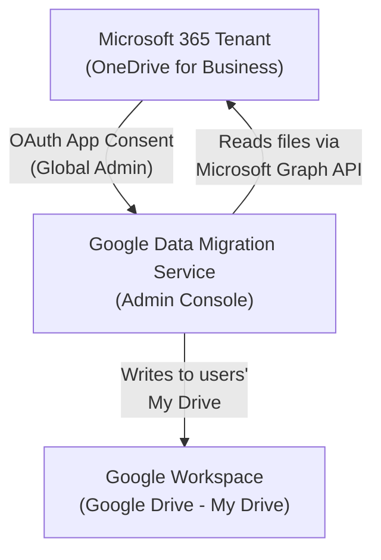

---

### 2. Unmapped Identity Handling
* **Copy unmapped accounts (disabled)**: Recommended for enterprise migrations to ensure explicit identity map CSV control and prevent unintended permission leaks.

---

## 9. Chapter 9: GAM Advanced Command Reference & Interview Cheat Sheet (Module 9)

### 1. Core SKU Table

| Product SKU Name | Standard SKUID | GAM Alias |
| :--- | :--- | :--- |
| **Workspace Enterprise Plus** | `1010020020` | `wsentplus` |
| **Workspace Enterprise Standard** | `1010020026` | `wsentstan` |
| **Workspace Business Plus** | `1010020025` | `wsbizplus` |
| **Workspace Business Standard** | `1010020028` | `wsbizstan` |
| **Workspace Business Starter** | `1010020027` | `wsbizstarter` |
| **Cloud Identity Free** | `1010010001` | `cloudidentityfree` |
| **Cloud Identity Premium** | `1010050001` | `cloudidentitypremium` |
| **Google Vault (Add-on)** | `Google-Vault` | `vault` |

---

### 2. Top 15 Production GAM One-Liners

```powershell
# 1. Mass Phishing Purge
gam all users delete messages query "subject:'Urgent Action Required'" doit

# 2. Revoke Sessions & OAuth Tokens
gam user compromised@co.com signout && gam user compromised@co.com delete tokens

# 3. Bulk User Provisioning
gam csv users.csv gam create user ~Email firstname ~First lastname ~Last password ~Pass org ~OU changepassword on

# 4. License SKU Assignment
gam csv users.csv gam user ~Email add license wsentplus

# 5. Audit Public File Exposure
gam all users print filelist query "visibility='anyoneWithLink'" fields id,name,owners todrive

# 6. Audit External Mail Forwarding
gam all users print forwardingaddresses todrive

# 7. Set Out of Office Auto-Responder
gam user user@co.com vacation on subject "OOO" message "Out of office" startdate 2026-08-19 enddate 2026-08-25

# 8. Add Mailbox Delegate
gam user manager@co.com add delegate assistant@co.com

# 9. Remote Mobile Device Wipe
gam user user@co.com wipe mobile <DeviceID>

# 10. Audit Super Admin 2SV
gam query "isAdmin=true" print users fields primaryEmail,isEnrolledIn2Sv

# 11. Revoke Malicious OAuth App Client ID
gam all users delete token clientid <ClientID>

# 12. Transfer Drive Ownership
gam user leaver@co.com transfer drive manager@co.com

# 13. Create Shared Drive
gam create teamdrive "Finance Shared Drive"

# 14. Add Shared Drive Manager
gam add drivefileacl <DriveID> user admin@co.com role manager

# 15. Export Group Members to Google Sheet
gam print group-members group all-employees@co.com todrive
```

---

## 10. Chapter 10: Official Google Workspace Migration Knowledge Base (Module 10)

### 1. Data Import Tool Default vs. Advanced Method

* **Default Method**: Shared Google API quota, max 1,000 users, direct Global Admin sign-in.
* **Advanced Method**: Dedicated Azure API quota (5,000 users/batch, 10 concurrent batches). Unlocks In-Place Archives, M365 Group mailboxes, event attachments up to 150 MB, calendar ACLs, and Outlook rules import.

---

### 2. Azure App Registration & Setup Steps

1. In **Entra ID** (`entra.microsoft.com`), register app: `Google Workspace Advanced Data Import`.
2. Add Graph API Application Permissions: `Sites.FullControl.All`, `Files.ReadWrite.All`, `User.Read.All`, `Group.Read.All`, `Mail.Read`, `Calendars.Read`, `Contacts.Read`, `Chat.Read.All`, `ChannelMessage.Read.All`.
3. Click **Grant admin consent**.
4. Generate Client Secret; record `Client ID`, `Client Secret`, and `Tenant ID`.
5. Enter credentials in `Admin Console > Data > Data import & export > Data import > Advanced > [SharePoint/Exchange/OneDrive]`.

---

## 11. Chapter 11: Master Migration Guide & Senior Systems Engineer Interview Mastery

### Master Interview Model Answers (Top 5 Key Scenarios)

#### Q1: "How are user accounts handled by Google migration tools?"
**Model Answer**: Google migration tools (**Data Import Tool**, **Google Workspace Migrate**, **GWMME**) **DO NOT create target user accounts**. They only copy data into pre-existing, licensed target user accounts. Target accounts must be pre-provisioned via **SCIM auto-provisioning**, **GCDS**, **GAM scripts**, or **Admin Console CSV upload** before starting data import jobs.

#### Q2: "How do you migrate SharePoint Team Sites to Google Workspace?"
**Model Answer**: SharePoint Team Sites map to **Google Shared Drives**, and Document Libraries map to root folders. We register an Azure App with `Sites.FullControl.All` and `Files.ReadWrite.All` permissions, connect using the `Sharepoint host name` (`tenant.sharepoint.com`), and upload a Site Mapping CSV (`Site URL -> Shared Drive ID -> Manager Email`) and an Identity Mapping CSV (`Source User/Group -> Destination Email/Group`).

#### Q3: "How do you handle email cutover and authentication DNS records?"
**Model Answer**: Prior to cutover, publish SPF (`v=spf1 include:_spf.google.com ~all`), 2048-bit DKIM (`google._domainkey`), and DMARC (`v=DMARC1; p=none...`). Lower MX TTL to 300 seconds 48 hours in advance. At cutover, switch MX records to priority **1** `SMTP.google.com`. After 48 hours of propagation, run a **Delta Import** pass to capture in-flight messages.

#### Q4: "Why do mail counts differ between Outlook and Gmail after a migration?"
**Model Answer**: Differences occur due to: (1) **Deduplication**: Outlook counts separate copies of a message in multiple folders separately; Gmail deduplicates them into a single email with multiple labels. (2) **Archived Unread Counts**: Outlook hides unread emails in system archive folders; Gmail maps these to labels and counts them as unread. (3) **Conversation Threading**: Gmail groups replies into threads and marks the whole thread unread when a new reply arrives.

#### Q5: "How do you troubleshoot HTTP 429 errors during data import?"
**Model Answer**: HTTP 429 indicates Microsoft Graph API or EWS rate-limiting. Google's Data Import tool features automated exponential backoff retries. For custom scripts or GWMME, we reduce thread count (`-NumThreads`) and stagger migration batches across off-peak hours.

---

## 12. Chapter 12: Professional Google Workspace Administrator Certification & Top 55 Q&A Handbook (Module 11)

### 1. Who is a Google Workspace Administrator?

A **Google Workspace Administrator** is the central architect and operational guardian of an organization’s digital collaboration ecosystem. They ensure that email flows uninterruptedly, calendars synchronize across time zones, shared drives remain organized and secure, and data policies prevent accidental or malicious data exposure.

Beyond routine tasks like user provisioning or password resets, a senior Workspace Admin designs automated lifecycle workflows, implements zero-trust security postures, enforces compliance retention, and manages federated single sign-on (SSO) and mobile endpoints. They balance security, compliance, automation, and end-user productivity.

---

### 2. Professional Google Workspace Administrator Certification Exam Overview

The **Google Cloud Professional Google Workspace Administrator** certification validates an administrator's ability to transform business requirements into practical enterprise configurations, manage operational security, and ensure seamless user collaboration.

#### Exam Specifications & Format

| Exam Feature | Official Specification Details |
| :--- | :--- |
| **Exam Name** | Professional Google Workspace Administrator |
| **Exam Duration** | 2 Hours (120 Minutes) |
| **Question Format** | Multiple choice and multiple-select |
| **Total Questions** | Approximately 50–60 Questions |
| **Passing Score** | Approximately 70% |
| **Delivery Method** | Online proctored (via Kryterion Webassessor) or in-person at an authorized testing center |
| **Exam Language** | English |
| **Registration Cost** | $125 USD (plus applicable regional taxes) |
| **Recommended Experience** | Minimum 6+ months of hands-on Google Workspace administration experience |
| **Certification Validity** | 2 Years (Requires re-certification to maintain status) |

---

### 3. The Google Workspace Admin Console Architecture

The **Google Workspace Admin Console** (`admin.google.com`) is the centralized control tower for organization-wide administration. It provides granular administrative controls across core workloads:

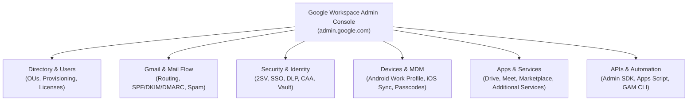

* **User & Group Management**: Add/suspend users, manage group memberships, assign licenses, and place users in target Organizational Units (OUs).
* **Email Routing & Gmail Settings**: Configure inbound/outbound compliance rules, hosts, split/dual delivery, SPF/DKIM/DMARC, and disclaimers.
* **Security & Compliance**: Enforce 2-Step Verification (2SV), Context-Aware Access (CAA), Data Loss Prevention (DLP) rules, and Google Vault retention.
* **Mobile Device Management (MDM)**: Secure mobile endpoints via Basic or Advanced MDM, enforce encryption, and issue remote wipes.
* **API Access & Automation**: Delegate access via GCP Service Accounts and Domain-Wide Delegation to tools like GAM and Google Apps Script.

---

### 4. Comprehensive Top 55 Interview & Certification Practice Q&A

#### Part A: Basic Level Questions (Q1 – Q15)

##### Q1: What is Google Workspace?
**Answer**: Google Workspace (formerly G Suite) is Google's cloud-native suite of productivity and collaboration apps (Gmail, Drive, Docs, Sheets, Slides, Meet, Calendar, Chat, Keep). For enterprise administration, it offers centralized management via the Admin Console (`admin.google.com`), enabling admins to enforce security baselines, provision users, manage devices, and configure data governance policies.

##### Q2: What is the role of a Google Workspace Administrator?
**Answer**: A Google Workspace Administrator manages user accounts, licensing, Organizational Units (OUs), email security, device access, compliance archiving, and SaaS integrations. They act as both the gatekeeper of security protocols and the technical troubleshooter ensuring system availability and productivity.

##### Q3: How do you add a new user in Google Workspace?
**Answer**: Navigate to **Admin Console > Directory > Users > Add new user**. Input the first name, last name, primary email address (username), and assign the target Organizational Unit (OU). Optionally assign a license SKU and set a temporary password. Alternatively, user creation can be executed in bulk via CSV upload, SCIM provisioning, GCDS, or GAM CLI (`gam create user`).

##### Q4: What is an Organizational Unit (OU) in Google Workspace?
**Answer**: An Organizational Unit (OU) is a hierarchical container used to group users or devices to apply specific security policies, service enablement, and configuration settings. Settings applied at a parent OU inherit down to child OUs unless explicitly overridden at the lower node.

##### Q5: What is the difference between a Group and an Organizational Unit (OU)?
**Answer**: 
* **Organizational Units (OUs)** are strictly administrative containers used to apply policy settings (e.g., password strength, Drive sharing restrictions, app access). Users can belong to only **one** OU at a time.
* **Groups** are used for communication and access controls (e.g., email distribution lists, collaborative inboxes, Drive ACL permissions). Users can belong to **multiple** groups simultaneously.

##### Q6: How do you reset a user’s password in Google Workspace?
**Answer**: Go to **Admin Console > Directory > Users**, search for the user, and click **Reset password**. Input a new password or let the system generate one. Check **Ask for a password change at the next sign-in** to enforce immediate user rotation.

##### Q7: What is the Admin Console in Google Workspace?
**Answer**: The Admin Console (`admin.google.com`) is the primary web portal where administrators configure services, manage identities, monitor domain security alerts, manage mobile endpoints, and audit user activity across the Workspace tenant.

##### Q8: What is 2-Step Verification (2SV) and how can it be enforced?
**Answer**: 2-Step Verification (2SV / MFA) requires users to verify their identity via a secondary factor (security key, Google Prompt, authenticator app, or SMS) after entering their password. Admins enforce it under **Security > Authentication > 2-Step Verification**, setting enforcement start dates, grace periods, and allowed verification methods by OU.

##### Q9: What are Admin Roles and how do they work?
**Answer**: Admin roles delegate specific administrative privileges without granting full access. Google provides predefined roles (**Super Admin**, **Groups Admin**, **User Management Admin**, **Help Desk Admin**, **Services Admin**) and allows creating **Custom Roles** with micro-permissions to adhere to the principle of least privilege.

##### Q10: How do you manage user licenses in Google Workspace?
**Answer**: Licenses are managed under **Billing > Subscriptions**. Admins can enable auto-licensing for specific OUs, manually assign/reclaim licenses per user, or perform bulk license assignments using CSV uploads, Admin SDK APIs, or GAM (`gam user <email> add license <SKUID>`).

##### Q11: What is Google Vault and what is its purpose?
**Answer**: Google Vault is an information governance and eDiscovery tool for Google Workspace. It allows organizations to retain, hold, search, and export data (Gmail, Drive, Chat, Groups) for legal and compliance requirements, even if end-users permanently delete items from their active mailboxes or trash.

##### Q12: What is the difference between Gmail settings at the user level vs. domain/OU level?
**Answer**: 
* **User-level settings** are managed by individual users in webmail (e.g., personal inbox filters, signature, vacation responder).
* **Domain/OU-level settings** are enforced globally by admins in the Admin Console (e.g., SPF/DKIM/DMARC, compliance footers, attachment blocks, spam thresholds, inbound/outbound mail routing rules).

##### Q13: How can you monitor user usage or login activity?
**Answer**: Admins use **Reporting > Audit logs** (Login, Admin, Drive, Token, SAML) in the Admin Console. Advanced monitoring is conducted using the **Security Investigation Tool**, **Alert Center**, or by exporting log streams to **Google Cloud BigQuery**.

##### Q14: What happens when a user is suspended in Google Workspace?
**Answer**: Suspending a user blocks active sign-in access, invalidates OAuth tokens, and halts mail delivery to active sessions. However, **no data is deleted**—their Gmail messages, Drive files, calendars, and contacts remain completely intact. Licenses continue to be consumed until explicitly reclaimed.

##### Q15: What is Mobile Device Management (MDM) in Google Workspace?
**Answer**: MDM allows administrators to secure and monitor mobile devices (Android and iOS) accessing corporate data. Features include enforcing screen passcodes, encrypting device storage, establishing Android Enterprise Work Profiles, and executing remote account or device wipes.

---

#### Part B: Intermediate Level Questions (Q16 – Q35)

##### Q16: How do you enforce password policies in Google Workspace?
**Answer**: Navigate to **Admin Console > Security > Authentication > Password management**. Set minimum character length (8–100 characters), enforce password strength metrics, require password expiration policies, and disallow password reuse across specific OUs.

##### Q17: How do you set up email routing in Google Workspace?
**Answer**: Navigate to **Apps > Google Workspace > Gmail > Routing**. Admins create rules to modify routes (Split/Dual delivery), add compliance disclaimers, route copies to archive mailboxes, quarantine messages matching specific regex patterns, or redirect delivery based on envelope senders/recipients.

##### Q18: What are the steps to configure SPF, DKIM, and DMARC for your domain?
**Answer**:
1. **SPF**: Publish TXT record on domain apex: `v=spf1 include:_spf.google.com ~all`.
2. **DKIM**: Generate 2048-bit key in Admin Console (**Gmail > Authenticate email**), publish TXT record at `google._domainkey.yourdomain.com`, then click **Start Authentication**.
3. **DMARC**: Publish TXT record at `_dmarc.yourdomain.com`: `v=DMARC1; p=none; rua=mailto:dmarc@yourdomain.com`, gradually stepping up to `p=quarantine` and `p=reject`.

##### Q19: What is Google Groups for Business and how is it different from regular Groups?
**Answer**: Google Groups for Business adds enterprise administrative controls, granular access permissions, moderation workflows, collaborative inbox capabilities, and integration with Workspace sharing policies, converting basic distribution lists into managed communication hubs.

##### Q20: How do you migrate users from one domain to another within Google Workspace?
**Answer**: You cannot directly rename a tenant's primary domain instantly for all users. Process:
1. Add and verify the new domain in Admin Console (**Account > Domains**).
2. Provision user email aliases or update UPNs to the new domain.
3. If migrating across separate Workspace tenants, use **Google Workspace Migrate**, **Data Import Tool**, or third-party tools (BitTitan/CloudM) to migrate mailbox, calendar, and Drive data.

##### Q21: How do you delegate mailbox access in Gmail?
**Answer**:
* **User Method**: End-user navigates to **Gmail Settings > Accounts > Grant access to your account** and enters the delegate's email.
* **Admin Method**: Use GAM CLI: `gam user executive@domain.com add delegate assistant@domain.com`.

##### Q22: What is Context-Aware Access (CAA) and how do you configure it?
**Answer**: Context-Aware Access enforces zero-trust access policies based on user identity, geographic location, IP CIDR, device security posture (encryption state, OS version), and browser state. Configure it via **Security > Access and data control > Context-Aware Access**, define Access Levels using visual conditions or Common Expression Language (CEL), and assign them to Workspace apps.

##### Q23: How do you handle technical onboarding and offboarding of users?
**Answer**:
* **Onboarding**: Provision account (SCIM/GCDS/GAM), assign SKU license, place in correct OU, add to role-based Google Groups, enforce 2SV.
* **Offboarding**: Suspend user, revoke sign-in cookies (`gam user signout`), wipe OAuth tokens, transfer Drive files & Calendar to manager, move to `_Leavers` OU, reclaim high-cost licenses, and archive data in Vault.

##### Q24: What are Marketplace Apps, and how do you control access to them?
**Answer**: Google Workspace Marketplace apps are third-party OAuth integrations. Admins control app installations under **Apps > Google Workspace Marketplace apps > Access settings**, choosing to allow all apps, allow only whitelisted apps, or block all third-party installations per OU.

##### Q25: What is the difference between Core and Additional Google Services?
**Answer**:
* **Core Services** (Gmail, Drive, Meet, Calendar, Chat) are governed by the primary Google Workspace Enterprise Agreement, HIPAA/GDPR compliance terms, and guaranteed 99.9% SLAs.
* **Additional Services** (YouTube, Blogger, Google Maps) are consumer-grade services enabled/disabled by admins per OU without Workspace SLA guarantees.

##### Q26: How can you bulk upload or modify users?
**Answer**:
1. **CSV Upload**: Admin Console > Directory > Users > Bulk update users.
2. **Directory Sync**: Google Cloud Directory Sync (GCDS) or Entra ID / Okta SCIM provisioning.
3. **Command Line**: GAM CLI (`gam csv users.csv gam create user ...`).
4. **REST APIs**: Admin SDK Directory API.

##### Q27: What tools can you use for auditing user activities?
**Answer**:
* **Admin Console Audit Logs**: Login, Drive, Admin, SAML logs.
* **Security Investigation Tool (SIT)**: Advanced query builder for enterprise security events.
* **Google Vault**: Compliance audit trails and search.
* **BigQuery Export**: Streaming audit logs for long-term analytical queries.

##### Q28: How do you manage external sharing of files in Drive?
**Answer**: Go to **Apps > Google Workspace > Drive and Docs > Sharing settings**. Configure settings per OU:
* Block all external sharing.
* Allow sharing only to whitelisted target domains.
* Warn users before sharing externally.
* Disable public link sharing (`anyoneWithLink`).

##### Q29: What is Google Workspace Migrate?
**Answer**: Google Workspace Migrate is an enterprise multi-node migration platform deployed on GCP or on-premises VMs. It performs high-volume migrations of mail, calendars, personal files, and team sites from Exchange, SharePoint, OneDrive, Box, and local File Shares into Google Workspace.

##### Q30: How can you enforce policies on mobile devices?
**Answer**: Navigate to **Devices > Mobile & endpoints > Settings**. Enable **Basic Management** (agentless passcode policies) or **Advanced Management** (requires Apple Push Cert for iOS, creates Android Enterprise Work Profiles on BYOD, enables full remote wipe).

##### Q31: What are service status dashboards and how do they help?
**Answer**: The **Google Workspace Status Dashboard** (`google.com/appsstatus`) provides public real-time operational health reports for Workspace services. Admins use it during disruptions to determine if an issue is globally widespread or isolated to their local network environment.

##### Q32: What is the difference between Super Admin and other admin roles?
**Answer**:
* **Super Admin**: Has unrestricted, full administrative control across all settings, user accounts, security policies, and domain configurations.
* **Delegated Admin Roles**: Restricted roles (Groups Admin, Help Desk Admin, Services Admin) scoped to specific tasks and OUs to enforce least-privilege administrative access.

##### Q33: How do you handle suspicious login attempts?
**Answer**: Monitor real-time alerts in **Security > Alert Center**. If a login anomaly (impossible travel, suspicious IP) occurs:
1. Force immediate password reset.
2. Terminate active sessions: `gam user <email> signout`.
3. Revoke active OAuth tokens.
4. Enforce hardware security key 2SV.

##### Q34: How do you enable email compliance features like footers or disclaimers?
**Answer**: Navigate to **Apps > Google Workspace > Gmail > Compliance**. Select **Append footer**, define the HTML/text disclaimer string, and configure execution conditions (applied to outbound external mail across selected OUs).

##### Q35: What are key service limits in Google Workspace?
**Answer**:
* **Gmail Sending Limit**: 2,000 messages/day per user via webmail (500/day via SMTP client).
* **Group Membership**: 2,000 direct members per group (expandable via nested groups).
* **Shared Drive Item Limit**: Max 400,000 items (files, folders, shortcuts) per Shared Drive.
* **Shared Drive Depth**: Max 20 folder levels.

---

#### Part C: Advanced & Scenario-Based Questions (Q36 – Q50)

##### Q36: A user accidentally deleted a critical shared file. What steps do you take to recover it?
**Answer**:
1. Check the user's active **Google Drive Trash** (items stay for 30 days).
2. If deleted from a Shared Drive, check the **Shared Drive Trash** (Manager role required).
3. If purged from Trash, use Admin Console **Directory > Users > Restore Data** (within 25 days of deletion).
4. If beyond 25 days, execute a search in **Google Vault** across the matter case and export the original file.

##### Q37: An employee left the company. How do you secure and transfer their data?
**Answer**:
1. Immediately suspend account & terminate active sign-in sessions (`gam user signout`).
2. Transfer Google Drive ownership to manager via **Admin Console > Apps > Drive > Transfer ownership** or GAM (`gam user leaver transfer drive manager`).
3. Transfer primary Google Calendar events to manager.
4. Move account to `_Leavers` OU and strip high-cost SKU licenses (assigning Cloud Identity Free or Vault Archived User SKU).
5. Maintain Vault retention for compliance before eventual account deletion.

##### Q38: How would you automate user provisioning and deprovisioning?
**Answer**:
* **On-Premises AD**: Deploy **Google Cloud Directory Sync (GCDS)** to mirror LDAP changes to Google Workspace SDK API.
* **Cloud Identity (Okta / Entra ID)**: Configure **SCIM 2.0 provisioning** to auto-create, update, and suspend accounts based on HR lifecycle triggers.
* **Scripted Pipeline**: Execute GAM scripts linked to webhook events (`gam create user` / `gam update user suspended true`).

##### Q39: Your company plans to merge with another that uses Google Workspace. How do you approach the migration?
**Answer**:
1. **Audit Phase**: Review both domain configurations, OU structures, licensed SKUs, third-party apps, and DNS records.
2. **Tooling**: Utilize **Google Workspace Migrate** or third-party tools (BitTitan / CloudM) for tenant-to-tenant data migration.
3. **Execution**: Pre-provision target user accounts, configure dual delivery email routing during coexistence, execute primary mailbox/Drive migration pass, cut over primary domain DNS records, and run a final Delta pass.

##### Q40: How do you investigate and respond to a phishing email reported by multiple users?
**Answer**:
1. Open **Security Investigation Tool (SIT)**, set data source to **Gmail messages**, query by `Subject` or `Message ID`.
2. Review sender IP, SPF/DKIM validation status, and recipient counts.
3. Execute domain-wide hard purge directly in SIT (**Actions > Delete Messages**) or via GAM (`gam all users delete messages query ...`).
4. Block sender domain/IP in Gmail Inbound Gateway / Spam rules.
5. Revoke sessions for users who clicked phishing links.

##### Q41: How do you set up a company-wide custom email signature?
**Answer**:
* **Native**: Use **Apps > Gmail > Compliance > Append footer** to add standard legal disclaimers.
* **Dynamic Per-User Signatures**: Deploy third-party signature management tools (e.g., Exclaimer, WiseStamp) or execute a GAM script reading user attributes from CSV to set custom HTML signatures via Gmail API.

##### Q42: Describe how you monitor security events like data loss or suspicious downloads.
**Answer**:
1. Configure **Alert Center** notifications for anomalous login attempts and DLP rule triggers.
2. Define **Data Loss Prevention (DLP)** rules with OCR to scan Drive files for credit cards, SSNs, or custom confidential regex.
3. Audit Drive log events in SIT filtering by `Event = Download` or `Visibility = Shared Externally`.
4. Stream audit logs to **BigQuery** for automated SIEM dashboarding.

##### Q43: Your team uses unmanaged personal devices to access Workspace. How do you reduce data exposure risk?
**Answer**:
1. Deploy **Context-Aware Access (CAA)**: Block access to Drive and Gmail unless device is company-owned or compliant.
2. Configure **Drive Sharing Settings**: Disable file downloading, printing, and copying for external viewers.
3. Deploy **Google Endpoint Verification** extension to evaluate device security posture before granting session tokens.

##### Q44: How would you handle a scenario where Gmail messages are not being delivered externally?
**Answer**:
1. Check **Admin Console > Reports > Email log search** using sender/recipient addresses.
2. Verify DNS email authentication records: **SPF** (`include:_spf.google.com`), **DKIM** (selector check), and **DMARC**.
3. Inspect NDR error codes (e.g., `550 5.7.1` authentication failure or `554 5.4.14` routing loop).
4. Verify destination server IP is not listed on global RBL blocklists.

##### Q45: A Google Group stopped receiving external emails. What could be the cause?
**Answer**:
1. Navigate to **Groups > Group Settings**.
2. Verify **Access settings > Who can post**: Ensure **Public / External** is selected (if set to "Group Members", external emails bounce).
3. Check **Spam moderation settings**: Messages might be held in moderation queue.
4. Verify sender domain SPF/DKIM is valid and not rejected by Group spam filters.

##### Q46: How do you create an alert for abnormal login attempts?
**Answer**:
1. Navigate to **Security > Alert Center**.
2. Configure **Rule > Suspicious login activity** and **Impossible travel**.
3. Set alert threshold and assign notification email recipients (IT Security distribution list).
4. Link alert to SIT for automated investigation workflows.

##### Q47: What steps would you take to enable Single Sign-On (SSO) for Google Workspace?
**Answer**:
1. In Admin Console, navigate to **Security > Authentication > SSO with third-party IdP**.
2. Input IdP Sign-in URL, Sign-out URL, and upload IdP X.509 verification certificate.
3. Test SSO profile on a pilot test OU.
4. Ensure Super Admin break-glass accounts are excluded from SSO profile to prevent lockout during IdP outages.

##### Q48: How do you audit file sharing outside the organization?
**Answer**:
1. Run query in **Security Investigation Tool**: Data source = `Drive log events`, Event = `Visibility change`, Filter = `Target domain != corporate domain`.
2. Run GAM audit: `gam all users print filelist query "visibility='anyoneWithLink' or visibility='anyoneCanFind'" fields id,name,owners todrive`.

##### Q49: Users report slow performance and lag during Google Meet calls. How do you troubleshoot?
**Answer**:
1. Open **Google Meet Quality Tool** (`Admin Console > Reporting > Meet quality tool`).
2. Search for the Meeting Code; review packet loss, jitter, network latency, and CPU utilization charts per participant.
3. Verify local network firewall rules allow outbound UDP ports `19302–19309`.
4. Lower default video send/receive resolution in Admin Console Meet settings if bandwidth is constrained.

##### Q50: How do you enforce compliance for Drive files containing confidential information?
**Answer**:
1. Configure **DLP Rules** under **Security > Data protection**.
2. Add detectors for credit card numbers, SSNs, or custom regex patterns.
3. Define automated rule response: Block external sharing, warn user, and dispatch security alert.
4. Apply **Vault Retention Rules** to retain compliance documents for mandatory retention periods.

---

#### Part D: Behavioral & Experience-Based Questions (Q51 – Q55)

##### Q51: Describe a time when you handled a high-priority Google Workspace issue. What was your approach?
**Model Answer**: *“In a previous role, outbound emails began bouncing globally due to an accidental DNS SPF record deletion by an external web team. I immediately identified the root cause using Google Email Log Search and DNS diagnostic utilities, restored the published `v=spf1 include:_spf.google.com ~all` record, communicated status transparently to leadership every 15 minutes, and subsequently locked down DNS registrar permissions to prevent unauthorized zone modifications.”*

##### Q52: Have you led a Google Workspace migration or deployment project? How did you manage it?
**Model Answer**: *“Yes, I led a 300-user migration from Microsoft Exchange Online to Google Workspace. I structured it into 5 distinct phases: Pre-provisioning accounts via GCDS, pilot testing with 10 users, bulk data import using Advanced Data Import, single MX cutover to `1 SMTP.google.com`, and a 48-hour post-cutover Delta import. The project completed on schedule with zero data loss.”*

##### Q53: How do you keep yourself updated with changes in Google Workspace?
**Model Answer**: *“I subscribe directly to the official Google Workspace Updates Blog (`workspaceupdates.googleblog.com`), review quarterly Google Cloud Release Notes, participate in the Google Admin Help Community, and test upcoming feature flags in a dedicated developer sandbox environment.”*

##### Q54: Can you give an example of how you improved security or efficiency in your organization?
**Model Answer**: *“I implemented automated license reclamation and user offboarding using GAM CLI scripts linked to our IdP directory events. By moving inactive accounts (>90 days no login) to a restricted `_Leavers` OU and stripping Enterprise Plus licenses, we saved the organization ~$35,000 annually in licensing spend while simultaneously tightening zero-trust security.”*

##### Q55: Describe how you work with non-technical teams or executives to support Workspace tools.
**Model Answer**: *“I translate technical configurations into business outcomes. When explaining Context-Aware Access to executives, I focus on risk mitigation—explaining how it protects corporate IP on unmanaged devices without friction for approved laptops. For non-technical teams, I provide visual quick-start guides and host interactive Q&A sessions.”*

---

### 5. Indispensable Tools Every Workspace Admin Should Master

| Tool / Platform | Primary Functional Purpose | Key Use Cases |
| :--- | :--- | :--- |
| **Google Admin Console** | Primary Web Management Portal | Managing users, OUs, app policies, Gmail routing, and security settings. |
| **Google Vault** | Archiving & Legal eDiscovery | Retaining, searching, holding, and exporting Workspace data for legal compliance. |
| **Security Center & SIT** | Threat Monitoring & Incident Response | Investigating security incidents, purging phishing, and auditing domain security. |
| **GAM (GAM-ADV-XTD3)** | Command-Line Automation CLI | Executing bulk provisioning, ACL audits, token wipes, and delegated mailbox access. |
| **Data Import Tool (New DMS)** | Cloud-Native Migration Engine | Migrating Exchange, OneDrive, SharePoint, and Teams data into Google Workspace. |
| **Meet Quality Tool** | Telemetry & VoIP Troubleshooting | Diagnosing audio/video lag, jitter, packet loss, and CPU throttling in Meet calls. |
| **Email Log Search** | Message Delivery Diagnostics | Tracing mail flow, verifying inbound/outbound delivery, and identifying NDR bounces. |
| **BigQuery Log Export** | Security Analytics & SIEM Integration | Streaming real-time Admin Console audit logs for custom SQL dashboards and audits. |
| **Context-Aware Access** | Zero-Trust Access Control Engine | Defining granular app access rules based on IP, geofence, and device posture. |
| **Google Endpoint Management** | Mobile & Desktop MDM | Managing Android Work Profiles, iOS sync profiles, passcodes, and remote wipes. |

---

### 6. Official 7-Step Certification Preparation Strategy

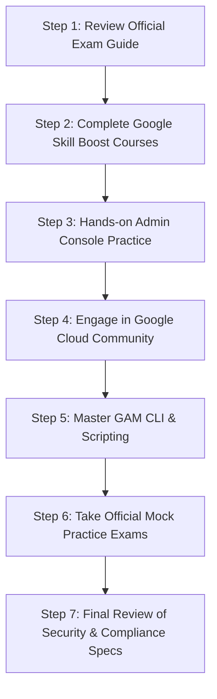

1. **Step 1: Review Official Exam Guide**: Analyze all exam domains on Google Cloud's official certification portal.
2. **Step 2: Complete Google Skill Boost Training**: Enroll in structured Google Workspace Admin learning paths (*Managing Workspace, Security, Mail Management*).
3. **Step 3: Hands-on Practice in Admin Console**: Set up a test Workspace domain to configure OUs, 2SV, routing rules, DLP, and Shared Drives.
4. **Step 4: Engage in Google Cloud Community**: Participate in admin forums and webinars to discuss real-world scenarios.
5. **Step 5: Master GAM CLI & Scripting**: Practice writing syntax for bulk user provisioning, license management, and audit log extractions.
7. **Step 7: Review Security & Compliance Specs**: Perform a final review of SPF/DKIM/DMARC, Vault precedence rules, and Context-Aware Access CEL syntax.

---

## 13. Chapter 13: G Suite & Google Workspace Core Operational Interview Handbook (Module 12)

### 1. Core Architecture & Primary Components
Google Workspace is a cloud-native suite of productivity and collaboration tools. Primary components include **Gmail** (professional email with custom domain support), **Google Drive** (cloud storage and Shared Drives), **Docs**, **Sheets**, **Slides**, **Meet**, **Calendar**, **Forms**, **Sites**, **Keep**, **AppSheet**, and **Vids**.

---

### 2. Google Workspace vs. Microsoft 365 Comparison Matrix

| Aspect / Feature | Google Workspace | Microsoft 365 |
| :--- | :--- | :--- |
| **Core Applications** | Gmail, Drive, Docs, Sheets, Slides, Meet, Calendar, Chat, Forms, Sites, Keep, AppSheet, Vids | Outlook, OneDrive, Word, Excel, PowerPoint, Teams, OneNote, SharePoint, Exchange, Loop |
| **Deployment Model** | 100% Cloud-Native (Browser & Mobile Apps) | Hybrid (Desktop Native Applications + Web/Mobile Apps) |
| **Pricing (Annual/User/Mo)** | **Starter**: $7 (30 GB)<br>**Standard**: $14 (2 TB)<br>**Business Plus**: $22 (5 TB)<br>**Enterprise**: Custom | **Business Basic**: $6 (Web/Mobile)<br>**Standard**: $12.50 (Desktop Apps)<br>**Premium**: $22 (Advanced Security)<br>**Enterprise**: $35–$57 |
| **Storage Architecture** | Pooled storage across Gmail & Drive (30 GB to 5 TB / Unlimited) | 1 TB OneDrive per user + Separate 50–100 GB Exchange Mailbox |
| **Collaboration Engine** | Superior real-time simultaneous co-authoring; seamless external sharing | Real-time co-authoring via OneDrive/SharePoint/Teams; native desktop lock model |
| **Email Platform** | **Gmail**: Search-centric, intuitive labeling system, 25 MB attachment cap | **Outlook**: Folder-centric, robust desktop client rules, 50–100 GB mailbox capacity |
| **Video Conferencing** | **Google Meet**: Lightweight browser-native, up to 500 participants | **Microsoft Teams**: Robust desktop app, up to 250–1,000 participants, deep SharePoint ties |

---

### 3. End-to-End Email & Workspace Migration Workflow

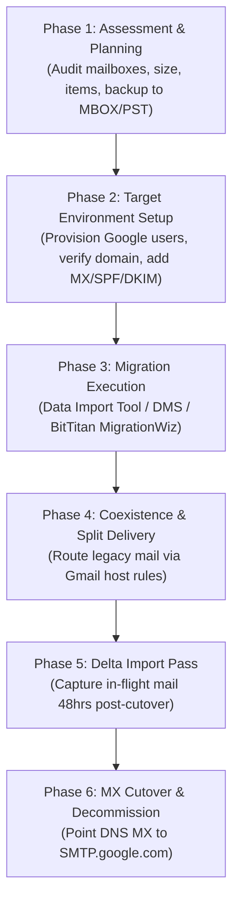

1. **Planning**: Audit source mailboxes, storage size, contacts, calendars, and mail rules. Select native **Data Import Tool (New DMS)** or third-party tools (BitTitan MigrationWiz).
2. **Target Setup**: Provision target user accounts in Google Workspace via SCIM, GCDS, GAM, or CSV. Configure domain DNS records.
3. **Primary Migration**: Connect Google Workspace to source IMAP/Exchange server via OAuth delegation and run primary import pass.
4. **Cutover & Delta**: Switch DNS MX record to priority **1** `SMTP.google.com`. After 48 hours of DNS propagation, execute a **Delta Migration** pass to capture emails received during propagation.

---

### 4. User Account Provisioning & Deprovisioning (JML)

#### A. Manual Provisioning via Admin Console
1. Navigate to **Admin Console > Directory > Users > Add new user**.
2. Input First Name, Last Name, Primary Email Address (`username@yourdomain.com`).
3. Set temporary password and assign to target **Organizational Unit (OU)**.
4. Assign corresponding license SKU (e.g., Business Standard).

#### B. Automated Offboarding Sequence
1. **Block Sign-in**: Suspend user account in Admin Console.
2. **Terminate Sessions**: Execute session signout (`gam user leaver signout`) and delete active OAuth tokens.
3. **Data Transfer**:
   * Transfer Google Drive file ownership to designated manager (**Admin Console > Apps > Drive > Transfer ownership**).
   * Transfer primary Google Calendar events to manager.
4. **OU & License Re-assignment**: Move user to `_Leavers` OU and reclaim expensive enterprise SKU license (reassigning Cloud Identity Free or Vault Archived User SKU).

---

### 5. Comprehensive Security Suite in Google Workspace

* **Data Encryption**:
  * **In Transit**: TLS 1.3 encryption for all data moving across networks.
  * **At Rest**: AES-256 bit encryption across distributed storage.
  * **Client-Side Encryption (CSE)**: Encrypts Gmail messages, Drive files, Docs, Sheets, Slides, Meet calls, and Calendar events using customer-managed encryption keys (KMS partners: Thales, FlowCrypt).
* **Two-Step Verification (2SV) & Passkeys**:
  * Mandatory 2SV via security keys (FIDO2/WebAuthn), Google Prompts, or authenticator apps.
  * **Passkeys** support passwordless, phishing-resistant biometric sign-in.
* **Advanced Protection Program (APP)**: Enforces physical FIDO2 security keys, deep Gmail malware/phishing scans, and restricts third-party OAuth app permissions for high-risk accounts (executives, admins).

---

### 6. Data Recovery Workflows in Google Workspace

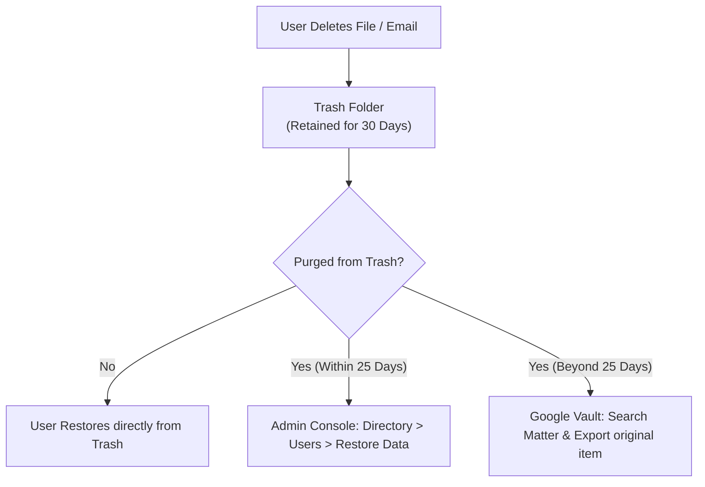

| Data Type | Retention in Trash | Admin Console Recovery Window | Long-Term Compliance Recovery |
| :--- | :--- | :--- | :--- |
| **Gmail Emails** | 30 Days | Up to 25 days post-trash purge | Google Vault (Indefinite if Litigation Hold active) |
| **Google Drive Files** | 30 Days | Up to 25 days post-trash purge | Google Vault / Shared Drive Trash |
| **Google Contacts** | 30 Days ("Undo changes") | N/A | Google Vault / Admin export |
| **Google Calendar** | 30 Days ("Trash") | N/A | Google Vault |

---

### 7. Google Apps Script & Automation Playbooks

**Google Apps Script** is a cloud-hosted JavaScript scripting platform running on Google servers. It interacts directly with Google Workspace APIs (Gmail, Drive, Sheets, Calendar, Admin SDK) without requiring external server infrastructure.

#### Complete Production Script: Automated Email Broadcast from Google Sheets

```javascript
/**
 * Automates sending personalized email broadcasts reading data from a Google Sheet.
 */
function sendAutomatedEmails() {
  const sheet = SpreadsheetApp.getActiveSpreadsheet().getActiveSheet();
  const data = sheet.getDataRange().getValues();
  
  // Skip header row (row 0)
  for (let i = 1; i < data.length; i++) {
    const name = data[i][0];       // Column A: Name
    const email = data[i][1];      // Column B: Email
    const message = data[i][2];    // Column C: Message
    const status = data[i][3];     // Column D: Status Flag
    
    // Only send if email exists and hasn't been sent yet
    if (email && status !== "SENT") {
      const subject = "Official Update for " + name;
      const htmlBody = "<p>Dear " + name + ",</p><p>" + message + "</p><br><p>Best regards,<br>IT Operations</p>";
      
      try {
        GmailApp.sendEmail(email, subject, message, {
          htmlBody: htmlBody,
          name: "IT Operations Team"
        });
        
        // Update status in Column D to prevent duplicate sending
        sheet.getRange(i + 1, 4).setValue("SENT");
        Logger.log("Email sent successfully to: " + email);
      } catch (err) {
        sheet.getRange(i + 1, 4).setValue("ERROR: " + err.message);
        Logger.log("Failed to send email to " + email + ": " + err.message);
      }
    }
  }
}
```

---

### 8. Mobile Device Integration & MDM Controls

* **Native Mobile Apps**: Optimized iOS and Android apps for Gmail, Drive, Docs, Sheets, Slides, Meet, Calendar, Chat, and Keep.
* **Basic Endpoint Management**: Agentless MDM. Enforces device passcodes, account wipes (removes work profile), and audits active mobile endpoints.
* **Advanced Endpoint Management**:
  * **Android Enterprise**: Creates a cryptographically isolated **Work Profile** separating corporate data from personal applications. Prevents cross-profile copy/paste and screenshot capture of work apps.
  * **iOS Sync**: Uses Apple Push Notification service (APNs) and Google Device Policy app to enforce corporate encryption, password complexity, and full hardware wipe capability.

---

### 9. Google Calendar Integrations Across Workspace

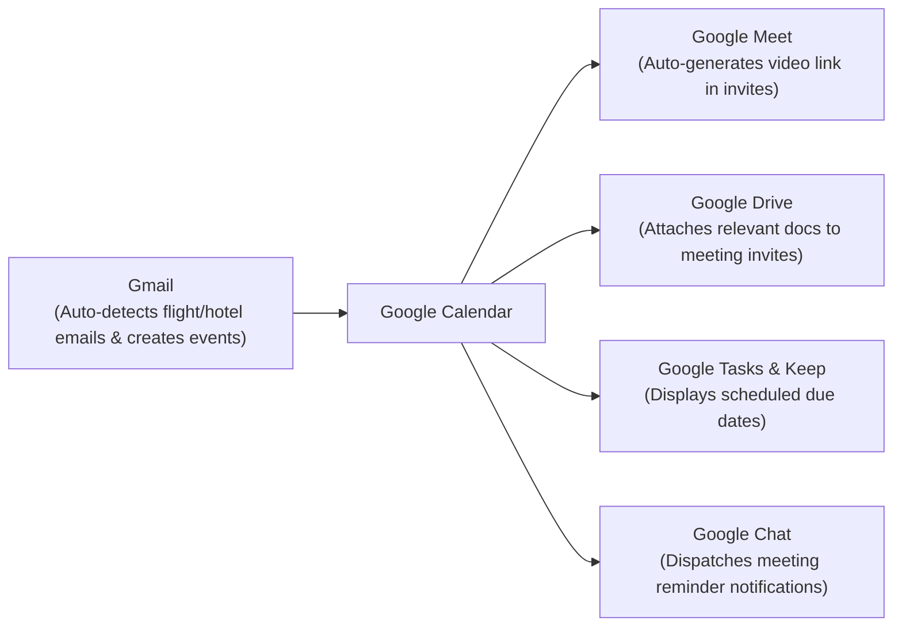

---

### 10. Google Sheets: Advantages & Conditional Formatting

#### Key Advantages Over Traditional Desktop Spreadsheets
1. **Cloud-Native Real-Time Collaboration**: Multiple users co-edit simultaneously without file locking conflicts (`.xlsx` lock errors).
2. **Built-in Apps Script Automation**: Extend functionality using JavaScript and REST APIs.
3. **Seamless Integration**: Connects natively to Google Forms, Google Finance (`=GOOGLEFINANCE()`), Google Translate (`=GOOGLETRANSLATE()`), and BigQuery datasets.
4. **Version History Audit**: Tracks every keystroke and edit with full point-in-time revision rollback capabilities.

#### How to Apply Conditional Formatting
1. Select target range (e.g., `A1:D100`).
2. Navigate to **Format > Conditional formatting**.
3. Choose Rule Type:
   * Single Color (Greater than, Text contains, Date is before, Cell is empty).
   * Custom Formula (e.g., `= $D1 = "OVERDUE"` to highlight entire row).
   * Color Scale (Gradients for financial ranges).
4. Set formatting styles (Fill color, font color, bold) and click **Done**.

---

### 11. Configuring Email Aliases & Google Groups

#### A. Configuring Email Aliases
* **Purpose**: Allows a single user to send and receive mail from alternate addresses (e.g., `sales@domain.com` routing to `jdoe@domain.com`).
* **Admin Setup**: Navigate to **Admin Console > Directory > Users > Select User > User Information > Email aliases > Add alias**.
* **Sending from Alias**: User opens **Gmail Settings > Accounts > Send mail as > Add another email address**.

#### B. Google Groups Use Cases

| Group Purpose | Administrative Use Case | Key Configuration |
| :--- | :--- | :--- |
| **Email Distribution List** | Deliver email to multiple users via single address (`team@domain.com`) | Delivery enabled to all group members. |
| **Collaborative Inbox** | Shared queue where team members assign, resolve, and tag customer tickets (`support@domain.com`) | Web forum interface enabled at `groups.google.com`. |
| **Access Control Group** | Grant Drive file or Shared Drive permissions to a group rather than individuals | Group added to Shared Drive ACL as Content Manager. |
| **Policy Target Group** | Apply administrative policies (e.g., CAA or 2SV enforcement) across departments | Group selected under Admin Console security scoping. |

---

### 12. Multithreaded Execution Concept

A **multithreaded program** is a software application executing multiple concurrent threads within a single process. In Workspace administration, multithreading is used in CLI tools like **GAM** (`num_threads = 25` in `gam.cfg`) or **GWMME** (`-NumThreads 32`) to issue parallel API requests across thousands of user mailboxes simultaneously, dramatically reducing migration and audit execution times.

---

### 13. Third-Party App Governance & Marketplace Controls

1. **Marketplace Installation**: Navigate to **Admin Console > Apps > Google Workspace Marketplace apps > App list > Install app**.
2. **API Access Levels**: Navigate to **Security > Access and data control > API controls > Manage Third-Party App Access**:
   * **Trusted**: App granted unrestricted access to specified Google APIs.
   * **Limited**: App restricted to non-sensitive scopes.
   * **Blocked**: App execution blocked domain-wide.
3. **OU Scoping**: Apply app access settings to specific Organizational Units.

---

### 14. Workspace Access Methods & System Requirements

* **Access Web Portals**:
  * Gmail: `mail.google.com`
  * Drive: `drive.google.com`
  * Calendar: `calendar.google.com`
  * Admin Console: `admin.google.com`
* **System Requirements**:
  * Internet connectivity (plus Chrome offline extension for offline Gmail/Drive editing).
  * Modern web browser (Chrome, Firefox, Safari, Edge).
  * Mobile endpoints: iOS 13+ or Android 8.0+.
  * Custom domain ownership (for custom `@yourcompany.com` email branding).

---

### 15. Operational Troubleshooting & Diagnostics Guide

| Service Issue | Probable Root Cause | Diagnostic & Resolution Protocol |
| :--- | :--- | :--- |
| **User Sign-in Lockout / Error 400** | Expired SSO SAML cert, 2SV lockout, or suspended account | Check Admin Console audit logs; issue backup 2SV codes; verify IdP SAML cert validity. |
| **Outbound Email Bouncing (NDR)** | Invalid SPF, DKIM, or DMARC record | Run Google Admin Toolbox Messageheader; verify `v=spf1 include:_spf.google.com ~all` and DKIM TXT record. |
| **Inbound Email Bounce Loop (554 5.4.14)** | Routing rule pointing back to MX instead of legacy host IP | Inspect Gmail Routing host rules; ensure destination host points to explicit Exchange IP/FQDN. |
| **Google Group Rejecting External Mail** | "Who can post" set to Group Members only | Open **Groups > Group Settings > Access settings > Who can post** and change to **Public / Anyone**. |
| **Drive File Migration Error 429** | Microsoft Graph API rate-limiting throttling | Exponential backoff retries; reduce concurrent batch size in migration settings. |

---

## 14. Chapter 14: Google Workspace Developer APIs, Python SDKs & Custom Add-ons Handbook (Module 13)

### 1. Google Workspace Core Services & Developer Ecosystem

Google Workspace provides REST APIs exposing core services to external applications via Google Cloud Platform (GCP) Service Accounts or OAuth 2.0 User Delegation.

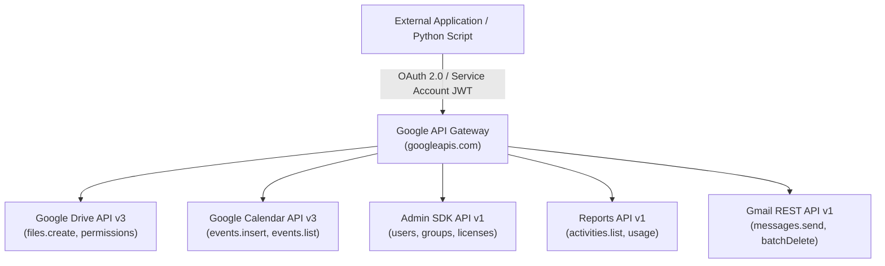

---

### 2. Python Scripting: Uploading Files to Google Drive (Drive API v3)

#### Complete Executable Python Script

```python
from googleapiclient.discovery import build
from googleapiclient.http import MediaFileUpload
from google.oauth2 import service_account

def upload_file_to_drive(file_path: str, mime_type: str, drive_file_name: str, service_account_path: str):
    """
    Uploads a local file to Google Drive using the Drive API v3.
    """
    SCOPES = ['https://www.googleapis.com/auth/drive.file']
    
    # 1. Authenticate using Service Account credentials
    credentials = service_account.Credentials.from_service_account_file(
        service_account_path, scopes=SCOPES
    )
    
    # 2. Build the Drive API client
    service = build('drive', 'v3', credentials=credentials)
    
    # 3. Define file metadata and media body
    file_metadata = {'name': drive_file_name}
    media = MediaFileUpload(file_path, mimetype=mime_type, resumable=True)
    
    # 4. Execute the create request
    try:
        file = service.files().create(
            body=file_metadata,
            media_body=media,
            fields='id, webViewLink'
        ).execute()
        
        print(f"Successfully uploaded file!")
        print(f"File ID: {file.get('id')}")
        print(f"View Link: {file.get('webViewLink')}")
        return file.get('id')
    except Exception as e:
        print(f"An error occurred during file upload: {str(e)}")
        return None

if __name__ == '__main__':
    upload_file_to_drive(
        file_path='report.pdf',
        mime_type='application/pdf',
        drive_file_name='Executive_Audit_Report_2026.pdf',
        service_account_path='credentials/service_account.json'
    )
```

---

### 3. Python Scripting: Programmatic Calendar Event Scheduling (Calendar API v3)

#### Complete Executable Python Script

```python
from google.oauth2 import service_account
from googleapiclient.discovery import build
from datetime import datetime, timedelta

def schedule_calendar_event(service_account_path: str, user_email: str):
    """
    Programmatically creates a meeting event with Google Meet link in Google Calendar.
    """
    SCOPES = ['https://www.googleapis.com/auth/calendar']
    
    # Authenticate with Domain-Wide Delegation (delegating to user_email)
    credentials = service_account.Credentials.from_service_account_file(
        service_account_path, scopes=SCOPES
    ).with_subject(user_email)
    
    service = build('calendar', 'v3', credentials=credentials)
    
    # Define event timing (Tomorrow 10:00 AM - 11:00 AM PST)
    start_time = (datetime.now() + timedelta(days=1)).replace(hour=10, minute=0, second=0).isoformat() + '-08:00'
    end_time = (datetime.now() + timedelta(days=1)).replace(hour=11, minute=0, second=0).isoformat() + '-08:00'
    
    event_payload = {
        'summary': 'Enterprise Security Audit Review',
        'location': 'Virtual Meeting / Google Meet',
        'description': 'Quarterly Google Workspace security posture and DLP rule audit review.',
        'start': {
            'dateTime': start_time,
            'timeZone': 'America/Los_Angeles',
        },
        'end': {
            'dateTime': end_time,
            'timeZone': 'America/Los_Angeles',
        },
        'attendees': [
            {'email': 'sec-admin@company.com'},
            {'email': 'auditor@company.com'},
        ],
        'conferenceData': {
            'createRequest': {
                'requestId': f"meet-{int(datetime.now().timestamp())}",
                'conferenceSolutionKey': {'type': 'hangoutsMeet'}
            }
        },
        'reminders': {
            'useDefault': False,
            'overrides': [
                {'method': 'email', 'minutes': 24 * 60},
                {'method': 'popup', 'minutes': 15},
            ],
        },
    }
    
    # Insert event and create Google Meet conference
    event = service.events().insert(
        calendarId='primary',
        body=event_payload,
        conferenceDataVersion=1
    ).execute()
    
    print(f"Event created successfully!")
    print(f"HTML Link: {event.get('htmlLink')}")
    print(f"Meet Video Link: {event.get('hangoutLink')}")
    return event.get('id')

if __name__ == '__main__':
    schedule_calendar_event('credentials/service_account.json', 'admin@yourcompany.com')
```

---

### 4. OAuth 2.0 Web Application Authentication Architecture

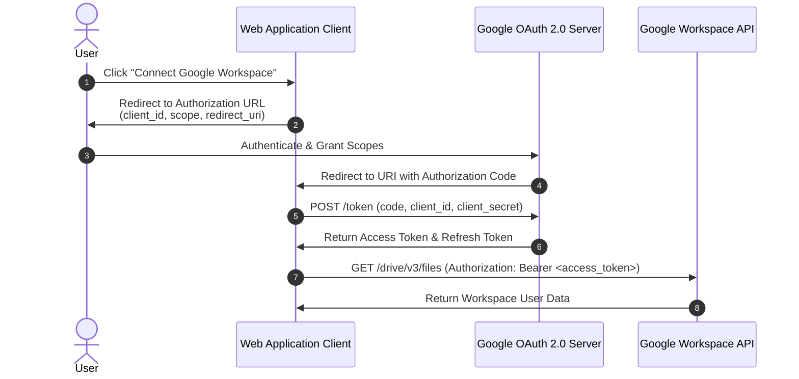

---

### 5. Custom Google Workspace Add-on Development Lifecycle

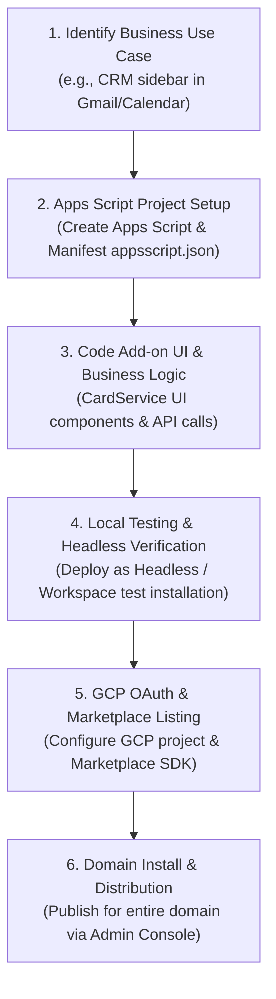

---

### 6. Audit Logging & Monitoring via Workspace Reports API (`reports_v1`)

```python
from google.oauth2 import service_account
from googleapiclient.discovery import build

def audit_drive_activity(service_account_path: str, admin_email: str):
    """
    Fetches external file sharing audit events using Google Admin Reports API.
    """
    SCOPES = ['https://www.googleapis.com/auth/admin.reports.audit.readonly']
    
    credentials = service_account.Credentials.from_service_account_file(
        service_account_path, scopes=SCOPES
    ).with_subject(admin_email)
    
    service = build('admin', 'reports_v1', credentials=credentials)
    
    # Query Drive audit events for external visibility changes
    results = service.activities().list(
        userKey='all',
        applicationName='drive',
        eventName='change_user_access'
    ).execute()
    
    activities = results.get('items', [])
    print(f"Found {len(activities)} Drive audit events:")
    
    for activity in activities:
        user = activity.get('actor', {}).get('email')
        time = activity.get('id', {}).get('time')
        print(f"User: {user} | Timestamp: {time}")

if __name__ == '__main__':
    audit_drive_activity('credentials/service_account.json', 'admin@yourcompany.com')
```

---

### 7. SAML 2.0 Single Sign-On (SSO) Integration Step-by-Step

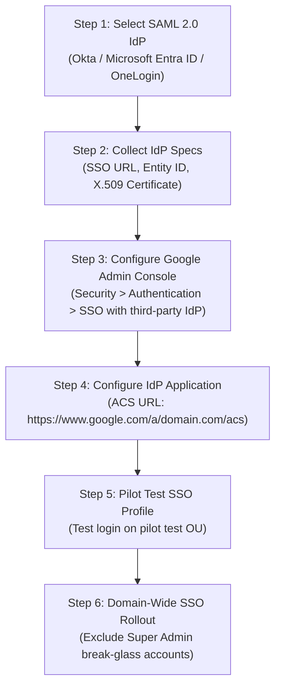

---

## 15. Chapter 15: G Suite & Google Workspace Senior Analyst Hiring, Evaluation & Interview Rubric (Module 14)

### 1. Top 10 Senior G Suite Analyst Interview Questions & Evaluator Rubrics

#### Q1: User Lifecycle Management & Automated Provisioning
* **Strong Answer Must Include**: Automated provisioning via SCIM 2.0 (Okta / Entra ID) or GCDS, role-based group assignments, hierarchical OU placement, and a documented offboarding protocol (session revocation, OAuth token wipe, data transfer to manager, account suspension, license reclamation, Vault retention).
* **Red Flags**: Manual-only GUI steps; no session revocation; no license optimization.

#### Q2: Security Policy Configuration & Staged Rollouts
* **Strong Answer Must Include**: Mandatory 2SV enforcement with security key grace periods per OU, zero-trust Context-Aware Access (CAA) policies, DLP rule configuration, and a staged rollout protocol (pilot testing before domain-wide enforcement).
* **Red Flags**: Vague references to vendor defaults; no staged testing protocol; ignoring compliance requirements.

#### Q3: Incident Response & Suspicious Activity Investigation
* **Strong Answer Must Include**: Step-by-step query construction in Security Investigation Tool (SIT), revoking unapproved OAuth tokens (`gam user signout`), inspecting Gmail Message Headers / Email Log Search, and executing containment + post-incident root-cause documentation.
* **Red Flags**: No structured IR plan; failure to inspect raw audit logs.

#### Q4: Federated Identity & Single Sign-On (SSO) Integration
* **Strong Answer Must Include**: Hands-on SAML 2.0 setup (ACS URL, Entity ID, X.509 cert), SCIM 2.0 attribute mapping/sync conflict resolution, configuring Super Admin break-glass accounts, and role-based group mapping.
* **Red Flags**: Conceptual understanding only; no hands-on SAML setup; ignoring SSO outage break-glass contingencies.

#### Q5: Storage Governance & Shared Drive Architecture
* **Strong Answer Must Include**: Drive storage quota limits per OU, Shared Drive lifecycle governance (restricting external sharing, 400,000 item cap best practices), Google Vault retention vs. Litigation Holds, and public file exposure audits via GAM.
* **Red Flags**: No storage quota strategy; treating Shared Drives like unmonitored file shares.

#### Q6: API Scripting & Administrative Automation
* **Strong Answer Must Include**: Writing custom Python/PowerShell scripts consuming Admin SDK, advanced CLI management via GAM/GAMADV-XTD3, and deploying Google Apps Script workflow triggers.
* **Red Flags**: Zero scripting exposure; pure reliance on Admin Console GUI.

#### Q7: Data Loss Prevention (DLP) Rule Engineering
* **Strong Answer Must Include**: Custom detector configuration (regex, credit cards, OCR scanning), defining rule actions (block, warn, alert SecOps), and tuning procedures (running rules in Audit/Monitor Mode to analyze false positives).
* **Red Flags**: Unaware of DLP controls; deploying blocking rules without dry-run testing.

#### Q8: Third-Party OAuth App Governance
* **Strong Answer Must Include**: Managing API Controls (Trusted, Limited, Blocked per OU), scope risk assessment (`gmail.readonly` vs `drive.file`), token revocation via GAM/SIT, and user education.
* **Red Flags**: Allowing unrestricted third-party OAuth scope grants.

#### Q9: Complex Tenant Migration Execution
* **Strong Answer Must Include**: Detailed migration phases (audit, pre-provisioning, pilot, bulk, MX cutover, delta sync), tool selection rationale, coexistence routing (Dual/Split Delivery), and change management.
* **Red Flags**: Lacking structured project methodology; assuming tools auto-create target accounts.

#### Q10: Proactive Health Monitoring & SIEM Integration
* **Strong Answer Must Include**: Monitoring Status Dashboard & Alert Center, programmatic audit log extraction via Reports API (`reports_v1`), and streaming logs to BigQuery or Splunk SIEM.
* **Red Flags**: Purely reactive approach.

---

### 2. Hiring Manager Evaluation Framework & Scoring Rubric

#### Weighted Scoring Rubric (1–5 Scale)

| Evaluation Category | Weight | Target Senior Benchmark |
| :--- | :--- | :--- |
| **Technical Configuration Depth** | **35%** | **4.5+**: Explains exact Admin Console navigation, CLI commands, and DNS topologies. |
| **Security & Compliance Knowledge** | **30%** | **4.0+**: Prioritizes zero-trust principles, staged testing, and audit log analysis. |
| **Automation & Integration Skills** | **20%** | **4.0+**: Demonstrates practical GAM syntax and custom API automation experience. |
| **Communication & Collaboration** | **15%** | **4.0+**: Articulates business risk clearly and documents technical SOPs effectively. |

---

### 3. Senior vs. Mid-Level Analyst Differentiation

| Competency Domain | Mid-Level Workspace Administrator | Senior G Suite Systems Analyst / Architect |
| :--- | :--- | :--- |
| **Execution Scope** | Manages daily user provisioning, password resets, basic group memberships. | Designs OU policy architecture, SAML/SCIM SSO federation, and automated JML lifecycles. |
| **Security Posture** | Maintains existing default security settings and basic 2SV enforcement. | Engineers zero-trust Context-Aware Access (CAA), DLP rules, CSE key management, and SIT containment. |
| **Automation Capabilities** | Relies primarily on Admin Console GUI; runs basic pre-written GAM commands. | Writes custom Python/PowerShell scripts using Admin SDK, GAM, and Google Apps Script pipelines. |
| **Migration & Projects** | Executes basic data migration batches following documented checklists. | Architects multi-tenant migration strategies, coexistence mail routing, and change management. |

---

### 4. Core Enterprise Technology Benchmark Table

| Technology / Tool | Required Functional Competency | Enterprise Validation Method |
| :--- | :--- | :--- |
| **Google Admin Console** | Primary configuration portal across users, OUs, apps, and security. | Ask candidate to walk through configuring a Split Delivery routing rule step-by-step. |
| **Google Workspace Admin SDK** | Programmatic REST API management of directory resources. | Ask candidate to describe an API script they authored using `googleapiclient`. |
| **GAM / GAMADV-XTD3** | Command-line tool for high-volume enterprise administration. | Request exact GAM command syntax for executing a mass phishing email purge domain-wide. |
| **Google Vault** | Archiving, legal holds, eDiscovery searches, and exports. | Ask candidate to explain the operational difference between a Retention Rule and a Litigation Hold. |
| **Context-Aware Access (CAA)** | Zero-trust access control based on IP, device posture, and OS. | Ask candidate to write a CEL expression restricting access to managed, encrypted laptops. |
| **IdPs (Okta / Entra ID)** | Single Sign-On (SAML 2.0) and directory sync (SCIM 2.0). | Validate hands-on setup of SAML ACS URLs and handling SCIM attribute sync drops. |
| **SIEM Integration (BigQuery)** | Streaming audit log events for long-term security analytics. | Ask how log streams were forwarded to BigQuery or Splunk for automated SOC dashboards. |

---

## 16. Chapter 16: Google Workspace Master 95 Platform Owner & Lead Administrator Interview Handbook (Module 15)

### 1. Identity & Access Architecture
* **OU vs. Group**: OUs carry policy and settings (user sits in 1 OU, settings inherit down tree); Groups carry access and permissions (user sits in many groups).
* **2SV Rollout Strategy**: Enrolment without enforcement $\rightarrow$ communicate deadline $\rightarrow$ pilot OU $\rightarrow$ domain rollout $\rightarrow$ grace period $\rightarrow$ backup codes $\rightarrow$ Super Admin security keys $\rightarrow$ break-glass exclusion.
* **Break-Glass Account**: Unattached emergency Super Admin account excluded from CAA, split credentials, physical FIDO2 keys, login alerts, scheduled testing.
* **Super Admin Hygiene**: Minimized for on-call (3–5), delegated/custom roles scoped to OUs, separate daily vs admin accounts, quarterly access reviews.
* **Context-Aware Access (CAA)**: Evaluates device compliance, IP CIDR, geofence, OS version. Monitor Mode $\rightarrow$ pilot OU $\rightarrow$ break-glass exclusion.
* **App Access Control**: Block unconfigured third-party apps domain-wide; allowlist by OAuth Client ID per OU; review scopes (`drive.readonly` vs `drive`).
* **IdP vs. SP**: Workspace as IdP authenticates third-party SaaS; Workspace as SP delegates auth to external IdP (Okta/Entra ID). Determines lifecycle & MFA authoritative source.
* **SAML Setup & Failures**: Metadata XML exchange, `NameID` mapping, attribute mapping. Failure point: `NameID` mismatch on primary email changes.
* **2SV & Passwords**: Password policy remains essential because legacy protocols, app passwords, service accounts, and recovery flows bypass MFA if Less Secure Apps aren't disabled.
* **Session Length Control**: Scoped by OU (short for Admin OU). Trade-off: Excessively short sessions cause prompt fatigue; pair with trusted device policies.
* **IdP Outage Response**: Confirm scope, out-of-band comms, temporary SSO bypass for critical OUs using Google direct login, break-glass admin authentication.

---

### 2. Lifecycle Engineering
* **Joiner Flow**: Triggered from HRIS (Workday/BambooHR) $\rightarrow$ SCIM/GCDS account creation $\rightarrow$ OU placement $\rightarrow$ Group entitlements/licenses $\rightarrow$ Drive folder provisioning $\rightarrow$ Day 1 readiness.
* **Leaver Flow Ordering**: 
  1. Suspend Account (halt sign-ins).
  2. Sign Out Sessions & Delete OAuth Tokens (`gam user signout`).
  3. Transfer Drive & Calendar Ownership to Manager.
  4. Configure Mail Forwarding / Delegation.
  5. Remove from Groups.
  6. Reclaim License.
  7. Retain Account in Suspended State per Vault rules.
* **Mover Flow**: Recompute group memberships from HR feed upon job code change; move OU node; strip obsolete permissions.
* **File Ownership**: My Drive files owned by user (lost on account deletion); Shared Drive files owned by organization (persist independently of employment lifecycle).
* **Contractor Management**: Dedicated `/Contractors` OU, mandatory account expiry date, restricted external sharing, excluded from company-wide groups.
* **Shared Mailboxes**: Google Group with Collaborative Inbox (no license cost, auditable) over unlicensed shared accounts.
* **Tenant Consolidation**: Inventory identity, data, SSO, routing. Sequence: Move identity first, migrate data second, single MX cutover, maintain legacy domain as routing alias.

---

### 3. Mail Flow, Security & Authentication
* **SPF, DKIM, DMARC**: SPF verifies sending server IP against envelope sender; DKIM signs headers cryptographically; DMARC enforces alignment with visible `From:` domain.
* **DMARC Enforcement (`p=reject`)**: `p=none` aggregate reports $\rightarrow$ fix DKIM alignment for all senders $\rightarrow$ `p=quarantine; pct=10` $\rightarrow$ `pct=100` $\rightarrow$ `p=reject`.
* **Outbound Spam Troubleshooting**: Analyze raw headers for `Authentication-Results`, verify SPF/DKIM/DMARC alignment, check IP/domain RBL blocklists.
* **Content Compliance**: Match sender/body/headers $\rightarrow$ act. **Trap**: Rules execute independently with NO priority ordering—use narrow match conditions rather than rule stacking.
* **Split vs. Dual Delivery**: Split routes mail to either Workspace or legacy host (user in 1 place); Dual routes copy to both (migration transition state).
* **Quarantine Operations**: Tune rules to minimize false positives, assign queue SLAs, enable automated user digests, monitor queue depth.
* **External Sender Banners**: Visual warning on external mail; limited by user habituation and zero protection against internal account compromises.
* **Zero-Day Attachment Security**: Security Sandbox (dynamic execution), encrypted attachment checks, click-time link protection.

---

### 4. Drive & Data Governance
* **Shared Drive vs. My Drive**: Shared Drives decouple organizational content from user lifecycle, eliminating leaver data loss.
* **External File Exposure Remediation**: GAM / GAT+ audit query (`visibility='anyoneWithLink'`), relative date scheduled reporting, automated bulk remediation.
* **DLP Deployment**: Detectors for SSN/PCI/regex $\rightarrow$ block/warn/quarantine actions $\rightarrow$ deploy in Audit-Only Mode first.
* **Target Audiences**: Scoped team-based default sharing options replacing domain-wide default sharing.
* **Takeout Prevention**: Disable Google Takeout service per OU; audit leaver accounts for download events.
* **Data Regions**: Enforces primary data storage at rest geographically (EU/US) per OU for covered core services (Enterprise Plus).

---

### 5. Device & Mobile Management
* **MDM Tiers**: Fundamental (agentless inventory/remote wipe) vs Advanced (Work Profile/policies) vs Enterprise MDM (Jamf/Intune OS builds). Workspace consumes compliance state via CAA.
* **Chrome Browser Management**: Extension allowlisting, policy enforcement, and reporting across managed, personal, and contractor endpoints.
* **Stolen Laptop Protocol**: Terminate sessions + revoke OAuth tokens $\rightarrow$ MDM remote wipe $\rightarrow$ verify full disk encryption (FileVault/BitLocker) $\rightarrow$ asset inventory update.

---

### 6. Reporting, Incidents & Automation
* **BigQuery Audit Logging**: Streams audit logs for long-term retention (>6 months), custom SQL joins, and SIEM dashboarding.
* **Compromised Account Incident Response**: Contain (suspend + session wipe + token revocation) $\rightarrow$ Investigate (login logs, SIT, forwarding rules) $\rightarrow$ Remediate $\rightarrow$ Prevent.
* **Mass Phishing Response**: Domain-wide message purge via SIT/GAM $\rightarrow$ contain compromised clickers $\rightarrow$ block sender IP/domain $\rightarrow$ user comms.
* **Idempotent Automation**: Script re-runs produce identical results; pre-execution checks, dry-run modes, exponential backoff retries.

---

## 17. Chapter 17: Google Workspace Data Import Tool — Default vs. Advanced Data Migration Definitive Guide (Module 16)

### 1. Architectural Overview & High-Level Comparison
Google Workspace provides a cloud-native **Data Import Tool** in the Admin Console (`Data > Data import & export > Data import`). Administrators select between **Default Data Import** (shared Google multi-tenant API quota, max 1,000 users/batch, basic Global Admin sign-in) and **Advanced Data Import** (dedicated Azure App Registration quota, up to 5,000 users/batch across 10 concurrent batches = 50,000 users total).

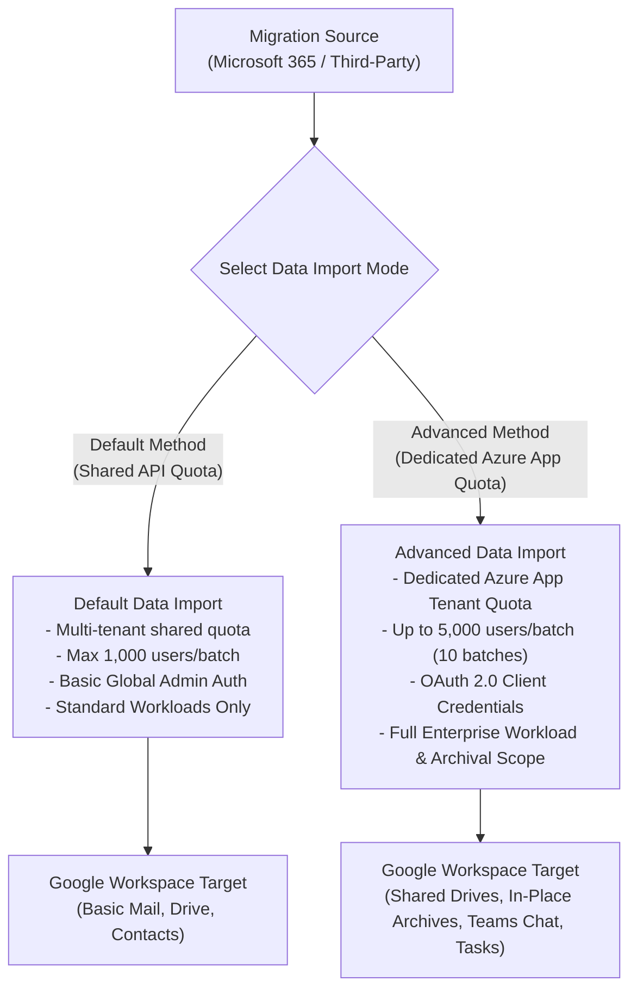

---

### 2. Workload-by-Workload Migration Capability Matrix

| Workload Category | Default Data Import Capabilities | Advanced Data Import Capabilities |
| :--- | :--- | :--- |
| **Exchange Primary Email** | Migrates core inbox & folders (converts `A/B` to `A_B`). Max 1,000 users. | Migrates core inbox & folders; preserves label hierarchy; supports 50,000 users. |
| **In-Place Archives** | ❌ **Not Supported**. Archives dropped. | ✅ **Supported**. Routes archives to Google Vault or custom `In-Place Archive` labels. |
| **M365 Group Mailboxes** | ❌ **Not Supported**. Group mail skipped. | ✅ **Supported**. Migrates group mail to Google Groups or target Shared Mailboxes. |
| **Outlook Rules & Filter** | ❌ **Not Supported**. | ✅ **Supported**. Translates server-side Outlook rules to native Gmail XML filters. |
| **Attachment Size Cap** | 35 MB max attachment cap. | ✅ **150 MB max attachment cap** (large files stored in Drive folder `Imported Calendar Attachments`). |
| **Calendars & Resource Rooms**| Primary personal calendar only. | ✅ Primary/Secondary calendars, Room Resources, ACL mappings, recurring end dates to Dec 31, 2099. |
| **Contacts & Tasks** | Up to 5,000 contacts; flattens contact folders; tasks dropped. | ✅ Up to 27,000 contacts; preserves contact sub-folders; migrates Microsoft To Do to **Google Tasks**. |
| **OneDrive for Business** | Files to personal My Drive; auto-maps unmapped accounts. | ✅ Files to My Drive; Admin policy toggle to **Disable unmapped account auto-mapping** (prevents leaks). |
| **SharePoint Team Sites** | Copies site files into user personal My Drives. | ✅ **Shared Drive Target**. Site Mapping CSV (`Site URL -> Shared Drive ID -> Manager Email`), role translations. |
| **Microsoft Teams Chat** | ❌ Excluded / Basic 1:1 text only. | ✅ **Full Workload Support**. 1:1 DMs, Group Chats, Public/Private Channel messages to **Google Chat Spaces**. |
| **Third-Party Storage** | Basic Dropbox/Box file copy. | ✅ Maps Dropbox Team Folders and Box collaborators directly to **Google Shared Drives**. |

---

### 3. Azure App Registration & Permission Walkthrough

Advanced Data Import requires creating an OAuth 2.0 Application in Microsoft Entra ID (`entra.microsoft.com`) with dedicated Graph API Application permissions:

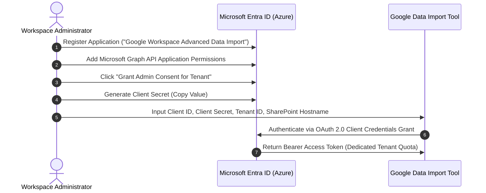

* **Required Application Permissions**: `Sites.FullControl.All`, `Files.ReadWrite.All`, `User.Read.All`, `Group.Read.All`, `Mail.Read`, `Calendars.Read`, `Contacts.Read`, `Chat.Read.All`, `ChannelMessage.Read.All`.

---

### 4. Admin Console Setup & Error Diagnostics

1. Navigate to **Admin Console > Data > Data import & export > Data import**.
2. Select Source and choose **Advanced Data Import**.
3. Input `Tenant ID`, `Client ID`, `Client Secret`, and `SharePoint Host Name`.
4. Upload User List CSV, Site Mapping CSV, and Identity Mapping CSV.
5. Set date range filters, file size limits, and set `Copy unmapped accounts` to **Disabled**.
6. Run primary import pass $\rightarrow$ execute **Delta Import** 48 hours post-MX cutover.

#### Error Code Diagnostic Matrix

| Error Status | Diagnostic Cause | Actionable Resolution Protocol |
| :--- | :--- | :--- |
| `HTTP 429` | Microsoft Graph API rate-limiting throttling. | Built-in exponential backoff retries automatically; stagger execution batches. |
| `401 Unauthorized` | Invalid or expired Azure Client Secret. | Generate new Client Secret in Azure Entra ID and update Admin Console settings. |
| `403 Forbidden` | Missing tenant-wide admin consent for Graph permissions. | In Azure Entra ID > App Registrations > API Permissions, click **Grant admin consent**. |
| `400,000 Item Limit` | Target Google Shared Drive exceeds item cap. | Split SharePoint Document Library across multiple target Shared Drives in Site Mapping CSV. |

---
*Reference: Official Google Workspace Data Import Tool Technical Documentation (`knowledge.workspace.google.com/admin/migrate/`).*


