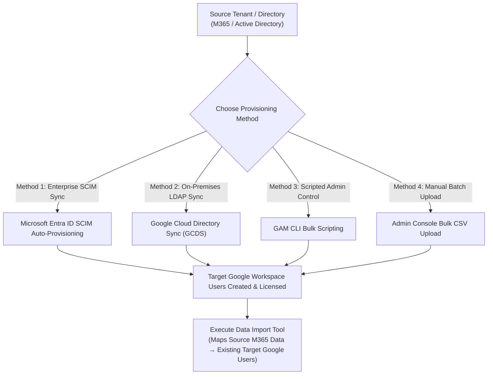
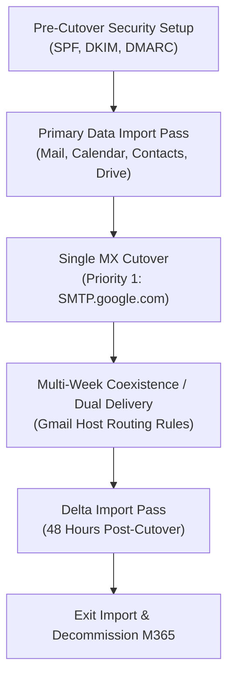

# Microsoft 365 to Google Workspace Master Enterprise Migration Guide

> **Consolidated Enterprise Reference**: Merging SharePoint Online (Module 6), Exchange Online (Module 7), OneDrive for Business (Module 8), Teams Chat, and Official Google Workspace Migration Knowledge Base (`knowledge.workspace.google.com/admin/migrate/`).  
> **Target Audience**: Senior Systems Engineers, Enterprise Cloud Architects, and L3 Workspace Administrators.

---

## 1. Executive Summary & Tool Selector Matrix

Migrating an organization from Microsoft 365 to Google Workspace requires a multi-workload execution plan covering identity, mail, calendars, contacts, tasks, personal files, team sites, and chat history.

### Tool Selection Matrix

| Source Workload / Environment | Primary Migration Tool | Deployment Model | Scale & Quota | Workloads Handled |
| :--- | :--- | :--- | :--- | :--- |
| **Exchange Online** *(Email, Calendar, Contacts, Tasks)* | **Data Import Tool (New DMS)** | Cloud-Native (Admin Console) | **Default**: Shared Quota (up to 1,000 users)<br>**Advanced**: Dedicated Azure Quota (5,000/batch, 10 concurrent batches) | Email, Drafts, Folders, Calendars, Contacts, Tasks, In-Place Archives, Groups |
| **OneDrive for Business** | **Data Import Tool (Advanced)** | Cloud-Native (Admin Console + Azure App) | Dedicated Azure Quota (up to 5,000 users/batch) | Personal files, nested folders, ACL permissions |
| **SharePoint Online** | **Data Import Tool (Advanced)** | Cloud-Native (Admin Console + Azure App) | Dedicated Azure Quota (up to 5,000 sites/batch) | Document libraries $\rightarrow$ Shared Drives, Site permissions |
| **Microsoft Teams Chat** | **Data Import Tool (Advanced)** | Cloud-Native (Admin Console + Azure App) | Dedicated Azure Quota | 1:1 DMs, Group chats, Channel messages $\rightarrow$ Google Chat & Spaces |
| **Enterprise Multi-Tenant / Box / File Shares** | **Google Workspace Migrate** | Multi-Node GCP / On-Prem VMs | 1,000 to 100,000+ Users | Enterprise mail, OneDrive, SharePoint, Box, File Shares |
| **On-Premises Exchange / Legacy PSTs** | **GWMME** | Server / Admin Workstation | Scripted CLI / Local Server | On-prem Exchange mailboxes, PST files, Public Folders |
| **Desktop Outlook PST Files** | **GWMMO** | Client Workstation | Individual Self-Service | End-user local PST file imports to Gmail |

---

## 2. Phase 0: Account Pre-Provisioning Architecture (How Users Are Created BEFORE Data Migration)

> [!CRITICAL]
> **Key Architectural Rule**: Google's migration tools (**Data Import Tool**, **Google Workspace Migrate**, **GWMME**) **DO NOT create target user accounts**. They only copy data into user accounts that **already exist** and hold active Google Workspace licenses.

All target user accounts must be provisioned and assigned valid Google Workspace licenses **before** running any data import jobs.



### The 4 Enterprise Pre-Provisioning Methods

| Provisioning Method | Best For / Scale | Technical Implementation & Commands |
| :--- | :--- | :--- |
| **1. Entra ID / SCIM Provisioning** | Automated Cloud Sync (Unlimited users) | Configure Google Workspace Enterprise App in Entra ID (`entra.microsoft.com`) $\rightarrow$ Enable Automatic SCIM Provisioning $\rightarrow$ Assign user groups. Accounts, names, OUs, and licenses sync automatically. |
| **2. Google Cloud Directory Sync (GCDS)** | On-Premises AD Sync (Unlimited users) | Deploy GCDS VM $\rightarrow$ Connect to Active Directory LDAP and Google Admin SDK API $\rightarrow$ Define user/group mapping rules $\rightarrow$ Run scheduled sync. |
| **3. GAM CLI Bulk Scripting** | Scripted Admin Control (1,000–50,000 users) | `gam csv m365_users.csv gam create user ~Email firstname ~FirstName lastname ~LastName password ~TempPass ou /MigratedUsers`<br>`gam csv m365_users.csv gam user ~Email add license wsbizstan` |
| **4. Admin Console Bulk CSV Upload** | One-time Batch Upload (10–1,000 users) | Go to `Admin Console > Directory > Users > Bulk update users` $\rightarrow$ Download template CSV $\rightarrow$ Populate users $\rightarrow$ Upload CSV. |

---

## 3. Phase 1: Azure / Microsoft Entra ID Application Registrations

To allow Google's Advanced Data Import tool to access Microsoft 365 workloads securely using dedicated Azure API quotas, register Enterprise Applications in **Microsoft Entra admin center** (`entra.microsoft.com`).

### Required Azure API Permissions Matrix

| Target Workload | Azure App Registration Name | Required Application API Permissions (Microsoft Graph) | Admin Consent Needed |
| :--- | :--- | :--- | :--- |
| **Exchange Online** | `Google Workspace Import - Exchange` | `full_access_as_app`, `User.Read.All`, `Mail.Read`, `Calendars.Read`, `Contacts.Read` | Yes |
| **OneDrive for Business** | `Google Workspace Import - OneDrive` | `Files.ReadWrite.All`, `User.Read.All`, `Group.Read.All` | Yes |
| **SharePoint Online** | `Google Workspace Import - SharePoint` | `Sites.FullControl.All` (or `Sites.ReadWrite.All`), `Files.ReadWrite.All`, `User.Read.All`, `Group.Read.All` | Yes |
| **Microsoft Teams Chat** | `Google Workspace Import - Teams` | `Chat.Read.All`, `ChannelMessage.Read.All`, `User.Read.All`, `Files.Read.All` | Yes |

> [!NOTE]
> **Credentials to Record**: From each registered Azure App, record:
> 1. **Application (Client) ID**
> 2. **Directory (Tenant) ID**
> 3. **Client Secret Value** (generated under *Certificates & secrets*)

---

## 4. Phase 2: Workload 1 — Exchange Online (Email, Calendar, Contacts, Tasks)

### A. What Is Migrated vs. What Is Excluded

#### 1. Email Data
- **Migrated**: All emails (Inbox, Sent Items, Drafts, custom subfolders), read/unread status, High Importance ($\rightarrow$ `Important` label), Snoozed ($\rightarrow$ `Snoozed` label), Archived ($\rightarrow$ `Archive_` label), Out of Office / Mailbox settings.
- **In-Place Archives** *(Advanced Method Only)*: Copies active users' In-Place Archives to a custom label (`In-Place Archive`), a specified label, or directly to **Google Vault**.
- **Shared & Group Mailboxes**: Shared mailboxes can map to **Google Groups as Collaborative Inboxes** or delegated user accounts. M365 Group mailboxes copy conversations to Google Groups (max 100 posts/thread).
- **Attachments**: Up to **150 MB** per email.
- **Excluded**: Emails $>150\text{ MB}$; Drafts without a `From` header; Categories; Messages in `Notes` or subfolders; Pinned/flagged/scheduled indicators; Shared folders; Starred folder status.

#### 2. Calendar Data
- **Migrated**: Primary, secondary, and resource calendars; all-day events; attendee responses; recurring events without end dates ($\rightarrow$ end date set to **Dec 31, 2099**); Teams meeting links (imported as text links); Calendar exceptions.
- **Attachments & ACLs** *(Advanced Method Only)*: Event attachments up to 150 MB (saved to `Imported Calendar Attachments` folder in Drive); Calendar sharing permissions (ACLs).
- **Excluded**: Color/timezone settings; Unsupported resource calendars; Events prior to start date; ICS files; Non-native attachments; Draft calendar events; Plain text formatting only for event descriptions.

#### 3. Contact Data
- **Migrated**: Personal contacts (up to **27,000 contacts** per organization); Folders/Categories $\rightarrow$ single-level labels (e.g. `Folder1 - Folder2`, `Category1`); Business & home phone numbers + 1 mobile number.
- **Excluded**: Mail contacts; Global Address List (GAL); Deleted contacts; Profile pictures; Anniversary dates; Initials; Webpage links; Fax/pager/extra mobile numbers. *(Starred contacts require a category named `starred` in Exchange to become Favorites in Google Contacts).*

#### 4. Task Data (Microsoft To Do)
- **Migrated**: Personal tasks $\rightarrow$ **Google Tasks** (up to 100 task lists); Title, notes, status, completion date, due date (imported as all-day tasks); High/Low importance appended as text in notes.
- **Excluded**: Recurring task settings (imported as single 1-time tasks); Due date time-of-day; File attachments; Microsoft Planner tasks.

---

### B. Exchange Folder $\rightarrow$ Gmail Label Mapping Rules

Exchange Online folder paths convert to Gmail labels. Reserved system labels are protected with underscores:

| Exchange Folder Name | Gmail Label Name | Mapping Rule / Behavior |
| :--- | :--- | :--- |
| **All Mail** | `All Mail_` | Underscore added to prevent system label conflict |
| **Drafts** | `DRAFT` | System reserved label |
| **Inbox** | `INBOX` | System reserved label |
| **Sent Items / Sent Mail** | `SENT` / `Sent Mail_` | Standard sent mapping |
| **Junk Email** | `SPAM` | System reserved label |
| **Deleted Items** | `TRASH` | System reserved label |
| **Outbox / Archive / Bin / Chats** | `Outbox_` / `Archive_` / `Bin_` / `Chats_` | Underscore added to prevent reserved conflicts |

> [!NOTE]
> **Folder Path Formatting**: Slashes in folder paths (`Travel/Asia`) become underscores (`Travel_Asia`). Folders with full paths $>225$ characters are imported without the label (messages still import to `All Mail`). Duplicate emails across multiple folders are deduplicated into a single instance with multiple labels applied.

---

### C. Outlook Rules $\rightarrow$ Gmail Filters Translation Matrix *(Advanced Import)*

| Outlook Message Rule | Gmail Filter Support & Behavior |
| :--- | :--- |
| `isReadOnly = True` | ✅ Imports as standard editable Gmail filter |
| `Subject or body includes` | ✅ Imports as `Subject includes` filter (searches subject & body; partial word substrings unsupported) |
| `Message header includes` | ✅ Imports for newly incoming email messages |
| `Maximum / Minimum size` | ⚠️ Gmail allows single size filter only; rules with both min & max size are skipped |
| `Move to folder` | ✅ Supported for standard folders (unsupported for Draft, Sent, Spam) |
| `hasError=True` / `isEnabled=False` | ❌ Not imported |
| `Categories` / `Flags` / `Sensitivity` | ❌ Not supported |
| `Forward to` / `Redirect` / `Pin to top` | ❌ Not supported |

---

### D. Calendar Permission ACL Mapping Table *(Advanced Import)*

| Outlook Permission Role | Google Calendar ACL Role | Modification Rights |
| :--- | :--- | :--- |
| **None** | `None` | No access |
| **freeBusyRead / limitedRead** | `freeBusyReader` | Sees free/busy times only |
| **Read** | `Reader` | Sees event details |
| **Write / delegateWithoutPrivateEventAccess** | `writerWithoutPrivateAccess` | Can edit events (except private) |
| **delegateWithPrivateEventAccess** | `Writer` | Full edit access (Super Admin required for sharing changes) |

---

### E. Mail & Message Count Discrepancy Causes

1. **Folder Storage vs. Deduplication**: Outlook counts separate copies of an email stored in multiple folders. Gmail deduplicates them into a single email instance with multiple labels, resulting in lower total counts in Gmail.
2. **Hidden/Archived Unread Counts**: Outlook hides unread emails in archived system folders. Gmail maps these folders to labels and includes unread counts, causing unread counts to increase in Gmail.
3. **Conversation Threading**: Gmail groups replies into conversation threads. A new incoming reply marks the entire thread as unread, whereas Outlook treats messages individually.

---

## 5. Phase 3: Workload 2 — OneDrive to Google Drive (My Drive)

### A. Architecture & Scope
* **OneDrive for Business** files and nested folder hierarchies map to **Google Drive (My Drive)**.
* **Preserved**: Standard file formats, timestamps, nested folder structures, internal/external ACL sharing permissions.
* **Excluded**: OneDrive Recycle Bin items; OneNote notebooks; Personal Vault files; Files $>5\text{ TB}$; Local PST/OST files; Folder shortcuts; App-specific data (Visio/Project).

### B. Unmapped Identity Handling
When a file in OneDrive is shared with an external user or an internal account that does not exist in Google Workspace:
* **Option 1: Keep original permissions** (If target email exists or domain-wide access allowed).
* **Option 2: Map to fallback admin / drop unmapped ACLs** (To prevent security policy violations).

---

## 6. Phase 4: Workload 3 — SharePoint Online to Google Shared Drives

### A. Architecture & Permission Role Translation
* **SharePoint Team Site** $\rightarrow$ Target **Google Shared Drive**.
* **Document Library** $\rightarrow$ Shared Drive root folders.

| SharePoint Permission Role | Google Shared Drive Role | Capabilities in Google Shared Drive |
| :--- | :--- | :--- |
| **Site Owner / Full Control** | **Manager** | Manage members, upload, edit, delete files, change settings |
| **Site Member / Edit** | **Content Manager** | Upload, edit, move, and delete files |
| **Contributor** | **Contributor** | Add and edit files (cannot delete files) |
| **Visitor / Read** | **Viewer** | View and download files only |

---

### B. Step-by-Step Configuration Walkthrough (Matching Admin Console Screen)

```
+-----------------------------------------------------------------------------------+
| Admin Console > Data > Data import & export > Data import > Advanced > [Testing]  |
+-----------------------------------------------------------------------------------+
| Step 1: Connect your SharePoint account                                          |
| [ Client ID ] [ Client secret ] [ Tenant ID ] [ Sharepoint host name ]            |
| ( Button: Connect )                                                               |
|                                                                                   |
| Step 2: Select sites containing the files you want to import                      |
| [ Upload CSV ]  ( Download sample CSV )                                           |
|                                                                                   |
| Step 3: Map SharePoint Online users and groups to Workspace                       |
| ( View example )                                                                  |
+-----------------------------------------------------------------------------------+
```

#### Step 1 Configuration (Connect SharePoint Account):
1. Navigate to `Admin Console > Data > Data import & export > Data import > Advanced > New batch`.
2. Enter Batch name (e.g., `Testing` or `SharePoint Wave 1`), select `SharePoint Online`, and click `Continue`.
3. Input the required credentials:
   * **Client ID**: Azure Application (Client) ID.
   * **Client secret**: Azure Client Secret value.
   * **Tenant ID**: Azure Directory (Tenant) ID.
   * **Sharepoint host name**: Base domain without `https://` (e.g. `contoso.sharepoint.com`).
4. Click **Connect**.

#### Step 2 Configuration (Site Mapping CSV Upload):
Upload a CSV file (`Site_Mapping.csv`) mapping source SharePoint site URLs to target **Google Shared Drive IDs**:
```csv
Source SharePoint Site URL,Target Shared Drive ID,Managing User Email
https://contoso.sharepoint.com/sites/Marketing,0A1b2C3d4E5f6G7h8,admin@yourdomain.com
https://contoso.sharepoint.com/sites/Engineering,0B987654321ZYXWVU,admin@yourdomain.com
```

#### Step 3 Configuration (Identity Mapping CSV Upload):
Upload an Identity Mapping CSV (`Identity_Mapping.csv`) to map SharePoint users and groups to Google Workspace users and Google Groups:
```csv
Source Email,Destination Email
jdoe@contoso.com,jdoe@yourdomain.com
MarketingTeam@contoso.com,marketing-group@yourdomain.com
```

---

## 7. Phase 5: Workload 4 — Microsoft Teams Chat to Google Chat

* **1:1 Direct Messages & Group Chats** $\rightarrow$ Imported as Google Chat 1:1 and Group Conversations.
* **Channel Messages** $\rightarrow$ Imported as Google Chat Spaces with thread history intact.
* **Inline Images & File Attachments** $\rightarrow$ Uploaded to Google Drive and linked in the chat thread.
* **Azure App Permissions Needed**: `Chat.Read.All`, `ChannelMessage.Read.All`, `User.Read.All`, `Files.Read.All`.

---

## 8. Phase 6: Cutover, Security & Coexistence Strategy



### 1. Pre-Cutover Email Security Records
Add DNS records **before** switching MX records to prevent outgoing emails landing in spam:
* **SPF**: `v=spf1 include:_spf.google.com ~all`
* **DKIM**: Generate selector `google` in Admin Console (`Apps > Google Workspace > Gmail > Authenticate email`) and publish TXT record `google._domainkey.yourdomain.com`.
* **DMARC**: `v=DMARC1; p=none; rua=mailto:dmarc-reports@yourdomain.com`

### 2. Streamlined Single MX Cutover
Set your domain's DNS MX record to Google's standard endpoint:

| Priority | Host | Value |
| :--- | :--- | :--- |
| **1** | `@` | `SMTP.google.com` |

*(Remove legacy Microsoft MX records `yourdomain-com.mail.protection.outlook.com` immediately).*

### 3. Delta Migration Pass
Wait **48 hours** post-MX switch for global DNS propagation. Run **Delta Import** in the Admin Console to copy all in-flight emails, calendar invites, and modified files delivered to Microsoft 365 during the transition window.

---

## 9. Phase 7: Troubleshooting & Error Code Diagnostic Reference

| Error Code / Symptom | Root Cause | Technical Resolution |
| :--- | :--- | :--- |
| **Error 1004 / 401 Unauthorized** | Azure App Secret expired or missing Entra Admin Consent | Re-generate Client Secret in Azure Entra ID; re-grant **Grant admin consent for [Tenant]**. |
| **Error 429 Too Many Requests** | Microsoft Graph API / Exchange EWS rate limiting | System automatically backs off; reduce batch sizes or concurrent threads. |
| **Error 500 / General Failure** | Source mailbox unlicensed, locked, or Litigation Hold timeout | Verify active Exchange license on source user; exclude damaged subfolders. |
| **Attachment $>150\text{ MB}$ Skipped** | Message attachment exceeds Gmail 150 MB message size limit | Item flagged in report; upload file separately to Google Drive. |
| **Folder Path $>225$ Chars** | Path length exceeds label character limit | Email messages import into `All Mail` without label. |
| **Unmapped User ACL Drop** | Source email does not match target Google Workspace UPN | Update Identity Mapping CSV to explicitly map source email to destination Google email. |

---

## 10. Senior Admin GAM & Scripting Command Reference

```powershell
# 1. Bulk User Provisioning from M365 User Export
gam csv m365_users.csv gam create user ~Email firstname ~FirstName lastname ~LastName password ~TempPass ou /MigratedUsers

# 2. Bulk License Assignment
gam csv m365_users.csv gam user ~Email add license wsbizstan

# 3. Create Target Google Shared Drives for SharePoint Migration
gam csv sharepoint_sites.csv gam create shareddrive ~DriveName admin ~ManagingUser

# 4. Audit Post-Migration Drive Permissions
gam user ~Email print fileacl id ~FileId

# 5. Headless GWMME CLI Migration Script
& "C:\Program Files\Google\Google Workspace Migration for Microsoft Exchange\ClientMigration.exe" `
  -GlobalAdminUser "admin@domain.com" `
  -ServiceAccountKeyPath "C:\Keys\workspace-migration-sa.json" `
  -SourceType EXCHANGE_ONLINE `
  -UserMapFile "C:\Migration\UserMap.csv" `
  -StartDate "2020-01-01" `
  -MigrateEmail -MigrateCalendar -MigrateContacts `
  -NumThreads 32 `
  -LogDir "C:\Migration\Logs"
```

---

## 11. Master Interview Q&A: 15 Model Answers for Senior Engineer Interviews

### Q1: How do Google Workspace migration tools handle user creation during a migration?
**Model Answer**: Google migration tools (**Data Import Tool**, **Google Workspace Migrate**, **GWMME**) **do NOT create user accounts**. They only copy data into pre-existing, licensed target user accounts. Accounts must be pre-provisioned via **SCIM auto-provisioning** (Microsoft Entra ID / Okta), **Google Cloud Directory Sync (GCDS)**, **GAM CLI scripts**, or **Admin Console CSV upload** before starting the data migration job.

### Q2: What is the difference between Default and Advanced Data Import for Exchange Online?
**Model Answer**: Default Data Import uses Google shared API quotas and supports up to 1,000 users via Global Admin OAuth sign-in. Advanced Data Import uses dedicated Azure API quotas (via custom Azure App registration), supporting up to 5,000 users per batch across 10 concurrent batches. Advanced Import also unlocks In-Place Archive migration, M365 Group mailboxes, event attachments up to 150 MB, calendar ACL permissions, and Outlook rules translation.

### Q3: How are Exchange folders mapped to Gmail, and how are system name conflicts resolved?
**Model Answer**: Exchange folders become Gmail labels. Folder path slashes (`Travel/Asia`) convert to underscores (`Travel_Asia`). Reserved system names add an underscore to prevent system label conflicts (e.g. `All Mail` $\rightarrow$ `All Mail_`, `Archive` $\rightarrow$ `Archive_`, `Outbox` $\rightarrow$ `Outbox_`, `Bin` $\rightarrow$ `Bin_`). Folders exceeding 225 characters lose their label, but the messages inside are preserved in `All Mail`. Duplicate emails across multiple folders are deduplicated into a single message instance with multiple labels.

### Q4: How do you migrate SharePoint Team Sites to Google Workspace?
**Model Answer**: SharePoint Team Sites map to Google **Shared Drives**, and Document Libraries map to root folders inside the Shared Drive. Using Advanced Data Import for SharePoint Online, we register an Azure App with `Sites.FullControl.All` and `Files.ReadWrite.All` permissions, connect using the `Sharepoint host name` (`tenant.sharepoint.com`), and upload two CSV files: a Site Mapping CSV (`Site URL -> Shared Drive ID -> Manager Email`) and an Identity Mapping CSV (`Source User/Group -> Destination Email/Group`).

### Q5: How are SharePoint permission roles mapped to Google Shared Drives?
**Model Answer**: SharePoint *Full Control / Site Owner* maps to **Manager**; *Edit / Site Member* maps to **Content Manager**; *Contributor* maps to **Contributor**; and *Read / Visitor* maps to **Viewer**.

### Q6: How are OneDrive user files migrated to Google Drive?
**Model Answer**: OneDrive for Business files and nested folders map to Google Drive (**My Drive**). We upload a Source Users CSV and an Identity Mapping CSV. Sharing permissions (ACLs) translate to Google Drive roles. Unmapped external identities are handled via fallback policies. Excluded items include OneDrive Recycle Bin, OneNote notebooks, Personal Vault, files $>5\text{ TB}$, and local `.pst` files.

### Q7: How do you handle email authentication and cutover during a migration?
**Model Answer**: Prior to switching MX records, we publish SPF (`v=spf1 include:_spf.google.com ~all`), 2048-bit DKIM (`google._domainkey`), and DMARC (`v=DMARC1; p=none...`) to prevent post-migration spam filtering. During cutover, we point DNS MX to priority `1 SMTP.google.com` and delete old Microsoft MX records. After 48 hours of DNS propagation, we execute a **Delta Import** to copy in-flight messages delivered during the transition window.

### Q8: What causes message count discrepancies between Outlook and Gmail post-migration?
**Model Answer**: Discrepancies stem from three factors: (1) **Deduplication**: Outlook counts copies of a message in multiple folders separately; Gmail deduplicates them into a single email with multiple labels. (2) **Archived Unread Counts**: Outlook hides unread emails in system archive folders; Gmail maps these to labels and counts them as unread. (3) **Conversation Threading**: Gmail groups replies into threads and marks the whole thread unread when a new reply arrives.

### Q9: How are Microsoft To Do tasks migrated to Google Workspace?
**Model Answer**: Personal tasks in Microsoft To Do import to **Google Tasks** (up to 100 task lists). Task titles, notes, status, completion date, and due dates import (as all-day tasks). High/Low importance settings append as text notes inside the task. Recurring task settings are not supported and import as single 1-time tasks.

### Q10: How are calendar permissions (ACLs) migrated from Outlook to Google Calendar?
**Model Answer**: Using Advanced Data Import, Outlook calendar ACLs map as follows: `freeBusyRead/limitedRead` $\rightarrow$ `freeBusyReader`; `Read` $\rightarrow$ `Reader`; `Write/delegateWithoutPrivateEventAccess` $\rightarrow$ `writerWithoutPrivateAccess`; and `delegateWithPrivateEventAccess` $\rightarrow$ `Writer`.

### Q11: How do you migrate Microsoft Teams chat history to Google Workspace?
**Model Answer**: Teams 1:1 DMs and Group chats import as Google Chat 1:1 and Group Conversations. Channel messages import into Google Chat **Spaces** with thread history. Inline images and attachments are saved to Google Drive and linked in the thread. Required Azure App permissions are `Chat.Read.All`, `ChannelMessage.Read.All`, `User.Read.All`, and `Files.Read.All`.

### Q12: How do you troubleshoot HTTP Error 429 during a large-scale data import?
**Model Answer**: HTTP 429 indicates Microsoft Graph API or EWS rate-limiting. Google's Data Import tool features automated exponential backoff retries. For GWMME or custom scripts, we reduce thread count (`-NumThreads`) and split users across multiple staggered Azure App registrations to distribute API quota load.

### Q13: How do you migrate Microsoft In-Place Archive mailboxes?
**Model Answer**: In-Place Archive migration is supported via **Advanced Data Import**. Archives can be mapped to automatically create an `In-Place Archive` label in Gmail, mapped to a custom user label, or ingested directly into **Google Vault** for compliance retention.

### Q14: How are Outlook rules converted to Gmail filters?
**Model Answer**: Active, read-only Outlook rules import as editable Gmail filters. Subject/body search rules translate to Gmail `Subject includes` filters. Rules with errors (`hasError=true`), disabled rules, categories, flags, forward/redirect actions, or min+max size combinations are skipped.

### Q15: What post-migration steps must be taken before decommissioning Microsoft 365?
**Model Answer**: (1) Run pre-scan reports and resolve 100% of errors. (2) Execute primary migration. (3) Switch MX to `1 SMTP.google.com`. (4) Run Delta Import 48 hours post-cutover. (5) Verify user mailbox item counts in Admin Console. (6) Export migration log reports. (7) Click **Exit and delete import** to revoke standing Azure delegation client keys.

---
*Reference: Consolidated Enterprise Google Workspace & Microsoft 365 Migration Guide.*
